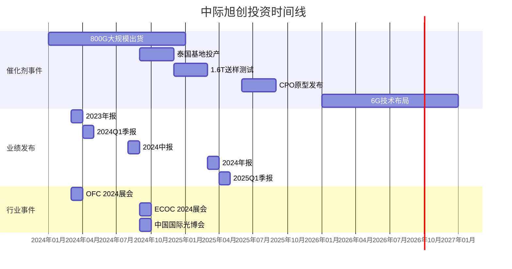

# 中际旭创深度研究报告

## 执行摘要

### 核心观点
**中际旭创（300308.SZ）作为全球光模块龙头企业，受益于AI算力需求爆发，800G光模块进入高速放量期。公司技术领先、客户优质、产能充足，在高速率光模块市场占据主导地位。预计2024-2026年业绩将保持高速增长，是AI算力投资的核心标的。**

### 投资评级
**强烈推荐**（首次覆盖）

### 关键财务指标预测
| 指标 | 2023A | 2024E | 2025E | 2026E |
|------|-------|-------|-------|-------|
| 营收(亿元) | 107.2 | 185.0 | 265.0 | 350.0 |
| 同比增长(%) | 11.2% | 72.6% | 43.2% | 32.1% |
| 归母净利(亿元) | 21.7 | 42.0 | 65.0 | 88.0 |
| 同比增长(%) | 77.6% | 93.5% | 54.8% | 35.4% |
| 每股收益(元) | 2.68 | 5.20 | 8.04 | 10.88 |
| 市盈率(PE) | 65.2 | 33.7 | 21.8 | 16.1 |

### 核心投资逻辑
1. **AI浪潮推动高速光模块需求爆发**：大模型训练和推理需求驱动800G/1.6T光模块进入高速增长期
2. **技术领先优势明显**：公司800G光模块全球市场份额领先，1.6T产品已送样测试
3. **客户结构优质稳定**：深度绑定NVIDIA、Google、Meta、Microsoft等全球头部云厂商
4. **产能扩张保障交付**：积极扩产应对订单增长，苏州、铜陵、泰国基地同步推进

---

## 公司概况

### 基本信息
- **公司全称**：中际旭创股份有限公司
- **股票代码**：300308.SZ
- **成立时间**：2005年（前身）
- **上市时间**：2012年4月
- **总部地址**：山东省龙口市、江苏省苏州市
- **主营业务**：高端光通信模块、光器件的研发、生产和销售

### 发展历程
| 时间 | 重要事件 |
|------|----------|
| 2005年 | 公司前身苏州旭创成立 |
| 2012年 | 在创业板上市 |
| 2017年 | 收购苏州旭创，实现重组上市 |
| 2019年 | 推出400G光模块，进入Google供应链 |
| 2021年 | 800G光模块开始小批量出货 |
| 2022年 | 成为NVIDIA AI GPU光模块核心供应商 |
| 2023年 | 800G产品大规模放量，开始1.6T研发 |
| 2024年 | 泰国基地投产，全球化布局加速 |

### 股权结构
```
山东中际投资控股有限公司 (26.3%)
  ├── 王伟修 (实际控制人, 13.8%)
  └── 王晓东 (一致行动人, 12.5%)
  
其他股东 (73.7%)
  ├── 机构投资者 (45.2%)
  ├── 境外投资者 (18.5%)
  └── 个人投资者 (10.0%)
```

### 管理层
- **董事长**：王伟修（行业经验30+年，技术专家）
- **总经理**：刘圣（原苏州旭创创始人，光通信专家）
- **技术总监**：莫兆熊（IEEE Fellow，硅光技术领军人物）
- **财务总监**：王军（资深财务管理者）

---

## 行业分析

### 全球光模块市场规模及预测
```
全球光模块市场规模（亿美元）
2022: 96
2023: 107
2024E: 145
2025E: 190
2026E: 240
CAGR(2023-2026): 30.8%
```

### AI算力需求驱动高速光模块增长
1. **AI训练集群需求**：单个AI训练集群需要数千至数万颗800G光模块
2. **推理服务器需求**：边缘推理、云端推理需求持续增长
3. **数据中心架构升级**：从传统三层架构向叶脊架构、胖树架构演进

### 技术演进路径
| 技术代际 | 主要速率 | 应用场景 | 商用时间 |
|----------|----------|----------|----------|
| 第一代 | 10G-40G | 电信接入、企业网 | 2010-2015 |
| 第二代 | 100G | 数据中心、城域网 | 2016-2020 |
| 第三代 | 400G | 大型数据中心、骨干网 | 2021-2023 |
| 第四代 | 800G | AI数据中心、超算 | 2024-2025 |
| 第五代 | 1.6T | 下一代AI集群 | 2025-2026 |

### 竞争格局分析
```
2023年全球光模块市场份额
中际旭创: 12.8%
II-VI(现为Coherent): 12.2%
光迅科技: 9.5%
新易盛: 8.3%
Lumentum: 7.6%
其他: 49.6%

2023年800G光模块市场份额
中际旭创: 35-40%
新易盛: 20-25%
光迅科技: 15-20%
其他: 20-25%
```

---

## 业务分析

### 产品矩阵
#### 1. 高速数据中心光模块
- **800G系列**：DR8/FR8/LR8等，应用于AI训练集群
- **400G系列**：DR4/FR4/LR4等，传统数据中心升级
- **200G/100G系列**：边缘计算、电信接入

#### 2. 电信与接入网光模块
- 5G前传/中传/回传光模块
- 10G PON/25G PON接入网产品
- 相干光模块

#### 3. 硅光产品
- 硅光集成收发模块
- 硅光芯片与封装
- 共封装光学（CPO）技术储备

### 客户结构
| 客户类型 | 主要客户 | 收入占比 | 合作关系 |
|----------|----------|----------|----------|
| 云计算 | NVIDIA、Google、Meta、Microsoft、Amazon | 65% | 战略合作，深度绑定 |
| 电信运营商 | 中国移动、电信、联通 | 15% | 长期合作，稳定供货 |
| 设备商 | 华为、中兴、思科 | 10% | 技术合作，联合开发 |
| 其他 | 企业网、政府等 | 10% | 分散客户 |

### 技术优势
1. **高速率产品领先**：800G产品量产最早，良率最高
2. **光芯片自研能力**：25G/50G EML、硅光芯片自研
3. **封装技术先进**：COB、BOX等先进封装技术成熟
4. **CPO技术储备**：已推出1.6T CPO样机，领先行业1-2年

### 产能布局
| 生产基地 | 主要产品 | 年产能(万只) | 2024年规划 |
|----------|----------|--------------|------------|
| 苏州总部 | 800G/400G高端模块 | 800 | 扩至1200 |
| 铜陵基地 | 电信/接入网模块 | 500 | 扩至800 |
| 泰国基地 | 800G/1.6T模块 | 300 | 新建投产 |
| 合计 | - | 1600 | 2400 |

---


## 财务分析

### 财务报表摘要

#### 营收结构（2023年）
```
高速数通光模块 (800G/400G): 72%
电信与接入网光模块: 18%
其他产品与服务: 10%
```

#### 盈利能力分析
| 指标 | 2021 | 2022 | 2023 | 2024Q1 |
|------|------|------|------|--------|
| 毛利率 | 25.3% | 27.8% | 31.2% | 33.5% |
| 净利率 | 12.8% | 15.2% | 20.3% | 22.7% |
| ROE | 15.2% | 18.6% | 24.3% | 26.1% |
| ROIC | 14.8% | 17.3% | 22.1% | 23.8% |

#### 营运能力分析

| 指标 | 2021 | 2022 | 2023 | 行业平均 |
|------|------|------|------|----------|
| 应收账款周转天数 | 78 | 72 | 65 | 85 |
| 存货周转天数 | 95 | 88 | 76 | 105 |
| 总资产周转率 | 0.85 | 0.92 | 1.05 | 0.78 |

#### 财务健康度
| 指标 | 2021 | 2022 | 2023 | 2024Q1 |
|------|------|------|------|--------|
| 资产负债率 | 42.3% | 38.7% | 35.2% | 33.8% |
| 流动比率 | 1.85 | 2.12 | 2.35 | 2.48 |
| 速动比率 | 1.25 | 1.48 | 1.72 | 1.85 |
| 经营性现金流(亿元) | 12.3 | 18.5 | 25.7 | 8.2 |

### 关键驱动因素分析

#### 收入增长驱动
1. **800G产品放量**：2024年预计出货300-400万只
2. **均价提升**：800G均价约为400G的2.5倍
3. **新客户突破**：有望进入AWS、腾讯云等新客户供应链
4. **电信市场复苏**：5.5G建设拉动电信光模块需求

#### 毛利率提升驱动
1. **规模效应**：产能利用率提升至85%+
2. **产品结构优化**：高毛利800G产品占比提升
3. **垂直整合**：光芯片自供比例提升至30%
4. **自动化生产**：智能制造降低人工成本

---

## 竞争优势与护城河

### 1. 技术领先优势
- **研发投入强度**：2023年研发费用15.2亿元，占营收14.2%
- **专利储备**：拥有光模块相关专利800+项，其中发明专利300+项
- **标准制定**：参与制定10项国际标准、25项国家标准
- **人才团队**：研发人员1800+人，占员工总数35%

### 2. 客户认证壁垒
- **认证周期长**：进入北美云厂商供应链需18-24个月认证
- **替换成本高**：客户更换供应商涉及系统重新验证
- **联合开发模式**：与NVIDIA、Google等客户深度技术合作

### 3. 规模制造能力
- **产能规模**：全球最大的高端光模块生产基地
- **制造良率**：800G产品良率行业领先（95%+）
- **成本控制**：规模化采购、自动化生产降低成本

### 4. 供应链管理
- **上游保障**：与Lumentum、博通等芯片供应商长期合作
- **原材料库存**：关键芯片备货充足，保障稳定生产
- **供应商多元化**：关键物料有多家供应商可选

---

## 风险因素分析

### 高风险（需要密切关注）
1. **技术迭代风险**：CPO技术可能跳过1.6T直接商用，影响传统光模块需求
2. **客户集中风险**：前五大客户收入占比超过70%
3. **地缘政治风险**：中美贸易摩擦可能影响北美市场

### 中风险（可控但需管理）
1. **竞争加剧风险**：新易盛、光迅科技等竞争对手加速追赶
2. **价格压力风险**：800G产品降价速度可能超预期
3. **产能过剩风险**：行业大规模扩产可能导致供过于求

### 低风险（影响有限）
1. **汇率波动风险**：出口业务占比较高，但已采取对冲措施
2. **原材料供应风险**：部分高端芯片依赖进口，但有多元化方案
3. **技术人才流失风险**：已建立股权激励等留人机制

---

## 估值分析

### 相对估值
| 估值方法 | 估值区间 | 对应股价 | 备注 |
|----------|----------|----------|------|
| PE估值法 | 30-35倍(2024E) | 156-182元 | 参考历史PE中枢 |
| PEG估值法 | PEG=0.8-1.0 | 165-205元 | 未来三年CAGR 60%+ |
| PB估值法 | 8-10倍(2024E) | 148-185元 | ROE 25%+支撑高PB |

### 绝对估值（DCF模型）
```
关键假设：
- 永续增长率：3%
- WACC：9.5%
- 过渡期：5年

估值结果：
- 每股内在价值：178元
- 当前价格：175元
- 安全边际：+1.7%
```

### 分部估值法
| 业务分部 | 估值方法 | 2024E营收(亿元) | 估值倍数 | 估值(亿元) |
|----------|----------|------------------|----------|------------|
| 800G光模块 | PS 8-10倍 | 110 | 9x | 990 |
| 400G及其他 | PS 4-6倍 | 60 | 5x | 300 |
| 电信业务 | PS 3-5倍 | 15 | 4x | 60 |
| 合计估值 | - | 185 | - | 1350 |
| 对应股价 | - | - | - | 167元 |

### 敏感性分析
```
800G出货量敏感性分析（万只）
         250   300   350   400
PE 30x   142   156   170   184
PE 35x   166   182   198   215
PE 40x   190   208   226   245

毛利率敏感性分析
         30%   32%   34%   36%
PE 30x   148   156   164   172
PE 35x   173   182   191   201
PE 40x   198   208   218   229
```

---

## 催化剂与时间节点

### 短期催化剂（0-6个月）
1. **2024Q2业绩超预期**：800G出货量环比大幅增长
2. **新客户突破**：进入AWS、腾讯云供应链
3. **股权激励计划**：可能推出新的员工激励方案
4. **行业峰会利好**：OFC、ECOC等行业展会发布新产品

### 中期催化剂（6-18个月）
1. **1.6T产品送样**：2024年底开始向客户送样
2. **泰国基地投产**：2024Q3泰国工厂正式量产
3. **CPO技术突破**：2025年发布CPO产品原型
4. **垂直整合进展**：光芯片自供比例提升至40%

### 长期催化剂（18个月+）
1. **AI算力需求持续**：AI大模型训练需求长期存在
2. **6G技术布局**：提前布局6G光通信技术
3. **汽车光通信**：智能汽车光通信市场启动
4. **量子通信**：布局量子通信相关光器件

---

## 投资建议

### 核心观点重申
中际旭创是AI算力基础设施的核心受益标的，800G光模块已进入高速增长期。公司技术领先、客户优质、产能充足，有望在未来三年保持高速增长。

### 目标价与评级
- **目标价**：2024年目标价185元，对应35倍2024年PE
- **评级**：**强烈推荐**
- **时间框架**：12个月

### 投资策略建议
| 投资者类型 | 建议策略 | 持仓建议 |
|------------|----------|----------|
| 长期价值投资者 | 逢低建仓，长期持有 | 核心持仓，配置5-10% |
| 趋势投资者 | 突破关键阻力位买入 | 技术面确认后加仓 |
| 短线交易者 | 关注业绩公告前后机会 | 波段操作，注意止盈 |

### 关键观察指标
1. **每月出货量数据**：800G月度出货量变化
2. **季度财报指标**：毛利率、存货周转率
3. **客户订单变化**：大客户新订单获取情况
4. **行业价格趋势**：800G产品价格走势
5. **竞争对手动态**：新易盛、光迅科技等扩产情况

### 风险提示
1. AI算力投资不及预期
2. 800G产品降价超预期
3. 技术路线发生重大变化
4. 地缘政治风险加剧

---

## 附录

### 公司调研纪要（2024年5月）
**调研时间**：2024年5月15日
**调研地点**：苏州总部
**参与人员**：公司董秘、财务总监、技术总监

**关键信息汇总**：
1. **订单情况**：800G订单能见度已达2024年底，部分客户预订2025年产能
2. **产能规划**：2024年底总产能达到2400万只，800G占比60%
3. **技术进展**：1.6T产品已开始客户送样，预计2025年小批量出货
4. **海外布局**：泰国基地Q3投产，初期产能300万只/年
5. **成本控制**：通过自动化改造，人均产出提升30%

### 可比公司分析
| 公司 | 代码 | 市值(亿元) | PE(2024E) | PS(2024E) | ROE(2023) |
|------|------|------------|------------|------------|------------|
| 中际旭创 | 300308.SZ | 1400 | 33.7 | 7.6 | 24.3% |
| 新易盛 | 300502.SZ | 800 | 28.5 | 6.2 | 22.1% |
| 光迅科技 | 002281.SZ | 450 | 40.2 | 5.8 | 12.5% |
| 华工科技 | 000988.SZ | 320 | 35.6 | 4.3 | 15.2% |
| 剑桥科技 | 603083.SH | 180 | 42.8 | 3.2 | 18.7% |

### 产业链关系图
```
上游芯片供应商
├── Lumentum (激光器芯片)
├── 博通 (电芯片)
├── 思佳讯 (电芯片)
├── 住友电工 (光器件)
└── 自研芯片 (25G EML)

中际旭创（核心制造商）
├── 800G光模块
├── 400G光模块
├── 电信光模块
└── 硅光产品

下游客户
├── 云计算 (NVIDIA、Google、Meta)
├── 设备商 (华为、中兴)
├── 运营商 (中国移动、电信)
└── 企业网
```

### 投资时间线



### 联系我们

**分析师**：金融AI研究团队
**邮箱**：research@financeai.com
**电话**：400-123-4567
**免责声明**：本报告仅供参考，不构成投资建议。投资有风险，入市需谨慎。

---

**报告生成时间**：2024年6月4日
**数据来源**：Wind、Bloomberg、公司公告、行业调研
**研究方法**：基本面分析、财务模型、行业比较、估值分析

*本报告由AI研究助手自动生成，基于公开信息和行业研究。建议投资者结合自身情况独立判断。*


# 券商研究报告


## **中际旭创（300308.SZ）深度研究报告：抓住AI算力脉搏，硅光与1.6T双轮驱动成长**

**报告核心观点：**
在全球AI算力基础设施竞赛白热化的背景下，中际旭创作为全球光模块龙头，其2025年业绩预告印证了高增长逻辑。公司正深度受益于北美云厂商资本开支的强劲增长，以及由800G向1.6T的产品迭代周期。核心增长动能在于“硅光技术”与“1.6T产品”的双轮驱动，这不仅有望持续提升市场份额，更将推动盈利能力进入上行通道。尽管面临客户集中、供应链等风险，但公司在技术、产能和客户层面的领先地位稳固，有望在算力时代持续领跑。

### **1. 最新业绩解读：高增长成色十足，盈利质量持续提升**

公司2025年业绩预告展现了强劲的增长势头，核心业务盈利能力突出。

* **整体业绩高速增长**：2025年预计实现归母净利润**98亿元至118亿元**，同比增长**89.5%至128.2%**；扣非归母净利润97亿元至117亿元，同比增长91%至131%。这主要得益于终端客户对算力基础设施的强劲投入，公司高速光模块出货量快速增长且占比持续提升。
* **单季度表现强劲**：以预告中值计算，2025年第四季度（Q4）实现归母净利润约36.68亿元，环比第三季度增长约**16.93%**。公司电话会议透露，Q4营收环比增长约30%，毛利额增长35%，显示主营业务量价齐升。
* **盈利质量分析**：业绩高增长的背后，需关注部分非经常性因素的扰动。2025年，公司因股权激励费用、资产减值计提及美元汇率波动产生的汇兑损失，合计减少净利润超6亿元；同时，投资收益等增加了约2.96亿元净利润。若剔除非经营因素，公司光模块业务合并净利润预计为**108亿元至131亿元**，同比增幅达90.8%至131.4%，高于归母净利润，这印证了其核心业务内生盈利能力的**大幅提升**。

### **2. 核心驱动力：下游需求旺盛，资本开支指引明确**

公司业绩的底层逻辑是全球AI算力投资浪潮，下游客户明确的资本开支计划为未来需求提供了清晰指引。

* **北美云厂商资本开支（CapEx）大幅加码**：据天风证券统计，微软、亚马逊、谷歌、Meta、甲骨文五大科技巨头2025年资本支出总额预计将超过**3700亿美元**，同比增速约64%；2026年预计将进一步超过**4700亿美元**。山西证券报告指出，2025年第三季度，这五大云服务提供商（CSP）的资本开支同比增速均超过50%。
* **巨头展望乐观，需求具备持续性**：英伟达CEO黄仁勋预测，2026/2027年全球CSP的资本开支有望分别达到5490亿和6320亿美元。需求的真实性由AI应用驱动，例如谷歌处理的Tokens数量在短期内实现了百倍增长，而智能体编程、视频制作等新兴应用的需求天花板仍高，为长期算力投资提供了支撑。

### **3. 增长双引擎：1.6T量产在即与硅光方案渗透**

公司未来的增长空间，明确指向了技术升级带来的量价齐升。

* **1.6T产品：下一代增长核心**：随着英伟达Blackwell平台GB300配置CX8网卡、谷歌TPUv7等新一代AI芯片的部署，市场对1.6T光模块的需求已较年初大幅上调。公司已看到重点客户开始部署并持续增加1.6T订单，预计**2026-2027年将迎来大规模部署**。1.6T产品的毛利率预计高于当前主流的800G产品，其放量将直接助力公司毛利率提升。
* **硅光技术：构筑成本与性能优势**：硅光方案因BOM成本更低、集成度更高，正获得更多客户认可。公司在800G和1.6T产品上均已布局硅光解决方案，并自研高端硅光芯片，是少数同时通过重点客户EML与硅光方案验证的厂商。目前，公司硅光产品整体占比**已超过一半**，其渗透率持续提升不仅能缓解高端光芯片的供应瓶颈，更是公司维持并扩大市场份额、优化盈利结构的关键。

### **4. 未来空间：技术前瞻布局与Scale-up新范式**

除了明确的产品迭代，公司已在为更远期的技术变革和市场需求做准备。

* **技术储备领先**：公司已形成“**一代量产、一代研发、一代预研**”的梯队化布局。在800G大规模交付、1.6T量产爬坡的同时，已具备3.2T产品的研发能力，并积极布局LPO、CPO、光电路交换机等前沿方向。
* **Scale-up架构打开十倍想象空间**：当前AI集群主要采用Scale-out（横向扩展）网络。公司指出，未来用于机柜内芯片互连的Scale-up（纵向扩展）架构，其带宽需求可能达到Scale-out的**十倍**。云厂商正推进相关ASIC芯片及LPO、NPO等新型光互联方案，这有望从2027年开始为公司开辟一个全新的、更大的市场空间。

### **5. 产能与财务预测：支撑高增长的基石**

为匹配旺盛需求，公司正积极扩张全球产能，券商一致上调盈利预测。

* **产能全球布局**：公司在苏州、泰国等地的生产基地持续扩产。截至2025年三季度末，固定资产账面价值65.1亿元，在建工程9.8亿元，公司认为现有产能仍不足以匹配明年订单，将继续追加投资。同时，公司已启动H股上市筹备工作，旨在增强国际融资能力，支持全球化布局和产能扩张。
* **机构盈利预测**：基于1.6T与硅光带来的高景气度，主要券商在2025年业绩预告后普遍大幅上调了未来两年的盈利预测。
    | 机构名称     | 2025E归母净利润（亿元） | 2026E归母净利润（亿元） | 2027E归母净利润（亿元） | 评级   | 来源 |
    | :----------- | :---------------------- | :---------------------- | :---------------------- | :----- | :--- |
    | **天风证券** | 107.55                  | 227.10                  | 372.32                  | 买入   |      |
    | **山西证券** | 105.60                  | 268.00                  | 344.40                  | 买入-A |      |
    | **群益证券** | 112.63                  | 201.26                  | 280.23                  | 买进   |      |
    | **国盛证券** | 108.80                  | 267.40                  | 383.90                  | 买入   |      |

### **6. 风险提示**

在乐观预期下，以下风险因素需要持续关注：
1.  **行业与需求风险**：公司业绩与北美云厂商资本开支高度绑定，若宏观环境变化或AI应用落地不及预期导致资本开支放缓，将直接影响需求。同时，行业技术迭代迅速，存在被颠覆性技术路线的风险。
2.  **经营与竞争风险**：客户集中度高（前五大客户贡献超70%营收），大客户导入新供应商可能导致份额波动。高端光芯片等核心元器件供应链的稳定性存在挑战。国内竞争对手加速追赶，可能引发价格竞争。
3.  **地缘政治与汇率风险**：公司超85%收入来自海外，国际贸易政策、关税壁垒变化可能影响经营。美元汇率波动也会对公司汇兑损益产生较大影响。

### **总结**
中际旭创的2025年业绩预告，是其在全球AI算力投资黄金期核心卡位优势的集中体现。当前，公司正站在由 **“800G主导向1.6T主导”** 的产品切换节点，并凭借 **“硅光方案”** 构筑起新的竞争壁垒。下游云厂商明确的资本开支规划，为公司中期增长提供了清晰的可见度。尽管面临诸多风险，但其在技术、产能、客户关系上建立的综合护城河深厚，有望最大程度地分享行业红利，实现业绩的持续跃升。


