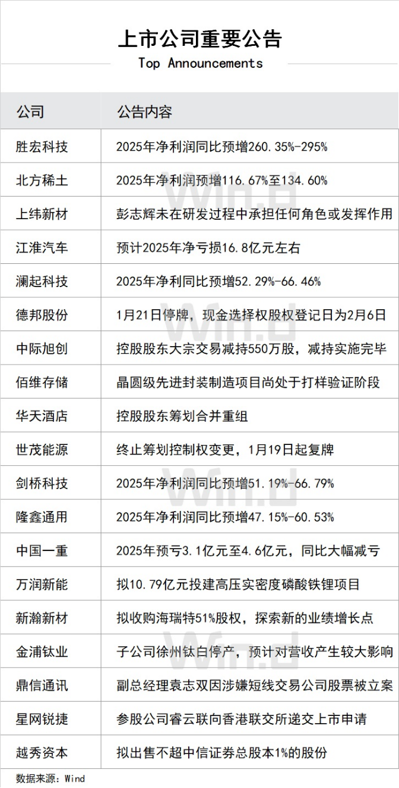
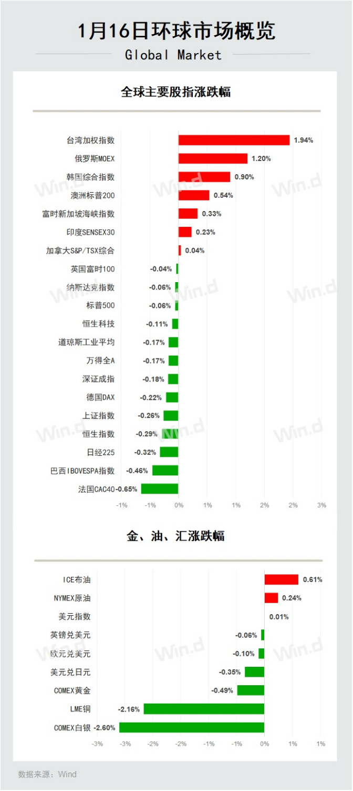

# **陆家嘴财经早餐2026年1月17日星期六**

## 热点聚焦

1、证监会召开2026年系统工作会议。**会议强调，坚持稳字当头，巩固市场稳中向好势头。全方位加强市场监测预警，及时做好逆周期调节，强化交易监管和信息披露监管，进一步维护交易公平性，严肃查处过度炒作乃至操纵市场等违法违规行为，坚决防止市场大起大落。**启动实施深化创业板改革，持续推动科创板改革落实落地，提高再融资便利性和灵活性。抓紧推动合格境外投资者优化方案落地，扩大期货特定品种开放范围，提升跨境投融资便利性。

2、**加拿大总理卡尼应邀对中国进行正式访问。双方就深化经贸合作达成广泛共识，签署《中国—加拿大经贸合作路线图》。**根据最新调整安排，加方将给予中国电动汽车每年4.9万辆的配额，配额内享受6.1%的最惠国关税待遇，不再征收100%附加税，配额数量将按一定比例逐年增长。

## 国内宏观

1、国务院总理李强主持召开国务院常务会议，听取提振消费专项行动进展情况汇报并研究加快培育服务消费新增长点等促消费举措，部署做好清理拖欠企业账款行动和保障农民工工资支付有关工作，审议通过《国务院关于修改和废止部分行政法规的决定（草案）》。**会议指出，要完善促消费长效机制，制定和实施好扩大消费“十五五”规划、城乡居民增收计划，加快清理消费领域不合理限制。**

2、商务部部长王文涛表示，**2026年消费品以旧换新以更大力度支持绿色智能商品消费，家电以旧换新要求一级能效或水效标准，购新补贴纳入智能手表手环、智能眼镜等。**

3、外交部发言人宣布，**中共中央政治局委员、国务院副总理何立峰将于1月19日至22日赴瑞士达沃斯出席世界经济论坛2026年年会并访问瑞士。**

4、针对美国和中国台湾地区日前达成贸易协议削减台对美半导体出口关税，**外交部表示，中方一贯坚决反对建交国与中国台湾地区商签任何具有主权意涵和官方性质的协定，美方应当切实恪守一个中国原则和中美三个联合公报。**

5、**国务院国资委主任张玉卓表示，2026年国资国企着力推进国有经济布局优化和结构调整。**各地国资委以编制“十五五”规划为契机，紧紧围绕推动国有资本“三个集中”，指导企业做强做优主业实业，更好服务现代化产业体系建设。

6、**市场监管总局出台《市场监督管理行政处罚案件违法所得认定办法》，自3月20日起施行。《**办法》明确市场监管领域违法所得认定的基本原则、计算规则及疑难问题的处理规则，为监管执法提供清晰指引。

7、杭州“十五五”规划建议提出，将做强做优“296X”先进制造业集群作为未来五年产业体系构建的核心。**根据这份建议，杭州市将重点打造人工智能和视觉智能两个万亿级产业集群，并积极推动人工智能产业争创国家级先进制造业集群，同时将视觉智能产业培育为世界级产业集群。**

## 国内股市

1、**周五A股高开低走，沪指险守4100点关口，市场全天成交3.06万亿元，上日成交2.94万亿元。**截至收盘，上证指数跌0.26%报4101.91点，深证成指跌0.18%，创业板指跌0.2%，万得全A跌0.17%。电网设备板块走强，电力股同步上扬；芯片股全线爆发，存储芯片方向领涨；人形机器人概念活跃；AI应用题材全线走弱。本周，上证指数累计跌0.45%，深证成指涨1.14%，创业板指涨1%。

2、**周五9只宽基ETF成交额突破百亿元。**其中，沪深300ETF华泰柏瑞和沪深300ETF华夏两只产品成交额分别高达259.23亿元与227.05亿元，换手率方面，华夏中证A500ETF 换手率高达30.64%。公募人士解读认为，近期部分资金可能通过申购或交易宽基ETF来快速调整仓位，以应对规则变化或进行布局，从而推高了成交额。

3、**香港恒生指数收盘跌0.29%报26844.96点，周涨2.34%；恒生科技指数跌0.11%，周涨2.37%；恒生中国企业指数跌0.50%，周涨1.90%。**科网股多数下跌，半导体、芯片股逆势走强，电力设备股活跃。市场成交额2550.79亿港元，南向资金净买入0.94亿港元，中芯国际获净买入10.84亿港元居首，中国移动遭净卖出10.74亿港元。

4、**香港财政司司长陈茂波表示，不会下调股票印花税，除非外围环境导致香港竞争力不足。**陈茂波指出，本财年印花税收入增加主要来自股票板块，而物业印花税受市况影响大幅缩减。对于房地产基金、ETF等新领域，政策会较为宽松，但会坚守应收则收的底线。

5、**证监会就《衍生品交易监督管理办法(试行)》公开征求意见。**征求意见稿指出，参与衍生品交易及相关活动的各方不得通过衍生品交易实施操纵市场、内幕交易、利用未公开信息交易、违规减持、利益输送等违法违规行为。证监会遵循审慎监管原则，健全衍生品市场监测监控制度，可以对衍生品交易实施逆周期调节管理。

6、据证监会介绍，**2025年查办证券期货违法案件701件，罚没款154.7亿元；**上市公司现金分红与回购合计2.68万亿元，IPO与再融资规模达1.26万亿元。

7、**证监会同意福恩股份深市主板IPO注册申请。**深交所上市委公告，天海电子首发获通过。

8、**上交所本周对\*ST正平、\*ST亚振、国晟科技、航天动力、天普股份、上纬新材等波动幅度较大的股票进行重点监控，**对20起上市公司重大事项等进行专项核查。深交所本周共对15起上市公司重大事项进行核查，并上报证监会5起涉嫌违法违规案件线索。

## 产经动态

1、住建部部长倪虹近日在《求是》刊发题为《高质量推进城市更新》的署名文章。**文章指出，“十五五”期间，实施城镇老旧小区改造、老旧街区改造、老旧厂房改造、城市基础设施更新改造等城市更新重点任务，涉及直接投资规模巨大，不仅可以重塑功能空间、再造产业生态、营造消费场景，提升存量资源价值，还将带动数十万亿元的投资和消费。**

2、**财政部、税务总局发布公告，延续实施公共租赁住房税收优惠政策。**对公租房建设期间用地及公租房建成后占地，免征城镇土地使用税。在其他住房项目中配套建设公租房，按公租房建筑面积占总建筑面积的比例免征建设、管理公租房涉及的城镇土地使用税。对公租房经营管理单位免征建设、管理公租房涉及的印花税。

3、**工信部等六部门联合发布《新能源汽车废旧动力电池回收和综合利用管理暂行办法》，**遵循“全渠道、全链条、全生命周期”管理思路，对新能源汽车动力电池生产与编码、废旧动力电池回收和综合利用、信息管理等做出具体要求，《办法》将自2026年4月1日起施行。

4、据中国汽车动力电池产业创新联盟统计，**2025年我国动力和储能电池累计产量为1755.6GWh，同比增长60.1%；**动力和储能电池累计销量为1700.5GWh，增长63.6%。

5、**中基协发布通知，五种符合条件的个人投资者可提前赎回公募养老基金份额，包括：完全丧失劳动能力；出国（境）定居；申请领取个人养老金之日前2年内，领取失业保险金累计达到12个月等。**

6、**长征十二号乙运载火箭（CZ-12B）静态点火试验圆满成功。**CZ-12B运载火箭是为满足我国低轨星座组网等商业发射需求研制的新一代四米级可重复使用火箭，采用两级构型及全液氧煤油动力方案，具备20吨级近地轨道运载能力。

7、**美国国际贸易委员会（ITC）决定对特定无线通信设备及其组件启动337调查，**韩国LG Electronics、中国广东深圳市万普拉斯科技有限公司、美国Qualcomm Technologies、中国广东TCL科技集团股份有限公司、美国T-Mobile USA等为列名被告。

## 金融科技

1、**中泰证券与阿里云进行全栈AI战略合作签约，成为1月15日阿里千问APP产品业务发布会后，阿里云战略签约的首家企业。**未来，中泰证券将作为阿里云独家全栈AI伙伴，打造“千问千泰”投顾品牌，为投资者提供更加智能化、个性化的解决方案。

## 公司要闻

1、**苹果调整iPhone、iPad、Mac等设备“以旧换新”折抵价，其中，iPhone 16 Pro Max中国区最高可抵5800元，华为、小米等安卓机型也被纳入折抵范围。**另有消息称，苹果首款智能眼镜最快二季度发布。

2、**英伟达对一篇技术论文中有关数据中心铜需求量数据进行了修正，将每吉瓦机架铜母线用量从“50万吨”大幅下调至200吨。**调整后，市场对铜未来需求的预期或将下调。

3、**意大利竞争管理局发表声明称，已就微软动视暴雪旗下《暗黑破坏神：不朽》与《使命召唤》两款游戏的销售行为启动两项调查，**指控其存在“误导性与强制性”销售行为。

4、**华为智能汽车解决方案BU CEO靳玉志表示，2026年预计搭载华为ADS车型数超过80款，累计车型搭载量预计约300万辆。**靳玉志透露，2025年10月至12月，搭载华为ADS的车型单月数量已超过10万辆。

5、**小米董事长雷军预计，新一代su7将于4月份正式上市，**雷军称其为“新一代驾驶者之车”，好看好开，并且更安全更智能。

6、**京东将发力自提外卖业务，于1月18日开启促销活动，部分自提食品低至0.01元。**

## 海外宏观

1、美国白宫国家经济委员会主任凯文·哈塞特表示，特朗普将于下周公布一项计划，允许人们从401(k)计划中提取资金，用于支付购房首付；若自己当选美联储主席，将承诺维护美联储的独立性。**美国总统特朗普表示，希望哈塞特留任现职而不是调往美联储。此番言论一出，前美联储理事凯文·沃什迅速跃升为下一任美联储主席的最热门人选。**

2、美联储副主席杰斐逊表示，利率处于与中性水平相符的区间；当前的政策立场“定位良好”；预计短期内经济将增长2%，今年失业率将保持稳定；**美联储已做好充分准备来决定是否对利率进行进一步调整**。

3、**美联储理事鲍曼表示，目前的货币政策仍具有温和的限制性，如果就业形势未能改善，官员们应准备好进一步下调利率**。在劳动力市场状况没有出现明显且持续改善的情况下，美联储应随时准备调整政策，使其向中性水平靠拢。鲍曼形容通胀压力正在缓解，并表示美联储应继续关注其“充分就业”使命面临的风险，采取先发制人的措施来稳定和支持劳动力市场。

4、**美国总统特使威特科夫透露，美国已向伊朗传递直接信息。**威特科夫称，伊朗经济状况严峻，并表示若伊朗希望回归国际社会，可通过外交方式解决相关问题，其中，铀浓缩、导弹、敏感材料以及“地区代理武装”是四项关键议题。威特科夫还称，如果无法通过外交方式解决相关问题，那么“替代方案将非常糟糕”。

5、**美国参议院通过一项法案，批准向多家联邦科研机构提供数十亿美元资金，否决了特朗普政府此前提出的对科研和航天领域进行大幅削减的预算方案。**

## 海外股市

1、**美国三大股指小幅收跌**，道指跌0.17%报49359.33点，标普500指数跌0.06%报6940.01点，纳指跌0.06%报23515.39点。赛富时、联合健康集团跌超2%，领跌道指。万得美国科技七巨头指数跌0.3%，苹果跌超1%，谷歌跌近1%。中概股多数下跌，新濠博亚娱乐跌近9%，脑再生跌逾8%。美联储多位官员强调当前政策限制性不强且降息可能性低，叠加地缘紧张局势，市场担忧情绪升温。本周，道指跌0.29%，标普500指数跌0.38%，纳指跌0.66%。

2、**欧洲三大股指收盘全线下跌**，德国DAX指数跌0.22%报25297.13点，法国CAC40指数跌0.65%报8258.94点，英国富时100指数跌0.04%报10235.29点。美国降息预期减弱推高债券收益率，投资者获利回吐，地缘政治担忧持续，市场从历史高位回调。本周，德国DAX指数涨0.14%，法国CAC40指数跌1.23%，英国富时100指数涨1.09%。

3、**亚太主要股指涨跌互现**，日经225指数收盘下跌0.32%报53936.17点，周涨3.84%。韩国综合指数首次突破4800点关口，收涨0.90%报4840.74点，为连续第11个交易日上涨，本周累计上涨5.55%。高盛策略师指出，韩国股市有望在未来一年继续强劲上涨，预计2026年以美元计的总回报为23%。

4、**三星集团继承人将出售2.2万亿韩元（约15亿美元）股票用于偿还税款和贷款。**

## 债券

1、**中国债市整体走暖，现券收益率纷纷下行，短券比较活跃，收益率多降1bp左右，超长券仍略显乏力。**国债期货多数走升，10年期主力合约收涨0.01%。央行开展867亿元逆回购操作，净投放527亿元。银行间市场资金面逐渐恢复宽松，DR001加权平均利率降超4bp至1.32%附近。

2、**美债收益率集体上涨**，2年期美债收益率涨2.82个基点报3.588%，3年期美债收益率涨3.37个基点报3.653%，5年期美债收益率涨4.93个基点报3.815%，10年期美债收益率涨5.35个基点报4.223%，30年期美债收益率涨4.16个基点报4.835%。

3、**巴克莱分析师预计，2026年美国公司债发行总量将达到2.46万亿美元，同比增长11.8%**；全年净发行量预计为9450亿美元，增长30.2%。

## 商品

1、上期所调整白银、镍期货相关合约交易限额，**自1月20日（即1月19日夜盘）交易起，白银期货AG2602至AG2612合约，以及AG2701合约的日内开仓交易的最大数量为3000手；镍期货NI2602至NI2612合约，以及NI2701合约的日内开仓交易的最大数量为2500手。**

2、**《上海国际能源交易中心集运指数（欧线）期货标准合约》（修订案）发布， 合约月份调整自2月10日起实施，最小变动价位的调整自5月11日起实施。**

3、**国际贵金属期货普遍收跌，**COMEX黄金期货跌0.49%报4601.10美元/盎司，周涨2.23%；COMEX白银期货跌2.60%报89.94美元/盎司，周涨13.37%。美联储政策分歧及部分官员鹰派倾向，削弱避险需求；虽地缘政治风险存，但市场对货币政策从紧预期升温，压制贵金属价格。

4、**美油主力合约收涨0.24%，报59.22美元/桶，周涨0.17%**；布伦特原油主力合约涨0.61%，报64.15美元/桶，周涨1.28%。截至1月13日当周，布伦特原油投机者净多头头寸增加85,496份合约至208,461份；WTI原油投机客净多头合约增加20,670份至8,689份，市场投机情绪回暖支撑油价上行。

5、**伦敦基本金属全线收跌**，LME期铜跌2.16%报12822.5美元/吨，周跌1.35%；LME期锌跌3.18%报3209美元/吨，周涨1.76%；LME期镍跌4.01%报17825美元/吨，周涨0.69%；LME期铝跌1.17%报3130.5美元/吨，周跌0.18%；LME期锡跌8.2%报47765美元/吨，周涨4.84%；LME期铅跌2.93%报2038美元/吨，周跌0.56%。

## 外汇

1、**周五在岸人民币对美元16:30收盘报6.969，较上一交易日上涨8个基点，本周累计上涨131个基点**。人民币对美元中间价报7.0078，较上一交易日调贬14个基点，本周累计调升50个基点。在岸人民币对美元夜盘收报6.9720。

2、**中国人民银行与加拿大银行续签双边本币互换协议，互换规模为2000亿元人民币，协议有效期五年，经双方同意可以展期。**这是中加两国第三次达成双边本币互换合作。

3、纽约尾盘，**美元指数涨0.01%报99.37，非美货币多数下跌**，欧元兑美元跌0.10%报1.1599，英镑兑美元跌0.06%报1.3377，澳元兑美元跌0.24%报0.6683，美元兑日元跌0.35%报158.07，美元兑加元涨0.15%报1.3915，美元兑瑞郎跌0.02%报0.8031，离岸人民币对美元跌43个基点报6.9674。

## **全球市场行情一览**

