# Backtrader从入门到精通教程


## 1.Backtrader是什么？

> [backtrader官方文档链接](https://www.backtrader.com/docu/)
>
> [原文链接](https://mp.weixin.qq.com/s?__biz=MzAxNTc0Mjg0Mg==&mid=2653315531&idx=1&sn=f003da3d862e1a13349a10e006c5e748&chksm=802da3deb75a2ac85f3c3a6164f96303b70c12d14293f59fddf9a38c39a89bf4927b90b9e9c6&scene=21#wechat_redirect)

Backtrader 是 2015 年开源的 Python 量化回测框架（**支持实盘交易(仅支持外盘实盘交易接口)**），功能丰富，操作方便灵活：

- 品种多：股票、期货、期权、外汇、数字货币；
- 周期全：Ticks 级、秒级、分钟级、日度、周度、月度、年度；
- 速度快：pandas 矢量运算、多策略并行运算；
- 组件多：内置 Ta-lib 技术指标库、PyFlio 分析模块、plot 绘图模块、参数优化等；
- 超灵活：即可以随意搭配组件，又支持扩展自己开发的功能，想怎么玩就怎么玩；
- 社区活跃、帮助文档齐全，官网：https://www.backtrader.com/。


结论：如果你想在本地通过 Python 尽可能“随心所欲”的进行策略回测和交易，完全可以基本Backtrader平台搭建自己的Python回测平台。


## 2.Backtrader安装


Bcaktrader 的安装很简单，不依赖额外第三方库，除了绘图时依赖的 matplotlib 库（版本要求是 >=1.4.1）：

```bash
# 若已经安装了 matplotlib ，只需安装 backtrader
pip install backtrader

# 若没有安装 matplotlib，可将其与 backtrader 一起安装
pip install backtrader[plotting]

# UV安装backtrader库
uv add backtrader

# uv 安装matplotlib库
uv add matplotlib
```


## 3.看图识Backtrader

下图是 Bcaktrader 的主要模块，Backtrader 以“大脑”cerebro 为统一的调度中心，数据、策略、回测条件等信息都会导入 cerebro 中，

并由 cerebro 启动和完成回测，最后返回回测结果：


Backtrader各模块各司其职，对模块进行灵活的配置可满足绝大部分的回测需求。通常的回测流程如下：

**step 1：构建策略**

- 确定策略潜在的可调参数；
- 计算策略中用于生成交易信号的指标；
- 按需打印交易信息；
- 编写买入、卖出的交易逻辑。
- 所有自定义的策略类需要继承Backtrader策略基类：backtrader.Strategy


**step 2：实例化策略引擎 cerebro，由 cerebro 来驱动回测**

- 通过DataFeeds 模块加载数据，再将加载的数据添加给 cerebro；
- 将上一步生成的策略添加给 cerebro；
- 按需添加策略分析指标或观测器；
- 通过运行 cerebro.run() 来启动回测；
- 回测完成后，按需运行 cerebro.plot() 进行回测结果可视化展示。


用一张图总结以上步骤：


Backtrader 回测代码编写流程如下：

```python
import backtrader as bt # 导入 Backtrader 
import backtrader.indicators as btind # 导入指标分析模块
import backtrader.feeds as btfeeds # 导入数据模块

# 创建策略
class TestStrategy(bt.Strategy):
    # 可选，设置回测的可变参数：如移动均线的周期
    params = (
        (...,...), # 最后一个“,”最好别删！
    )
    
    def log(self, txt, dt=None):
        '''可选，构建策略打印日志的函数：可用于打印订单记录或交易记录等'''
        dt = dt or self.datas[0].datetime.date(0)
        print('%s, %s' % (dt.isoformat(), txt))

    def __init__(self):
        '''必选，初始化属性、计算指标等'''
        pass

    def notify_order(self, order):
        '''可选，打印订单信息'''
        pass

    def notify_trade(self, trade):
        '''可选，打印交易信息'''
        pass

    def next(self):
        '''必选，编写交易策略逻辑'''
        sma = btind.SimpleMovingAverage(...) # 计算均线
        pass


# 实例化 cerebro
cerebro = bt.Cerebro()
# 通过 feeds 读取数据
data = btfeeds.BacktraderCSVData(...) 
# 将数据传递给 “大脑”
cerebro.adddata(data) 
# 通过经纪商设置初始资金
cerebro.broker.setcash(...)
# 设置单笔交易的数量
cerebro.addsizer(...)
# 设置交易佣金
cerebro.broker.setcommission(...)
# 添加策略
cerebro.addstrategy(TestStrategy)
# 添加策略分析指标
cerebro.addanalyzer(...)
# 添加观测器
cerebro.addobserver(...)
# 启动回测
cerebro.run()
# 可视化回测结果
cerebro.plot()
```


## **4.编写一个backtrader交易策略**

### 1.策略说明

下面就参照上面的模板，一步步教大家如何用 Backtrader 进行选股回测 。本文省去了选股过程，直接提供最终的选股结果，然后对选股结果做回测，具体的回测条件如下：


| 股票池   | 中证500成分股                                                |
| -------- | ------------------------------------------------------------ |
| 回测区间 | 2019-01-01 至2021-01-28                                      |
| 持仓周期 | 月度调仓，每月第一个交易日，以开盘价买入或者卖出             |
| 持仓权重 | 流通市值占比                                                 |
| 总资产   | 100,000,000元                                                |
| 佣金     | 0.0003双边                                                   |
| 滑点     | 0.0001 双边                                                  |
| 策略逻辑 | 假设已经在每个月最后一个交易日基于选股规则选出了中证500成分股中表现最优的前20%的股票作为下一个月的持仓成分股，然后在下个月的第一个交易日。卖出已有持仓，买入新的持仓。 |


### 2.数据说明

测试用到 2 个数据集，一个是日度历史行情数据，另一个是最终的选股结果数据集 。

#### 日度行情数据集

测试用的数据集 daily_price.csv 对应的是 510 只股票各自从 2019-01-02 至 2021-01-28 的日度行情数据（后复权），共有 8 个字段，除 sec_code 字段外，其余 7 个字段是 Data Feeds 导入 DataFrame 数据时默认必须包含的字段：

```python
daily_price = pd.read_csv("./data/daily_price.csv", parse_dates=['datetime'])   # 读取数据，将 datetime 列解析为日期时间类型，其中openinterest用于期货品种
# 查看数据前五行
daily_price.head()
```

```bash
       	 datetime      sec_code open high low close volume openinterest
0         2019-01-02    600466.SH 33.064891    33.496709  31.954503   32.386321   10629352    0
1         2019-01-02    603228.SH 50.660230    51.458513  50.394136   51.120778   426147  0
2         2019-01-02    600315.SH 148.258423 150.480132   148.258423 149.558935   2138556 0
3         2019-01-02    000750.SZ 49.512579    53.154883  48.715825   51.561375   227557612   0
...     ... ... ... ... ... ... ... ...
255968  2021-01-28  300558.SZ 134.155888 137.600704   130.700970  131.569750  5330301 0
255969  2021-01-28  600171.SH 39.774873    39.830040  38.864630   38.947380   12354183    0
255970  2021-01-28  600597.SH 47.190201    49.243025  46.250355   46.423484   32409940    0
255971  2021-01-28  600584.SH 204.725839 210.226650   199.225028  199.799026  68831481    0
255972 rows × 8 columns

```


#### 月末调仓成分股数据集

测试用的数据集 trade_info.csv 就是最终的选股结果，共包含 3 个字段：trade_date 调仓期（每月最后一个交易日）、sec_code 持仓成分股代码、weight 持仓权重 。

- 调仓信息表数据说明
  - trade_date: 调仓期，每月最后一个交易日
  - sec_code: 持仓成分股代码
  - weight : 持仓成分股权重

```python
trade_info = pd.read_csv("trade_info.csv", parse_dates=['trade_date'])
trade_info
            trade_date sec_code weight
0           2019-01-31  000006.SZ 0.007282
1           2019-01-31  000008.SZ 0.009783
2           2019-01-31  000025.SZ 0.006928
3           2019-01-31  000090.SZ 0.007234
...     ... ... ...
2491    2021-01-28  603737.SH 0.019291
2492    2021-01-28  603816.SH 0.022646
2493    2021-01-28  603866.SH 0.018611
2494    2021-01-28  688088.SH 0.007600
2495 rows × 3 columns
```


### 3.导入 backtrader，构建“大脑”

导入 backtrader 时，约定俗成的将其缩写为 bt 。

由于回测用到的各种原材料都是需要被添加给“大脑” cerebro的，所以最开始可以先实例化大脑：

```python
import backtrader as bt # 导入 Backtrader 

# 实例化 cerebro
cerebro = bt.Cerebro()
```

如果没啥感觉，可以运行如下代码小试一下，若返回下面的结果，恭喜你！成功完成一个“空”回测 ~

```python
import backtrader as bt # 导入 Backtrader 

# 实例化 cerebro
cerebro = bt.Cerebro()
# 打印初始资金
print('Starting Portfolio Value: %.2f' % cerebro.broker.getvalue())
# 启动回测
cerebro.run()
# 打印回测完成后的资金
print('Final Portfolio Value: %.2f' % cerebro.broker.getvalue())
Starting Portfolio Value: 10000.00
Final Portfolio Value: 10000.00
```


### 4.如何导入多只股票的历史行情数据？ 

Backtrader 通过 DataFeeds 模块来导入各式各样的数据。由于读取 daily_price.csv 文件后就生成了 DataFrame 表格，所以选用 DataFeeds 的 PandasData() 方法来导入，导入的 DataFrame 有默认的格式要求：

- 以交易日 'datetime' 为 index
- 列为'open'、'high'、'low'、'close'、'volume'、'openinterest' 字段

该如何导入本次回测用到的 510 只股票的数据，并让 Backtrader 知道这是哪只股票的数据？我们采用的是循环导入的方式，每次循环导入一只股票的数据并将数据名称命名为股票名，如下所示：

```python
# 按股票代码，依次循环传入数据
for stock in daily_price['sec_code'].unique():
    # 日期对齐
    backtest_datetime = pd.DataFrame(index=daily_price.index.unique()) # 获取回测区间内所有交易日,并将其转换为 DataFrame 格式,索引为交易日
    df = daily_price.query(f"sec_code=='{stock}'")[['open','high','low','close','volume','openinterest']]  # 筛选出该股票的所有数据,并将其转换为 DataFrame 格式,索引为交易日
    data_ = pd.merge(data, df, left_index=True, right_index=True, how='left')  # left_index=True, right_index=True 表示以索引为键进行合并
    # 缺失值处理：日期对齐时会使得有些交易日的数据为空，所以需要对缺失数据进行填充
    data_.loc[:,['volume','openinterest']] = data_.loc[:,['volume','openinterest']].fillna(0)  # 将'volume'和'openinterest'列的缺失值填充为0
    data_.loc[:,['open','high','low','close']] = data_.loc[:,['open','high','low','close']].fillna(method='pad')  # 将'open','high','low','close'列的缺失值填充为前一个非缺失值
    # 将缺失的高开低收做前向填充（解决股票在指定回测区间上出现停牌时，OHLC做前向填充）
    data_.loc[:,['open','high','low','close']] = data_.loc[:,['open','high','low','close']].fillna(0)  # 将'open','high','low','close'列的缺失值填充为0
    # 将上市前缺失的高开低收填充为 0 等；
    # 导入数据
    datafeed = bt.feeds.PandasData(dataname=data_, fromdate=datetime.datetime(2019,1,2), todate=datetime.datetime(2021,1,28))
    cerebro.adddata(datafeed, name=stock) # 通过 name 实现数据集与股票的一一对应
    print(f"{stock} Done !")
```


在导入多只股票数据时需注意以下细节： 

**▪ 各股交易日不统一** ：上市日期不一致、退市日期不一致、回测区间内出现停牌等，都会使得不同股票各自的交易日数量不统一，所以要以回测区间内所有交易日为基础，对每只股票缺失的交易日进行补齐；

**▪ 行情数据缺失：** 在补齐交易日过程中，会使得补充的交易日缺失行情数据，需对缺失数据进行填充。比如将缺失的 volume 填充为 0，表示股票无法交易的状态；将缺失的高开低收做前向填充（解决股票在指定回测区间上出现停牌时，OHLC做前向填充）；将上市前缺失的高开低收填充为 0 等；

**▪ 股票与行情数据的匹配：** 通过设置 adddata() 方法中 name 参数，来实现数据集与股票的一 一对应关系。


- 交易日对齐

```python
daily_price.index.unique()  # 获取回测区间内所有交易日,一共有506个交易日
# 交易日开始日期
print(daily_price.index.unique()[0])
print(daily_price.index.unique()[-1])

# 2019-01-02 00:00:00
# 2021-01-28 00:00:00 
```


### 5.如何配置回测条件？

Backtrader 通过 Broker 模块来模拟证券交易中的“经纪商”角色（比如大家熟悉的证券公司），所以像初始资金、手续费等与经纪商相关的各种信息是通过 Broker 模块来配置的：

```python
# 初始资金 100,000,000 
cerebro.broker.setcash(100000000.0) 
# 佣金，双边各 0.0003
cerebro.broker.setcommission(commission=0.0003) 
# 滑点：双边各 0.0001
cerebro.broker.set_slippage_perc(perc=0.0001)
```

此外，还可以通过 analyzers 策略分析模块和 observers 观测器模块提前配置好要返回的回测结果，比如想要返回策略的收益率序列、常规的策略评价指标，就可以提前将指标添加给大脑：

```python
cerebro.addanalyzer(bt.analyzers.TimeReturn, _name='pnl') # 返回收益率时序数据
cerebro.addanalyzer(bt.analyzers.AnnualReturn, _name='_AnnualReturn') # 年化收益率
cerebro.addanalyzer(bt.analyzers.SharpeRatio, _name='_SharpeRatio') # 夏普比率
cerebro.addanalyzer(bt.analyzers.DrawDown, _name='_DrawDown') # 回撤
```


### 6.如何编写交易策略？ 

所有的交易策略都是写在自定义的策略类里，如下面的 TestStrategy 类，自定义的策略类名称可以任意取，但必须继承 Backtrader 内置的 Strategy 类，即 bt.Strategy 。backtrader.Strategy相当于是给大家提供了一个策略接口，大家只需调用这个接口，专心编写自己的策略，而无需关心接口的具体内容。


```python
class TestStrategy(bt.Strategy):  # 类的名字可以随意取
    ...
```

那如何基于 trade_info.csv 的调仓信息在构建的 TestStrategy 里实现买卖操作呢？在TestStrategy 里至少需要定义 **\_\_init\_\_() 和 next()** 方法。其中， **\_\_init\_\_()** 用于初始化各类属性，next() 用于下单交易，如下所示： 

```python
# 通过继承 Strategy 基类，来构建自己的交易策略子类
class MyStrategy(bt.Strategy):
    
    # 定义我们自己写的这个 MyStrategy 类的专有属性
    def __init__(self):
        '''必选，策略中各类指标的批量计算或是批量生成交易信号都可以写在这里'''
        pass
    
    # 构建交易函数: 策略交易的主体部分
    def next(self):
        '''必选，在这里根据交易信号进行买卖下单操作'''
        pass
```


----------------


具体到选股策略：

- 1. trade_info.csv 里的调仓日和持仓列表就可以定义在 **\_\_init\_\_() **里，方便 next() 函数调用；
  2. 在 next() 里，判断每个交易日是否为调仓日，如果是调仓日就按调仓权重卖出旧股，买入新股。具体代码如下： 


```python
# 回测策略
class TestStrategy(bt.Strategy):
    '''选股策略'''
    def __init__(self):
        self.buy_stock = trade_info # 保留调仓列表
        
        # 读取调仓日期，即每月的最后一个交易日，回测时，会在这一天下单，然后在下一个交易日，以开盘价买入
        self.trade_dates = pd.to_datetime(self.buy_stock['trade_date'].unique()).tolist()
        self.order_list = [] # 记录以往订单，方便调仓日对未完成订单做处理
        self.buy_stocks_pre = [] # 记录上一期持仓
    def next(self):
        dt = self.datas[0].datetime.date(0) # 获取当前的回测时间点
        # 如果是调仓日，则进行调仓操作
        if dt in self.trade_dates:
            print("--------------{} 为调仓日----------".format(dt))
            # 在调仓之前，取消之前所下的没成交也未到期的订单
            if len(self.order_list) > 0:
                for od in self.order_list:
                    self.cancel(od) # 如果订单未完成，则撤销订单
                self.order_list = [] #重置订单列表
            # 提取当前调仓日的持仓列表
            buy_stocks_data = self.buy_stock.query(f"trade_date=='{dt}'")
            long_list = buy_stocks_data['sec_code'].tolist()
            print('long_list', long_list) # 打印持仓列表
            # 对现有持仓中，调仓后不再继续持有的股票进行卖出平仓
            sell_stock = [i for i in self.buy_stocks_pre if i not in long_list]
            print('sell_stock', sell_stock) # 打印平仓列表
            if len(sell_stock) > 0:
                print("-----------对不再持有的股票进行平仓--------------")
                for stock in sell_stock:
                    data = self.getdatabyname(stock)
                    if self.getposition(data).size > 0 :
                        od = self.close(data=data) 
                        self.order_list.append(od) # 记录卖出订单
            # 买入此次调仓的股票：多退少补原则
            print("-----------买入此次调仓期的股票--------------")
            for stock in long_list:
                w = buy_stocks_data.query(f"sec_code=='{stock}'")['weight'].iloc[0] # 提取持仓权重
                data = self.getdatabyname(stock)
                order = self.order_target_percent(data=data, target=w*0.95) # 为减少可用资金不足的情况，留 5% 的现金做备用
                self.order_list.append(order)
       
            self.buy_stocks_pre = long_list # 保存此次调仓的股票列表
        
# 将编写的策略添加给大脑，别忘了 ！
cerebro.addstrategy(TestStrategy)
```


策略细节说明： 

1、**\_\_init\_\_()** 初始化函数在回测过程中只会在最开始的时候调用一次，而 next() 会每个交易日依次循环调用多次；

2、 为了提高回测效率，对于策略用到的辅助数据、一次性就能计算完成的指标等，都建议在**\_\_init\_\_()** 里生成或计算；对于复杂的选股策略，建议参考本文的方式，事先确定好调仓日期、成分、权重，再将结果导入 Backtrader 做回测；

3、Backtrader 默认情况下是：**在 t 日运行下单函数，然后在 t+1 日以开盘价成交；**

4、 交易函数说明：

- self.close() 平仓；
- self.buy() 买入、做多；
- self.sell() 卖出、做空；
- self.cancel() 取消订单；
- self.order_target_percent() 
  - 按持仓百分比下单，“多退少补”原则， 对于股票当前无持仓或持有的是多单（size>=0）的情况，若目标占比 target > 当前持仓占比，买入不够的部分；若目标占比 target < 当前持仓占比，卖出多余的部分。


### 7.如何打印回测日志？

在 TestStrategy 里还可以定义许多打印日志的函数，常用的有 notify_order() 订单日志、notify_trade() 交易日志、notify_cashvalue() 资金信息、notify_store() 交易事件说明等等。比如再往上面的 TestStrategy 里添加 notify_order() ，用于打印具体的订单信息：

```python
def notify_order(self, order):
    # 未被处理的订单
    if order.status in [order.Submitted, order.Accepted]:
        return
    # 已经处理的订单:判断订单是否完成、取消或保证金不足
    if order.status in [order.Completed, order.Canceled, order.Margin]:
        if order.isbuy():  # 如果订单是买订单
            self.log(
                'BUY EXECUTED, ref:%.0f，Price: %.2f, Cost: %.2f, Comm %.2f, Size: %.2f, Stock: %s' %
                (order.ref,  # 订单编号
                 order.executed.price,  # 成交价
                 order.executed.value,  # 成交额
                 order.executed.comm,  # 佣金
                 order.executed.size,  # 成交量
                 order.data._name))  # 股票名称
        elif order.issell():  # 如果订单是卖订单
            # Sell
            self.log('SELL EXECUTED, ref:%.0f, Price: %.2f, Cost: %.2f, Comm %.2f, Size: %.2f, Stock: %s' %
                 (order.ref,
                  order.executed.price,
                  order.executed.value,
                  order.executed.comm,
                  order.executed.size,
                  order.data._name))
```


打印的部分日志信息如下：

```bash
2019-02-01, BUY EXECUTED, ref:1，Price: 177.31, Cost: 697180.74, Comm 209.15, Size: 3932.00, Stock: 000006.SZ
2019-02-01, BUY EXECUTED, ref:2，Price: 81.76, Cost: 937090.98, Comm 281.13, Size: 11462.00, Stock: 000008.SZ
2019-02-01, BUY EXECUTED, ref:3，Price: 46.15, Cost: 662750.37, Comm 198.83, Size: 14360.00, Stock: 000025.SZ
2019-02-01, BUY EXECUTED, ref:4，Price: 25.11, Cost: 691557.36, Comm 207.47, Size: 27536.00, Stock: 000090.SZ
2019-02-01, BUY EXECUTED, ref:5，Price: 6.13, Cost: 333978.23, Comm 100.19, Size: 54439.00, Stock: 000536.SZ
2019-02-01, BUY EXECUTED, ref:6，Price: 30.00, Cost: 286969.07, Comm 86.09, Size: 9567.00, Stock: 000587.SZ
2019-02-01, BUY EXECUTED, ref:7，Price: 103.05, Cost: 1263876.16, Comm 379.16, Size: 12265.00, Stock: 000598.SZ
2019-02-01, BUY EXECUTED, ref:8，Price: 36.84, Cost: 451202.22, Comm 135.36, Size: 12247.00, Stock: 000612.SZ
2019-02-01, BUY EXECUTED, ref:9，Price: 172.78, Cost: 891370.87, Comm 267.41, Size: 5159.00, Stock: 000636.SZ
```


### 8.如何提取回测结果？

想要提取回测结果，首先要确保已经启动并完成回测，然后再从返回的 result 中提取事先配置好的回测结果：

```python
# 启动回测
result = cerebro.run()
# 从返回的 result 中提取回测结果
strat = result[0]
# 返回日度收益率序列
daily_return = pd.Series(strat.analyzers.pnl.get_analysis())
# 打印评价指标
print("--------------- AnnualReturn -----------------")
print(strat.analyzers._AnnualReturn.get_analysis())
print("--------------- SharpeRatio -----------------")
print(strat.analyzers._SharpeRatio.get_analysis())
print("--------------- DrawDown -----------------")
print(strat.analyzers._DrawDown.get_analysis())
```


最终打印出来的原始结果如下所示，也可以按需对结果的数据结果做进一步的处理：

```
--------------- AnnualReturn -----------------
OrderedDict([(2019, 0.2421668400755459), (2020, 0.21542275632539853), (2021, 0.017567210073598405)])
--------------- SharpeRatio -----------------
OrderedDict([('sharperatio', 1.5512121051534207)])
--------------- DrawDown -----------------
AutoOrderedDict([('len', 136), ('drawdown', 6.655064560818994), ('moneydown', 10952970.349310666), ('max', AutoOrderedDict([('len', 206), ('drawdown', 20.374812759676267), ('moneydown', 27705182.493407518)]))])
```


## 5.小结

本文先是整体介绍了 Backtrader 的功能和主要模块，然后教大家用 Backtrader 实现了一个简单的选股回测流程：

```bash
导入 Backtrader → 实例化大脑 → 导入数据 → 配置回测条件 → 编写交易逻辑 → 打印日志 → 运行回测 → 提取回测结果
```

其实 Backtrader 的功能远不止这些，还有很多功能没有提及，也有很多细节未做深入讲解。

- 如何可视化回测结果？
- 如何对各模块的配置做修改？
- Backtrader 的数据调用规则是什么？
- 支持的订单类型有哪些？
- 订单撮合逻辑是怎样的？
- 如何实现多策略回测？
- 如何进行参数调优？
- 如何对接实盘交易？
- ...... 想要熟练的使用 Backtrader，还有很多内容要学。


##  6.Backtrader 框架下的数据表格的属性和操作规则

> [Backtrader数据篇](https://mp.weixin.qq.com/s?__biz=MzAxNTc0Mjg0Mg==&mid=2653315933&idx=1&sn=0b3e71d4bf59da67d837907e05aef8cb&chksm=802da148b75a285e3aa180a23132873646bf356191befc88831639146c68027ae4ab740a5e18&cur_album_id=2380299870701420545&scene=189#wechat_redirect)

阅读完上一篇Backtrader 来了后，不知大家心里是否有如下疑惑：

1、为什么用 DataFeeds 模块导入DataFrame 数据框必须依次包含7个字段 'datetime'、 'open'、'high'、'low'、'close'、'volume'、'openinterest'？

2、能否以及如何自定义导入的数据集结构？

3、为什么 self.datas[0].datetime.date(0) 返回的就是当前回测时刻？

4、self.datas 的数据结构是怎样的？

5、Backtrader 的数据组织形式又是怎样的？

6、回测过程中，数据的传递规则是怎样的？

7、在编写策略时，该如何提取想用的数据？

......

对上述问题进行标准化，其实就是一个传统的“**数据表格创建和增删改查**“问题。之所以有上述疑惑，是因为不了解 Backtrader 框架下的数据表格的属性和操作规则，下面就带大家全面深入的了解一下 ~


### 1.Data Feed 数据馈送对象

Backtrader 中有一个“Data Feed” 或 “Data Feeds” 概念（可将其称为“数据馈送对象” ），其实这个“Data Feed” 或 “Data Feeds”就是我们熟悉的数据表格或数据表格集合 。Data Feed 在 Backtrader 中扮演一个“数据传递者”的角色，给策略有序的提供数据以及数据的索引位置 。

```python
self.datas
```

大家在策略函数中经常用到的 `self.datas` 属性就是一个 Data Feeds，对应通过 Cerebro 导入的**行情数据表格的集合**（可能只导入了一只证券的行情数据，也可能导入了 N 只证券的行情数据）。在这个集合中，数据表格是按照导入的顺序依次确定索引位置，第一个导入的数据表格的索引位置为 0 ，之后的依次递增，如下图所示：


在编写策略时，可通过索引位置从 `self.datas` 中调用行情数据，而且 Backtrader 的索引方式非常灵活，支持各种缩写形式：

1. **2种索引方式：**
    a. 带中括号的常规方式 → `self.datas[X]；`
    b. 不带中括号的缩写方式 → `self.dataX`（data后面没有 s）， 其中 X 对应索引位置编号 0,1,2,3,...,N；
2. 使用负向索引位置编号 -1,-2,-3,...,-N 调用数据时，不支持缩写，必须带中括号[ ]，如 `self.datas[-1]`；
3. **默认情况下，Backtrader 指向的是 self.datas 中的第一个导入的数据集，所以该数据集的调用方式可以直接省略索引号，写法能最简洁，有 3 种等价形式：**`self.datas[0] ↔ self.data0 ↔ self.data`；
4. **通过表格名称调用数据：self.getdatabyname('stockN')，表格名称是在导入数据时通过 name 参数设置的。**


```python
# self.datas测试
import backtrader as bt   # 导入 backtrader 库
import backtrader.feeds as btfeeds  # 导入 backtrader 数据feed模块
import pandas as pd   # 导入 pandas 库
import numpy as np  # 导入 numpy 库
import datetime  # 导入 datetime 库
from copy import deepcopy  # 导入 deepcopy 函数，用于深拷贝对象

class TestStrategy(bt.Strategy):
    
    def __init__(self):
        # 打印数据集和数据集对应的名称
        print("-------------self.datas-------------")
        print(self.datas)
        print("-------------self.data-------------")
        print(self.data._name, self.data)
        print("-------------self.data0-------------")
        print(self.data0._name, self.data0)
        print("-------------self.datas[0]-------------")
        print(self.datas[0]._name, self.datas[0])
        print("-------------self.datas[1]-------------")
        print(self.datas[1]._name, self.datas[1])
        print("-------------self.datas[-1]-------------")
        print(self.datas[-1]._name, self.datas[-1])
        print("-------------self.datas[-2]-------------")
        print(self.datas[-2]._name, self.datas[-2])
        print("-----通过数据集名称获取数据集-------------")
        print(self.getdatabyname('600466.SH'))  # 打印的是第一个数据集600466.SH的内存地址, 与 self.datas[0] 相同
        print(self.getdatabyname('600466.SH'))   # 打印的是第二个数据集603228.SH的内存地址, 与 self.datas[1] 相同   
        print(self.getdatabyname('600466.SH')._name)  # 获取 600466.SH 股票的数据集
        print(self.getdatabyname('603228.SH')._name)  # 获取 603228.SH 股票的数据集   
        

cerebro1 = bt.Cerebro()  # 实例化 cerebro1 引擎
datafeed1 = btfeeds.PandasData(dataname=data1, fromdate=datetime.datetime(2019,1,2), todate=datetime.datetime(2021,1,28))  # 实例化 datafeed1 数据feed对象，用于提供 600466.SH 股票的历史价格数据
cerebro1.adddata(datafeed1, name='600466.SH')  # 将 datafeed1 添加到 cerebro1 引擎中，名称为 600466.SH
datafeed2 = btfeeds.PandasData(dataname=data2, fromdate=datetime.datetime(2019,1,2), todate=datetime.datetime(2021,1,28))  # 实例化 datafeed2 数据feed对象，用于提供 603228.SH 股票的历史价格数据   
cerebro1.adddata(datafeed2, name='603228.SH')  # 将 datafeed2 添加到 cerebro1 引擎中，名称为 603228.SH

cerebro1.addstrategy(TestStrategy)  # 将 TestStrategy 策略添加到 cerebro1 引擎中
rasult = cerebro1.run()  # 运行 cerebro1 引擎，执行回测
```


- 输出结果：

  ```bash
  -------------self.datas-------------
  [<backtrader.feeds.pandafeed.PandasData object at 0x00000220A9043390>, <backtrader.feeds.pandafeed.PandasData object at 0x00000220A90434D0>]
  -------------self.data-------------
  600466.SH <backtrader.feeds.pandafeed.PandasData object at 0x00000220A9043390>
  -------------self.data0-------------
  600466.SH <backtrader.feeds.pandafeed.PandasData object at 0x00000220A9043390>
  -------------self.datas[0]-------------
  600466.SH <backtrader.feeds.pandafeed.PandasData object at 0x00000220A9043390>
  -------------self.datas[1]-------------
  603228.SH <backtrader.feeds.pandafeed.PandasData object at 0x00000220A90434D0>
  -------------self.datas[-1]-------------
  603228.SH <backtrader.feeds.pandafeed.PandasData object at 0x00000220A90434D0>
  -------------self.datas[-2]-------------
  600466.SH <backtrader.feeds.pandafeed.PandasData object at 0x00000220A9043390>
  -----通过数据集名称获取数据集-------------
  <backtrader.feeds.pandafeed.PandasData object at 0x00000220A9043390>
  <backtrader.feeds.pandafeed.PandasData object at 0x00000220A9043390>
  600466.SH
  603228.SH
  ```

返回的结果也再次证明，self.datas 是数据表格的集合（是一个 Data Feeds 数据馈送对象 ）， self.datas[X] 索引后返回的对象是单个的数据表格（也是一个 Data Feed 数据馈送对象），它们都是数据的传递者。


### 2.无处不在的LineSeries对象

除了上面提到的 self.datas 属性以及对其索引后返回的对象属于 Data Feed 外，Backtrader 中到处都是 Data Feed， Data Feed 在 Backtrader 中无处不在。只要某个属性或对象指向的是数据集，那它就属于 Data Feed，能给我们提供数据。比如 Indicators 计算指标时返回的对象、添加 Operations 观测器后返回的各类策略评价指标对象等，而且 Data Feed 对象之间运算后返回的对象也仍然属于 Data Feed，只不过这些 Data Feed 相比 `self.datas(a collection of Data Feeds) `颗粒度要更细些。

**数据表格中的“行”和“列”**

> :warning:  Pandas最为重要的两种数据结构：Series对象和DataFrame对象。其中DataFrame对象类似于backtrader中的DataFeed对象，Series对象类似于backtrader中的Lines对象。在Pandas中，DataFrame对象可以看作是一系列的Series对象组合而成的数据集对象 。 
>
> ✅backtrader中的Data Feed对象可以看作是一系列的LinesSeries对象组合而成的数据集对象。


了解了数据表格在 Backtrader 中扮演的“Data Feed”角色后，我们再深入到表格内部，看看 Backtrader 又给其赋予了哪些新的概念或属性。

**列是“lines”**

Backtrader 将数据表格的列拆成了一个个 line 线对象，**一列→一个指标→该指标的时间序列→一条线 line。**

Backtrader 默认情况下要求导入的数据表格要包含 7 个字段：'datetime'、 'open'、 'high'、 'low'、 'close'、 'volume'、 'openinterest' ，这 7 个字段序列就对应了 7 条 line 。其实给列赋予“线”的概念也很好理解，回测过程中用到的时间序列行情数据可视化后就是一条条曲线：close 曲线、 open 曲线、high 曲线 ......

**如何调用某一条 line ?**

因为可以将 Data Feed 对象看做是数据表格，而表格中又包含列，所以每一个 Data Feed 对象(对应一支股票的数据表格)都有**一个 lines 属性**。可以将 lines 属性看作是 line 的集合，所以想要调用具体的某一条线，就通过 lines 属性来调用：

1、**访问 lines 属性：xxx.lines，可简写成 xxx.l；**

2、**访问 lines 属性 中具体某条线：xxx.lines.name，可简写成 xxx.lines_name，其中 name 对应线的名称 ;**

3、**一般可以套用“先调用某张数据表格，再调用这张表格中具体的某根 line”的逻辑依次编写代码；**

4、**可以通过 getlinealiases() 方法查看 Data Feed 对象包含哪些线。**


以 self.datas 为例，调用语句可以写成如下形式：

```python
# 访问第一个数据集的 close 线
self.data.lines.close # 可省略 lines 简写成：self.data.close
self.data.lines_close # 可省略 lines 简写成：self.data_close
# 访问第二个数据集的 close 线
self.data1.lines.close # 可省略 lines 简写成：self.data1.close
self.data1.lines_close # 可省略 lines 简写成：self.data1_close
# 注：只有从 self.datas 调用 line 时可以省略 lines，调用 indicators 中的 line 时不能省略lines.
# 在__init__方法中计算第一个数据集的一个基于close收盘价的SMA20指标
self.sma_20 = self.btind.SMA(self.data.close,period=20)
print(self.sma_20.lines.sma[0])  # 打印 self.sma_20 指标对象的 sma_20 线的当前值
print(self.sma_20.lines[0][0])  # 打印 self.sma_20 指标对象的 sma_20 线的当前值
```


如果你能清楚的记住数据表格中每条线的位置，也可以通过索引位置（整数）来访问，同样支持简写形式：

1、完整形式：self.datas[X].lines[Y]；

2、简写形式：self.dataX.lines[Y]、self.dataX_Y；

3、**说明：X 对应单个数据表格在数据表格集合中的索引位置，Y 对应某条线在数据表格中的索引位置 。**


下面的代码给大家打印了 line 对象，并且对 line 的索引位置做了验证：

> ❗ 如何调用某个数据集(表格)(数据集是一个DataFeed对象)的某一条line
>
> 建议：
>
> 1. 使用line name来访问某个数据集对象(Data Feed)的某一条line对象
> 2. 访问第一个数据集对象的收盘价：self.datas[0].lines.close
> 3. 访问第二个数据集对象的OI持仓量数据： self.data1.lines.openinterest

```python
# 如何调用某个数据集(表格)(数据集是一个DataFeed对象)的某一条line
import backtrader.indicators as btind   # 导入 backtrader 指标库
import backtrader.feeds as btfeeds   # 导入 backtrader 数据表格库
class TestStrategy(bt.Strategy):
 
    def __init__(self):
        print("--------- 打印 self 策略本身的 lines ----------")
        print(self.lines.getlinealiases())  # 打印 self 策略本身的 lines 别名
        print("--------- 打印 self.datas 第一个数据表格的 lines ----------")
        print(self.datas[0].lines.getlinealiases())  # 打印 self.datas 第一个数据表格的 lines 别名
        # 计算第一个数据集的基于收盘价的20日均线，返回一个Data feed对象
        self.sma = btind.SimpleMovingAverage(self.datas[0].close, period=20)  # 计算第一个数据集的收盘价的20日均线
        # self.sma = btind.SimpleMovingAverage(self.data.close, period=20)  # 计算第一个数据集的收盘价的20日均线
        print("--------- 打印 indicators 对象的 lines ----------")
        print(self.sma.lines.getlinealiases())  # 打印 self.sma 指标对象的 lines 别名
        print("---------- 直接打印 indicators 对象的所有 lines -------------")
        print(self.sma.lines)  # 打印 self.sma 指标对象的所有 lines
        print("---------- 直接打印 indicators 对象的第一条 lines -------------")
        print(self.sma.lines[0])  # 打印 self.sma 指标对象的第一条 lines
        
    def next(self):
        print('验证索引位置为 6 的线是不是 datetime')
        print(bt.num2date(self.datas[0].lines[6][0]))  # 验证索引位置为 6 的线是不是 datetime 
        print("验证通过lines的名字和索引来访问第一个数据集的收盘价")
        print(self.datas[0].lines.close[0])  # 打印lines.close的线的值
        print(self.datas[0].lines[0][0])  # 打印索引位置为0的线的值, 与lines.close的值相同.其中lines[0]是close线, 索引为0.lines[0][0]中存储的是close线的当前值
        # num2date() 作用是将数字形式的时间转为 date 形式
        
cerebro2 = bt.Cerebro()   # 创建一个 Cerebro 引擎对象
st_date = datetime.datetime(2019,1,2)  # 回测开始时间
ed_date = datetime.datetime(2021,1,28)  # 回测结束时间
datafeed1 = btfeeds.PandasData(dataname=data1, 
                                fromdate=st_date, 
                                todate=ed_date)
cerebro2.adddata(datafeed1, name='600466.SH')  # 添加第一个数据表格，命名为 600466.SH
datafeed2 = btfeeds.PandasData(dataname=data2, 
                                fromdate=st_date,         
                                todate=ed_date)
cerebro2.adddata(datafeed2, name='603228.SH')  # 添加第二个数据表格，命名为 603228.SH

cerebro2.addstrategy(TestStrategy)   # 添加策略，命名为 TestStrategy
# print("--------- 打印 cerebro2.strats 策略对象的 lines ----------")
# print(cerebro2.strats[0][0].lines.getlinealiases())  # 打印 cerebro2.strats 策略对象的 lines 别名
rasult = cerebro2.run()  # 运行回测
```

```bash
# output:输出结果

--------- 打印 self 策略本身的 lines ----------
('datetime',)
--------- 打印 self.datas 第一个数据表格的 lines ----------
('close', 'low', 'high', 'open', 'volume', 'openinterest', 'datetime')
--------- 打印 indicators 对象的 lines ----------
('sma',)
---------- 直接打印 indicators 对象的所有 lines -------------
<backtrader.lineseries.Lines_LineSeries_LineIterator_DataAccessor_IndicatorBase_Indicator_MovingAverageBase_MovingAverageSimple_SimpleMovingAverage object at 0x000002569172EC30>
---------- 直接打印 indicators 对象的第一条 lines -------------
<backtrader.linebuffer.LineBuffer object at 0x0000025692447650>
验证索引位置为 6 的线是不是 datetime
2019-01-29 00:00:00
通过lines的名字来访问收盘价
34.79216172
34.79216172
验证索引位置为 6 的线是不是 datetime
2019-01-30 00:00:00
通过lines的名字来访问收盘价
34.23696765
34.23696765
验证索引位置为 6 的线是不是 datetime
2019-01-31 00:00:00
通过lines的名字来访问收盘价
34.23696765
34.23696765
...
2021-01-28 00:00:00
通过lines的名字来访问收盘价
28.76016312
28.76016312
Output is truncated. View as a scrollable element or open in a text editor. Adjust cell output settings...
```


### 3.如何提取 line 上的数据点？

Data Feeds 、lines 、line 都可以看作是带有元素索引位置的序列，只不过序列中元素的级别不一样：Data Feeds 序列中的元素是一张张数据表格（Data Feed对象）、lines 序列中的元素是一条条 line(收盘价line,开盘价line.....)、line 序列中的元素是一个个数据点，所以对于 line 上数据点的提取方式也是类似的：通过索引位置来提取数据点。不过 Backtrader 创建了一套新的索引规则和一个切片方法 get()：

**1、索引规则** ：索引位置编号结合了时间信息，0 号位置永远指向**当前时间点**的数据，-1 号位置指向**前一个时间点**的数据，然后依次回退 （backwards）-2、-3、-4、-5、......；1 号位置**指向下一天**的数据，然后依次向前（forwards）2、3、4、......；

**2、切片方法** ：**get(ago=0, size=1) 函数，其中 ago 对应数据点的索引位置，即从 ago 时间点开始往前取 size 个数据点。默认情况下是取当前最新时点（ago=0）的那一个数据（size=1）；**

3、在编写策略时，上面提到的对数据点的索引切片操作一般在 **自定义策略next() 函数**中涉及较多，而 **\_\_init\_\_()** 中涉及较少，因为**\_\_init\_\_()** 中一般是对 一整条 line 进行操作（运算）。


- **查看数据集data2最后五个数据记录**

- **data2数据集对应Cerebro中加载的第二个数据集：self.datas[1]或者self.data1**

```python
data2.tail()
# output 
				open	high	low	close	volume			open		interest
datetime						
2021-01-22	59.955312	59.955312	57.478496	58.174461	6410959			0
2021-01-25	58.113052	58.133522	57.110045	57.498966	3445027			0
2021-01-26	57.498966	57.498966	54.305716	55.124498	7340180			0
2021-01-27	55.595298	55.943280	54.960742	55.595298	2665407			0
2021-01-28	55.206376	55.840932	54.612759	54.919803	2372181			0

```


具体到实际应用过程中：

```python
class TestStrategy(bt.Strategy):
    def __init__(self):
        self.count = 0 # 用于计算 next 的循环次数
        # 打印数据集和数据集对应的名称
        print("------------- init 中的索引位置-------------")
        print("0 索引：",'datetime',self.data1.lines.datetime.date(0), 'close',self.data1.lines.close[0])
        print("-1 索引：",'datetime',self.data1.lines.datetime.date(-1),'close', self.data1.lines.close[-1])
        print("-2 索引",'datetime', self.data1.lines.datetime.date(-2),'close', self.data1.lines.close[-2])
        print("1 索引：",'datetime',self.data1.lines.datetime.date(1),'close', self.data1.lines.close[1])
        print("2 索引",'datetime', self.data1.lines.datetime.date(2),'close', self.data1.lines.close[2])
        print("从 0 开始往前取3天的收盘价：", self.data1.lines.close.get(ago=0, size=3))
        print("从-1开始往前取3天的收盘价：", self.data1.lines.close.get(ago=-1, size=3))
        print("从-2开始往前取3天的收盘价：", self.data1.lines.close.get(ago=-2, size=3))
        print("line的总长度：", self.data1.buflen())
        
    def next(self):
        print(f"------------- next 的第{self.count+1}次循环 --------------")
        print("当前时点（今日）：",'datetime',self.data1.lines.datetime.date(0),'close', self.data1.lines.close[0])
        print("往前推1天（昨日）：",'datetime',self.data1.lines.datetime.date(-1),'close', self.data1.lines.close[-1])
        print("往前推2天（前日）", 'datetime',self.data1.lines.datetime.date(-2),'close', self.data1.lines.close[-2])
        print("前日、昨日、今日的收盘价：", self.data1.lines.close.get(ago=0, size=3))
        print("往后推1天（明日）：",'datetime',self.data1.lines.datetime.date(1),'close', self.data1.lines.close[1])
        print("往后推2天（明后日）", 'datetime',self.data1.lines.datetime.date(2),'close', self.data1.lines.close[2])
        print("已处理的数据点：", len(self.data1))
        print("line的总长度：", self.data0.buflen())
        self.count += 1
        
cerebro = bt.Cerebro()
st_date = datetime.datetime(2019,1,2) # 起始时间
ed_date = datetime.datetime(2021,1,28) # 结束时间
datafeed1 = bt.feeds.PandasData(dataname=data1, 
                                fromdate=st_date, 
                                todate=ed_date)
cerebro.adddata(datafeed1, name='600466.SH')
datafeed2 = bt.feeds.PandasData(dataname=data2, 
                                fromdate=st_date, 
                                todate=ed_date)
cerebro.adddata(datafeed2, name='603228.SH')
cerebro.addstrategy(TestStrategy)
rasult = cerebro.run()

------------- init 中的索引位置-------------
0 索引：datetime 2021-01-28 close 54.91980265
-1 索引：datetime 2021-01-27 close 55.5952978
-2 索引 datetime 2021-01-26 close 55.12449815
1 索引：datetime 2019-01-02 close 51.12077805
2 索引 datetime 2019-01-03 close 50.63976172
从 0 开始往前取3天的收盘价：array('d')
从-1开始往前取3天的收盘价：array('d', [57.49896595, 55.12449815, 55.5952978])
从-2开始往前取3天的收盘价：array('d', [58.1744611, 57.49896595, 55.12449815])
line的总长度：506
------------- next 的第1次循环 --------------
当前时点（今日）：datetime 2019-01-02 close 51.12077805
往前推1天（昨日）：datetime 2021-01-28 close 54.91980265
往前推2天（前日） datetime 2021-01-27 close 55.5952978
前日、昨日、今日的收盘价：array('d')
往后推1天（明日）：datetime 2019-01-03 close 50.63976172
往后推2天（明后日） datetime 2019-01-04 close 50.4555427
已处理的数据点：1
line的总长度：506
------------- next 的第2次循环 --------------
当前时点（今日）：datetime 2019-01-03 close 50.63976172
往前推1天（昨日）：datetime 2019-01-02 close 51.12077805
往前推2天（前日） datetime 2021-01-28 close 54.91980265
前日、昨日、今日的收盘价：array('d')
往后推1天（明日）：datetime 2019-01-04 close 50.4555427
往后推2天（明后日） datetime 2019-01-07 close 50.9672622
已处理的数据点：2
line的总长度：506
------------- next 的第3次循环 --------------
当前时点（今日）：datetime 2019-01-04 close 50.4555427
往前推1天（昨日）：datetime 2019-01-03 close 50.63976172
往前推2天（前日） datetime 2019-01-02 close 51.12077805
前日、昨日、今日的收盘价：array('d', [51.12077805, 50.63976172, 50.4555427])
往后推1天（明日）：datetime 2019-01-07 close 50.9672622
往后推2天（明后日） datetime 2019-01-08 close 50.52718343
已处理的数据点：3
line的总长度：506
------------- next 的第4次循环 --------------
```


**\_\_init\_\_()初始化方法中：**

**访问的是整条 line，索引编号也是对整条 line 上所有数据点进行编号的，所以 0 号位置对应导入的行情数据中最晚的那个时间点 2021-01-28，然后依次 backwards；1 号位置对应最早的那个时间点 2019-01-02，然后依次 forwards ；通过 get() 切片时，如果是从 ago=0 开始取，不会返回数据，从其他索引位置开始取，能返回数据 。**

**next() 方法中：**

1. 由于 next() 方法中是**<u>按回测时间点依次循环运行</u>**的，所以 next() 中数据点的索引位置是随着回测依次推进而动态变化的：backwards 时对应回测过的、已处理过的那部分 line， forwards 时对应还未回测的那部分 line ；
2. 在 next() 中，只要记住 0 是当前回测的时间点（今日），然后站在当前时刻回首过往：-1 是昨日、-2 是前日，依次类推 ；或者站在当前时刻期盼未来：1 是明日、2 是明后日，以此类推 。

**获取 line 长度：**

1. self.data0.buflen() 返回整条线的总长度，固定不变；
2. 在 next() 中调用 len(self.data0)，返回的是当前已处理（已回测）的数据长度，会随着回测的推进动态增长。

**datetime 线：**

1、datetime 线中的时间点存的是数字形式的时间，可以通过 bt.num2date() 方法将其转为“%Y-%m-%d %H:%M:%S"这种形式；

2、对 datetime 线进行索引时，xxx.date(X) 可以直接以“%Y-%m-%d %H:%M:%S"”的形式返回，X 就是索引位置，可以看做是传统 [X] 索引方式的改进版 。


### 4.行是`Bars`

> Bar的概念：在一定时间段内的时间序列就构成了一根K线(日本蜡烛图)，单根K线就被称之为Bar。
>
> 传统上来说，一个Bar是由四个价格构成的，Open开盘价、High最高价、Low最低价、Close收盘价，即OHLC构成。
>
> 频率来说：如果是一分钟内的tick时间序列的OHLC，即构成一根分钟级K线，双称之为分钟Bar；
>
> 如果是一天内的分钟序列，即构成一根日线K线（也是由四个价格构成OHLC），又称之为日线Bar; 
>
> 从backtrader的视角来看，数据表格(一个Data Feed对象)中一行数据之称之为一个bar。


数据表格的行，可以看做是蜡烛图中的一个个 bar ，只不过这个 bar 包含的信息并不局限于“高开低收OHLC” 4 个指标，可以指向在这个时间点上的所有信息。Backtrader 中并没有“Bars”的概念，但是大家心里可以有这么一个概念，这有助于大家更好的理解 Backtrader 的回测流程。

回测其实就是按时间先后顺序依次循环遍历各个带有历史行情信息的 bar，检验策略在历史行情上的表现。


### 5.DataFeeds 数据模块

在了解了 Backtrader 体系下的数据组织形式后，我们再回到最开始的数据导入阶段，对 DataFeeds 数据模块的应用做一些补充和扩展。Backtrader 支持导入各式各样的数据：第三方网站加载数据（Yahoo、VisualChart、Sierra Chart、Interactive Brokers 盈透、OANDA、Quandl）、CSV 文件、Pandas DataFrame、InfluxDB、MT4CSV 等，其中最基础或最常见的就是导入 CSV 和导入 DataFrame了。

#### **默认的导入方式**

Backtrader 导入数据大致分 2 步：

- step1：调用 DataFeeds 模块中的方法读取数据；
- step2：将读取的数据传给大脑。

```python
# 读取和导入 CSV 文件
data = bt.feeds.GenericCSVData(dataname='filename.csv', ...)
cerebro.adddata(data, name='XXX')
# 读取和导入 dataframe 数据框 - 方式1
data = bt.feeds.PandasData(dataname=df, ...)
cerebro.adddata(data, name='XXX')
# 读取和导入 dataframe 数据框 - 方式2
data = bt.feeds.PandasDirectData(dataname=df, ...)
cerebro.adddata(data, name='XXX')

# 以 GenericCSVData 为例进行参数说明（其他导入函数参数类似）
bt.feeds.GenericCSVData(
    dataname='daily_price.csv', # 数据源，CSV文件名 或 Dataframe对象
    fromdate=st_date, # 读取的起始时间
    todate=ed_date, # 读取的结束时间
    nullvalue=0.0, # 缺失值填充
    dtformat=('%Y-%m-%d'), # 日期解析的格式
    
    # 下面是数据表格默认包含的 7 个指标，取值对应指标在 daily_price.csv 中的列索引位置
    datetime=0, # 告诉 GenericCSVData， datetime 在 daily_price.csv 文件的第1列
    high=3,  # 告诉 GenericCSVData,high在daily_price.csv文件的第4列
    low=4,   # 告诉 GenericCSVData,low在daily_price.csv文件的第5列
    open=2,   # 告诉 GenericCSVData,open在daily_price.csv文件的第3列
    close=5,  # 告诉 GenericCSVData,close在daily_price.csv文件的第6列
    volume=6,  # 告诉 GenericCSVData,volume在daily_price.csv文件的第7列
    openinterest=-1) # 如果取值为 -1 , 告诉 GenericCSVData 该指标不存在

```


Backtrader 中的数据表格默认情况下包含 7 条 line，这 7 条 line 的位置也是固定的，依次为 ('close', 'low', 'high', 'open', 'volume', 'openinterest', 'datetime') ，**那导入的数据表格必须包含这 7 个指标吗？指标的排列顺序也必须一致吗？**

当然不是！其实你只要告诉 GenericCSVData、PandasData 、PandasDirectData 这 7 个指标在数据源中位于第几列，如果没有这个指标，那就将位置设置为 -1 （如果是dataframe， None 表示指标不存在，-1 表示按位置或名称自动匹配指标），所以你要做的是让 Backtrader 知道指标在数据源的哪个位置上 。

> 如果读取的是DataFrame数据结构的数据，None表示该指标不存在；
>
> -1表示位置或者名称自动匹配指标。


#### **自定义读取函数**

如果你觉得每次都要设置这么多参数来告知指标位置很麻烦，那你也可以重新自定义数据读取函数，自定义的方式就是继承数据加载类 GenericCSVData、PandasData 再构建一个新的类，然后在新的类里统一设置参数：

```python
class My_CSVData(bt.feeds.GenericCSVData):
    """
    自定义CSV数据类，继承自bt.feeds.GenericCSVData
    params是一个元组，元组中的每个元素都是一个元组，元组的第一个元素是参数名，元组的第二个元素是参数值
    每个参数的含义如下：
    fromdate：开始日期，默认值为2019年1月2日
    todate：结束日期，默认值为2021年1月28日
    nullvalue：缺失值填充为0.0
    dtformat：日期时间格式为%Y-%m-%d
    datetime：日期时间在第1列
    time：如果取值为 -1 , 告诉 GenericCSVData 该指标不存在
    high：最高价列索引为3
    low：最低价列索引为4
    open：开盘价列索引为2
    close：收盘价列索引为5
    volume：成交量列索引为6
    openinterest：如果取值为 -1 , 告诉 GenericCSVData 该指标不存在  
    """ 
    params = (
    ('fromdate', datetime.datetime(2019,1,2)),   # 从2019-01-02开始
    ('todate', datetime.datetime(2021,1,28)),     # 到2021-01-28结束
    ('nullvalue', 0.0),                          # 缺失值填充为0.0
    ('dtformat', ('%Y-%m-%d')),                  # 日期格式为%Y-%m-%d
    ('datetime', 0),                          # 日期时间在第1列
    ('time', -1),                            # 如果取值为 -1 , 告诉 GenericCSVData 该指标不存在
    ('high', 3),                             # 最高价在第4列
    ('low', 4),                             # 最低价在第5列
    ('open', 2),                             # 开盘价在第3列
    ('close', 5),                            # 收盘价在第6列
    ('volume', 6),                           # 成交量在第7列
    ('openinterest', -1)   # 如果取值为 -1 , 告诉 GenericCSVData 该指标不存在
)

cerebro4 = bt.Cerebro()   # 创建Cerebro对象
data = My_CSVData(dataname='./data/daily_price.csv')   # 创建数据对象
cerebro4.adddata(data, name='600466.SH')   # 添加数据对象
result = cerebro4.run()   # 运行回测
# cerebro4.plot(ipot=True)   # 绘制图表
```

上面自定义的函数，不会修改 Backtrader 底层的数据表格内 lines 的排列规则。自定义的数据读取函数只是规定了一个新的数据读取规则，调用这个函数，就按函数里设置的规则来读数据，而不用每次都设置一堆参数。


#### **新增指标**

在回测时，除了常规的高开低收成交量这些行情数据外，还会用到别的指标，比如选股回测时会用到很多选股因子（PE、PB 、PCF、......），那这些数据又该如何添加进 Backtrader 的数据表格呢？往 Backtrader 的数据表格里添加指标，就是给数据表格新增列，也就是给数据表格新增 line：以导入 DataFrame 为例，在继承原始的数据读取类 bt.feeds.PandasData 的基础上，设置 lines 属性和 params 属性，新的 line 会按其在 lines 属性中的顺序依次添加进数据表格中，具体对照下面例子的输出部分：

```python
class PandasData_more(bt.feeds.PandasData):
    """
    新增 pe, pb 指标
    PandasData_more 是 bt.feeds.PandasData 的子类，新增了 pe, pb 指标
    新增加的pe和pb指标相当于给原来的数据表格新增了两列指标，也就是新增加了两条lines
    """
    lines = ('pe', 'pb', )  # 要添加的线
    # 设置 line 在数据源上的列位置
    params=(
        ('pe', -1),
        ('pb', -1),
           ) # -1表示自动按列名匹配数据，也可以设置为线在数据源中列的位置索引 (('pe',6),('pb',7),) 

class TestStrategy(bt.Strategy):
    def __init__(self):
        print("--------- 打印 self.datas 第一个数据表格的 lines ----------")
        print(self.data0.lines.getlinealiases())
        print("pe line:", self.data0.lines.pe)
        print("pb line:", self.data0.lines.pb)

data1['pe'] = 2 # 给原先的data1新增pe指标（简单的取值为2）
data1['pb'] = 3 # 给原先的data1新增pb指标（简单的取值为3）
# 导入的数据 data1 中
cerebro5 = bt.Cerebro()    # 创建 Cerebro 引擎
st_date = datetime.datetime(2019,1,2)    # 回测开始时间
ed_date = datetime.datetime(2021,1,28)    # 回测结束时间
datafeed1 = PandasData_more(dataname=data1, 
                            fromdate=st_date, 
                            todate=ed_date)   # 导入数据 data1 到 Cerebro 引擎
cerebro5.adddata(datafeed1, name='600466.SH')  # 给数据 data1 命名为 600466.SH
cerebro5.addstrategy(TestStrategy)   # 添加策略 TestStrategy 到 Cerebro 引擎
rasult = cerebro5.run()  # 运行 Cerebro 引擎


# output
--------- 打印 self.datas 第一个数据表格的 lines ----------
('close', 'low', 'high', 'open', 'volume', 'openinterest', 'datetime', 'pe', 'pb')
pe line: <backtrader.linebuffer.LineBuffer object at 0x00000256A2E7A510>
pb line: <backtrader.linebuffer.LineBuffer object at 0x00000256A2E7A5D0>
```


### 6.小结

本篇内容主要是从大家熟悉的数据表格出发，以站在 Backtrader 角度重识数据表格的形式，给大家介绍了 Backtrader 框架下与数据相关的重要概念 ：Data Feed 数据馈送对象、lines 概念，以及一系列数据读取规则（有常规的索引方式，也有新的索引规则），最后补充了一些数据导入时会遇到的情况。


## 7.Backtrader的指标


### 概述

在编写策略时，除了常规的高开低收成交量等行情数据外，还会用到各式各样的指标（变量），比如宏观经济指标、基本面分析指标、技术类分析指标、另类数据等等。Backtrader 大致有 2 种获取指标的方式：

1. 直接通过 DataFeeds 模块导入 **已经计算好** 的指标，比如《数据篇》中的导入新增指标 PE、PB；
2. 在编写策略时调用 Indicators 指标模块 **临时计算** 指标，比如 5 日均线、布林带等 。

对于第 1 种直接导入的方式，大家只需掌握 [《数据篇》 ](http://mp.weixin.qq.com/s?__biz=MzAxNTc0Mjg0Mg==&mid=2653315933&idx=1&sn=0b3e71d4bf59da67d837907e05aef8cb&chksm=802da148b75a285e3aa180a23132873646bf356191befc88831639146c68027ae4ab740a5e18&scene=21#wechat_redirect)中“DataFeeds 数据模块 ~ 新增指标”的内容即可；而今天的《指标篇》主要针对第 2 种临时计算指标的方式，重点介绍 Indicators 指标模块的用法**。Indicators 也是一个技术分析指标模块，与大家熟悉的 TA-Lib 库类似 。**


### **写在最前面**

在展开介绍 Indicators 各式各样的技术分析指标之前，先提前说明指标计算和指标使用时会涉及到的几个注意点。因为重要，所以将这部分内容写在了最前面～

**哪些地方会用到指标 ？**

回顾一下 Backtrader 的主要功能模块和回测流程（见： [Backtrader 来了！ ](http://mp.weixin.qq.com/s?__biz=MzAxNTc0Mjg0Mg==&mid=2653315531&idx=1&sn=f003da3d862e1a13349a10e006c5e748&chksm=802da3deb75a2ac85f3c3a6164f96303b70c12d14293f59fddf9a38c39a89bf4927b90b9e9c6&scene=21#wechat_redirect)）可以发现，只有在编写策略Strategy 时才会涉及到指标的计算和使用，而且是 Strategy 中的 **\_\_init\_\_()** 和 **next()** 方法涉及的最多。

**建议在 自定义策略\_\_init\_\_() 中提前计算指标**

Strategy 中的**\_\_init\_\_()**函数在回测过程中只会在最开始的时候调用一次，而 next() 会每个交易日依次循环调用多次，所以为了提高回测效率，建议先在 **\_\_init\_\_()**中一次性计算好指标（甚至是交易信号），然后在 next() 中调用已经算好的指标，这样能有效避免指标的重复计算，提高回测运行速度。

建议遵循“**\_\_init\_\_()**负责指标计算，**next()** 负责指标调用”的原则。


```python
import backtrader as bt  # 导入backtrader库，用于回测
import backtrader.feeds as btfeeds # 导入backtrader数据库，用于加载数据
import backtrader.strategies as btstrats # 导入backtrader策略库，用于定义策略
import backtrader.analyzers as btanalyzers # 导入backtrader分析库，用于分析策略
import backtrader.indicators as btind # 导入backtrader指标库，用于计算指标
import pandas as pd  # 导入pandas库，用于数据处理   
import numpy as np  # 导入numpy库，用于数值计算
import datetime  # 导入datetime库，用于处理日期时间
from copy import deepcopy  # 导入deepcopy库，用于深拷贝

# 筛选 600466.SH 和 603228.SH 2只股票的数据集
data1 = daily_price.query(f"sec_code=='600466.SH'").set_index('datetime').drop(columns=['sec_code'])
data2 = daily_price.query(f"sec_code=='603228.SH'").set_index('datetime').drop(columns=['sec_code'])


class MyStrategy(bt.Strategy):
	# 先在 __init__ 中提前算好要用到的指标和交易信号，以便next方法直接调用即可
    def __init__(self):
        sma1 = btind.SimpleMovingAverage(self.data, period=50)  # 50日简单移动均线
        ema1 = btind.ExponentialMovingAverage(self.data, period=50)  # 50日指数移动均线
        close_over_sma = self.data.close > sma1  # 收盘价大于50日均线
        close_over_ema = self.data.close > ema1  # 收盘价大于50日指数移动均线
        sma_ema_diff = sma1 - ema1  # 50日均线与50日指数移动均线的差值
        # 生成交易信号
        buy_sig = bt.And(close_over_sma, close_over_ema, sma_ema_diff > 0)  # 当收盘价大于50日均线、50日指数移动均线，且50日均线大于50日指数移动均线时，生成购买信号    
    
    # 在 next 中直接调用计算好的指标
    def next(self):
        if buy_sig:
            self.buy(size=100)  # 购买100股
```


**关于 Indicators 返回的指标对象**

上一篇 [《数据篇》 ](http://mp.weixin.qq.com/s?__biz=MzAxNTc0Mjg0Mg==&mid=2653315933&idx=1&sn=0b3e71d4bf59da67d837907e05aef8cb&chksm=802da148b75a285e3aa180a23132873646bf356191befc88831639146c68027ae4ab740a5e18&scene=21#wechat_redirect)介绍 Data Feed 数据馈送对象和 Lines 线属性时有提到“Data Feed 对象无处不在，除了典型的 self.datas 外，Indicators 计算返回的指标对象也属于 Data Feed 对象，包含 Lines 线属性”，所以 [《数据篇》 ](http://mp.weixin.qq.com/s?__biz=MzAxNTc0Mjg0Mg==&mid=2653315933&idx=1&sn=0b3e71d4bf59da67d837907e05aef8cb&chksm=802da148b75a285e3aa180a23132873646bf356191befc88831639146c68027ae4ab740a5e18&scene=21#wechat_redirect)中提到的关于 Data Feed 对象和 Lines 线属性的操作规则同样适用于指标对象。对于上面的例子，计算得到的简单移动均线 sma1 和指数移动均线 ema1 都是含 lines 对象，指标与指标之间运算返回的新指标 close_over_sma、close_over_ema、sma_ema_diff 、buy_sig 也是含 lines 对象。

**计算指标时的各种简写形式**

调用 Indicators 模块的函数计算指标时，默认是对 self.datas 数据对象中的第一张表格中的第一条line （默认第一条line是 close line）计算相关指标。以计算 5 日均线为例，各种不同级别的简写方式都是默认基于收盘价 close 计算 5 日均线，所以返回的结果都是一致的：

```python
data1['sma_5'] = data1['close'].rolling(window=5).mean()  # 5日简单移动均线
data1.head(10)
# output
				open	high			low		close		volume	 openinterest					sma_5
datetime							
2019-01-02	33.064891	33.496709	31.954503	32.386321	10629352	0							   NaN
2019-01-03	32.262944	32.941515	31.399309	31.831127	8602646	0	        					   NaN
2019-01-04	31.399309	33.558397	31.337621	33.496709	12768116	0	   						   NaN
2019-01-07	33.496709	34.360344	33.373332	33.620085	10584321	0							   NaN
2019-01-08	33.311644	34.113591	32.694762	33.743462	10012902	0							33.015541
2019-01-09	33.743462	34.545409	33.558397	33.743462	10180626	0							33.286969
2019-01-10	33.990215	34.113591	33.373332	33.496709	5795725		0							33.620085
2019-01-11	33.866838	33.990215	32.818138	33.126580	9397423		0							33.546059
2019-01-14	33.126580	33.435021	32.324633	32.509697	7926510		0							33.323982
2019-01-15	32.324633	33.188268	31.892815	33.064891	10543975	0							33.188268


class TestStrategy(bt.Strategy):
    def __init__(self):
        # 最简方式：直接省略指向的数据集
        self.sma1 = btind.SimpleMovingAverage(period=5)  # 5日简单移动均线
        # 只指定第一个数据表格
        self.sma2 = btind.SMA(self.data, period=5)  # 5日简单移动均线
        # 指定第一个数据表格的close 线
        self.sma3 = btind.SMA(self.data.close, period=5)  # 5日简单移动均线
        # 完整写法
        self.sma4 = btind.SMA(self.datas[0].lines[0], period=5)  # 5日简单移动均线,self.datas[0]指向第一个数据表格，self.datas[0].lines[0]指向第一个数据表格的close线。
        # 指标函数也支持简写 SimpleMovingAverage → SMA
        # sma1,sma2,sma3,sma4四种写法是等价的
        
    def next(self):
        # 提取当前时间点的日期：因为在__init__中指定period=5,所以当前时间点的日期是第五天的日期，有了5天的收盘价数据才可以计算5日均线
        # 因此这里的第一条line是2019-01-08而不是2019-01-02
        print('datetime', self.datas[0].datetime.date(0))  # 打印当前时间点
        # 打印当日、昨日、前日的均线
        print('sma1',self.sma1.get(ago=0, size=3))  # 打印当日、昨日、前日的sma1均线
        print('sma2',self.sma2.get(ago=0, size=3))  # 打印当日、昨日、前日的sma2均线
        print('sma3',self.sma3.get(ago=0, size=3))  # 打印当日、昨日、前日的sma3均线
        print('sma4',self.sma4.get(ago=0, size=3))  # 打印当日、昨日、前日的sma4均线
        

cerebro = bt.Cerebro()  # 创建回测引擎
st_date = datetime.datetime(2019,1,2)  # 回测开始日期
end_date = datetime.datetime(2021,1,28)  # 回测结束日期
datafeed1 = bt.feeds.PandasData(dataname=data1, fromdate=st_date, todate=end_date)  # 创建数据表格1的数据源
cerebro.adddata(datafeed1, name='600466.SH')       # 添加数据表格1到回测引擎，名称为600466.SH
datafeed2 = bt.feeds.PandasData(dataname=data2, fromdate=st_date, todate=end_date)  # 创建数据表格2的数据源 
cerebro.adddata(datafeed2, name='603228.SH')       # 添加数据表格2到回测引擎，名称为603228.SH    
cerebro.addstrategy(TestStrategy)  # 添加策略
rasult = cerebro.run()  # 运行回测


# output
datetime 2019-01-08
sma1 array('d', [nan, nan, 33.015540696])
sma2 array('d', [nan, nan, 33.015540696])
sma3 array('d', [nan, nan, 33.015540696])
sma4 array('d', [nan, nan, 33.015540696])
datetime 2019-01-09
sma1 array('d', [nan, 33.015540696, 33.286968908])
sma2 array('d', [nan, 33.015540696, 33.286968908])
sma3 array('d', [nan, 33.015540696, 33.286968908])
sma4 array('d', [nan, 33.015540696, 33.286968908])
datetime 2019-01-10
sma1 array('d', [33.015540696, 33.286968908, 33.62008535])
sma2 array('d', [33.015540696, 33.286968908, 33.62008535])
sma3 array('d', [33.015540696, 33.286968908, 33.62008535])
sma4 array('d', [33.015540696, 33.286968908, 33.62008535])
datetime 2019-01-11
sma1 array('d', [33.286968908, 33.62008535, 33.546059473999996])
sma2 array('d', [33.286968908, 33.62008535, 33.546059473999996])
sma3 array('d', [33.286968908, 33.62008535, 33.546059473999996])
sma4 array('d', [33.286968908, 33.62008535, 33.546059473999996])
datetime 2019-01-14
sma1 array('d', [33.62008535, 33.546059473999996, 33.323981845999995])
sma2 array('d', [33.62008535, 33.546059473999996, 33.323981845999995])
sma3 array('d', [33.62008535, 33.546059473999996, 33.323981845999995])
sma4 array('d', [33.62008535, 33.546059473999996, 33.323981845999995])
...
sma1 array('d', [29.678327952, 29.340767352, 29.0302116])
sma2 array('d', [29.678327952, 29.340767352, 29.0302116])
sma3 array('d', [29.678327952, 29.340767352, 29.0302116])
sma4 array('d', [29.678327952, 29.340767352, 29.0302116])
```


所以当你遇到类似 ema1 = btind.ExponentialMovingAverage() 的语句时，就应该知道是对 self.datas 数据对象中的第一张表格的第一条 line 进行求均值。

### **调用指标时的各种简写形式**

调用指标时会涉及 line 的索引和切片操作，为了使操作更加简便，在 next() 中调用当前时刻指标值时，可以省略索引 [0] ：

- 即在 next() 中，self.sma5[0] ↔ self.sma5、self.data.close[0] ↔ self.data.close 等都是等价的，
- 省略了 [0] 的简写形式 self.sma5 、 self.data.close 等都默认指向当前值，自动索引当前值。


```python

data1['sma10'] = data1['close'].rolling(10).mean() # 计算10日均线
data1.head(11)


				open	high	low	close	volume	openinterest	sma_5	sma10
datetime								
2019-01-02	33.064891	33.496709	31.954503	32.386321	10629352	0	NaN			NaN
2019-01-03	32.262944	32.941515	31.399309	31.831127	8602646	0		NaN			NaN
2019-01-04	31.399309	33.558397	31.337621	33.496709	12768116	0	NaN			NaN
2019-01-07	33.496709	34.360344	33.373332	33.620085	10584321	0	NaN			NaN
2019-01-08	33.311644	34.113591	32.694762	33.743462	10012902	0	33.015541	NaN
2019-01-09	33.743462	34.545409	33.558397	33.743462	10180626	0	33.286969	NaN
2019-01-10	33.990215	34.113591	33.373332	33.496709	5795725		0	33.620085	NaN
2019-01-11	33.866838	33.990215	32.818138	33.126580	9397423		0	33.546059	NaN
2019-01-14	33.126580	33.435021	32.324633	32.509697	7926510		0	33.323982	NaN
2019-01-15	32.324633	33.188268	31.892815	33.064891	10543975	0	33.188268	33.101904
2019-01-16	33.003203	33.003203	32.571385	32.633074	6608719	0	32.966190	33.126580

class TestStrategy(bt.Strategy):
    
    def __init__(self):
        self.sma5 = btind.SimpleMovingAverage(period=5) # 5日均线
        self.sma10 = btind.SimpleMovingAverage(period=10) # 10日均线
        self.buy_sig = self.sma5 > self.sma10 # 5日均线上穿10日均线
      
    def next(self):
        # 提取当前时间点
        print('datetime', self.datas[0].datetime.date(0))   # 打印当前时间点的日期:2019-01-15
        # 打印当前值
        print('close', self.data.close[0], self.data.close)  # 打印当前收盘价
        print('sma5', self.sma5[0], self.sma5)  # 打印当前5日均线的值
        print('sma10', self.sma10[0], self.sma10)  # 打印当前10日均线的值   
        print('buy_sig', self.buy_sig[0], self.buy_sig)  # 打印当前5日均线是否上穿10日均线  
        # 比较收盘价与均线的大小
        if self.data.close > self.sma5:
            print('------收盘价上穿5日均线------')
        if self.data.close[0] > self.sma10:
            print('------收盘价上穿10日均线------')
        if self.buy_sig:
            print('------ buy ------')
        
cerebro2 = bt.Cerebro()  # 创建回测引擎2
st_date = datetime.datetime(2019,1,2)  # 回测开始日期
end_date = datetime.datetime(2021,1,28)  # 回测结束日期
datafeed1 = bt.feeds.PandasData(dataname=data1, fromdate=st_date, todate=end_date) # 创建数据表格1的数据源
cerebro2.adddata(datafeed1, name='600466.SH')       # 添加数据表格1到回测引擎2，名称为600466.SH
cerebro2.addstrategy(TestStrategy)  # 添加策略
rasult = cerebro2.run()  # 运行回测
        
 
    
    
# ------output------------------------
datetime 2019-01-15
close 33.06489128 <backtrader.linebuffer.LineBuffer object at 0x00000228E2124C50>
sma5 33.18826774 <backtrader.indicators.sma.SimpleMovingAverage object at 0x00000228E2140E10>
sma10 33.101904218 <backtrader.indicators.sma.SimpleMovingAverage object at 0x00000228E21416D0>
buy_sig 1.0 <backtrader.linebuffer.LinesOperation object at 0x00000228DFED78C0>
------ buy ------
datetime 2019-01-16
close 32.63307367 <backtrader.linebuffer.LineBuffer object at 0x00000228E2124C50>
sma5 32.966190112 <backtrader.indicators.sma.SimpleMovingAverage object at 0x00000228E2140E10>
sma10 33.12657951 <backtrader.indicators.sma.SimpleMovingAverage object at 0x00000228E21416D0>
buy_sig 0.0 <backtrader.linebuffer.LinesOperation object at 0x00000228DFED78C0>
datetime 2019-01-17
close 32.0778796 <backtrader.linebuffer.LineBuffer object at 0x00000228E2124C50>
sma5 32.682424254 <backtrader.indicators.sma.SimpleMovingAverage object at 0x00000228E2140E10>
sma10 33.151254802 <backtrader.indicators.sma.SimpleMovingAverage object at 0x00000228E21416D0>
buy_sig 0.0 <backtrader.linebuffer.LinesOperation object at 0x00000228DFED78C0>
datetime 2019-01-18
close 32.75645013 <backtrader.linebuffer.LineBuffer object at 0x00000228E2124C50>
sma5 32.608398378 <backtrader.indicators.sma.SimpleMovingAverage object at 0x00000228E2140E10>
sma10 33.077228926 <backtrader.indicators.sma.SimpleMovingAverage object at 0x00000228E21416D0>
buy_sig 0.0 <backtrader.linebuffer.LinesOperation object at 0x00000228DFED78C0>
------收盘价上穿5日均线------
datetime 2019-01-21
close 32.44800898 <backtrader.linebuffer.LineBuffer object at 0x00000228E2124C50>
sma5 32.596060732 <backtrader.indicators.sma.SimpleMovingAverage object at 0x00000228E2140E10>
...
close 28.76016312 <backtrader.linebuffer.LineBuffer object at 0x00000228E2124C50>
sma5 29.0302116 <backtrader.indicators.sma.SimpleMovingAverage object at 0x00000228E2140E10>
sma10 29.806600980000002 <backtrader.indicators.sma.SimpleMovingAverage object at 0x00000228E21416D0>
buy_sig 0.0 <backtrader.linebuffer.LinesOperation object at 0x00000228DFED78C0>


```


从打印的结果可知，self.sma5 、 self.data.close 本质上还是含线对象，并不是具体的指标值，只不过在 next() 中会自动索引当前时刻的值，进而可以省略 [0]。由此可知，同样的 self.sma5 、 self.data.close 变量在 **\_\_init\_\_() 和 next() 中**的操作会有所差异，在**\_\_init\_\_()**中侧重于对整条 line 的操作，而在 next() 中侧重于站在当前回测时点，对单个数据点进行操作，所以对索引 [ ] 做了简化。


### 好用的运算函数

在计算指标或编写策略逻辑时，离不开算术运算、关系运算、逻辑运算、条件运算......，为了更好的适用于Backtrader 框架的语法规则，Backtrader 的开发者还对一些常用的运算符做了优化和改进，使用起来更简便高效：

```python
class TestStrategy(bt.Strategy):
    
    def __init__(self):
        self.sma5 = btind.SimpleMovingAverage(period=5) # 5日均线
        self.sma10 = btind.SimpleMovingAverage(period=10) # 10日均线
        # bt.And 中所有条件都满足时返回 1；有一个条件不满足就返回 0
        self.And = bt.And(self.data>self.sma5, self.data>self.sma10, self.sma5>self.sma10)
        # bt.Or 中有一个条件满足时就返回 1；所有条件都不满足时返回 0
        self.Or = bt.Or(self.data>self.sma5, self.data>self.sma10, self.sma5>self.sma10)
        # bt.If(a, b, c) 如果满足条件 a，就返回 b，否则返回 c
        self.If = bt.If(self.data>self.sma5,1000, 5000)
        # bt.All,同 bt.And
        self.All = bt.All(self.data>self.sma5, self.data>self.sma10, self.sma5>self.sma10)
        # bt.Any，同 bt.Or
        self.Any = bt.Any(self.data>self.sma5, self.data>self.sma10, self.sma5>self.sma10)
        # bt.Max，返回同一时刻所有指标中的最大值
        self.Max = bt.Max(self.data, self.sma10, self.sma5)
        # bt.Min，返回同一时刻所有指标中的最小值
        self.Min = bt.Min(self.data, self.sma10, self.sma5)
        # bt.Sum，对同一时刻所有指标进行求和
        self.Sum = bt.Sum(self.data, self.sma10, self.sma5)
        # bt.Cmp(a,b), 如果 a>b ，返回 1；否则返回 -1
        self.Cmp = bt.Cmp(self.data, self.sma5)
        
    def next(self):
        print('---------- datetime',self.data.datetime.date(0), '------------------')
        print('close:', self.data[0], 'ma5:', self.sma5[0], 'ma10:', self.sma10[0])
        print('close>ma5',self.data>self.sma5, 'close>ma10',self.data>self.sma10, 'ma5>ma10', self.sma5>self.sma10)
        print('self.And', self.And[0], self.data>self.sma5 and self.data>self.sma10 and self.sma5>self.sma10)
        print('self.Or', self.Or[0], self.data>self.sma5 or self.data>self.sma10 or self.sma5>self.sma10)
        print('self.If', self.If[0], 1000 if self.data>self.sma5 else 5000)
        print('self.All',self.All[0], self.data>self.sma5 and self.data>self.sma10 and self.sma5>self.sma10)
        print('self.Any', self.Any[0], self.data>self.sma5 or self.data>self.sma10 or self.sma5>self.sma10)
        print('self.Max',self.Max[0], max([self.data[0], self.sma10[0], self.sma5[0]]))
        print('self.Min', self.Min[0], min([self.data[0], self.sma10[0], self.sma5[0]]))
        print('self.Sum', self.Sum[0], sum([self.data[0], self.sma10[0], self.sma5[0]]))
        print('self.Cmp', self.Cmp[0], 1 if self.data>self.sma5 else -1)
        
cerebro = bt.Cerebro()
st_date = datetime.datetime(2019,1,2)
ed_date = datetime.datetime(2021,1,28)
datafeed1 = bt.feeds.PandasData(dataname=data1, fromdate=st_date, todate=ed_date)
cerebro.adddata(datafeed1, name='600466.SH')
cerebro.addstrategy(TestStrategy)
rasult = cerebro.run()
    

    
# output

---------- datetime 2019-01-15 ------------------
close: 33.06489128 ma5: 33.18826774 ma10: 33.101904218
close>ma5 False close>ma10 False ma5>ma10 True
self.And 0.0 False
self.Or 1.0 True
self.If 5000.0 5000
self.All 0.0 False
self.Any 1.0 True
self.Max 33.18826774 33.18826774
self.Min 33.06489128 33.06489128
self.Sum 99.355063238 99.355063238
self.Cmp -1.0 -1
---------- datetime 2019-01-16 ------------------
close: 32.63307367 ma5: 32.966190112 ma10: 33.12657951
close>ma5 False close>ma10 False ma5>ma10 False
self.And 0.0 False
self.Or 0.0 False
self.If 5000.0 5000
self.All 0.0 False
self.Any 0.0 False
self.Max 33.12657951 33.12657951
self.Min 32.63307367 32.63307367
self.Sum 98.72584329200001 98.72584329200001
self.Cmp -1.0 -1
---------- datetime 2019-01-17 ------------------
...
self.Max 29.806600980000002 29.806600980000002
self.Min 28.76016312 28.76016312
self.Sum 87.5969757 87.5969757
self.Cmp -1.0 -1
```


从返回结果可以看出，在**\_\_init\_\_()**中事先通过 bt.And、bt.Or、bt.If、bt.All、bt.Any、bt.Max、bt.Min、bt.Sum 计算返回的结果与在 next() 中对当前时点通过常规 python 运算语法返回的结果是一致的。

**\_\_init\_\_()**中 这些函数是基于整条 line(默认是基于close line) 进行运算，返回的结果也是 lines ，能在 next () 中循环调用。以 bt.Max(self.data, self.sma10, self.sma5) 为例，bt.Max 函数会站在 self.data、self.sma10、self.sma5 这 3 条 line 的相同时间节点上求出最大值（各个横截面上求最大值），返回的结果就是由各个时间节点上最大值组成的 line 。


### 如何对齐不同周期的指标

通常情况下，操作的都是相同周期的数据，比如日度行情数据计算返回各类日度指标、周度行情数据计算返回各类周度指标、......，行情数据和指标的周期是一致的，时间也是对齐的。但有时候也会遇到操作不同周期数据的情况，比如拿日度行情与月度指标作比较，日度行情每天都有数据，而月度指标每个月只有一个，2 条数据在时间上是没有对齐的，如下所示：


注：在 Backtrader 中，当前月计算的月度指标是存给下个月第一个交易日的，比如上图月度数据 2019-02-01 的指标值，就是用 1 月份数据计算出来的指标值；2019-03-01 的指标值对应的是 2 月份数据计算出来的指标值等。

可以使用“ ( ) ”语法操作来对齐不同周期的数据，对齐的方向是“大周期向小周期对齐”，可以选择指标对象中的某条 line 进行对齐，也可以对整个指标对象进行对齐。在使用该语法时，要将 cerebro.run() 中的 runonce 设置为 False，才能实现对齐操作：

```python
# self.data0 是日度行情数据集、self.data1 是月度行情数据集
self.month = btind.xxx(self.data1) # 计算返回的 self.month 指标也是月度的
# 选择指标对象中的第一条 line 进行对齐
self.sellsignal = self.data0.close < self.month.lines[0]()
# 对齐整个指标对象
self.month_ = self.month() 
self.signal = self.data0.close < self.month_.lines[0] 

cerebro.run(runonce=False)
```


“ ( ) ”语法类似于线的切片操作 get (ago=-1, size=1)，然后在更细的时间点上始终取当前最新的指标值。比如对于月度指标，向日度对齐时，月中的那些时间点的数据取得是当前最新的数据（即：月初的指标值），直到下个月月初新的指标值计算出来为止：


### 丰富的内置指标

Indicators 指标模块提供了 140 多个技术分析指标计算函数，大部分指标与 TA-Lib 库里的指标是一致的，各函数的用途、算法、参数、返回的结果等信息可以查阅官网的： *https://www.backtrader.com/docu/indautoref/* ，文档对各函数介绍的内容大致分为如下几个部分：

- Alias：函数别名，如果一个指标函数包含多个别名，那这些名称都可以作为这个函数的函数名，如简单移动均线函数 MovingAverageSimple，别名有 SMA,SimpleMovingAverage，那调用该函数时可以有 3 种写法：
  - btind.MovingAverageSimple()；
  - btind.SimpleMovingAverage()；
  - btind.SMA()。
- Formula：技术指标算法说明，如 MACD 函数的算法为：
  - macd = ema(data, me1_period) - ema(data, me2_period)；
  - signal = ema(macd, signal_period)。
- Lines：说明函数返回的指标对象中包含哪些 lines，如 MACD 函数返回的指标对象就包含 2 条线：macd 线和 signal 线，可通过 xxxx.lines.macd ↔ xxxx.macd 、xxxx.lines.signal ↔ xxxx.signal 的形式调用具体的线，‘.lines’ 有时可以省略。
- Params：指标函数可以设置的参数，如移动均线 MovingAverageSimple 包含一个参数：period (30)，括号里是该参数的默认值，默认情况下是计算 30 日均值。
- PlotInfo：绘制指标时，支持设置的图形参数，常用绘图参数有：
  - plot = True，是否显示这个指标值，True的显示，False不显示 ；
  - subplot = True，是否把指标显示到另一个窗口，True显示到另一个窗口，False显示在主图；
  - plotname = ""， 显示 line 的名称，默认是 class.__name__；
  - plotabove = False， 指标绘制的位置，False 指标画在主图下方，True 指标画在主图上方；
  - plotlinelabels = False，False 显示的是指标函数的名称，True 显示指标线的名称；
  - plotymargin=0.0，画图的时候距离顶部和底部的距离；
  - plotyticks=[ ]， y 轴刻度范围，取值为空列表时会自动计算；
  - plothlines=[ ]，用于绘制水平线；
  - plotyhlines=[ ]，用同一个参数，控制 plotyticks 和 plothlines 的取值；
  - plotforce=False，如果该绘制的指标没有被绘制，就将 plotforce 设置为 True 进行 强制绘图。
  - PlotLines：绘制的曲线样式 。

结合上述的解释，就可以通过官方帮助文档查阅各函数的用法了，后期的《可视化篇》会重点介绍如何绘制指标 。


### 在 Backtrader 中调用 TA-Lib 库

为了满足大家的使用习惯，Backtrader 还接入了 TA-Lib 技术指标库，具体信息可以查阅官方 document ： *https://www.backtrader.com/docu/talibindautoref/* ，文档中同样对各个函数的输入、输出，以及在 Backtrader 中特有的绘图参数、返回的 lines 属性等信息都做了介绍和说明。TA-Lib 指标函数的调用形式为 bt.talib.xxx ：

```python
class TALibStrategy(bt.Strategy):
    """ 在Backtrader中使用TA-Lib指标 """
    def __init__(self):
        # 计算 5 日均线
        bt.talib.SMA(self.data.close, timeperiod=5)  # 使用ta-lib计算5日均线
        bt.indicators.SMA(self.data, period=5)  # 使用backtrader计算5日均线
        # 计算布林带
        bt.talib.BBANDS(self.data, timeperiod=25)  # 使用ta-lib计算布林带
        bt.indicators.BollingerBands(self.data, period=25)  # 使用backtrader计算布林带  
```


### 自定义新指标

在 Backtrader 中，如果涉及到自定义操作，一般都是通过继承原始的父类，然后在新的子类里自定义属性，比如之前介绍的自定义数据读取函数 class My_CSVData (bt.feeds.GenericCSVData)，就是继承了原始GenericCSVData 类，自定义新指标也类似，需要继承原始的 bt.Indicator 类，然后在新的子类里构建指标。新的子类里通常可以设置如下属性：

- lines = ('xxx', 'xxx', 'xxx',)：定义指标函数返回的 lines 名称，方便后面通过名称调用具体的指标，如 self.lines.xxx、self.l.xxx、self.xxx；
- params = (('xxx', n),)：定义参数，方便在子类里全局调用，也方便在使用指标函数时修改参数取值；
- __init__() 方法：同策略 Strategy 里的 __init__() 类似，对整条 line 进行运算，运算结果也以整条 line 的形式返回；
- next() 方法：同策略 Strategy 里的 next() 类似，每个 bar 都会运行一次，在 next() 中是对数据点进行运算；
- once() 方法：这个方法只运行一次，但是需要从头到尾循环计算指标；
- 指标绘图相关属性的设置：例如：plotinfo = dict() 通过字典形式修改绘图参数；plotlines = dict() 设置曲线样式 等等，指标绘制相关内容会在后期的《可视化篇》进行重点讲解。


```python
class MyInd(bt.Indicator):
    lines = (xxx,xxx, ) # 最后一个 “,” 别省略
    params = ((xxx, n),) # 最后一个 “,” 别省略
    
    def __init__(self):
        '''可选'''
        pass
    
    def next(self):
        '''可选'''
        pass
    
    def once(self):
        '''可选'''
        pass 
    
    plotinfo = dict(...)
    plotlines = dict(...)
    ...
```


下面的伪例子，可以比较在 __init__()、next()、once() 中计算指标的区别：

- \_\_init\_\_() 中是对 line 进行运算，最终也以 line 的形式返回，所以运算结果直接赋值给了 self.l.dummyline；
- next() 中是对当前时刻的数据点进行运算（用了常规的 max() 函数），返回的运算结果也只是当前时刻的值，所以是将结果赋值给 dummyline 的当前时刻：self.l.dummyline[0]， 然后依次在每个 bar 都运算一次；
- once() 也只运行一次，是更为纯粹的 python 运算，少了 Backtrader 味道，不是直接对指标 line 进行操作，而只是单纯的 python 运算和赋值；
- 自定义指标时，建议首选 \_\_init\_\_()，因为 __init__() 最智能，能自动实现 next() 和 once() 的功能，计算指标一气呵成 。


```python
class DummyInd(bt.Indicator):
    # 将计算的指标命名为 'dummyline'，后面调用这根 line 的方式有： 
    # self.lines.dummyline ↔ self.l.dummyline ↔ self.dummyline
    lines = ('dummyline',)
    # 定义参数，后面调用这个参数的方式有：
    # self.params.xxx ↔ self.p.xxx
    params = (('value', 5),)
    
    def __init__(self):
        self.l.dummyline = bt.Max(0.0, self.p.value)
    
    def next(self):
        self.l.dummyline[0] = max(0.0, self.p.value)
   
    def once(self, start, end):
        dummy_array = self.l.dummyline.array
        for i in xrange(start, end):
            dummy_array[i] = max(0.0, self.p.value)
```


下面是通过自定义指标复现 MACD 算法的例子，可以再具体的感受一下自定义指标的大致操作：

```python
class My_MACD(bt.Indicator):
    lines = ('macd', 'signal', 'histo')
    params = (('period_me1',12), 
              ('period_me2', 26), 
              ('period_signal', 9),)
    def __init__(self):
        me1 = EMA(self.data, period=self.p.period_me1)
        me2 = EMA(self.data, period=self.p.period_me2)
        self.l.macd = me1 - me2
        self.l.signal = EMA(self.l.macd, period=self.p.period_signal)
        self.l.histo = self.l.macd - self.l.signal
```


### Backtrader指标小结

Backtrader 的指标模块 Indicator 侧重的是技术分析，提供了各式各样的技术指标计算函数，考虑到大家技术指标的计算习惯，还内接了 TA-Lib 指标库，这些函数都带有浓厚的 Backtrder style，与 Backtrder 框架下的 DataFeeds 和 lines 属性，紧紧的捆绑在一起，使得指标运算更切合回测场景。计算指标和使用指标时都支持各种简写，说明 Backtrder 中的指标计算是非常智能的，无需显式的定义，就能知道读什么数据，算什么指标，调用哪个指标值，还能自动匹配时间 ，作者对 Indicator 的评价是：

***Indicators are smart dumb objects***

嗯， 好用！


## 8.Backtrader之交易篇上:交易条件的设置与管理


### 前言

无论是实盘，还是模拟或回测，都会涉及到 “交易”，区区 “交易” 2 字，背后却关联着许许多多的概念和复杂的运行逻辑，在 Backtrader 中，交易流程大致如下：

- step1：设置交易条件：初始资金、交易税费、滑点、成交量限制等；
- step2：在 Strategy 策略逻辑中下达交易指令 buy、sell、close，或取消交易 cancel；
- step3：Order 模块会解读交易订单，解读的信息将交由经纪商 Broker 模块处理；
- step4：经纪商 Broker 会根据订单信息检查订单并确定是否接收订单；
- step5：经纪商 Broker 接收订单后，会按订单要求撮合成交 trade，并进行成交结算；
- step6：Order 模块返回经纪商 Broker 中的订单执行结果。

Broker 经纪商模块和 Order 订单模块是交易相关的核心模块，特别是 Broker 模块，小到交易条件的设置，大到交易订单的执行，交易的方方面面都与 Broker 有关。《Backtrader 交易篇》主要会从 “交易条件”、“交易函数”、“交易订单”、“交易执行”、“交易结算” 5 个方面来讲述 Backtrader 中交易相关的操作 ，分上下 2 篇，今天的《上篇》主要介绍各种交易条件的设置和管理。


### 简单移动均线的测试案例

>  策略：
>
> **5 日均线上穿 10 日均线 → 买入；**
>
> **5 日均线下穿 10 日均线 → 卖出**

**注：后面各交易操作都基于该案例进行测试**

```python
import backtrader as bt   # 导入 backtrader 库
import backtrader.feeds as btfeeds   # 导入 backtrader 数据模块
import backtrader.strategies as btstrats   # 导入 backtrader 策略模块
import backtrader.indicators as btinds   # 导入 backtrader 指标模块
import pandas as pd    # 导入 pandas 库
import numpy as np   # 导入 numpy 库
import datetime   # 导入 datetime 库
from copy import deepcopy  # 导入 deepcopy 函数

class TestStrategy(bt.Strategy):
    """
    测试策略：
    1. 5日均线上穿10日均线，买入100股
    2. 5日均线下穿10日均线，卖出所有持仓
    """ 
  
    params=(('fast_period',5),
            ('slow_period',10),)   #全局设定均线周期
    
    def log(self, txt, dt=None):
        ''' Logging function fot this strategy'''
        dt = dt or self.datas[0].datetime.date(0)  # 取当前交易日日期
        print('%s, %s' % (dt.isoformat(), txt))  # 打印日志，格式为：日期, 日志内容
    
    def __init__(self):
        """
        初始化策略：
        1. 计算5日均线和10日均线
        2. 计算5日均线与10日均线的交叉信号
        """
        #计算均线
        self.ma1 = btinds.SMA(self.data0, period=self.p.fast_period)  # 5日均线
        self.ma2 = btinds.SMA(self.data0, period=self.p.slow_period)  # 10日均线
        #计算2条均线交叉信号：ma2 上穿 ma1 时，取值为 +1； ma2 下穿 ma1 时，取值为 -1
        self.crossover = btinds.CrossOver(self.ma2, self.ma1)  # 5日均线与10日均线交叉信号   
        # 初始化订单
        self.order = None
        
    def next(self):
        # 取消之前未执行的订单
        if self.order:  # 如果有未执行的订单
            self.cancel(self.order)  # 取消订单
        
        # 检查是否有持仓
        if not self.position:  
            # 10日均线上穿5日均线，买入
            if self.crossover > 0:             
                self.order = self.buy(size=100) # 在下一日开盘价买入100股，并记录订单
                # 打印订单信息
                # self.log('BUY CREATE, ref:%.0f, Price: %.4f, Size: %.2f, Cost: %.4f, Comm %.4f, Stock: %s' %
                #          (self.order.ref,
                #           self.order.price,
                #           self.order.size,
                #           self.order.value,
                #           self.order.comm,
                #           self.order.data._name))
        # # 10日均线下穿5日均线，卖出
        elif self.crossover < 0:            
            self.order = self.close() # 平仓，在下一日以开盘价卖出
            # 打印订单信息
            # self.log('CLOSE CREATE, ref:%.0f, Price: %.4f, Size: %.2f, Cost: %.4f, Comm %.4f, Stock: %s' %
            #              (self.order.ref,
            #               self.order.price,
            #               self.order.size,
            #               self.order.value,
            #               self.order.comm,
            #               self.order.data._name))   
            
    
    def notify_order(self, order):
        # 未被处理的订单：提交中或已接受，直接返回。
        if order.status in [order.Submitted, order.Accepted]:
            return
        # 已被处理的订单：已完成、已取消或保证金不足    
        if order.status in [order.Completed, order.Canceled, order.Margin]:
            if order.isbuy():
                self.log(
                    'BUY EXECUTED, ref:%.0f，Price: %.4f, Size: %.2f, Cost: %.4f, Comm %.4f, Stock: %s' %
                    (order.ref,
                     order.executed.price,
                     order.executed.size,
                     order.executed.value,
                     order.executed.comm,
                     order.data._name))
            else:  # Sell
                self.log('SELL EXECUTED, ref:%.0f, Price: %.4f, Size: %.2f, Cost: %.4f, Comm %.4f, Stock: %s' %
                        (order.ref,
                        order.executed.price,
                         order.executed.size,
                        order.executed.value,
                        order.executed.comm,
                        order.data._name))
                
        
# 实例化大脑
cerebro1= bt.Cerebro()
# 设置初始资金
cerebro1.broker.set_cash(1000000000000)
# 加载数据
datafeed1 = bt.feeds.PandasData(dataname=data1, fromdate=datetime.datetime(2019,1,2), todate=datetime.datetime(2021,1,28))
cerebro1.adddata(datafeed1, name='600466.SH')
# 添加策略
cerebro1.addstrategy(TestStrategy)            
# 启动回测
result = cerebro1.run()  
```


### Broker 中的交易条件

回测过程中涉及的交易条件设置，最常见的有初始资金、交易税费、滑点、期货保证金比率等，有时还会对成交量做限制、对涨跌幅做限制、对订单生成和执行时机做限制，上述大部分交易条件都可以通过 Broker 来管理，主要有 2 种操作方式：

- **方式1：通过设置 backtrader.brokers.BackBroker() 类中的参数，生成新的 broker 实例，再将新的实例赋值给 cerebro.broker ；**
- **方式2：通过调用 broker 中的 ”set_xxx“ 方法来修改条件，还可通过 ”get_xxx“ 方法查看当前设置的条件取值。**


### **资金管理**

Broker 默认的初始资金 cash 是 10000，可通过 “cash” 参数、set_cash() 方法修改初始资金，此外还提供了add_cash() 方法增加或减少资金。Broker 会检查提交的订单现金需求与当前现金是否匹配，cash 也会随着每次交易进行迭代更新用以匹配当前头寸。

```python
# 初始化时
cerebro.broker.set_cash(100000000.0) # 设置初始资金
cerebro.broker.get_cash() # 获取当前可用资金

# 简写形式
cerebro.broker.setcash(100000000.0) # 设置初始资金
cerebro.broker.getcash() # 获取当前可用资金

# 在 Strategy 中添加资金或获取当前资金
self.broker.add_cash(10000) # 正数表示增加资金
self.broker.add_cash(-10000) # 负数表示减少资金
self.broker.getcash() # 获取当前可用资金
```


### **持仓查询**

Broker 在每次交易后更新 cash 外，还会同时更新当前总资产 value 和当前持仓 position，通常在 Strategy 中进行持仓查询操作：

```python
import backtrader as bt   # 导入 backtrader 库
import backtrader.feeds as btfeeds   # 导入 backtrader 数据模块
import backtrader.strategies as btstrats   # 导入 backtrader 策略模块
import backtrader.indicators as btinds   # 导入 backtrader 指标模块
import pandas as pd    # 导入 pandas 库
import numpy as np   # 导入 numpy 库
import datetime   # 导入 datetime 库
from copy import deepcopy  # 导入 deepcopy 函数

class TestStrategy(bt.Strategy):
    """
    测试策略：
    1. 5日均线上穿10日均线，买入100股
    2. 5日均线下穿10日均线，卖出所有持仓
    测试功能：
    1. 策略在回测数据上运行，检查是否符合预期
    2. 策略在真实数据上运行，检查是否符合预期
    3. 资金管理和持仓信息管理
      
    """
  
    params=(('fast_period',5),
            ('slow_period',10),)   #全局设定均线周期
    
    def log(self, txt, dt=None):
        ''' Logging function fot this strategy'''
        dt = dt or self.datas[0].datetime.date(0)
        print('%s, %s' % (dt.isoformat(), txt))
    
    def __init__(self):
        #计算均线
        self.ma1 = btinds.SMA(self.data0, period=self.p.fast_period)
        self.ma2 = btinds.SMA(self.data0, period=self.p.slow_period)
        #计算2条均线交叉信号：ma2 上穿 ma1 时，取值为 +1； ma2 下穿 ma1 时，取值为 -1
        self.crossover = btinds.CrossOver(self.ma2, self.ma1) 
        # 初始化订单
        self.order = None
        
    def next(self):
        
        # 打印每日的资金和持仓情况
        print('date', self.data0.datetime.date(0))  # 打印当前日期
        print('当前可用资金', self.broker.getcash())  # 打印当前可用资金
        print('当前总资产', self.broker.getvalue())  # 打印当前总资产
        print('当前持仓量', self.broker.getposition(self.data).size)  # 打印当前持仓量
        print('当前持仓成本', self.broker.getposition(self.data).price)  # 打印当前持仓成本 
        
        # 取消之前未执行的订单
        if self.order:  
            self.cancel(self.order)  
        
        # 检查是否有持仓
        if not self.position:  
            # 10日均线上穿5日均线，买入
            if self.crossover > 0:             
                self.order = self.buy(size=100) # 以下一日开盘价买入100股
        # # 10日均线下穿5日均线，卖出
        elif self.crossover < 0:            
            self.order = self.close() # 平仓，以下一日开盘价卖出
            
    
    def notify_order(self, order):
        # 未被处理的订单
        if order.status in [order.Submitted, order.Accepted]:
            return
        # 已被处理的订单
        if order.status in [order.Completed, order.Canceled, order.Margin]:
            if order.isbuy():
                self.log(
                    'BUY EXECUTED, ref:%.0f，Price: %.4f, Size: %.2f, Cost: %.4f, Comm %.4f, Stock: %s' %
                    (order.ref,
                     order.executed.price,
                     order.executed.size,
                     order.executed.value,
                     order.executed.comm,
                     order.data._name))
            else:  # Sell
                self.log('SELL EXECUTED, ref:%.0f, Price: %.4f, Size: %.2f, Cost: %.4f, Comm %.4f, Stock: %s' %
                        (order.ref,
                        order.executed.price,
                         order.executed.size,
                        order.executed.value,
                        order.executed.comm,
                        order.data._name))
                
# 实例化大脑
cerebro1= bt.Cerebro()
# 设置初始资金
cerebro1.broker.set_cash(1000000000000)
# 加载数据
datafeed1 = btfeeds.PandasData(dataname=data1, fromdate=datetime.datetime(2019,1,2), todate=datetime.datetime(2021,1,28))
cerebro1.adddata(datafeed1, name='600466.SH')
# 添加策略
cerebro1.addstrategy(TestStrategy)            
# 启动回测
result = cerebro1.run()  
```


```python
# output
date 2019-01-16
当前可用资金 1000000000000.0
当前总资产 1000000000000.0
当前持仓量 0
当前持仓成本 0.0
-----------------------
2019-01-17, BUY EXECUTED, ref:62，Price: 32.6331, Size: 100.00, Cost: 3263.3074, Comm 0.0000, Stock: 600466.SH
date 2019-01-17
当前可用资金 999999996736.6926
当前总资产 999999999944.4806
当前持仓量 100
当前持仓成本 32.63307367
------------------------
date 2019-01-18
当前可用资金 999999996736.6926
当前总资产 1000000000012.3376
当前持仓量 100
当前持仓成本 32.63307367
-------------------------
date 2019-01-21
当前可用资金 999999996736.6926
当前总资产 999999999981.4935
当前持仓量 100
当前持仓成本 32.63307367
date 2019-01-22
当前可用资金 999999996736.6926
当前总资产 999999999981.4935
当前持仓量 100
...
当前可用资金 999999997932.0973
当前总资产 1000000000808.1136
当前持仓量 100
当前持仓成本 28.96269948
```


- 当前总资产 = 当前可用资金 + 当前持仓总市值，而当前持仓总市值为当前持仓中所有标的各自持仓市值之和，如果只有一个标的（如上例），就有 当前总资产 999943.18 = 当前可用资金 996735.39 + 当前持仓数量 100.00 × 当前 close 32.0779；

- 在计算当前可用资金时，除了考虑扣除购买标的时的费用外，还需要考虑扣除交易费用 。


### 滑点管理

在实际交易中，由于市场波动、网络延迟等原因，交易指令中指定的交易价格与实际成交价格会存在较大差别，出现滑点。为了让回测结果更真实，在交易前可以通过 brokers 设置滑点，滑点的类型有 2 种： **百分比滑点和固定滑点** 。不论哪种设置方式，都是起到相同的作用：**买入时，在指定价格的基础上提高实际买入价格；卖出时，在指定价格的基础上，降低实际卖出价格；买的 “更贵”，卖的 “更便宜” 。**

>  注：在 Backtrader 中，如果同时设置了百分比滑点和固定滑点，前者的优先级高于后者，最终按百分比滑点的设置处理。


#### **百分比滑点**

假设设置了 n% 的滑点，如果指定的买入价为 x，那实际成交时的买入价会提高至$x * (1+ n\%)$  ；同理，若指定的卖出价为 x，那实际成交时的卖出价会降低至$ x * (1- n\%)$，下面时将滑点设置为 0.01% 的例子：

```python
# 方式1：通过 BackBroker 类中的 slip_perc 参数设置百分比滑点
cerebro.broker = bt.brokers.BackBroker(slip_perc=0.0001)
# 方式2：通过调用 brokers 的 set_slippage_perc 方法设置百分比滑点
cerebro.broker.set_slippage_perc(perc=0.0001)
```


```python
class TestStrategy(bt.Strategy):
  
    params=(('period1',5),
            ('period2',10),)   #全局设定均线周期
    
    def log(self, txt, dt=None):
        ''' Logging function fot this strategy'''
        dt = dt or self.datas[0].datetime.date(0)
        print('%s, %s' % (dt.isoformat(), txt))
    
    def __init__(self):
        #计算均线
        self.ma1 = bt.indicators.SMA(self.data0, period=self.p.period1)
        self.ma2 = bt.indicators.SMA(self.data0, period=self.p.period2)
        #计算2条均线交叉信号：ma2 上穿 ma1 时，取值为 +1； ma2 下穿 ma1 时，取值为 -1
        self.crossover = bt.indicators.CrossOver(self.ma2, self.ma1) 
        # 初始化订单
        self.order = None
        
    def next(self):
        
        # 打印每日的资金和持仓情况
        print('date', self.data0.datetime.date(0),
              'close', self.data0.close[0],
              'open', self.data0.open[0])
        print('当前可用资金', self.broker.getcash())
        print('当前总资产', self.broker.getvalue())
        print('当前持仓量', self.broker.getposition(self.data).size)
        print('当前持仓成本', self.broker.getposition(self.data).price)
        
        # 取消之前未执行的订单
        if self.order:  
            self.cancel(self.order)  
        
        # 检查是否有持仓
        if not self.position:  
            # 10日均线上穿5日均线，买入
            if self.crossover > 0:             
                self.order = self.buy(size=100) # 以下一日开盘价买入100股
        # # 10日均线下穿5日均线，卖出
        elif self.crossover < 0:            
            self.order = self.close() # 平仓，以下一日开盘价卖出
            
    
    def notify_order(self, order):
        # 未被处理的订单
        if order.status in [order.Submitted, order.Accepted]:
            return
        # 已被处理的订单
        if order.status in [order.Completed, order.Canceled, order.Margin]:
            if order.isbuy():
                self.log(
                    'BUY EXECUTED, ref:%.0f，Price: %.4f, Size: %.2f, Cost: %.4f, Comm %.4f, Stock: %s' %
                    (order.ref,
                     order.executed.price,
                     order.executed.size,
                     order.executed.value,
                     order.executed.comm,
                     order.data._name))
            else:  # Sell
                self.log('SELL EXECUTED, ref:%.0f, Price: %.4f, Size: %.2f, Cost: %.4f, Comm %.4f, Stock: %s' %
                        (order.ref,
                        order.executed.price,
                         order.executed.size,
                        order.executed.value,
                        order.executed.comm,
                        order.data._name))
                
# 实例化大脑
cerebro1= bt.Cerebro()
# 设置初始资金
cerebro1.broker.set_cash(1000000000000)
# 加载数据
datafeed1 = bt.feeds.PandasData(dataname=data1, fromdate=datetime.datetime(2019,1,2), todate=datetime.datetime(2021,1,28))
cerebro1.adddata(datafeed1, name='600466.SH')


# 设置百分比滑点 
cerebro1.broker.set_slippage_perc(perc=0.0001)  # 0.01% 百分比滑点
# 设置固定滑点
# cerebro1.broker.set_slippage_fixed(fixed=0.001) 
# 有关滑点的其他设置
# cerebro1.broker.set_slippage_fixed(fixed=0.35, slip_open=False, slip_match=True, slip_out=False)
# cerebro1.broker.set_slippage_fixed(fixed=0.35, slip_open=True, slip_match=True, slip_out=False)
# cerebro1.broker.set_slippage_fixed(fixed=0.35, slip_open=True, slip_match=True, slip_out=True)
# cerebro1.broker.set_slippage_fixed(fixed=0.35, slip_open=True, slip_match=False, slip_out=True)

# 添加策略
cerebro1.addstrategy(TestStrategy)            
# 启动回测
result = cerebro1.run()  
```


```python
# output
date 2019-01-16 close 32.63307367 open 33.00320305
当前可用资金 1000000000000.0
当前总资产 1000000000000.0
当前持仓量 0
当前持仓成本 0.0

-------------------------
2019-01-17, BUY EXECUTED, ref:123，Price: 32.6363, Size: 100.00, Cost: 3263.6337, Comm 0.0000, Stock: 600466.SH
-------------------
date 2019-01-17 close 32.0778796 open 32.63307367
当前可用资金 999999996736.3663
当前总资产 999999999944.1543
当前持仓量 100
当前持仓成本 32.636336977367
-----------------------
date 2019-01-18 close 32.75645013 open 31.95450314
当前可用资金 999999996736.3663
当前总资产 1000000000012.0114
当前持仓量 100
当前持仓成本 32.636336977367
date 2019-01-21 close 32.44800898 open 33.06489128
当前可用资金 999999996736.3663
当前总资产 999999999981.1672
当前持仓量 100
当前持仓成本 32.636336977367
date 2019-01-22 close 32.44800898 open 32.38632075
当前可用资金 999999996736.3663
当前总资产 999999999981.1672
当前持仓量 100
...
当前可用资金 999999997910.671
当前总资产 1000000000786.6874
当前持仓量 100
当前持仓成本 28.965595749948
```


- 2019-01-17 以开盘价买入标的 600466.SH，当天的开盘价为**32.63307367** ，实际成交价 Price 为 32.6331 * (1+0.0001) = 32.63636331；

- 2019-01-29 以开盘价卖出标的 600466.SH，当天的开盘价为 33.9285 ，实际成交价 Price 为 33.9285 * (1-0.0001) = 33.92510715。


#### **固定滑点**

假设设置了大小为 n 的固定滑点，如果指定的买入价为 x，那实际成交时的买入价会提高至 x + n ；同理，若指定的卖出价为 x，那实际成交时的卖出价会降低至 x - n，下面时将滑点固定为 0.001 的例子：

```python
# 方式1：通过 BackBroker 类中的 slip_fixed 参数设置固定滑点
cerebro.broker = bt.brokers.BackBroker(slip_fixed=0.001)
# 方式2：通过调用 brokers 的 set_slippage_fixed 方法设置固定滑点
cerebro.broker.set_slippage_fixed(fixed=0.001)

# 部分输出结果
date 2019-01-16 close 32.63307367 open 33.00320305
当前可用资金 1000000000000.0
当前总资产 1000000000000.0
当前持仓量 0
当前持仓成本 0.0
-----------------------
2019-01-17, BUY EXECUTED, ref:184，Price: 32.6341, Size: 100.00, Cost: 3263.4074, Comm 0.0000, Stock: 600466.SH
date 2019-01-17 close 32.0778796 open 32.63307367
当前可用资金 999999996736.5927
当前总资产 999999999944.3806
当前持仓量 100
当前持仓成本 32.63407367
----------------------------
date 2019-01-18 close 32.75645013 open 31.95450314
当前可用资金 999999996736.5927
当前总资产 1000000000012.2377
当前持仓量 100
当前持仓成本 32.63407367
date 2019-01-21 close 32.44800898 open 33.06489128
当前可用资金 999999996736.5927
当前总资产 999999999981.3936
当前持仓量 100
当前持仓成本 32.63407367
date 2019-01-22 close 32.44800898 open 32.38632075
当前可用资金 999999996736.5927
当前总资产 999999999981.3936
当前持仓量 100
...
当前可用资金 999999997926.5969
当前总资产 1000000000802.6133
当前持仓量 100
当前持仓成本 28.963699480000002
```

- 2019-01-17 以开盘价买入标的 600466.SH，当天的开盘价为32.63307367 ，实际成交价 Price 为 32.6331 +0.001 =32.63407； 
- 2019-01-29 以开盘价卖出标的 600466.SH，当天的开盘价为 33.9285 ，实际成交价 Price 为 33.9285 - 0.001 = 33.9275 。


#### **有关滑点的其他设置**

除了用于设置滑点的 slip_perc 和 slip_fixed 参数外，broker 还提供了其他参数用于处理价格出现滑点后的极端情况：

- **slip_open：是否对开盘价做滑点处理，该参数在 BackBroker() 类中默认为 False，在 set_slippage_perc 和set_slippage_fixed 方法中默认为 True；**
- **slip_match：是否将滑点处理后的新成交价与成交当天的价格区间 low ~ high 做匹配，如果为 True，则根据新成交价重新匹配调整价格区间，确保订单能被执行；如果为 False，则不会与价格区间做匹配，订单不会执行，但会在下一日执行一个空订单；默认取值为 True；**
- **slip_out：如果新成交价高于最高价或低于最高价，是否以超出的价格成交，如果为 True，则允许以超出的价格成交；如果为 Fasle，实际成交价将被限制在价格区间内 low ~ high；默认取值为 False；**
- slip_limit：是否对限价单执行滑点，如果为 True，即使 slip_match 为Fasle，也会对价格做匹配，确保订单被执行；如果为 Fasle，则不做价格匹配；默认取值为 True。

下面是将滑点设置为固定 0.35 ，对上述参数取不同的值，标的 600466.SH 在 2019-01-17 的成交情况做对比：

```python
# 情况1：
set_slippage_fixed(fixed=0.35,
                   slip_open=False,
                   slip_match=True, 
                   slip_out=False)
# 由于 slip_open=False ，不会对开盘价做滑点处理，所以仍然以原始开盘价 32.63307367 成交
......
date 2019-01-16 open 33.00320305 low 32.57138544 high 33.00320305
2019-01-17, BUY EXECUTED, ref:249，Price: 32.6331, Cost: 3263.3074, Comm 0.9790, Size: 100.00, Stock: 600466.SH
2019-01-17, 当前持仓, 100.00
2019-01-17, 当前持仓, 32.63
date 2019-01-17 open 32.63307367 low 31.83112668 high 32.94151482
......

# 情况2：
set_slippage_fixed(fixed=0.35, 
                   slip_open=True, 
                   slip_match=True, 
                   slip_out=False)
# 滑点调整的新成交价为 32.63307367+0.35 = 32.98307367，超出了当天最高价 32.94151482
# 由于允许做价格匹配 slip_match=True, 但不以超出价格区间的价格执行 slip_out=False
# 最终以最高价 32.9415 成交
......
date 2019-01-16 open 33.00320305 low 32.57138544 high 33.00320305
2019-01-17, BUY EXECUTED, ref:493，Price: 32.9415, Cost: 3294.1515, Comm 0.9882, Size: 100.00, Stock: 600466.SH
2019-01-17, 当前持仓, 100.00
2019-01-17, 当前持仓, 32.94
date 2019-01-17 open 32.63307367 low 31.83112668 high 32.94151482
.....

# 情况3：
set_slippage_fixed(fixed=0.35, 
                   slip_open=True, 
                   slip_match=True, 
                   slip_out=True)
# 滑点调整的新成交价为 32.63307367+0.35 = 32.98307367，超出了当天最高价 32.94151482
# 允许做价格匹配 slip_match=True, 而且运行以超出价格区间的新成交价执行 slip_out=True
# 最终以新成交价 32.98307367 成交
......
2019-01-17, BUY EXECUTED, ref:640，Price: 32.9831, Cost: 3298.3074, Comm 0.9895, Size: 100.00, Stock: 600466.SH
2019-01-17, 当前持仓, 100.00
2019-01-17, 当前持仓, 32.98
date 2019-01-17 open 32.63307367 low 31.83112668 high 32.94151482
......

# 情况4：
set_slippage_fixed(fixed=0.35, 
                   slip_open=True, 
                   slip_match=False, 
                   slip_out=True)
# 滑点调整的新成交价为 32.63307367+0.35 = 32.98307367，超出了当天最高价 32.94151482
# 由于不进行价格匹配 slip_match=False，新成交价超出价格区间无法成交
# 2019-01-17 这一天订单不会执行，但会在下一日 2019-01-18 执行一个空订单
# 再往后的 2019-07-02，也未执行订单，下一日 2019-07-03 执行空订单
# 即使 2019-07-03的 open 39.96627412+0.35 < high 42.0866713 满足成交条件，也不会补充成交
......
date 2019-01-17 open 32.63307367 low 31.83112668 high 32.94151482
2019-01-18, BUY EXECUTED, ref:597，Price: 0.0000, Cost: 0.0000, Comm 0.0000, Size: 0.00, Stock: 600466.SH
2019-01-18, 当前持仓, 0.00
2019-01-18, 当前持仓, 0.00
date 2019-01-18 open 31.95450314 low 31.95450314 high 32.81813836
......
date 2019-07-01 open 40.4803098 low 39.90201966 high 41.18710886
crossover ture
2019-07-02, 当前持仓, 0.00
2019-07-02, 当前持仓, 0.00
date 2019-07-02 open 40.4803098 low 39.70925628 high 40.54456426
2019-07-03, BUY EXECUTED, ref:900，Price: 0.0000, Cost: 0.0000, Comm 0.0000, Size: 0.00, Stock: 600466.SH
2019-07-03, 当前持仓, 0.00
2019-07-03, 当前持仓, 0.00
date 2019-07-03 open 39.96627412 low 39.90201966 high 42.0866713
```


上述参数在 BackBroker() 中也是以参数形式存在:

```python
bt.brokers.BackBroker(..., slip_perc=0, slip_fixed=0, slip_open=False, slip_match=True, slip_out=False, slip_limit=True, ...)
```


### 交易税费管理

交易时是否考虑交易费用对回测的结果影响很大，所以在回测是通常会设置交易税费，不同标的的费用收取规则也各不相同：

- 股票：目前 A 股的交易费用分为 2 部分：佣金和印花税，其中佣金双边征收，不同证券公司收取的佣金各不相同，一般在 0.02%-0.03% 左右，单笔佣金不少于 5 元；印花税只在卖出时收取，税率为 0.1%。
- 期货：期货交易费用包括交易所收取手续费和期货公司收取佣金 万2 部分，交易所手续费较为固定，不同期货公司佣金不一致，而且不同期货品种的收取方式不相同，有的按照固定费用收取，有的按成交金额的固定百分比收取：合约现价*合约乘数*手续费费率。除了交易费用外，期货交易时还需上交一定比例的保证金 。

Backtrader 也提供了多种交易费设置方式，既可以简单的通过参数进行设置，也可以结合交易条件自定义费用函数：

- 根据交易品种的不同，Backtrader 将交易费用分为 股票 Stock-like 模式和期货 Futures-like 种模式；
- 根据计算方式的不同，Backtrader 将交易费用分为 PERC 百分比费用模式 和 FIXED 固定费用模式 ；

Stock-like 模式与 PERC 百分比费用模式对应，期货 Futures-like 与 FIXED 固定费用模式对应；

- 在设置交易费用时，最常涉及如下 3 个参数：
- commission：手续费 / 佣金；
- mult：乘数；
- margin：保证金 / 保证金比率 。
- 双边征收：买入和卖出操作都要收取相同的交易费用 。


#### **通过 BackBroker() 设置**

BackBroker 中有一个 commission 参数，用来全局设置交易手续费。如果是股票交易，可以简单的通过该方式设置交易佣金，但该方式无法满足期货交易费用的各项设置。

```python
# 设置 0.0002 = 0.02% 的手续费
cerebro.broker = bt.brokers.BackBroker(commission= 0.0002)
```


#### **通过 setcommission() 设置**

如果想要完整又方便的设置交易费用，可以调用 broker 的 setcommission() 方法，该方法基本上可以满足大部分的交易费用设置需求，下面是对该方法中各个参数的解释说明：

```python
cerebro.broker.setcommission(
    # 交易手续费，根据margin取值情况区分是百分比手续费还是固定手续费
    commission=0.0,
    # 期货保证金，决定着交易费用的类型,只有在stocklike=False时起作用
    margin=None,
    # 乘数，盈亏会按该乘数进行放大
    mult=1.0, 
    # 交易费用计算方式，取值有：
    # 1.CommInfoBase.COMM_PERC 百分比费用
    # 2.CommInfoBase.COMM_FIXED 固定费用
    # 3.None 根据 margin 取值来确定类型
    commtype=None,
    # 当交易费用处于百分比模式下时，commission 是否为 % 形式
    # True，表示不以 % 为单位，0.XX 形式；False，表示以 % 为单位，XX% 形式 
    percabs=True, 
    # 是否为股票模式，该模式通常由margin和commtype参数决定
    # margin=None或COMM_PERC模式时，就会stocklike=True，对应股票手续费；
    # margin设置了取值或COMM_FIXED模式时,就会stocklike=False，对应期货手续费
    stocklike=False, 
    # 计算持有的空头头寸的年化利息
    # days * price * abs(size) * (interest / 365)
    interest=0.0, 
    # 计算持有的多头头寸的年化利息
    interest_long=False, 
    # 杠杆比率，交易时按该杠杆调整所需现金
    leverage=1.0, 
    # 自动计算保证金
    # 如果False,则通过margin参数确定保证金
    # 如果automargin<0,通过mult*price确定保证金
    # 如果automargin>0,如果automargin*price确定保证金
    automargin=False, 
    # 交易费用设置作用的数据集(也就是作用的标的)
    # 如果取值为None，则默认作用于所有数据集(也就是作用于所有assets)
    name=None)
```

从上述各参数的含义和作用可知，margin 、commtype、stocklike 存在 2 种默认的配置规则：股票百分比费用、期货固定费用，具体如下：

- **第 1 条规则：未设置 margin（即 margin 为 0 / None / False）→ commtype 会指向 COMM_PERC 百分比费用 → 底层的 _stocklike 属性会设置为 True → 对应的是“股票百分比费用”。所以如果想为股票设置交易费用，就令 margin = 0 / None / False，或者令 stocklike=True；**
- **第 2 条规则：为 margin 设置了取值 → commtype 会指向 COMM_FIXED 固定费用 → 底层的 _stocklike 属性会设置为 False → 对应的是“期货固定费用”，因为只有期货交易才会涉及到保证金交易。所以如果想为期货设置交易费用，就需要设置 margin，此外还需令 stocklike=True，margin 参数才会起作用 。**


####  通过addcommissioninfo() 设置

如果想要更灵活的设置交易费用，可以在继承 CommInfoBase 基础类的基础上自定义交易费用子类 ，然后通过 **addcommissioninfo()** 方法将实例添加进 broker。

```python
# 在继承 CommInfoBase 基础类的基础上自定义交易费用
class MyCommission(bt.CommInfoBase):
    # 对应 setcommission 中介绍的那些参数，也可以增添新的全局参数
    params = ((xxx, xxx),)
    # 自定义交易费用计算方式
    def _getcommission(self, size, price, pseudoexec):
        pass
    # 自定义佣金计算方式
    def get_margin(self，price):
        pass
    ...
    
# 实例化
mycomm = MyCommission(...)
cerebro = bt.Cerebro()
# 添加进 broker 
cerebro.broker.addcommissioninfo(mycomm, name='xxx')   # name用于指定该交易费用函数适用的标的
```

Backtrader 中与交易费用相关的设置都是由 CommInfoBase 类管理的，上一节介绍的 setcommission() 方法中的参数就是 CommInfoBase 类中 params 属性里包含的参数，此外还内置许多 getxxx 方法，用于计算并返回交易产生的指标，比如计算成交量 getsize(price, cash) 、计算持仓市值 getvalue(position, price)、计算佣金getcommission(size, price) 或 _getcommission(self, size, price, pseudoexec)、计算保证金 get_margin(price) ......，其中自定义时最常涉及的就是上面案例中显示的 _getcommission 和 get_margin。


#### **自定义交易费用的例子**

Backtrader 中默认配置了 2 种费用：“股票百分比费用”和“期货固定费用”，官方文档还给大家提供了 **“期货百分比费用”** 的自定义子类：

```python
# 自定义期货百分比费用
class CommInfo_Fut_Perc_Mult(bt.CommInfoBase):
    params = (
      ('stocklike', False), # 指定为期货模式
      ('commtype', bt.CommInfoBase.COMM_PERC), # 使用百分比费用
      ('percabs', False), # commission 以 % 为单位
    )

    def _getcommission(self, size, price, pseudoexec):
        # 计算交易费用
        return (abs(size) * price) * (self.p.commission/100) * self.p.mult
    # pseudoexec 用于提示当前是否在真实统计交易费用
    # 如果只是试算费用，pseudoexec=False
    # 如果是真实的统计费用，pseudoexec=True

comminfo = CommInfo_Fut_Perc_Mult(
    commission=0.1, # 0.1%
    mult=10,
    margin=2000) # 实例化 
cerebro.broker.addcommissioninfo(comminfo)

# 上述自定义函数，也可以通过 setcommission 来实现
cerebro.broker.setcommission(commission=0.1, #0.1%
                             mult=10,
                             margin=2000,
                             percabs=False,
                             commtype=bt.CommInfoBase.COMM_PERC,
                             stocklike=False)
```


下面是考虑佣金和印花税的股票百分比费用：

```python
class StockCommission(bt.CommInfoBase):
    params = (
      ('stocklike', True), # 指定为期货模式
      ('commtype', bt.CommInfoBase.COMM_PERC), # 使用百分比费用模式
      ('percabs', True), # commission 不以 % 为单位
      ('stamp_duty', 0.001),) # 印花税默认为 0.1%
    
    # 自定义费用计算公式
  def _getcommission(self, size, price, pseudoexec):
        if size > 0: # 买入时，只考虑佣金
            return abs(size) * price * self.p.commission 
        elif size < 0: # 卖出时，同时考虑佣金和印花税
    return abs(size) * price * (self.p.commission + self.p.stamp_duty) 
        else:
            return 0
```


### **成交量限制管理** 

默认情况下，Broker 在撮合成交订单时，不会将订单上的购买数量与成交当天 bar 的总成交量 volume 进行对比，即使购买数量超出了当天该标的的总成交量，也会按购买数量全部撮合成交，显然这种**“无限的流动性”**是不现实的，这种 “不考虑成交量，默认全部成交” 的交易模式，也会使得回测结果与真实结果产生较大偏差。如果想要修改这种默认模式，可以通过 Backtrader 中的 fillers 模块来限制实际成交量，fillers 会告诉 Broker 在各个成交时间点应该成交多少量，一共有 3 种形式：

**形式1：bt.broker.fillers.FixedSize(size)**

通过 FixedSize() 方法设置最大的固定成交量：size，该种模式下的成交量限制规则如下：

- 订单实际成交量的确定规则：取（size、订单执行那天的 volume 、订单中要求的成交数量）中的最小者；
- 订单执行那天，如果订单中要求的成交数量无法全部满足，则只成交部分数量。
- 设置方式如下：

```python
# 通过 BackBroker() 类直接设置
cerebro = Cerebro()
filler = bt.broker.fillers.FixedSize(size=xxx)
newbroker = bt.broker.BrokerBack(filler=filler)
cerebro.broker = newbroker

# 通过 set_filler 方法设置
cerebro = Cerebro()
cerebro.broker.set_filler(bt.broker.fillers.FixedSize(size=xxx))

#--------------------------------------------------------------------------
class TestStrategy(bt.Strategy):
  
    params=(('period1',5),
            ('period2',10),)   #全局设定均线周期
    
    def log(self, txt, dt=None):
        ''' Logging function fot this strategy'''
        dt = dt or self.datas[0].datetime.date(0)
        print('%s, %s' % (dt.isoformat(), txt))
    
    def __init__(self):
        #计算均线
        self.ma1 = bt.indicators.SMA(self.data0, period=self.p.period1)
        self.ma2 = bt.indicators.SMA(self.data0, period=self.p.period2)
        #计算2条均线交叉信号：ma2 上穿 ma1 时，取值为 +1； ma2 下穿 ma1 时，取值为 -1
        self.crossover = bt.indicators.CrossOver(self.ma2, self.ma1) 
        # 初始化订单
        self.order = None
        
    def next(self):
         # 打印日志
       
        print('date', self.datas[0].datetime.date(0),
              'open', self.data0.open[0],
              'volume', self.data0.volume[0],
              '当前持仓量', self.broker.getposition(self.data).size,
              '当前持仓成本', self.broker.getposition(self.data).price)
    
        # 取消之前未执行的订单
        if self.order:  
            self.cancel(self.order)  
        
        # 检查是否有持仓
        if not self.position:  
            # 10日均线上穿5日均线，买入
            if self.crossover > 0:             
                self.order = self.buy(size=2000) # 以下一日开盘价买入100股
        # # 10日均线下穿5日均线，卖出
        elif self.crossover < 0:            
            self.order = self.close() # 平仓，以下一日开盘价卖出
            
    
    def notify_order(self, order):
        # 未被处理的订单
        if order.status in [order.Created, order.Submitted, order.Accepted, order.Canceled, order.Margin]:
            return
        # 已被处理的订单
        if order.status in [order.Partial, order.Completed]:
            if order.isbuy():
                self.log(
                    'BUY EXECUTED, ref:%.0f，Price: %.4f, Size: %.2f, Remsize: %.2f, Cost: %.4f, Stock: %s' %
                    (order.ref,
                     order.executed.price,
                     order.executed.size,
                     order.executed.remsize, # 剩余 数量
                     order.executed.value,
                     order.data._name))
            else:  # Sell
                self.log('SELL EXECUTED, ref:%.0f, Price: %.4f, Size: %.2f, Remsize: %.2f, Cost: %.4f, Stock: %s' %
                        (order.ref,
                        order.executed.price,
                         order.executed.size,
                         order.executed.remsize, # 剩余 数量
                        order.executed.value,
                        order.data._name))
                
# 实例化大脑
cerebro4 = bt.Cerebro()
# 设置初始资金
cerebro4.broker.set_cash(1000000)
# 设置成交量限制
cerebro4.broker.set_filler(bt.broker.fillers.FixedSize(size=3000))  # 每次成交量为3000股
# cerebro6.broker.set_filler(bt.broker.fillers.BarPointPerc(minmov=0.1, perc=0.5))
# 加载数据
datafeed1 = bt.feeds.PandasData(dataname=data1_, fromdate=datetime.datetime(2019,1,2), todate=datetime.datetime(2021,1,28))
cerebro4.adddata(datafeed1, name='600466.SH')
# 添加策略
cerebro4.addstrategy(TestStrategy)            
# 启动回测
result = cerebro4.run()  
```

下面是部分输出案例：

- 2019-01-17 这天执行买入订单，当天 volume 869.0 < buy(size=2000) < FixedSize(size=3000)，所以当天只买入了最小的 volume 869 股，剩余未成交数量 Remsize: 1131.00 ；2019-02-22 这天情况类似；
- 2019-03-15 这天执行买入订单，当天 buy(size=2000) < FixedSize(size=3000)< volume 3063.0，所以可以全部成交，剩余未成交数量 Remsize: 0；
- 2019-05-20 这天执行卖出订单，当天 close 平仓时的仓位 2000.0 > volume 1686.0，无法全部平仓，所以只卖出了 1686 股，剩余未成交数量 Remsize: -314.00；随后，在 2019-06-12 再次触发卖出信号，2019-06-13 执行卖出，对剩余仓位 341 股 进行了平仓。


```python
......
self.order = self.buy(size=2000) # 每次买入 2000 股
......
cerebro.broker.set_filler(bt.broker.fillers.FixedSize(size=3000)) # 固定最大成交量


# 下面是部分输出结果
......
date 2019-01-16 open 33.00320305 volume 660.0 当前持仓量 0 当前持仓成本 0.0
2019-01-17, BUY EXECUTED, ref:2456，Price: 32.6331, Size: 869.00, Remsize: 1131.00, Cost: 28358.1410, Stock: 600466.SH
date 2019-01-17 open 32.63307367 volume 869.0 当前持仓量 869.0 当前持仓成本 32.63307367
date 2019-01-18 open 31.95450314 volume 890.0 当前持仓量 869.0 当前持仓成本 32.63307367
......
date 2019-02-21 open 35.47073225 volume 2012.0 当前持仓量 0.0 当前持仓成本 0.0
2019-02-22, BUY EXECUTED, ref:2458，Price: 34.9155, Size: 1627.00, Remsize: 373.00, Cost: 56807.5806, Stock: 600466.SH
date 2019-02-22 open 34.91553818 volume 1627.0 当前持仓量 1627.0 当前持仓成本 34.91553818
date 2019-02-25 open 35.28566756 volume 4040.0 当前持仓量 1627.0 当前持仓成本 34.91553818
......
date 2019-03-14 open 41.82461994 volume 3063.0 当前持仓量 0.0 当前持仓成本 0.0
2019-03-15, BUY EXECUTED, ref:2460，Price: 41.2077, Size: 2000.00, Remsize: 0.00, Cost: 82415.4753, Stock: 600466.SH
date 2019-03-15 open 41.20773764 volume 4078.0 当前持仓量 2000.0 当前持仓成本 41.20773764
......
ate 2019-05-17 open 40.93009102 volume 2470.0 当前持仓量 2000.0 当前持仓成本 46.63630188
2019-05-20, SELL EXECUTED, ref:2465, Price: 39.7735, Size: -1686.00, Remsize: -314.00, Cost: 78628.8050, Stock: 600466.SH
date 2019-05-20 open 39.77351074 volume 1686.0 当前持仓量 314.0 当前持仓成本 46.63630188
date 2019-05-21 open 39.25947506 volume 1921.0 当前持仓量 314.0 当前持仓成本 46.63630188
......
date 2019-06-11 open 38.48842154 volume 4038.0 当前持仓量 314.0 当前持仓成本 46.63630188
date 2019-06-12 open 39.90201966 volume 1785.0 当前持仓量 314.0 当前持仓成本 46.63630188
2019-06-13, SELL EXECUTED, ref:2466, Price: 40.0948, Size: -314.00, Remsize: 0.00, Cost: 14643.7988, Stock: 600466.SH
date 2019-06-13 open 40.09478304 volume 1605.0 当前持仓量 0.0 当前持仓成本 0.0
......
```


从执行结果跟踪记录来看，存在 2 个现象：

- 对订单执行当天未成交的剩余数量，并不会在第二天接着成交；
- 在订单执行当天，如果遇到对于无法全部成交的情况，订单会被部分执行，然后在第二天取消该订单，并打印 notify_order ：以上面的案例为例，2019-01-16 这一天触发买入信号，下达订单指令，创建订单 → 2019-01-17 订单被传递给 broker，并由 broker 接受，然后由于成交量限制，订单被部分执行 → 2019-01-18 这天，剩余订单会被取消，同时打印 notify_order 。


**形式2：bt.broker.fillers.FixedBarPerc(perc)**

通过 FixedBarPerc(perc) 将 订单执行当天 bar 的总成交量 volume 的 perc % 设置为最大的固定成交量，该模式的成交量限制规则如下：

- 订单实际成交量的确定规则：取 （volume * perc /100、订单中要求的成交数量） 的 最小者；
- 订单执行那天，如果订单中要求的成交数量无法全部满足，则只成交部分数量。
- 设置方式如下：

```python
# 通过 BackBroker() 类直接设置
cerebro = Cerebro()
filler = bt.broker.fillers.FixedBarPerc(perc=xxx)
newbroker = bt.broker.BrokerBack(filler=filler)
cerebro.broker = newbroker

# 通过 set_filler 方法设置
cerebro = Cerebro()
cerebro.broker.set_filler(bt.broker.fillers.FixedBarPerc(perc=xxx))
# perc 以 % 为单位，取值范围为[0.0,100.0]


#---------------------
class TestStrategy(bt.Strategy):
  
    params=(('period1',5),
            ('period2',10),)   #全局设定均线周期
    
    def log(self, txt, dt=None):
        ''' Logging function fot this strategy'''
        dt = dt or self.datas[0].datetime.date(0)
        print('%s, %s' % (dt.isoformat(), txt))
    
    def __init__(self):
        #计算均线
        self.ma1 = bt.indicators.SMA(self.data0, period=self.p.period1)
        self.ma2 = bt.indicators.SMA(self.data0, period=self.p.period2)
        #计算2条均线交叉信号：ma2 上穿 ma1 时，取值为 +1； ma2 下穿 ma1 时，取值为 -1
        self.crossover = bt.indicators.CrossOver(self.ma2, self.ma1) 
        # 初始化订单
        self.order = None
        
    def next(self):
         # 打印日志
       
        print('date', self.datas[0].datetime.date(0),
              'open', self.data0.open[0],
              'volume', self.data0.volume[0],
              '当前持仓量', self.broker.getposition(self.data).size,
              '当前持仓成本', self.broker.getposition(self.data).price)
    
        # 取消之前未执行的订单
        if self.order:  
            self.cancel(self.order)  
        
        # 检查是否有持仓
        if not self.position:  
            # 10日均线上穿5日均线，买入
            if self.crossover > 0:             
                self.order = self.buy(size=2000) # 以下一日开盘价买入2000股
        # # 10日均线下穿5日均线，卖出
        elif self.crossover < 0:            
            self.order = self.close() # 平仓，以下一日开盘价卖出
            
    
    def notify_order(self, order):
        # 未被处理的订单
        if order.status in [order.Created, order.Submitted, order.Accepted, order.Canceled, order.Margin]:
            return
        # 已被处理的订单
        if order.status in [order.Partial, order.Completed]:
            if order.isbuy():
                self.log(
                    'BUY EXECUTED, ref:%.0f，Price: %.4f, Size: %.2f, Remsize: %.2f, Cost: %.4f, Stock: %s' %
                    (order.ref,
                     order.executed.price,
                     order.executed.size,
                     order.executed.remsize, # 剩余 数量
                     order.executed.value,
                     order.data._name))
            else:  # Sell
                self.log('SELL EXECUTED, ref:%.0f, Price: %.4f, Size: %.2f, Remsize: %.2f, Cost: %.4f, Stock: %s' %
                        (order.ref,
                        order.executed.price,
                         order.executed.size,
                         order.executed.remsize, # 剩余 数量
                        order.executed.value,
                        order.data._name))
                
# 实例化大脑
cerebro1 = bt.Cerebro()
# 设置初始资金
cerebro1.broker.set_cash(1000000)
# 设置成交量限制
cerebro1.broker.set_filler(bt.broker.fillers.FixedBarPerc(perc=50))  # 表示 50%  
# cerebro6.broker.set_filler(bt.broker.fillers.BarPointPerc(minmov=0.1, perc=0.5))
# 加载数据
datafeed1 = bt.feeds.PandasData(dataname=data1_, fromdate=datetime.datetime(2019,1,2), todate=datetime.datetime(2021,1,28))
cerebro1.adddata(datafeed1, name='600466.SH')
# 添加策略
cerebro1.addstrategy(TestStrategy)            
# 启动回测
result = cerebro1.run()  
```


下面是部分输出案例： 

- 2019-01-17 这天执行买入订单，订单的buy(size=2000) > 当天 volume 869.0，只能部分成交，数量为 volume 869.0 * （50/100）= 434 ，订单剩余数量 Remsize: 1566.00 不会成交；2019-02-22 这天情况类似；
- 2019-03-15 这天执行买入订单，当天 buy(size=2000) < volume 3063.0，所以可以全部成交，剩余未成交数量 Remsize: 0；
- 2019-04-03 这天执行卖出订单，当天要 close 平仓的量仓位为 2000.0 ，虽然小于当天的 volume 3826.0，但是大于 volume 3826.0 *（50/100）= 1913.00，所以最多只成交了 1913.00，还剩 Remsize: -87.00 未成交；随后，在 2019-05-17 再次触发卖出信号，2019-05-20 剩余仓位 87 进行了平仓。


```python
......
self.order = self.buy(size=2000) # 以下一日开盘价买入2000股
......
cerebro.broker.set_filler(bt.broker.fillers.FixedBarPerc(perc=50)) 
 # perc=50 表示 50% 
......


# 返回的部分结果：
date 2019-01-16 open 33.00320305 volume 660.0 当前持仓量 0 当前持仓成本 0.0
2019-01-17, BUY EXECUTED, ref:2664，Price: 32.6331, Size: 434.00, Remsize: 1566.00, Cost: 14162.7540, Stock: 600466.SH
date 2019-01-17 open 32.63307367 volume 869.0 当前持仓量 434.0 当前持仓成本 32.63307367
date 2019-01-18 open 31.95450314 volume 890.0 当前持仓量 434.0 当前持仓成本 32.63307367 
......
date 2019-02-21 open 35.47073225 volume 2012.0 当前持仓量 0.0 当前持仓成本 0.0
2019-02-22, BUY EXECUTED, ref:2666，Price: 34.9155, Size: 813.00, Remsize: 1187.00, Cost: 28386.3325, Stock: 600466.SH
date 2019-02-22 open 34.91553818 volume 1627.0 当前持仓量 813.0 当前持仓成本 34.91553818
......
date 2019-03-14 open 41.82461994 volume 3063.0 当前持仓量 0.0 当前持仓成本 0.0
2019-03-15, BUY EXECUTED, ref:2668，Price: 41.2077, Size: 2000.00, Remsize: 0.00, Cost: 82415.4753, Stock: 600466.SH
date 2019-03-15 open 41.20773764 volume 4078.0 当前持仓量 2000.0 当前持仓成本 41.20773764
......
date 2019-04-02 open 48.1168194 volume 3281.0 当前持仓量 2000.0 当前持仓成本 46.14279604
2019-04-03, SELL EXECUTED, ref:2671, Price: 47.0681, Size: -1913.00, Remsize: -87.00, Cost: 88271.1688, Stock: 600466.SH
date 2019-04-03 open 47.06811949 volume 3826.0 当前持仓量 87.0 当前持仓成本 46.14279604
date 2019-04-04 open 48.17850763 volume 3770.0 当前持仓量 87.0 当前持仓成本 46.14279604
......
date 2019-05-16 open 40.35180088 volume 1424.0 当前持仓量 87.0 当前持仓成本 46.14279604
date 2019-05-17 open 40.93009102 volume 2470.0 当前持仓量 87.0 当前持仓成本 46.14279604
2019-05-20, SELL EXECUTED, ref:2672, Price: 39.7735, Size: -87.00, Remsize: 0.00, Cost: 4014.4233, Stock: 600466.SH
date 2019-05-20 open 39.77351074 volume 1686.0 当前持仓量 0.0 当前持仓成本 0.0
......
```


**形式3：bt.broker.fillers.BarPointPerc(minmov=0.01，perc=100.0)**

BarPointPerc() 在考虑了价格区间的基础上确定成交量，在订单执行当天，成交量确定规则为：

- 通过 minmov 将 当天 bar 的价格区间 low ~ high 进行均匀划分，得到划分的份数：
- part = (high -low +minmov) // minmov （向下取整）
- 再对当天 bar 的总成交量 volume 也划分成相同的份数 part ，这样就能得到每份的平均成交量：
- volume_per = volume // part
- 最终，volume_per * （perc / 100）就是允许的最大成交量，实际成交时，对比订单中要求的成交量，就可以得到最终实际成交量
- 实际成交量 = min ( volume_per * （perc / 100）, 订单中要求的成交数量 )
- 设置方式如下：


```python
# 通过 BackBroker() 类直接设置
cerebro = Cerebro()
filler = bt.broker.fillers.BarPointPerc(minmov=0.01，perc=100.0)
newbroker = bt.broker.BrokerBack(filler=filler)
cerebro.broker = newbroker

# 通过 set_filler 方法设置
cerebro = Cerebro()
cerebro.broker.set_filler(bt.broker.fillers.BarPointPerc(minmov=0.01，perc=100.0))
# perc 以 % 为单位，取值范围为[0.0,100.0]


lass TestStrategy(bt.Strategy):
  
    params=(('period1',5),
            ('period2',10),)   #全局设定均线周期
    
    def log(self, txt, dt=None):
        ''' Logging function fot this strategy'''
        dt = dt or self.datas[0].datetime.date(0)
        print('%s, %s' % (dt.isoformat(), txt))
    
    def __init__(self):
        #计算均线
        self.ma1 = bt.indicators.SMA(self.data0, period=self.p.period1)
        self.ma2 = bt.indicators.SMA(self.data0, period=self.p.period2)
        #计算2条均线交叉信号：ma2 上穿 ma1 时，取值为 +1； ma2 下穿 ma1 时，取值为 -1
        self.crossover = bt.indicators.CrossOver(self.ma2, self.ma1) 
        # 初始化订单
        self.order = None
        
    def next(self):
         # 打印日志
       
        print('date', self.datas[0].datetime.date(0),
              'open', self.data0.open[0],
              'high', self.data0.high[0],
              'low', self.data0.low[0],
              'volume', self.data0.volume[0],
              '当前持仓量', self.broker.getposition(self.data).size,
              '当前持仓成本', self.broker.getposition(self.data).price)
    
        # 取消之前未执行的订单
        if self.order:  
            self.cancel(self.order)  
        
        # 检查是否有持仓
        if not self.position:  
            # 10日均线上穿5日均线，买入
            if self.crossover > 0:             
                self.order = self.buy(size=1000) # 以下一日开盘价买入100股
        # # 10日均线下穿5日均线，卖出
        elif self.crossover < 0:            
            self.order = self.close() # 平仓，以下一日开盘价卖出
            
    
    def notify_order(self, order):
        # 未被处理的订单
        if order.status in [order.Created, order.Submitted, order.Accepted, order.Canceled, order.Margin]:
            return
        # 已被处理的订单
        if order.status in [order.Partial, order.Completed]:
            if order.isbuy():
                self.log(
                    'BUY EXECUTED, ref:%.0f，Price: %.4f, Size: %.2f, Remsize: %.2f, Cost: %.4f, Stock: %s' %
                    (order.ref,
                     order.executed.price,
                     order.executed.size,
                     order.executed.remsize, # 剩余 数量
                     order.executed.value,
                     order.data._name))
            else:  # Sell
                self.log('SELL EXECUTED, ref:%.0f, Price: %.4f, Size: %.2f, Remsize: %.2f, Cost: %.4f, Stock: %s' %
                        (order.ref,
                        order.executed.price,
                        order.executed.size,
                        order.executed.remsize, # 剩余 数量
                        order.executed.value,
                        order.data._name))
                
# 实例化大脑
cerebro7 = bt.Cerebro()
# 设置初始资金
cerebro7.broker.set_cash(1000000)
# 设置成交量限制
cerebro7.broker.set_filler(bt.broker.fillers.BarPointPerc(minmov=0.1, perc=50))
# 加载数据
datafeed1 = bt.feeds.PandasData(dataname=data1_, fromdate=datetime.datetime(2019,1,2), todate=datetime.datetime(2021,1,28))
cerebro7.adddata(datafeed1, name='600466.SH')
# 添加策略
cerebro7.addstrategy(TestStrategy)            
# 启动回测
result = cerebro7.run()  
```


可以通过下面部分输出案例做验证：

```python
......
self.order = self.buy(size=2000) # 以下一日开盘价买入2000股
......
cerebro.broker.set_filler(bt.broker.fillers.BarPointPerc(minmov=0.1, perc=50)) # 表示 50% 
......

# 部分输出结果
date 2019-01-16 open 33.00320305 high 33.00320305 low 32.57138544 volume 660.0 当前持仓量 0 当前持仓成本 0.0
2019-01-17, BUY EXECUTED, ref:2560，Price: 32.6331, Size: 36.00, Remsize: 964.00, Cost: 1174.7907, Stock: 600466.SH
date 2019-01-17 open 32.63307367 high 32.94151482 low 31.83112668 volume 869.0 当前持仓量 36.0 当前持仓成本 32.63307367
date 2019-01-18 open 31.95450314 high 32.81813836 low 31.95450314 volume 890.0 当前持仓量 36.0 当前持仓成本 32.63307367
......

# 结果验证：
# part = (high 32.94151482 - low 31.83112668 + minmov 0.1) // minmov 0.1 = 12.0
# volume_per = volume 869.0 // 12.0 = 72.0
# 最终成交数量 = min ( volume_per 72.0 * （perc 50 / 100）, 订单中要求的成交数量 2000 ) = 36.0
```


### 交易时机管理

对于交易订单生成和执行时间，Backtrader 默认是 “当日收盘后下单，次日以开盘价成交”，这种模式在回测过程中能有效避免使用未来数据。但对于一些特殊的交易场景，比如“all_in”情况下，当日所下订单中的数量是用当日收盘价计算的（总资金 / 当日收盘价），次日以开盘价执行订单时，如果开盘价比昨天的收盘价提高了，就会出现可用资金不足的情况。为了应对一些特殊交易场景，Backtrader 还提供了一些 cheating 式的交易时机模式：Cheat-On-Open 和 Cheat-On-Close。


#### 正常模式:当日收盘后下单，次日以开盘价成交

```python

class TestStrategy(bt.Strategy):
  
    params=(('period1',5),
            ('period2',10),)   #全局设定均线周期
    
    def log(self, txt, dt=None):
        ''' Logging function fot this strategy'''
        dt = dt or self.datas[0].datetime.date(0)
        print('%s, %s' % (dt.isoformat(), txt))
    
    def __init__(self):
        #计算均线
        self.ma1 = bt.indicators.SMA(self.data0, period=self.p.period1)
        self.ma2 = bt.indicators.SMA(self.data0, period=self.p.period2)
        #计算2条均线交叉信号：ma2 上穿 ma1 时，取值为 +1； ma2 下穿 ma1 时，取值为 -1
        self.crossover = bt.indicators.CrossOver(self.ma2, self.ma1) 
        # 初始化订单
        self.order = None
        
    def next(self):
        # 取消之前未执行的订单
        if self.order:  
            self.cancel(self.order)  
        # 检查是否有持仓
        if not self.position:  
            # 10日均线上穿5日均线，买入
            if self.crossover > 0:  
                print('{} Send Buy, open {}'.format(self.data.datetime.date(),self.data.open[0]))
                self.order = self.buy(size=100) # 以下一日开盘价买入100股
        # # 10日均线下穿5日均线，卖出
        elif self.crossover < 0:   
            print('{} Send Sell, open {}'.format(self.data.datetime.date(),self.data.open[0]))
            self.order = self.close() # 平仓，以下一日开盘价卖出
    
    def notify_order(self, order):
        if order.status != order.Completed:
            return
        self.order = None
        print('{} {} Executed at price {}'.format(
            bt.num2date(order.executed.dt).date(),
            'Buy' * order.isbuy() or 'Sell', order.executed.price))        

    
# 实例化大脑
cerebro5= bt.Cerebro(cheat_on_open=False)
# 设置初始资金
cerebro5.broker.set_cash(1000000000000)
# 加载数据
datafeed1 = bt.feeds.PandasData(dataname=data1, fromdate=datetime.datetime(2019,1,2), todate=datetime.datetime(2021,1,28))
cerebro5.adddata(datafeed1, name='600466.SH')
# 添加策略
cerebro5.addstrategy(TestStrategy)            
# 启动回测
result = cerebro5.run()  


#------------------------
# 下面是正常模式下的订单执行情况
# Send 对应订单指令下单时间，也就是订单发送时间
# Executed 对应订单执行时间
2019-01-16 Send Buy, open 33.00320305
2019-01-17 Buy Executed at price 32.63307367
2019-01-28 Send Sell, open 33.311644199999996
2019-01-29 Sell Executed at price 33.928526500000004
2019-02-21 Send Buy, open 35.47073225
2019-02-22 Buy Executed at price 34.91553818
2019-02-26 Send Sell, open 37.07462623
2019-02-27 Sell Executed at price 37.50644384
2019-03-14 Send Buy, open 41.82461994
2019-03-15 Buy Executed at price 41.20773764
2019-03-15 Send Sell, open 41.20773764
2019-03-18 Sell Executed at price 44.10708445
2019-03-29 Send Buy, open 43.55189038
2019-04-01 Buy Executed at price 46.14279604
2019-04-02 Send Sell, open 48.1168194
2019-04-03 Sell Executed at price 47.06811949
......
```


#### Cheat-On-Open:当日下单，当日以开盘价成交

Cheat-On-Open 是“**当日下单，当日以开盘价成交**”模式，在该模式下，Strategy 中的交易逻辑不再写在 next() 方法里，而是写在特定的 next_open()、nextstart_open() 、prenext_open() 函数中，具体设置可参考如下案例：

- 方式1：bt.Cerebro(cheat_on_open=True)；
- 方式2：cerebro.broker.set_coo(True)；
- 方式3：BackBroker(coo=True)。


```python
class TestStrategy(bt.Strategy):
  
    params=(('period1',5),
            ('period2',10),)   #全局设定均线周期
    
    def log(self, txt, dt=None):
        ''' Logging function fot this strategy'''
        dt = dt or self.datas[0].datetime.date(0)
        print('%s, %s' % (dt.isoformat(), txt))
    
    def __init__(self):
        #计算均线
        self.ma1 = bt.indicators.SMA(self.data0, period=self.p.period1)
        self.ma2 = bt.indicators.SMA(self.data0, period=self.p.period2)
        #计算2条均线交叉信号：ma2 上穿 ma1 时，取值为 +1； ma2 下穿 ma1 时，取值为 -1
        self.crossover = bt.indicators.CrossOver(self.ma2, self.ma1) 
        # 初始化订单
        self.order = None
        
    def next_open(self):
        # 取消之前未执行的订单
        if self.order:  
            self.cancel(self.order)  
        # 检查是否有持仓
        if not self.position:  
            # 10日均线上穿5日均线，买入
            if self.crossover > 0:  
                print('{} Send Buy, open {}'.format(self.data.datetime.date(),self.data.open[0]))
                self.order = self.buy(size=100) # 以下一日开盘价买入100股
        # # 10日均线下穿5日均线，卖出
        elif self.crossover < 0:  
            print('{} Send Sell, open {}'.format(self.data.datetime.date(),self.data.open[0]))
            self.order = self.close() # 平仓，以下一日开盘价卖出
    
    def notify_order(self, order):
        if order.status != order.Completed:
            return
        self.order = None
        print('{} {} Executed at price {}'.format(
            bt.num2date(order.executed.dt).date(),
            'Buy' * order.isbuy() or 'Sell', order.executed.price))        

    
# 实例化大脑
cerebro5= bt.Cerebro(cheat_on_open=True)
# # 当日下单，当日收盘价成交
# cerebro.broker.set_coc(True)与bt.Cerebro(cheat_on_open=True)等价
# 设置初始资金
cerebro5.broker.set_cash(1000000000000)
# 加载数据
datafeed1 = bt.feeds.PandasData(dataname=data1, fromdate=datetime.datetime(2019,1,2), todate=datetime.datetime(2021,1,28))
cerebro5.adddata(datafeed1, name='600466.SH')
# 添加策略
cerebro5.addstrategy(TestStrategy)            
# 启动回测
result = cerebro5.run()  


#--------------------------------------------

# 部分运行结果
2019-01-17 Send Buy, open 32.63307367
2019-01-17 Buy Executed at price 32.63307367
2019-01-29 Send Sell, open 33.928526500000004
2019-01-29 Sell Executed at price 33.928526500000004
2019-02-22 Send Buy, open 34.91553818
2019-02-22 Buy Executed at price 34.91553818
2019-02-27 Send Sell, open 37.50644384
2019-02-27 Sell Executed at price 37.50644384
2019-03-15 Send Buy, open 41.20773764
2019-03-15 Buy Executed at price 41.20773764
2019-03-18 Send Sell, open 44.10708445
2019-03-18 Sell Executed at price 44.10708445
......
```


与常规模式返回的结果进行对可知：

- 原本 2019-01-16 生成的下单指令，被延迟到了 2019-01-17 日才发出；
- 2019-01-17 发出的订单，在 2019-01-17 当日就以 开盘价 执行成交了。


#### Cheat-On-Close:当日下单，当日以收盘价成交

Cheat-On-Close 是“**当日下单，当日以收盘价成交**”模式，在该模式下，Strategy 中的交易逻辑仍写在 next() 中，具体设置如下：

- 方式1：cerebro.broker.set_coc(True)；
- 方式3：BackBroker(coc=True)。

```python
class TestStrategy(bt.Strategy):
  
    params=(('period1',5),
            ('period2',10),)   #全局设定均线周期
    
    def log(self, txt, dt=None):
        ''' Logging function fot this strategy'''
        dt = dt or self.datas[0].datetime.date(0)
        print('%s, %s' % (dt.isoformat(), txt))
    
    def __init__(self):
        #计算均线
        self.ma1 = bt.indicators.SMA(self.data0, period=self.p.period1)
        self.ma2 = bt.indicators.SMA(self.data0, period=self.p.period2)
        #计算2条均线交叉信号：ma2 上穿 ma1 时，取值为 +1； ma2 下穿 ma1 时，取值为 -1
        self.crossover = bt.indicators.CrossOver(self.ma2, self.ma1) 
        # 初始化订单
        self.order = None
        
    def next(self):
        # 取消之前未执行的订单
        if self.order:  
            self.cancel(self.order)  
        
        # 检查是否有持仓
        if not self.position:  
            # 10日均线上穿5日均线，买入
            if self.crossover > 0:  
                print('{} Send Buy, close {}'.format(self.data.datetime.date(),self.data.close[0]))
                self.order = self.buy(size=100) # 以下一日开盘价买入100股
        # # 10日均线下穿5日均线，卖出
        elif self.crossover < 0:
            print('{} Send Sell, close {}'.format(self.data.datetime.date(),self.data.close[0]))
            self.order = self.close() # 平仓，以下一日开盘价卖出
    
    def notify_order(self, order):
        if order.status != order.Completed:
            return
        self.order = None
        print('{} {} Executed at price {}'.format(
            bt.num2date(order.executed.dt).date(),
            'Buy' * order.isbuy() or 'Sell', order.executed.price))        

    
# 实例化大脑
cerebro5= bt.Cerebro()
# 设置初始资金
cerebro5.broker.set_cash(1000000000000)
# 当日下单，当日收盘价成交
cerebro5.broker.set_coc(True)  # enable cheat on close.
# 加载数据
datafeed1 = bt.feeds.PandasData(dataname=data1, fromdate=datetime.datetime(2019,1,2), todate=datetime.datetime(2021,1,28))
cerebro5.adddata(datafeed1, name='600466.SH')
# 添加策略
cerebro5.addstrategy(TestStrategy)            
# 启动回测
result = cerebro5.run()  


# ---------------output---------
# 部分运行结果
2019-01-16 Send Buy, close 32.63307367
2019-01-16 Buy Executed at price 32.63307367
2019-01-28 Send Sell, close 33.86683827
2019-01-28 Sell Executed at price 33.86683827
2019-02-21 Send Buy, close 34.85384995
2019-02-21 Buy Executed at price 34.85384995
2019-02-26 Send Sell, close 37.75319676
2019-02-26 Sell Executed at price 37.75319676
2019-03-14 Send Buy, close 41.20773764
2019-03-14 Buy Executed at price 41.20773764
2019-03-15 Send Sell, close 42.62656693
2019-03-15 Sell Executed at price 42.626566929999996
......
```


与常规模式返回的结果进行对可知：

- 2019-01-16 生成的下单指令，当天就被发送，而且当天就以 收盘价 执行了；并未在指令发出的下一日执行。


## 9.Backtrader之交易篇下:交易订单及执行

上期， [交易篇（上） ](http://mp.weixin.qq.com/s?__biz=MzAxNTc0Mjg0Mg==&mid=2653316528&idx=1&sn=24f2c06b8f7da8dee6fe40f7c65b83a6&chksm=802da7a5b75a2eb36a921917ece8f010c1f81032edaeced6a50525ca1fff0cdfa42c0f9310e8&scene=21#wechat_redirect)重点介绍“交易条件”的设置和管理：初始资金、滑点、交易税费、成交量限制、交易时机等。今天的交易篇（下）将接着介绍交易相关的剩余内容：“交易函数”、“交易订单”、“交易执行”。对于“交易结算“， 主要在回测中可能会涉及到的使用场景就是在每笔交易发生前或发生后查询当前可用资金、总资产、持仓量、持仓成本、交易盈亏等信息，具体查询方式可以参考 [交易篇（上） ](http://mp.weixin.qq.com/s?__biz=MzAxNTc0Mjg0Mg==&mid=2653316528&idx=1&sn=24f2c06b8f7da8dee6fe40f7c65b83a6&chksm=802da7a5b75a2eb36a921917ece8f010c1f81032edaeced6a50525ca1fff0cdfa42c0f9310e8&scene=21#wechat_redirect)中的资金管理和持仓查询部分的内容。

### Order 中的交易订单

不同的订单类型，下单时需要配置的参数会存在区别，所以在介绍交易函数之前，先介绍 Broker 能够识别和处理的各种订单类型，这样更有利于理解交易函数中各个参数的用途。Backtrader 支持许多不同类型的交易订单，用以满足不同的交易需求，不同类型的订单的成交逻辑存在差异。

**Order.Market**

- 市价单，以当时市场价格成交的订单，不需要自己设定价格。市价单能被快速达成交易，防止踏空，尽快止损/止盈；
- 按下一个 Bar （即生成订单的那个交易日的下一个交易日）的开盘价来执行成交；
- 例：self.buy(exectype=bt.Order.Market) 。

**Order.Close**

- 和 Order.Market 类似，也是市价单，只是成交价格不一样；
- 按下一个 Bar 的收盘价来执行成交；
- 例：self.buy(exectype=bt.Order.Close) 。

**Order.Limit**

- 限价单，需要指定成交价格，只有达到指定价格（limit Price）或有更好价格时才会执行，即以指定价或低于指点价买入，以指定价或更高指定价卖出；
- 在订单生成后，会通过比较 limit Price 与之后 Bar 的 open\high\low\close 行情数据来判断订单是否成交。如果下一个 Bar 的 open 触及到指定价格 limit Price，就以 open 价成交，订单在这个 Bar 的开始阶段就被执行完成；如果下一个 Bar 的 open 未触及到指定价格 limit Price，但是 limit Price 位于这个 bar 的价格区间内 （即 low ~ high），就以 limit Price 成交；
- 例：self.buy(exectype=bt.Order.Limit, price=price, valid=valid) 。

**Order.Stop**

- 止损单，需要指定止损价格（Stop Price），一旦股价突破止损价格，将会以市价单的方式成交；
- 在订单生成后，也是通过比较 Stop Price 与之后 Bar 的 open\high\low\close 行情数据来判断订单是否成交。如果下一个 Bar 的 open 触及到指定价格 limit Price，就以 open 价成交；如果下一个 Bar 的 open 未触及到指定价格 Stop Price，但是 Stop Price 位于这个 bar 的价格区间内 （即 low ~ high），就以 Stop Price 成交；
- 例：self.buy(exectype=bt.Order.Stop, price=price, valid=valid) 。

**Order.StopLimit**

- 止损限价单，需要指定止损价格（Stop price）和限价（Limit Price），一旦股价达到设置的止损价格，将以限价单的方式下单；
- 在下一个 Bar，按 Order.Stop 的逻辑触发订单，然后以 Order.Limit 的逻辑执行订单；
- 例：self.buy(exectype=bt.Order.StopLimit, price=price, valid=valid, plimit=plimit)。

**Order.StopTrail**

- 跟踪止损订单，是一种止损价格会自动调整的止损单，调整范围通过设置止损价格和市场价格之间的差价来确定。差价即可以用金额 trailamount 表示，也可以用市价的百分比 trailpercent 表示；
- 如果是通过 buy 下达了买入指令，就会“卖出”一个跟踪止损单，在市场价格上升时，止损价格会随之上升；若股价触及止损价格时，会以市价单的形式执行订单；若市场价格下降或保持不变，止损价格会保持不变；
- 如果是通过 sell 下达卖出指令，就会“买入”一个跟踪止损单，在市场价格下降时，止损价格会随之下降；若股价触及止损价格时，会以市价单的形式执行订单；但是当市场价格上升时，止损价格会保持不变；
- 例：self.buy(exectype=bt.Order.StopTrail, price=xxx, trailamount=xxx)。

**Order.StopTrailLimit**

- 跟踪止损限价单，是一种止损价格会自动调整的止损限价单，订单中的限价 Limit Price 不会发生变动，止损价会发生变动，变动逻辑与上面介绍的跟踪止损订单一致；
- 例：self.buy(exectype=bt.Order.StopTrailLimit, plimit=xxx, trailamount=xxx) 。

虽然订单的类型多种多样，但考虑到国内交易所的现状，我们在回测中使用比较多的还是市价单和限价单。


### Strategy 中的交易函数

在 Strategy 的策略逻辑中，一旦满足交易条件，就会通过交易函数下达交易指令，Strategy 提供的交易函数主要分为 2 类：常规下单函数、目标下单函数，常规下单函数需要自行确定买卖方向，而目标下单函数会根据交易目标自动确定买卖方向。除此之外，如果多个订单之间有关联，还支持生成一篮子关联订单和取消关联订单。


#### 常规下单函数

Strategy 中的常规下单函数主要有 3 个：

买入 buy() 、卖出 sell()、平仓 close() ，它们的调用方式非常简单，大家也经常在案例中看到，交易函数会返回订单 Order 实例，通常会赋值给对象self.order ：

```python
class TestStrategy(bt.Strategy):
    def next(self):
        self.order = self.buy( ...) # 买入、做多 long
        self.order = self.sell(...) # 卖出、做空 short
        self.order = self.close(...) # 平仓 cover
```


调用的 buy、sell、close 方法中支持设置的参数有：

- data（默认: None）：用于指定给哪个数据集（即哪个证券）创建订单，默认为 None，表示给第 1 个数据集（self.datas[0] 、self.data0 对应的证券）创建订单。
- size（默认: None）：订单委托数量（正数），默认为 None，表示会自动通过 getsizer 获取 sizer 。
- price（默认: None）：订单委托价， None 表示不指定具体的委托价，而是由市场决定最终的成交价，适用于市价单；对于限价单、止损单和止损限价单，price 就是触发订单执行的那个价格 。
- plimit（默认: None）：仅适用于 StopLimit 订单，用于指定 StopLimit 订单的限价 Limit Price 为多少。
- exectype （默认: None）：执行的订单类型，None 表示按市价单执行，可选的类型有：
  - 1. Order.Market 市价单，回测时将以下一个 bar 的开盘价执行的市价单 ；
  - 2. Order.Close 市价单，回测时将以下一个 bar 的收盘价执行的市价单；
  - 3. Order.Limit 限价单；
  - 4. Order.Stop 止损单；
  - 5. Order.StopLimit 止损现价单；
  - 6. Order.StopTrail 跟踪止损订单；
  - 7. Order.StopTrailLimit 跟踪止损限价单。
- valid（默认: None）：订单有效期，可选取值有：
  - 1. None 表示订单在完成成交或被撤销之前一直都有效（aka Good till cancel or match）;
  - 2. datetime实例、date 实例、数值形式的日期，表示订单在设置的 date 之前有效，date 之后会被撤销（aka good till date）；
  - 3. Order.DAY 、0 、imedelta()，表示订单当日有效，未成交的订单将在当日收盘后被自动撤销（aka day order）。
- tradeid（默认: None）：当同一资产出现重复交易的时候，通知订单状态更改时，tradeid 会被传递给 Strategy。
- \*\*kwargs：通过传入其他参数，生成特定类型的订单 。


#### 目标下单函数

目标下单函数包括按目标数量下单、按目标金额下单、按目标百分比下单，这些下单函数会根据设置的目标来选择买卖方向：

```python
class TestStrategy(bt.Strategy):
   def next(self):
      # 按目标数量下单
      self.order = self.order_target_size(target=size)
      # 按目标金额下单
      self.order = self.order_target_value(target=value)
      # 按目标百分比下单
      self.order = self.order_target_percent(target=percent)
```


- **order_target_size**：按目标数量下单，按“多退少补”的原则，让证券的持仓数量等于设定的目标数量 target ：

  - 如果目标数量 target 大于当前持仓数量，则会发出买入订单，补足持仓量，例如： 

    - 当前持仓量 size=0， 目标持仓量 target=7 -> 买入订单，买入数量 size=7-0=7；
    - 当前持仓量 size=3， 目标持仓量 target=7 -> 买入订单，买入数量 size=7-3=4；
    - 当前持仓量 size=-3， 目标持仓量 target=7 -> 买入订单，买入数量 size=7-(-3)=10。

    

  - 如果目标数量 target 小于当前持仓数量，则会发出卖出订单，减少持仓量，例如：
    - 当前持仓量 size=0，目标持仓量 target=-7 -> 卖出订单，卖出数量 size=0-(-7)=7；
    - 当前持仓量 size=3， 目标持仓量 target=-7 -> 卖出订单，卖出数量 size=3-(-7)=10；
    - 当前持仓量 size=-3， 目标持仓量 target=-7 -> 卖出订单，卖出数量 size=-3-(-7)=4。


- **order_target_value**：按目标金额下单，通过比较目标金额与当前持仓额和持仓方向，确定最终买卖买卖方向：（持仓量默认使用当前 Bar 的 close 进行计算，然后以下一根 bar 的开盘价进行交易）

  - 如果当前持有的是空单（size<0）：

    - 若目标金额 target > 当前持仓额 -> 卖出；
    - 若目标金额 target < 当前持仓额 -> 买入。

    

  - 如果当前无持仓或持有的是多单（size>=0）：
    - 若目标金额 target > 当前持仓额 -> 买入；
    - 若目标金额 target < 当前持仓额 -> 卖出。


- **order_target_percent：**按目标百分比下单，订单生成逻辑同 order_target_value，目标金额 = 目标百分比 * 当前账户的总资产。


#### 取消订单

交易函数用于生成订单，返回 Order 对象，如果想要取消生成的订单，就可以通过 cancel() 方法来取消：

- 通过 cancel() 来取消订单 ：self.cancel(order)；
- 通过 Broker 来取消订单 ：self.broker.cancel(order) 。


#### 订单组合

> ✅**注：这里的订单组合并不是同时对多个标的进行交易，而是对某一笔交易同时发出多个指令，以满足在不同市场情况时触发对应的指令。**

前面介绍的交易函数生成的都是单个订单，而且订单之间并没有什么联系，而此处介绍的交易函数 buy_bracket() 和 sell_bracket() 会一次性生成 3 个自定义类型的订单：主订单 main order、针对主订单的止损单 stop order、针对主订单的止盈单 limit order 。

##### buy_bracket()

buy_bracket() 用于long side 的交易场景，买入证券后，在价格下跌时，希望通过止损单卖出证券，限制损失；在价格上升时，希望通过限价单卖出证券，及时获利，通过 buy_bracket() 可以同时提交上述 3 个订单，而无需繁琐的调用 3 次常规交易函数。


```python
# 函数可用参数
buy_bracket(# 主订单的参数
            data=None, size=None, price=None,
            plimit=None,exectype=bt.Order.Limit, 
            valid=None, tradeid=0,
            trailamount=None, trailpercent=None, 
            oargs={},
            # 止损单的参数
            stopprice=None, stopexec=bt.Order.Stop, stopargs={},
            # 止盈单的参数
            limitprice=None, limitexec=bt.Order.Limit, limitargs={},
            **kwargs):......

# 调用示例
brackets = self.buy_bracket(price=13.50,
                            limitprice=14.00，
                            stopprice=13.00)
# 主订单以 13.5 的价格买入 self.data0 数据集对应的标的
# 当价格超过 14.00 时，会触发止盈单，卖出标的
# 当价格跌破 13.00 时，会触发止损单，卖出标的
```


从 buy_bracket 的可用参数可知：

- data=None，默认是对 data0 数据集对应的证券标的进行交易；
- 主订单：为买入单，默认为 Order.Limit 限价单，可通过参数 price 设定成交价，也可通过参数 plimit 设置指定价 limit；主订单通常设置为 Order.Limit 限价单 或 Order.StopLimit 止损限价单；
- 止损单：为卖出单，用于及时止损，默认为 Order.Stop 止损单，可通过参数 stopprice 设置止损价，参数 stopargs 中还可设置止损单相关的其他参数；
- 止盈单：为卖出单，用于及时止盈，默认为 Order.Limit 限价单，可通过参数 limitprice 设置指定价格，参数 limitargs 中还可设置限价单相关的其他参数。


##### sell_bracket()

sell_bracket() 用于short side 的交易场景，卖出证券做空后，在价格上升时，希望通过止损单买入证券，限制损失；在价格下降时，希望通过限价单买入证券，及时获利，sell_bracket() 也是一次同时提交上述 3 个订单 。

```python
# 函数可用参数
sell_bracket(# 主订单设置
             data=None,size=None, price=None, plimit=None, 
             exectype=bt.Order.Limit, valid=None, tradeid=0,
             trailamount=None, trailpercent=None, oargs={},
             # 止损单设置
             stopprice=None, stopexec=bt.Order.Stop, stopargs={},
             # 止盈单设置
             limitprice=None, limitexec=bt.Order.Limit, limitargs={}, 
             **kwargs):

# 调用示例
brackets = self.sell_bracket(price=13.50,
                             limitprice=13.00，
                             stopprice=14.00)
# 主订单以 13.5 的价格卖出 self.data0 数据集对应的标的
# 当价格跌破 13.00 时，会触发止盈单，买入标的，获得套利收益
# 当价格超过 14.00 时，会触发止损单，买入标的，及时止损
```

sell_bracket 的可用参数与 buy_bracket 的类似，只是 sell_bracket 中的主订单为 卖出单、止损单和止盈单为 买入单。


### 一篮子订单的执行逻辑

一篮子订单中的三个订单是一块提交的，但执行顺序有主有次、有先有后：

- 只当在主订单执行后，止损单和止盈单才会被激活，而且是同时激活；
- 如果主订单被取消，止盈单和止损单也会被取消；
- 在止盈单和止损单激活之后，如果取消两者中的任意一个，那另外一个也会被取消。


### **OCO订单**

OCO 是“aka One Cancel Others”的缩写，OCO 针对的是多个相互关联的订单，一个订单的执行、取消或到期（对应的订单状态有：Completed、Cancelled、Margin、Expired），就会自动取消其他与其相关联的订单。可以将 OCO 看做是订单的属性或特征，通过下单函数中的“oco”参数来设置，例如：

```python
# 案例1
def next(self):
   ...
   o1 = self.buy(...)
   ...
   o2 = self.buy(..., oco=o1)
   ...
   o3 = self.buy(..., oco=o1)

# 案例 2
def next(self):
   ...
   o1 = self.buy(...)
   ...
   o2 = self.buy(..., oco=o1)
   ...
   o3 = self.buy(..., oco=o2)
```

- 案例 1 中，生成的 o1 与 o2 是一组关联订单，其中 o1 是主订单，它的执行情况将会决定 o2 的生死 存亡，如果 o1 被执行、取消或到期，就会自动取消订单 o2； o1 与 o3 也是一组关联订单，情况与o1 - o2 组类似； 
- 案例 2 中，订单 o1 关联着订单 o2，订单 o2 关联着订单 o3，虽然是 2 组关联订单，实质上o1、o2、o3 是一组订单，因为 o1 以 o2 为媒介，影响 o2 的同时，也影响了 o3 。


### **Broker 中的交易执行**

Broker 在执行交易时，会根据执行流程给订单赋予不同的状态，不同阶段的订单状态可以通过Strategy 中定义 notify_order() 方法来捕获，从而进行自定义的处理，从下达交易指令到订单执行结束，订单可能会依次呈现如下状态：

- Order.Created：订单已被创建；
- Order.Submitted：订单已被传递给经纪商 Broker；
- Order.Accepted：订单已被经纪商接收；
- Order.Partial：订单已被部分成交；
- Order.Complete：订单已成交；
- Order.Rejected：订单已被经纪商拒绝；
- Order.Margin：执行该订单需要追加保证金，并且先前接受的订单已从系统中删除；
- Order.Cancelled (or Order.Canceled)：确认订单已经被撤销；
- Order.Expired：订单已到期，其已经从系统中删除 。

上述状态的排列顺序依次为：

['Created'、'Submitted'、'Accepted'、'Partial'、'Completed'、'Canceled'、'Expired'、'Margin'、'Rejected']，而 order.status 的取值对应上述专题的位置索引，如order.status==4，对应 'Completed' 状态 。


### **总结**

Backtrader《交易篇》到此就介绍完了~ 大家实际应用中，可以结合策略需求，设置相应的“交易条件”；下单时，根据所需的订单执行逻辑，确定订单类型，然后选择相应的“交易函数”，配置该类订单所需的参数；当然，也可以通过 notify 函数追踪订单状态和订单信息。


## 10.策略篇

今天的《策略篇》先会对 Strategy 常规策略实现操作做一个汇总，然后再介绍一种更为简单的策略实现方式——信号策略；还会重点介绍策略收益评价指标的生成方式；最后会介绍策略参数优化功能。


### **通过 Strategy 类开发策略**

从《Backtrader 来了～》到现在，相信大家对 Backtrader 中的 Strategy 策略类应该不再陌生了，知道策略逻辑都写在 Strategy 类里，还知道 Strategy 类里有**\_\_init\_\_() 、next() 、notify_order()、notify_trade()** 等方法，有各式各样的交易函数，有各式各样的查询函数，下面就将这些内容做一个汇总：

```python
import backtrader as bt # 导入 Backtrader 

# 创建策略
class MyStrategy(bt.Strategy):
    # 初始化策略参数
    params = (
        (...,...), # 最后一个“,”最好别删！
    )
    
    
    # 日志打印：参考的官方文档
    def log(self, txt, dt=None):
        '''构建策略打印日志的函数：可用于打印订单记录或交易记录等'''
        dt = dt or self.datas[0].datetime.date(0)
        print('%s, %s' % (dt.isoformat(), txt))
  

    # 初始化函数
    def __init__(self):
        '''初始化属性、计算指标等'''
        # 指标计算可参考《backtrader指标篇》
        self.add_timer() # 添加定时器
        pass
    
    # 整个回测周期上，不同时间段对应的函数
    def start(self):
        '''在回测开始之前调用,对应第0根bar'''
        # 回测开始之前的有关处理逻辑可以写在这里
        # 默认调用空的 start() 函数，用于启动回测 
        pass
    
    def prenext(self):
        '''策略准备阶段,对应第1根bar-第 min_period-1 根bar'''
        # 该函数主要用于等待指标计算，指标计算完成前都会默认调用prenext()空函数
        # min_period 就是 __init__ 中计算完成所有指标的第1个值所需的最小时间段
        pass
    
  def nextstart(self):
        '''策略正常运行的第一个时点，对应第 min_period 根bar'''
        # 只有在 __init__ 中所有指标都有值可用的情况下，才会开始运行策略
        # nextstart()只运行一次，主要用于告知后面可以开始启动 next() 了
        # nextstart()的默认实现是简单地调用next(),所以next()方法中的策略逻辑从第 min_period根bar就已经开始执行
        pass
    
     def next(self):
        '''策略正常运行阶段，对应第min_period+1根bar-最后一根bar'''
        # 主要的策略逻辑都是写在该函数下
        # 进入该阶段后，会依次在每个bar上循环运行next函数
        # 查询函数
        print('当前持仓量', self.getposition(self.data).size)
        print('当前持仓成本', self.getposition(self.data).price)
        # self.getpositionbyname(name=None, broker=None)
        print('数据集名称列表',getdatanames())
        data = getdatabyname(name) # 根据名称返回数据集
        # 常规下单函数
        self.order = self.buy( ...) # 买入、做多 long
        self.order = self.sell(...) # 卖出、做空 short
        self.order = self.close(...) # 平仓 cover
        self.cancel(order) # 取消订单
        # 目标下单函数
        # 按目标数量下单
        self.order = self.order_target_size(target=size) 
        # 按目标金额下单
        self.order = self.order_target_value(target=value) 
        # 按目标百分比下单
        self.order = self.order_target_percent(target=percent) 
        # 订单组合
        brackets = self.buy_bracket()
        brackets = self.sell_bracket()
        pass
    
    def stop(self):
        '''策略结束，对应最后一根bar'''
        # 告知系统回测已完成，可以进行策略重置和回测结果整理了
        pass
    
  # 打印回测日志
    def notify_order(self, order):
        '''通知订单信息'''
        pass

    def notify_trade(self, trade):
        '''通知交易信息'''
        pass
    
    def notify_cashvalue(self, cash, value):
        '''通知当前资金和总资产'''
        pass
    
    def notify_fund(self, cash, value, fundvalue, shares):
        '''返回当前资金、总资产、基金价值、基金份额'''
        pass
    
    def notify_store(self, msg, *args, **kwargs):
        '''返回供应商发出的信息通知'''
        pass
    
    def notify_data(self, data, status, *args, **kwargs):
        '''返回数据相关的通知'''
        pass
    
    def notify_timer(self, timer, when, *args, **kwargs)：
      '''返回定时器的通知'''
      # 定时器可以通过函数add_time()添加
        pass
    
  # 各式各样的交易函数和查询函数：请查看《交易篇（上）》和《交易篇（下）》

......
# 将策略添加给大脑
cerebro.addstrategy(MyStrategy)
......
```


### **基于交易信号直接生成策略**

除了在 Strategy 类中编写策略外，追求 “极简” 的 Backtrader 还给大家提供了一种更为简单的策略生成方式，这种方式不需要定义 Strategy 类，更不需要调用交易函数，只需计算交易信号 signal 指标，然后将其 add_signal 给大脑 Cerebro 即可，Cerebro 会自动将信号 signal 指标转换为交易指令，通常可以将这类策略称为信号策略 SignalStrategy 。下面以官方文档中的例子介绍信号策略生成方式：

- **step1：自定义交易信号，交易信号和一般的指标相比的区别只在于：交易信号指标在通过 add_signal 传递给大脑后，大脑会将其转换为策略，所以在自定义交易信号时直接按照 Indicator 指标定义方式来定义即可（具体可以参考之前的《指标篇》）。定义时需要声明信号 'signal' 线，信号指标也是赋值给 'signal' 线；**
- **step2：按常规方式，实例化大脑 cerebro、加载数据、通过 add_signal 添加交易信号线 ；**
- **备注1：信号策略每次下单的成交量取的是 Sizer 模块中的 FixedSize，默认成交 1 单位的标的，比如 1 股、1 张合约等；**
- **备注2：生成的是市价单 Market，订单在被取消前一直都有效。**


```python
import backtrader as bt

# 自定义信号指标
class MySignal(bt.Indicator):
    lines = ('signal',) # 声明 signal 线，交易信号放在 signal line 上
    params = (('period', 30),)

    def __init__(self):
        self.lines.signal = self.data - bt.indicators.SMA(period=self.p.period)

# 实例化大脑
cerebro = bt.Cerebro() 
# 加载数据
data = bt.feeds.OneOfTheFeeds(dataname='mydataname')
cerebro.adddata(data)
# 添加交易信号
cerebro.add_signal(bt.SIGNAL_LONGSHORT, MySignal, period=xxx)
cerebro.run()
```


**支持添加多条交易信号：**

```python
import backtrader as bt

# 定义交易信号1
class SMACloseSignal(bt.Indicator):
    lines = ('signal',)
    params = (('period', 30),)  # 单均线

    def __init__(self):
        self.lines.signal = self.data - bt.indicators.SMA(period=self.p.period)

# 定义交易信号2
class SMAExitSignal(bt.Indicator):
    lines = ('signal',)
    params = (('p1', 5), ('p2', 30),)  # 双均线

    def __init__(self):
        sma1 = bt.indicators.SMA(period=self.p.p1)
        sma2 = bt.indicators.SMA(period=self.p.p2)
        self.lines.signal = sma1 - sma2
        
# 实例化大脑
cerebro = bt.Cerebro() 
# 加载数据
data = bt.feeds.OneOfTheFeeds(dataname='mydataname')
cerebro.adddata(data)
# 添加交易信号1
cerebro.add_signal(bt.SIGNAL_LONG, MySignal, period=xxx)
# 添加交易信号2
cerebro.add_signal(bt.SIGNAL_LONGEXIT, SMAExitSignal, p1=xxx, p2=xxx) 
cerebro.run()
```


**信号指标取值与多空信号对应关系：**

- signal 指标取值大于0 → 对应多头 long 信号；
- signal 指标取值小于0 → 对应空头 short 信号；
- signal 指标取值等于0 → 不发指令；


**add_signal(signal type, signal class, arg) 中的参数说明：**

- 第 1 个参数：信号类型，分为 2 大类，共计 5 种信号类型：

**开仓类：**

- bt.SIGNAL_LONGSHORT：
- 多头信号和空头信号都会作为开仓信号；
- 对于多头信号，如果之前有空头仓位，会先对空仓进行平仓 close，再开多仓；
- 空头信号也类似，会在开空仓前对多仓进行平仓 close。
- bt.SIGNAL_LONG：
- 多头信号用于做多，空头信号用于平仓 close；
- 如果系统中同时存在 LONGEXIT 信号类型，SIGNAL_LONG 中的空头信号将不起作用，将会使用 LONGEXIT 中的空头信号来平仓多头，如上面的多条交易信号的例子。
- bt.SIGNAL_SHORT：
- 空头信号用于做空，多头信号用于平仓；
- 如果系统中同时存在 SHORTEXIT 信号类型，SIGNAL_SHORT 中的多头信号将不起作用，将会使用 SHORTEXIT 中的多头信号来平仓空头。


**平仓类**：

- bt.SIGNAL_LONGEXIT：接收空头信号平仓多头；
- bt.SIGNAL_SHORTEXIT：接收多头信号平仓空头；
- 上述 2 种信号类型主要用于确定平仓信号，在下达平仓指令时，优先级高于上面开仓类中的信号。
- 第 2 个参数：定义的信号指标类的名称，比如案例中的 SMACloseSignal 类 和 SMAExitSignal 类，**直接传入类即可，不需要将类进行实例化；**
- 第 3 个参数：对应信号指标类中的参数 params，直接通过 period=xxx 、p1=xxx, p2=xxx 形式修改参数取值。


**关于订单累计和订单并发：**

由于交易信号指标通常只是技术指标之间进行加减得到，在技术指标完全已知的情况下，很容易连续不断的生成交易信号，进而连续不断的生成订单，这样就容易出现如下 2 种情况：

- 积累 Accumulation：即使已经在市场上，信号也会产生新的订单，进而增加市场的头寸；
- 并发 Concurrency：新订单会并行着生成，而不是等待其他订单的执行完再后依次执行。

可通过如下 2 个函数来控制上述 2 种情况的发生：

```python
cerebro.signal_accumulate(True)
cerebro.signal_concurrency(True)
# True 表示允许其发生， False 表示不允许其发生
```


### **如何返回策略收益评价指标**

回测完成后，通常需要计算此次回测的各项收益评价指标，据此判断策略的好坏表现，在 Backtrader 中，有专门负责回测收益评价指标计算的模块 analyzers，大家可以将其称为“策略分析器”。关于 analyzers 支持内置的指标分析器的具体信息可以参考官方文档 [ Backtrader ~ Analyzers Reference](https://www.backtrader.com/docu/analyzers/analyzers/)

。分析器的使用主要分为 2 步：

- 第一步：通过 addanalyzer(ancls, _name, *args, **kwargs) 方法将分析器添加给大脑，ancls 对应内置的分析器类，后面是分析器各自支持的参数，添加的分析器类 ancls 在 cerebro running 区间会被实例化，并分配给 cerebro 中的每个策略，然后分析每个策略的表现，而不是所有策略整体的表现 ；
- 第二步：分别基于results = cerebro.run() 返回的各个对象 results[x] ，提取该对象 analyzers 属性下的各个分析器的计算结果，并通过 get_analysis() 来获取具体值。
- 说明：addanalyzer() 时，通常会通过 \_name 参数对分析器进行命名，在第二步获取分析器结果就是通过_name 来提取的。

```python
......
# 添加分析指标
# 返回年初至年末的年度收益率
cerebro.addanalyzer(bt.analyzers.AnnualReturn, _name='_AnnualReturn')
# 计算最大回撤相关指标
cerebro.addanalyzer(bt.analyzers.DrawDown, _name='_DrawDown')
# 计算年化收益：日度收益
cerebro.addanalyzer(bt.analyzers.Returns, _name='_Returns', tann=252)
# 计算年化夏普比率：日度收益
cerebro.addanalyzer(bt.analyzers.SharpeRatio, _name='_SharpeRatio', timeframe=bt.TimeFrame.Days, annualize=True, riskfreerate=0) # 计算夏普比率
cerebro.addanalyzer(bt.analyzers.SharpeRatio_A, _name='_SharpeRatio_A')
# 返回收益率时序
cerebro.addanalyzer(bt.analyzers.TimeReturn, _name='_TimeReturn')
# 启动回测
result = cerebro.run() 

# 提取结果
print("--------------- AnnualReturn -----------------")
print(result[0].analyzers._AnnualReturn.get_analysis())
print("--------------- DrawDown -----------------")
print(result[0].analyzers._DrawDown.get_analysis())
print("--------------- Returns -----------------")
print(result[0].analyzers._Returns.get_analysis())
print("--------------- SharpeRatio -----------------")
print(result[0].analyzers._SharpeRatio.get_analysis())
print("--------------- SharpeRatio_A -----------------")
print(result[0].analyzers._SharpeRatio_A.get_analysis())
......
```

各个分析器的结果通常以 OrderedDict 字典的形式返回，如下所示，大家可以通过 keys 取需要的 values：

```python
AutoOrderedDict([('len', 56),
                 ('drawdown', 8.085458202746946e-05),
                 ('moneydown', 8.08547225035727),
                 ('max',
                  AutoOrderedDict([('len', 208),
                                   ('drawdown', 0.00015969111320873712),
                                   ('moneydown', 15.969112889841199)]))])

# 常用指标提取
analyzer = {}
# 提取年化收益
analyzer['年化收益率'] = result[0].analyzers._Returns.get_analysis()['rnorm']
analyzer['年化收益率（%）'] = result[0].analyzers._Returns.get_analysis()['rnorm100']
# 提取最大回撤
analyzer['最大回撤（%）'] = result[0].analyzers._DrawDown.get_analysis()['max']['drawdown'] * (-1)
# 提取夏普比率
analyzer['年化夏普比率'] = result[0].analyzers._SharpeRatio_A.get_analysis()['sharperatio']

# 日度收益率序列
ret = pd.Series(result[0].analyzers._TimeReturn.get_analysis())
```


除了上面提到的这些内置分析器外，Backtrader 当然还支持自定义分析器（不然就不符合 Backtrader style 了）。

凡是涉及到自定义的操作，遵循的都是“在继承了 xxx 原始父类的基础上，在新的子类里自定义相关属性和方法”，比如《数据篇》中通过继承数据加载父类 bt.feeds.PandasData 等自定义数据加载函数、《指标篇》中在通过继承 bt.Indicator 自定义指标、《交易篇（上）》中通过继承 bt.CommInfoBase 自定义交易费用函数...... 不过，自定义分析器的过程与今天《策略篇》最开始介绍的定义策略函数是最相似的，分析器毕竟是用来分析整个回测的，既涉及过程，又涉及结果，所以继承的 bt.Analyzer 父类中的方法和相应的运行逻辑和策略中的基本一致：

```python
import backtrader as bt # 导入 Backtrader 

# 创建分析器
class MyAnalyzer(bt.Analyzer):
    # 初始化参数：比如内置分析器支持设置的那些参数
    params = (
        (...,...), # 最后一个“,”最好别删！
    )
    # 初始化函数
    def __init__(self):
        '''初始化属性、计算指标等'''
        pass
    
    # analyzer与策略一样，都是从第0根bar开始运行
    # 都会面临 min_period 问题
    # 所以都会通过 prenext、nextstart 来等待 min_period 被满足
    def start(self):
        pass
    
    def prenext(self):
        pass
    
  def nextstart(self):
        pass
    
    def next(self):
        pass
    
    def stop(self):
        # 一般对策略整体的评价指标是在策略结束后开始计算的
        pass
    
  # 支持与策略一样的信息打印函数
    def notify_order(self, order):
        '''通知订单信息'''
        pass

    def notify_trade(self, trade):
        '''通知交易信息'''
        pass
    
    def notify_cashvalue(self, cash, value):
        '''通知当前资金和总资产'''
        pass
    
    def notify_fund(self, cash, value, fundvalue, shares):
        '''返回当前资金、总资产、基金价值、基金份额'''
        pass
    
    def get_analysis(self):
        pass

    
# 官方提供的 SharpeRatio 例子
class SharpeRatio(Analyzer):
    params = (('timeframe', TimeFrame.Years), ('riskfreerate', 0.01),)

    def __init__(self):
        super(SharpeRatio, self).__init__()
        self.anret = AnnualReturn()

    def start(self):
        # Not needed ... but could be used
        pass

    def next(self):
        # Not needed ... but could be used
        pass

    def stop(self):
        retfree = [self.p.riskfreerate] * len(self.anret.rets)
        retavg = average(list(map(operator.sub, self.anret.rets, retfree)))
        retdev = standarddev(self.anret.rets)
        self.ratio = retavg / retdev
        
    def get_analysis(self):
        return dict(sharperatio=self.ratio)
```


下面是在 Backtrader 社区中找到的自定义分析器，用于查看每笔交易盈亏情况：

- 地址：https://community.backtrader.com/topic/1274/closed-trade-list-including-mfe-mae-analyzer；
- 该案例涉及到 trade 对象的相关属性，具体可以参考官方文档：https://www.backtrader.com/docu/trade/ 。


```python
class trade_list(bt.Analyzer):
    def __init__(self):

        self.trades = []
        self.cumprofit = 0.0

    def notify_trade(self, trade):

        if trade.isclosed:
            brokervalue = self.strategy.broker.getvalue()

            dir = 'short'
            if trade.history[0].event.size > 0: dir = 'long'

            pricein = trade.history[len(trade.history)-1].status.price
            priceout = trade.history[len(trade.history)-1].event.price
            datein = bt.num2date(trade.history[0].status.dt)
            dateout = bt.num2date(trade.history[len(trade.history)-1].status.dt)
            if trade.data._timeframe >= bt.TimeFrame.Days:
                datein = datein.date()
                dateout = dateout.date()

            pcntchange = 100 * priceout / pricein - 100
            pnl = trade.history[len(trade.history)-1].status.pnlcomm
            pnlpcnt = 100 * pnl / brokervalue
            barlen = trade.history[len(trade.history)-1].status.barlen
            pbar = pnl / barlen
            self.cumprofit += pnl

            size = value = 0.0
            for record in trade.history:
                if abs(size) < abs(record.status.size):
                    size = record.status.size
                    value = record.status.value

            highest_in_trade = max(trade.data.high.get(ago=0, size=barlen+1))
            lowest_in_trade = min(trade.data.low.get(ago=0, size=barlen+1))
            hp = 100 * (highest_in_trade - pricein) / pricein
            lp = 100 * (lowest_in_trade - pricein) / pricein
            if dir == 'long':
                mfe = hp
                mae = lp
            if dir == 'short':
                mfe = -lp
                mae = -hp

            self.trades.append({'ref': trade.ref, 
             'ticker': trade.data._name, 
             'dir': dir，
             'datein': datein, 
             'pricein': pricein, 
             'dateout': dateout, 
             'priceout': priceout,
             'chng%': round(pcntchange, 2), 
             'pnl': pnl, 'pnl%': round(pnlpcnt, 2),
             'size': size, 
             'value': value, 
             'cumpnl': self.cumprofit,
             'nbars': barlen, 'pnl/bar': round(pbar, 2),
             'mfe%': round(mfe, 2), 'mae%': round(mae, 2)})
            
    def get_analysis(self):
        return self.trades
```

调用时，需要设置 cerebro.run(tradehistory=True)：

```python
# 添加自定义的分析指标
cerebro.addanalyzer(trade_list, _name='tradelist')

# 启动回测
result = cerebro.run(tradehistory=True)

# 返回结果
ret = pd.DataFrame(result[0].analyzers.tradelist.get_analysis())

# 部分结果展示
ref ticker dir datein pricein dateout priceout chng% pnl pnl% size value cumpnl nbars pnl/bar mfe% mae%
0  6586  000612.SZ long 2019-02-01  36.838173  2019-03-01  46.338544  25.79  116351.042167  0.10  12247  4.511571e+05  1.163510e+05  15  7756.74  29.74  0.00
1  6587  000636.SZ long 2019-02-01  172.762500  2019-03-01  236.616875  36.96  329424.720625  0.28  5159  8.912817e+05  4.457758e+05  15  21961.65  52.94  0.00
2  6591  000766.SZ long 2019-02-01  19.804062  2019-03-01  25.163577  27.06  93877.266141  0.08  17516  3.468879e+05  5.396530e+05  15  6258.48  30.20  -0.33
3  6592  000807.SZ long 2019-02-01  23.945099  2019-03-01  31.359917  30.97  264345.664040  0.22  35651  8.536667e+05  8.039987e+05  15  17623.04  36.36  0.00
4  6593  000829.SZ long 2019-02-01  69.728937  2019-03-01  90.499258  29.79  129939.131930  0.11  6256  4.362242e+05  9.339378e+05  15  8662.61  40.43  -0.64
...  ... ... ... ... ... ... ... ... ... ... ... ... ... ... ... ... ...
797  7390  600959.SH long 2020-11-02  4.809258  2021-01-04  4.495455  -6.52  -73971.303962  -0.05  235725  1.133662e+06  4.854122e+07  44  -1681.17  5.09  -7.94
798  7445  601717.SH long 2020-12-01  23.003961  2021-01-04  25.823190  12.26  125700.963423  0.08  44587  1.025678e+06  4.866692e+07  23  5465.26  24.30  -4.33
799  7448  603198.SH long 2020-12-01  36.751896  2021-01-04  41.230664  12.19  215057.006417  0.14  48017  1.764716e+06  4.888198e+07  23  9350.30  36.27  -5.69
800  7310  603659.SH long 2020-08-03  105.138155  2021-01-04  116.205444  10.53  322492.512325  0.21  30301  3.185791e+06  4.920447e+07  103  3131.00  21.09  -11.13
801  7395  603816.SH long 2020-11-02  109.871963  2021-01-04  106.540841  -3.03  -97628.521708  -0.06  29308  3.220127e+06  4.910684e+07  44  -2218.83  14.94  -8.55
```


### **如何对策略进行参数优化**

如果策略的收益表现可能受相关参数的影响，需要验证比较参数不同取值对策略表现的影响，就可以使用 Backtrader 的参数优化功能，使用该功能只需通过 cerebro.optstrategy() 方法往大脑添加策略即可：

```python
class TestStrategy(bt.Strategy):
  
    params=(('period1',5),
            ('period2',10),) #全局设定均线周期
    ......

    
# 实例化大脑
cerebro1= bt.Cerebro(optdatas=True, optreturn=True)
# 设置初始资金
cerebro1.broker.set_cash(10000000)
# 加载数据
datafeed1 = bt.feeds.PandasData(dataname=data1, fromdate=datetime.datetime(2019,1,2), todate=datetime.datetime(2021,1,28))
cerebro1.adddata(datafeed1, name='600466.SH')

# 添加优化器
cerebro1.optstrategy(TestStrategy, period1=range(5, 25, 5), period2=range(10, 41, 10))

# 添加分析指标
# 返回年初至年末的年度收益率
cerebro1.addanalyzer(bt.analyzers.AnnualReturn, _name='_AnnualReturn')
# 计算最大回撤相关指标
cerebro1.addanalyzer(bt.analyzers.DrawDown, _name='_DrawDown')
# 计算年化收益
cerebro1.addanalyzer(bt.analyzers.Returns, _name='_Returns', tann=252)
# 计算年化夏普比率
cerebro1.addanalyzer(bt.analyzers.SharpeRatio_A, _name='_SharpeRatio_A')
# 返回收益率时序
cerebro1.addanalyzer(bt.analyzers.TimeReturn, _name='_TimeReturn')

# 启动回测
result = cerebro1.run()

# 打印结果
def get_my_analyzer(result):
    analyzer = {}
    # 返回参数
    analyzer['period1'] = result.params.period1
    analyzer['period2'] = result.params.period2
    # 提取年化收益
    analyzer['年化收益率'] = result.analyzers._Returns.get_analysis()['rnorm']
    analyzer['年化收益率（%）'] = result.analyzers._Returns.get_analysis()['rnorm100']
    # 提取最大回撤(习惯用负的做大回撤，所以加了负号)
    analyzer['最大回撤（%）'] = result.analyzers._DrawDown.get_analysis()['max']['drawdown'] * (-1)
    # 提取夏普比率
    analyzer['年化夏普比率'] = result.analyzers._SharpeRatio_A.get_analysis()['sharperatio']
    
    return analyzer

ret = []
for i in result:
    ret.append(get_my_analyzer(i[0]))
    
pd.DataFrame(ret)

# 优化结果
period1 period2 年化收益率 年化收益率（%） 最大回撤（%） 年化夏普比率
0  5  10  4.024514e-05  4.024514e-03  -0.010175  -140.948647
1  5  20  -3.240455e-06  -3.240455e-04  -0.008839  -229.402157
2  5  30  -1.211110e-05  -1.211110e-03  -0.008674  -236.577612
3  5  40  -1.284502e-05  -1.284502e-03  -0.011886  -370.807650
4  10  10  0.000000e+00  0.000000e+00  -0.000000   NaN
5  10  20  8.568641e-06  8.568641e-04  -0.009392  -282.835125
6  10  30  1.835459e-06  1.835459e-04  -0.008545  -265.568666
7  10  40  -7.817367e-06  -7.817367e-04  -0.013492  -261.387903
8  15  10  -6.560915e-09  -6.560915e-07  -0.017579  -161.893285
9  15  20  -1.857955e-05  -1.857955e-03  -0.009652  -611.196458
10  15  30  -2.226534e-05  -2.226534e-03  -0.008160  -641.959703
11  15  40  1.708522e-05  1.708522e-03  -0.013492  -213.637841
12  20  10  -3.799574e-05  -3.799574e-03  -0.025414  -109.665911
13  20  20  0.000000e+00  0.000000e+00  -0.000000   NaN
14  20  30  -1.398007e-05  -1.398007e-03  -0.010388  -527.518303
15  20  40  6.699340e-06  6.699340e-04  -0.013492  -301.729232

#　策略表现真的是惨不忍睹啊......
```


- cerebro.optstrategy(strategy, *args, **kwargs)：strategy 就是自定义的策略类（比如上例的TestStrategy）、后面*args, **kwargs 对应自定义策略类中 params 中的需要优化的参数的取值（比如上例的period1=range(5, 25, 5), period2=range(10, 41, 10)）；当有多个参数时，会将各个参数的各个取值进行一一匹配（见上面的输出结果）；
- 在进行参数优化时，实例化大脑的时候，有 2 个与参数优化相关的参数：
- optdatas=True：在处理数据时会采用相对节省时间的方式，进而提高优化速度；
- optreturn=True：在返回回测结果时，为了节省时间，只返回与参数优化最相关的内容（params 和 analyzers），而不会返回参数优化不关心的数据（比如 datas, indicators, observers …等）；
- 参数优化是基于 multiprocessing 进行多进程处理数据和分析结果的。

**注意：在对于多个标的进行参数优化过程中（比如连续对1000个股票的均线策略寻优），如果对于多进程的cpu使用数量不加限制，会有一定几率出现异常错误的情况，这类错误目前还没找到解决方法。建议是限制cpu的数量，如设置为2或3：**

```python
cerebro.run(maxcpus=2)
```


### **总结**

一路学到现在，Backtrader 策略回测相关内容已经介绍的差不多了，大家可以总结一个属于自己的策略回测常规操作列表（操作框架），下面是简单整理的，主要分“设置回测条件”、“编写交易策略”、“回测结果分析和评价”3 部分内容：


大家可以基于自己的策略操作列表回顾复习今天和之前的文章，来个知识串联。


## 11.可视化篇


### **前言**

今天的《可视化篇》先会介绍与可视化相关的观测器模块 observers ，然后介绍 Backtrader 自带的绘图函数 plot() ，在介绍的过程中会指出如何修改图形的样式； **最后直接基于回测返回的收益序列 TimeReturn，结合** **pyfolio和matplotlib** 工具，自定义了一个可视化图形。

**observers 观测器**

observers 是 Backtrader 的“观测器模块”，主要用于统计回测信息，并在 plot() 的帮助下实现信息的可视化展示，如下图所示：


## 12.Backtrader常见策略回测案例汇总

> [常见策略回测案例汇总](https://mp.weixin.qq.com/s?__biz=MzAxNTc0Mjg0Mg==&mid=2653330626&idx=1&sn=83bed9723d81cd6b636f3efff43db926&chksm=802d5ed7b75ad7c19927c4fce4d5da4aa39d87bf9e519f1c5e64ee4aae82cdbb55c7e5ef5c65&cur_album_id=2380299870701420545&scene=189#wechat_redirect)

### **前言**

本期案例主要涉及了 “选股”、“择时”、“套利“3 个方面，其中“选股”列举的是多因子选股策略；“择时”列举了均线策略和海龟交易法则；“套利”列举了配对交易策略；共计 6 个案例。


### **案例1：多因子选股策略 - 基于调仓表**

对于逻辑复杂的多因子选股策略，建议将选股过程和回测过程分离开来，在 Backtrader 回测框架外，进行选股，选股结果存成调仓表，然后再将调仓表传给 Backtrader ，让 Backtrader 读取调仓表上的信息，进行策略回测。调仓表上存的选股结果，其实就是每个调仓日应该持有哪些股票以及对应的持仓权重。

```python
import backtrader as bt
import backtrader as bt
import pandas as pd
import datetime

# 回测策略
class StockSelectStrategy(bt.Strategy):
    '''多因子选股 - 基于调仓表'''
    def __init__(self):
        # 读取调仓表，表结构如下所示：
        # trade_date sec_code weight
        # 0 2019-01-31 000006.SZ 0.007282
        # 1 2019-01-31 000008.SZ 0.009783
        # ... ... ... ...
        # 2494 2021-01-28 688088.SH 0.007600
        self.buy_stock = pd.read_csv("./Backtrader/data/trade_info.csv", parse_dates=['trade_date']) 
        # 读取调仓日期，即每月的最后一个交易日，回测时，会在这一天下单，然后在下一个交易日，以开盘价买入
        self.trade_dates = pd.to_datetime(self.buy_stock['trade_date'].unique()).tolist()
        self.order_list = [] # 记录以往订单，方便调仓日对未完成订单做处理
        self.buy_stocks_pre = [] # 记录上一期持仓
    

    def log(self, txt, dt=None):
        ''' 策略日志打印函数'''
        dt = dt or self.datas[0].datetime.date(0)
        print('%s, %s' % (dt.isoformat(), txt))

    def next(self):
        dt = self.datas[0].datetime.date(0) # 获取当前的回测时间点
        # 如果是调仓日，则进行调仓操作
        if dt in self.trade_dates:
            print("--------------{} 为调仓日----------".format(dt))
            # 在调仓之前，取消之前所下的没成交也未到期的订单
            if len(self.order_list) > 0:
                for od in self.order_list:
                    self.cancel(od) # 如果订单未完成，则撤销订单
                self.order_list = [] #重置订单列表
            # 提取当前调仓日的持仓列表
            buy_stocks_data = self.buy_stock.query(f"trade_date=='{dt}'")
            long_list = buy_stocks_data['sec_code'].tolist()
            print('long_list', long_list) # 打印持仓列表
            # 对现有持仓中，调仓后不再继续持有的股票进行卖出平仓
            sell_stock = [i for i in self.buy_stocks_pre if i not in long_list]
            print('sell_stock', sell_stock) # 打印平仓列表
            if len(sell_stock) > 0:
                print("-----------对不再持有的股票进行平仓--------------")
                for stock in sell_stock:
                    data = self.getdatabyname(stock)
                    if self.getposition(data).size > 0 :
                        od = self.close(data=data) 
                        self.order_list.append(od) # 记录卖出订单
            # 买入此次调仓的股票：多退少补原则
            print("-----------买入此次调仓期的股票--------------")
            for stock in long_list:
                w = buy_stocks_data.query(f"sec_code=='{stock}'")['weight'].iloc[0] # 提取持仓权重
                data = self.getdatabyname(stock)
                order = self.order_target_percent(data=data, target=w*0.95) # 为减少可用资金不足的情况，留 5% 的现金做备用
                self.order_list.append(order)
       
            self.buy_stocks_pre = long_list # 保存此次调仓的股票列表
        
    def notify_order(self, order):
        # 未被处理的订单
        if order.status in [order.Submitted, order.Accepted]:
            return
        # 已经处理的订单
        if order.status in [order.Completed, order.Canceled, order.Margin]:
            if order.isbuy():
                self.log(
                        'BUY EXECUTED, ref:%.0f, Price: %.2f, Cost: %.2f, Comm %.2f, Size: %.2f, Stock: %s' %
                        (order.ref, # 订单编号
                         order.executed.price, # 成交价
                         order.executed.value, # 成交额
                         order.executed.comm, # 佣金
                         order.executed.size, # 成交量
                         order.data._name)) # 股票名称
            else: # Sell
                self.log('SELL EXECUTED, ref:%.0f, Price: %.2f, Cost: %.2f, Comm %.2f, Size: %.2f, Stock: %s' %
                            (order.ref,
                             order.executed.price,
                             order.executed.value,
                             order.executed.comm,
                             order.executed.size,
                             order.data._name))
        

# 实例化 cerebro
cerebro = bt.Cerebro()
# 读取行情数据 
daily_price = pd.read_csv("./Backtrader/data/daily_price.csv", parse_dates=['datetime'])
daily_price = daily_price.set_index(['datetime']) # 将datetime设置成index
# 按股票代码，依次循环传入数据
for stock in daily_price['sec_code'].unique():
    # 日期对齐
    data = pd.DataFrame(index=daily_price.index.unique()) # 获取回测区间内所有交易日
    df = daily_price.query(f"sec_code=='{stock}'")[['open','high','low','close','volume','openinterest']]
    data_ = pd.merge(data, df, left_index=True, right_index=True, how='left')
    # 缺失值处理：日期对齐时会使得有些交易日的数据为空，所以需要对缺失数据进行填充
    data_.loc[:,['volume','openinterest']] = data_.loc[:,['volume','openinterest']].fillna(0)
    data_.loc[:,['open','high','low','close']] = data_.loc[:,['open','high','low','close']].fillna(method='pad')
    data_.loc[:,['open','high','low','close']] = data_.loc[:,['open','high','low','close']].fillna(0)
    # 导入数据
    datafeed = bt.feeds.PandasData(dataname=data_, 
                                   fromdate=datetime.datetime(2019,1,2), 
                                   todate=datetime.datetime(2021,1,28))
    cerebro.adddata(datafeed, name=stock) # 通过 name 实现数据集与股票的一一对应
    print(f"{stock} Done !") 
# 初始资金 100,000,000 
cerebro.broker.setcash(100000000.0) 
# 佣金，双边各 0.0003
cerebro.broker.setcommission(commission=0.0003) 
# 滑点：双边各 0.0001
cerebro.broker.set_slippage_perc(perc=0.0001) 
# 将编写的策略添加给大脑，别忘了 ！
cerebro.addstrategy(StockSelectStrategy)
# 回测时需要添加 PyFolio 分析器
cerebro.addanalyzer(bt.analyzers.PyFolio, _name='pyfolio')
result = cerebro.run()
# 借助 pyfolio 进一步做回测结果分析
pyfolio = result[0].analyzers.pyfolio # 注意：后面不要调用 .get_analysis() 方法
# 或者是 result[0].analyzers.getbyname('pyfolio')
returns, positions, transactions, gross_lev = pyfolio.get_pf_items()

import pyfolio as pf
pf.create_full_tear_sheet(returns)
```


### **案例2：多因子选股策略 - 直接指标选股**

直接指标选股就是在将选股逻辑写在 Strategy 策略里，然后一边选股一边交易，包括选股指标的计算也可能是在 __init__() 或 next() 中完成的。多因子选股的常规逻辑是基于多个因子对股票进行排序，然后选出表现好的股票和表现差的股票，而且分为 **顺序筛选** 和 **同时筛选** 2 种方式：

- **顺序筛选：** 在顺序筛选中，投资组合经理会按照选股标准的优先级顺序一步步做出筛选。首先根据最重要的选股标准剔除股票池中不符合条件的股票，然后根据第二最重要的条件对第一次选出的股票再次进行股票筛选，依此类推，直到将投资范围缩小为满足所有选股条件的股票清单为止。
- **同时筛选：** 在同时筛选中，投资组合经理将所有选股标准（选股因子）同时应用于股票筛选，并计算待筛选股票在整个选股标准集上的综合得分，再基于综合得分的排名筛选股票。

本案例对应的是 **同时筛选** 这种方式，在横截面上，计算每只股票在所有因子上的rank，然后将所有 rank 进行求和，得到综合 rank，再基于综合 rank 进行选股和调仓。


```python
import backtrader as bt
import datetime
import pandas as pd

class PandasData_more(bt.feeds.PandasData):
    lines = ('ROE', 'EP', ) # 要添加的线
    # 设置 line 在数据源上的列位置
    params = dict(
        ROE=-1, # 设置新增指标的位置，-1表示自动按列明匹配数据
        EP=-1
        )

class StockSelectStrategy(bt.Strategy):
    params = dict(
        selnum=30, # 设置持仓股数在总的股票池中的占比，如买入表现最好的前30只股票
        rperiod=1, # 计算收益率的周期
        vperiod=6, # 计算波动率的周期，过去6个月的波动率
        mperiod=2, # 计算动量的周期，如过去2个月的收益
        reserve=0.05  # 5% 为了避免出现资金不足的情况，每次调仓都预留 5% 的资金不用于交易
    )
    def log(self, arg):
        print('{} {}'.format(self.datetime.date(), arg))

    def __init__(self):
        # 计算持仓权重，等权
        self.perctarget = (1.0 - self.p.reserve) / self.p.selnum
        # 循环计算每只股票的收益波动率因子
        self.rs = {d:bt.ind.PctChange(d, period=self.p.rperiod) for d in self.datas}
        self.vs = {d:1/(bt.ind.StdDev(ret, period=self.p.vperiod)+0.000001) for d,ret in self.rs.items()}
        # 循环计算每只股票的动量因子
        self.ms = {d:bt.ind.ROC(d, period=self.p.mperiod) for d in self.datas}
        # 将 ep 和 roe 因子进行匹配
        self.EP = {d:d.lines.EP for d in self.datas}
        self.ROE = {d:d.lines.ROE for d in self.datas}
        self.all_factors = [self.rs, self.vs, self.ms, self.EP, self.ROE]
    
        
    def next(self):
        # 在每个横截面上计算所有因子的综合排名
        stocks = list(self.datas)
        ranks = {d:0 for d in stocks}
        # 计算每个因子的rank，并进行求和
        for factor in self.all_factors:
            stocks.sort(key=lambda x: factor[x][0], reverse=True)
            # print({x._name:factor[x][0] for x in stocks})
            ranks = {d:i+ranks[d] for d,i in zip(stocks, range(1,len(stocks)+1))}
            # print({d._name:rank for d,rank in ranks.items()})

        # 对各因子rank求和后的综合值进行最后的排序,最大综合值排最前面
        # 买入 动量、ep、roe 高；波动率低的股票
        ranks = sorted(ranks.items(), key=lambda x: x[1], reverse=False) 
        # print({i._name:rank for (i,rank) in ranks})

        # 选取前 self.p.selnum 只股票作为持仓股
        rtop = dict(ranks[:self.p.selnum])

        # 剩余股票将从持仓中剔除（如果在持仓里的话）
        rbot = dict(ranks[self.p.selnum:])

        # 提取有仓位的股票
        posdata = [d for d, pos in self.getpositions().items() if pos]

        # 删除不在继续持有的股票，进而释放资金用于买入新的股票
        for d in (d for d in posdata if d not in rtop):
            self.log('Leave {} - Rank {:.2f}'.format(d._name, rbot[d]))
            self.order_target_percent(d, target=0.0)

        # 对下一期继续持有的股票，进行仓位调整
        for d in (d for d in posdata if d in rtop):
            self.log('Rebal {} - Rank {:.2f}'.format(d._name, rtop[d]))
            self.order_target_percent(d, target=self.perctarget)
            del rtop[d] 

        # 买入当前持仓中没有的股票
        for d in rtop:
            self.log('Enter {} - Rank {:.2f}'.format(d._name, rtop[d]))
            self.order_target_percent(d, target=self.perctarget)
        

# 实例化 cerebro
cerebro = bt.Cerebro()
# 读取行情数据 
month_price = pd.read_csv("./data/month_price.csv", parse_dates=['datetime'])
month_price = month_price.set_index(['datetime']).sort_index() # 将datetime设置成index
# 按股票代码，依次循环传入数据
for stock in month_price['sec_code'].unique():
    # 日期对齐
    data = pd.DataFrame(index=month_price.index.unique()) # 获取回测区间内所有交易日
    df = month_price.query(f"sec_code=='{stock}'")[['open','high','low','close','volume','openinterest']]
    data_ = pd.merge(data, df, left_index=True, right_index=True, how='left')
    # 缺失值处理：日期对齐时会使得有些交易日的数据为空，所以需要对缺失数据进行填充
    data_.loc[:,['volume','openinterest']] = data_.loc[:,['volume','openinterest']].fillna(0)
    data_.loc[:,['open','high','low','close','EP','ROE']] = data_.loc[:,['open','high','low','close']].fillna(method='pad')
    data_.loc[:,['open','high','low','close','EP','ROE']] = data_.loc[:,['open','high','low','close']].fillna(0.0000001)
    # 导入数据
    datafeed = PandasData_more(dataname=data_, 
                               fromdate=datetime.datetime(2019,1,31), 
                               todate=datetime.datetime(2021,8,31),
                               timeframe=bt.TimeFrame.Months) # 将数据的时间周期设置为月度
    cerebro.adddata(datafeed, name=stock) # 通过 name 实现数据集与股票的一一对应
    print(f"{stock} Done !") 
# 初始资金 100,000,000 
cerebro.broker.setcash(100000000.0) 
# 佣金，双边各 0.0003
cerebro.broker.setcommission(commission=0.0003) 
# 滑点：双边各 0.0001
cerebro.broker.set_slippage_perc(perc=0.0001) 
# 将编写的策略添加给大脑，别忘了 ！
cerebro.addstrategy(StockSelectStrategy)
# 返回收益率时序
cerebro.addanalyzer(bt.analyzers.TimeReturn, _name='_TimeReturn')
result = cerebro.run()
# 得到收益率时序
ret = pd.Series(result[0].analyzers._TimeReturn.get_analysis())

######### 注意 #########
# PyFolio 分析器返回的收益也是月度收益，但是绘制的各种收益分析图形会有问题，有些图绘制不出来
```


### **案例3：均线策略 - 双均线**

均线策略中最常见的一种方法是根据长期均线和短期均线的交叉情况来确定交易信号，即：当短期均线从下往上穿越长期均线时，形成金叉，做多；反之，当长期均线从上往下穿越短期均线时，形成死叉，做空或平仓。下面是常见的双均线策略如下：

- **均线：** 以 5 日均线为短期均线、以 20 日均线为长期均线；

- **买入开仓：** 当前无持仓，当日 5 日均线上穿 20 日均线，第二天以市价单买入，开仓；

- **卖出平仓**：当前持有多单，当日 5 日均线下穿 20 日均线，第二天以市价单卖出，平仓。

  

```python
import backtrader as bt

# 自定义信号指标
class MySignal(bt.Indicator):
    lines = ('signal',) # 声明 signal 线，交易信号放在 signal line 上
    params = dict(
        short_period=5,
        long_period=20)

    def __init__(self):
        self.s_ma = bt.ind.SMA(period=self.p.short_period)
        self.l_ma = bt.ind.SMA(period=self.p.long_period)
        # 短期均线上穿长期均线，取值为1；反之，短期均线下穿长期均线，取值为-1
        self.lines.signal = bt.ind.CrossOver(self.s_ma, self.l_ma)
        

# 实例化大脑
cerebro = bt.Cerebro() 
# 加载数据
# 读取行情数据 
daily_price = pd.read_csv("./data/daily_price.csv", parse_dates=['datetime'])
stock_name = '000006.SZ'
stock_price = daily_price.query(f"sec_code=='{stock_name}'").set_index('datetime')
datafeed = bt.feeds.PandasData(dataname=stock_price,
                              fromdate=pd.to_datetime('2019-01-02'), 
                              todate=pd.to_datetime('2021-01-28')) 
cerebro.adddata(datafeed, name=stock_name) 
# 初始资金 1,000,000 
cerebro.broker.setcash(1000000.0) 
# 佣金，双边各 0.0003
cerebro.broker.setcommission(commission=0.0003) 
# 滑点：双边各 0.0001
cerebro.broker.set_slippage_perc(perc=0.0001)
#每次固定交易100股
cerebro.addsizer(bt.sizers.FixedSize, stake=100) 
# 添加交易信号
cerebro.add_signal(bt.SIGNAL_LONG, MySignal)
# 回测时需要添加 PyFolio 分析器
cerebro.addanalyzer(bt.analyzers.PyFolio, _name='pyfolio')
result = cerebro.run()
cerebro.plot(iplot=False)
# 借助 pyfolio 进一步做回测结果分析
```


### **案例4：均线策略 - 三均线**

三均线策略与双均线策略类似，只不过交易信号是由短期均线、中期均线、长期均线这 3 条均线共同确定的。如果只考虑做多的情况，一般是短期均线>中期均线>长期均线，呈多头排列时，买入开仓；出现短期均线下穿中期均线时，卖出平仓。下面是案例具体的策略逻辑：

- **均线：** 5 日均线为短期均线、20 日均线为中期均线、60 日均线为长期均线；
- **买入开仓：** 当前无持仓，当开始出现 5 日均线>20 日均线>60 日均线多头排列时，第二天以市价单买入，开仓；
- **卖出平仓：** 当前持有多单，当日 5 日均线下穿 20 日均线，第二天以市价单卖出，平仓。


```python
import backtrader as bt

# 自定义信号指标
class MySignal(bt.Indicator):
    lines = ('signal',) # 声明 signal 线，交易信号放在 signal line 上
    params = dict(
        short_period=5,
        median_period=20,
        long_period=60)
    def __init__(self):
        self.s_ma = bt.ind.SMA(period=self.p.short_period)
        self.m_ma = bt.ind.SMA(period=self.p.median_period)
        self.l_ma = bt.ind.SMA(period=self.p.long_period)
        # 短期均线在中期均线上方，且中期均取也在长期均线上方，三线多头排列，取值为1；反之，取值为0
        self.signal1 = bt.And(self.m_ma>self.l_ma, self.s_ma>self.m_ma)
        # 求上面 self.signal1 的环比增量，可以判断得到第一次同时满足上述条件的时间，第一次满足条件为1，其余条件为0
        self.buy_signal = bt.If((self.signal1-self.signal1(-1))>0, 1, 0)
        # 短期均线下穿长期均线时，取值为1；反之取值为0
        self.sell_signal = bt.ind.CrossDown(self.s_ma, self.m_ma)
        # 将买卖信号合并成一个信号
        self.lines.signal = bt.Sum(self.buy_signal, self.sell_signal*(-1))

# 实例化大脑
cerebro = bt.Cerebro() 
# 加载数据
# 读取行情数据 
daily_price = pd.read_csv("./data/daily_price.csv", parse_dates=['datetime'])
stock_name = '000006.SZ'
stock_price = daily_price.query(f"sec_code=='{stock_name}'").set_index('datetime')
datafeed = bt.feeds.PandasData(dataname=stock_price,
                              fromdate=pd.to_datetime('2019-01-02'), 
                              todate=pd.to_datetime('2021-01-28')) 
cerebro.adddata(datafeed, name=stock_name) 
# 初始资金 1,000,000 
cerebro.broker.setcash(1000000.0) 
# 佣金，双边各 0.0003
cerebro.broker.setcommission(commission=0.0003) 
# 滑点：双边各 0.0001
cerebro.broker.set_slippage_perc(perc=0.0001)
#每次固定交易100股
cerebro.addsizer(bt.sizers.FixedSize, stake=100) 
# 添加交易信号
cerebro.add_signal(bt.SIGNAL_LONG, MySignal)
# 回测时需要添加 PyFolio 分析器
cerebro.addanalyzer(bt.analyzers.PyFolio, _name='pyfolio')
result = cerebro.run()
cerebro.plot(iplot=False)
# 借助 pyfolio 进一步做回测结果分析
```

上述案例的特点是：

- 在双均线策略的基础上，加入了中期均线；
- 3 条均线的多头排列是通过 bt.And 来判断的，但还需要捕捉第一次出现多头排列的时间点，借助了环比增量的计算逻辑，使得第一次出现的那个时间点取值为 1，其它剩余的时间点都不是产生多头信号的时间点（取值等于0或-1）；
- 因为买入信号和卖出信号是各算各的，所以最后还需要对两个信号进行整合；由于两个信号形成条件不存在冲突，所以直接求和即可，-1 对应卖出信号、1对应买入信号、0 对应不做调仓操作；
- 如果想借助多个技术指标生成一个综合信号，也可以借鉴上面的多信号合成逻辑，将信号合成问题转换成数学指标的计算问题。


### **案例5：海龟交易策略**

海龟交易法是一套非常经典的交易系统，因为它涵盖了交易品种的选择、头寸规模、单位头寸的限制、入场、逐步加仓、止损、离场（止盈）这一整套相对完备的交易体系，特别是其中的头寸管理或资金管理的思想，无论是股票交易，还是期货交易......都非常有借鉴意义。下面案例实现的策略细节如下：

- 策略标的：沪深 300 主力合约（行情数据为前复权数据）
- 指标计算：
- 用 20 日的最高、最低、收盘价计算平均真实波幅 ATR；
- 计算出近 20 日的最高与 20 日最低价，构建唐奇安通道。
- 交易信号：
- 入场：价格突破 20 日价格高点时，入场；
- 加仓：价格继续上涨至 0.5 倍 ATR ，再次加仓，加仓次数不超过 3 次；
- 止损：价格回落 2 倍 ATR 时止损离场；
- 止盈：价格突破 10 日最低点时止盈离场；
- 做空与做多的逻辑相反。


```python
class TurtleTradingStrategy(bt.Strategy):
    params = dict(
        N1= 20, # 唐奇安通道上轨的t
        N2=10, # 唐奇安通道下轨的t
        ) 
    
    def log(self, txt, dt=None):           
            dt = dt or self.datas[0].datetime.date(0) 
            print('%s, %s' % (dt.isoformat(), txt)) 

    def __init__(self): 
        self.order = None                   
        self.buy_count = 0 # 记录买入次数
        self.last_price = 0 # 记录买入价格
        # 准备第一个标的沪深300主力合约的close、high、low 行情数据 
        self.close = self.datas[0].close
        self.high = self.datas[0].high 
        self.low = self.datas[0].low 
        # 计算唐奇安通道上轨：过去20日的最高价
        self.DonchianH = bt.ind.Highest(self.high(-1), period=self.p.N1, subplot=True)
        # 计算唐奇安通道下轨：过去10日的最低价
        self.DonchianL = bt.ind.Lowest(self.low(-1), period=self.p.N2, subplot=True) 
        # 生成唐奇安通道上轨突破：close>DonchianH，取值为1.0；反之为 -1.0 
        self.CrossoverH = bt.ind.CrossOver(self.close(0), self.DonchianH, subplot=False) 
        # 生成唐奇安通道下轨突破: 
        self.CrossoverL = bt.ind.CrossOver(self.close(0), self.DonchianL, subplot=False)
        # 计算 ATR
        self.TR = bt.ind.Max((self.high(0)-self.low(0)), # 当日最高价-当日最低价
                                    abs(self.high(0)-self.close(-1)), # abs(当日最高价−前一日收盘价) 
                                    abs(self.low(0)-self.close(-1))) # abs(当日最低价-前一日收盘价) 
        self.ATR = bt.ind.SimpleMovingAverage(self.TR, period=self.p.N1, subplot=False)
        # 计算 ATR，直接调用 talib ，使用前需要安装 python3 -m pip install TA-Lib
        # self.ATR = bt.talib.ATR(self.high, self.low, self.close, timeperiod=self.p.N1, subplot=True) 
    
    
    def next(self): 
        # 如果还有订单在执行中，就不做新的仓位调整
        if self.order:
            return  
                
        # 如果当前持有多单
        if self.position.size > 0 :
            # 多单加仓:价格上涨了买入价的0.5的ATR且加仓次数少于等于3次
            if self.datas[0].close >self.last_price + 0.5*self.ATR[0] and self.buy_count <= 4: 
                print('if self.datas[0].close >self.last_price + 0.5*self.ATR[0] and self.buy_count <= 4:')
                print('self.buy_count',self.buy_count)
                # 计算建仓单位：self.ATR*期货合约乘数300*保证金比例0.1
                self.buy_unit = max((self.broker.getvalue()*0.005)/(self.ATR*300*0.1),1) 
                self.buy_unit = int(self.buy_unit) # 交易单位为手 
                # self.sizer.p.stake = self.buy_unit 
                self.order = self.buy(size=self.buy_unit) 
                self.last_price = self.position.price # 获取买入价格
                self.buy_count = self.buy_count + 1
            #多单止损：当价格回落2倍ATR时止损平仓 
            elif self.datas[0].close < (self.last_price - 2*self.ATR[0]): 
                print('elif self.datas[0].close < (self.last_price - 2*self.ATR[0]):')
                self.order = self.sell(size=abs(self.position.size))
                self.buy_count = 0
            #多单止盈：当价格突破10日最低点时止盈离场 平仓 
            elif self.CrossoverL < 0: 
                print('self.CrossoverL < 0')
                self.order = self.sell(size=abs(self.position.size)) 
                self.buy_count = 0 
                
        # 如果当前持有空单
        elif self.position.size < 0 :
            # 空单加仓:价格小于买入价的0.5的ATR且加仓次数少于等于3次
            if self.datas[0].close<self.last_price-0.5*self.ATR[0] and self.buy_count <= 4:
                print('self.datas[0].close<self.last_price-0.5*self.ATR[0] and self.buy_count <= 4')
                # 计算建仓单位：self.ATR*期货合约乘数300*保证金比例0.1
                self.buy_unit = max((self.broker.getvalue()*0.005)/(self.ATR*300*0.1),1) 
                self.buy_unit = int(self.buy_unit) # 交易单位为手 
                # self.sizer.p.stake = self.buy_unit 
                self.order = self.sell(size=self.buy_unit) 
                self.last_price = self.position.price # 获取买入价格
                self.buy_count = self.buy_count + 1              
            #空单止损：当价格上涨至2倍ATR时止损平仓
            elif self.datas[0].close < (self.last_price+2*self.ATR[0]): 
                print('self.datas[0].close < (self.last_price+2*self.ATR[0])')
                self.order = self.buy(size=abs(self.position.size)) 
                self.buy_count = 0
            #多单止盈：当价格突破20日最高点时止盈平仓 
            elif self.CrossoverH>0:
                print('self.CrossoverH>0')
                self.order = self.buy(size=abs(self.position.size)) 
                self.buy_count = 0
                
        else: # 如果没有持仓，等待入场时机
            #入场: 价格突破上轨线且空仓时，做多
            if self.CrossoverH > 0 and self.buy_count == 0: 
                print('if self.CrossoverH > 0 and self.buy_count == 0:')
                # 计算建仓单位：self.ATR*期货合约乘数300*保证金比例0.1
                self.buy_unit = max((self.broker.getvalue()*0.005)/(self.ATR*300*0.1),1) 
                self.buy_unit = int(self.buy_unit) # 交易单位为手 
                self.order = self.buy(size=self.buy_unit)
                self.last_price = self.position.price # 记录买入价格
                self.buy_count = 1  # 记录本次交易价格
            #入场: 价格跌破下轨线且空仓时，做空
            elif self.CrossoverL < 0 and self.buy_count == 0:
                print('self.CrossoverL < 0 and self.buy_count == 0')
                # 计算建仓单位：self.ATR*期货合约乘数300*保证金比例0.1
                self.buy_unit = max((self.broker.getvalue()*0.005)/(self.ATR*300*0.1),1) 
                self.buy_unit = int(self.buy_unit) # 交易单位为手 
                self.order = self.sell(size=self.buy_unit)
                self.last_price = self.position.price # 记录买入价格
                self.buy_count = 1  # 记录本次交易价格
        
    # 打印订单日志
    def notify_order(self, order):
        order_status = ['Created','Submitted','Accepted','Partial',
                        'Completed','Canceled','Expired','Margin','Rejected']
        # 未被处理的订单
        if order.status in [order.Submitted, order.Accepted]:
            self.log('ref:%.0f, name: %s, Order: %s'% (order.ref,
                                                   order.data._name,
                                                   order_status[order.status]))
            return
        # 已经处理的订单
        if order.status in [order.Partial, order.Completed]:
            if order.isbuy():
                self.log(
                        'BUY EXECUTED, status: %s, ref:%.0f, name: %s, Size: %.2f, Price: %.2f, Cost: %.2f, Comm %.2f' %
                        (order_status[order.status], # 订单状态
                         order.ref, # 订单编号
                         order.data._name, # 股票名称
                         order.executed.size, # 成交量
                         order.executed.price, # 成交价
                         order.executed.value, # 成交额
                         order.executed.comm)) # 佣金
            else: # Sell
                self.log('SELL EXECUTED, status: %s, ref:%.0f, name: %s, Size: %.2f, Price: %.2f, Cost: %.2f, Comm %.2f' %
                            (order_status[order.status],
                             order.ref,
                             order.data._name,
                             order.executed.size,
                             order.executed.price,
                             order.executed.value,
                             order.executed.comm))
                    
        elif order.status in [order.Canceled, order.Margin, order.Rejected, order.Expired]:
            # 订单未完成
            self.log('ref:%.0f, name: %s, status: %s'% (
                order.ref, order.data._name, order_status[order.status]))
            
        self.order = None
        
    def notify_trade(self, trade):
        # 交易刚打开时
        if trade.justopened: 
            self.log('Trade Opened, name: %s, Size: %.2f,Price: %.2f' % (
                    trade.getdataname(), trade.size, trade.price))
        # 交易结束 
        elif trade.isclosed:
            self.log('Trade Closed, name: %s, GROSS %.2f, NET %.2f, Comm %.2f' %(
            trade.getdataname(), trade.pnl, trade.pnlcomm, trade.commission))
        # 更新交易状态
        else: 
            self.log('Trade Updated, name: %s, Size: %.2f,Price: %.2f' % (
                    trade.getdataname(), trade.size, trade.price))
   
  
# 创建主控制器 
cerebro = bt.Cerebro() 
# 准备股票日线数据，输入到backtrader 
IF_price = pd.read_csv('./data/IF_20200101_20220430.csv', parse_dates=['datetime'], index_col=0)
datafeed = bt.feeds.PandasData(dataname=IF_price,
                           fromdate=pd.to_datetime('2020-01-01'), 
                           todate=pd.to_datetime('2022-04-30')) 
cerebro.adddata(datafeed, name='IF') 
# 初始资金 100,000,000 
cerebro.broker.setcash(1000000.0) 
cerebro.broker.setcommission(commission=0.1, # 按 0.1% 来收取手续费
                             mult=300, # 合约乘数
                             margin=0.1, # 保证金比例
                             percabs=False, # 表示 commission 以 % 为单位
                             commtype=bt.CommInfoBase.COMM_FIXED,
                             stocklike=False)

# 加入策略 
cerebro.addstrategy(TurtleTradingStrategy) 
# 回测时需要添加 PyFolio 分析器
cerebro.addanalyzer(bt.analyzers.PyFolio, _name='pyfolio')
result = cerebro.run()
# 借助 pyfolio 进一步做回测结果分析

pyfolio = result[0].analyzers.pyfolio # 注意：后面不要调用 .get_analysis() 方法
# 或者是 result[0].analyzers.getbyname('pyfolio')
returns, positions, transactions, gross_lev = pyfolio.get_pf_items()

import pyfolio as pf
pf.create_full_tear_sheet(returns)
```

其他说明：

- 如果想将海龟交易法则用在股票上，由于国内股票不存在做空机制，大家直接将上面做空部分的操作逻辑删除即可；
- 唐奇安通道和布林带是非常相似的，所以布林带策略也可以借鉴上面案例中买卖条件的设定逻辑来实现。


### **案例6：配对交易策略**

配对交易策略属于统计套利范畴。本案例要介绍的配对交易策略是基于价格序列之间的协整关系而构建的，投资标的是股票，主要思想是：寻找具有协整关系（表明双方存在长期均衡关系，价格走势相似）的一对股票，然后利用双方价差进行套利。在使用 Backtrader 实现配对交易策略前，需要先寻找出存在协整关系的一对股票，再交易这对股票，整个配对交易策略的流程可以分为如下几步：

- step1：在股票池中，基于收盘价序列，筛选出存在协整关系的股票对：


```python
from statsmodels.tsa.stattools import coint #协整分析的模块

def find_cointergrated_stocks(data): 
    '''查找股票列表中有协整关系的股票''' 
    cols = data.columns 
    pairs = []
    for i,j in zip(cols[:-1], cols[1:]):
        data_ = data.loc[:,[i,j]].dropna()
        result = coint(data_.loc[:,i],data_.loc[:,j]) # 对两只股票进行协整检验
        if result[1]<0.01: # 当 pvalue 小于 0.01 时，拒绝原假设，股票间存在显著的协整关系
            pairs.append((i,j,result[1])) #记录存在协整关系的股票
    pairs = sorted(pairs, key=la
```


- step2：选择一对满足协整关系的股票，检验它们是否是同阶单整（协整关系的前提条件）：先检验原序列是否是平稳序列，再检验一阶差分后的序列是否都为平稳序列，如果前者都为非平稳序列，后者都为平稳序列，则可以认为双方都是 1 阶单整的；

```python
from statsmodels.tsa.stattools import adfuller # adf检验模块

def test_stationarity(data):
    adftest = adfuller(data)
    result = pd.Series(adftest[0:4],index=['adf','pvalue','lags used','number of pbservations'])
    for key,value in adftest[4].items():
        result['Critical value(%s)'%key] = value
    return result
```


- step3：一般可以通过 OLS 线性回归来估计双方的长期均衡关系，并得到价差序列，这个价差序列就是回归方程的残差：spear = y - (a+bx)，同时还需要检验这个价差序列是否平稳；

```python
import statsmodels.api as sm

X = sm.add_constant(daily_close.loc[:,'600718.SH']) # 添加常数项
y = daily_close.loc[:,'600728.SH']
res = (sm.OLS(y,X)).fit()
residual = res.resid #得到估计的残差序列
print(res.summary()) #查看OLS估计结果
print(test_stationarity(residual)) # 查看残差的平稳性
```

- step4: 对价差序列进行 zscore 标准化处理，并用 zscore 值构建配对交易策略（zscore衡量的是价差序列偏离了其均值多少倍的标准差）： 
- 当 zscore>1 则认为 y 取值相对过高，x 取值相对过低，即 y 的价格相对高估，x 的价格相对低估，此时应该做多x，做空 y ；
- 当 zscore<-1 则认为 y 取值相对过低，x 取值相对过高，即 y 的价格相对低估，x 的价格相对高估，此时应该做空 x，做多 y ；
- 当-0.5<=zscore<=0.5，认为价差相对均衡，不存在套利空间，平仓了结。

上述的 step3 和 step4，可以通过 Backtrader 中的 OLS_TransformationN 直接计算完成，bt.ind.OLS_TransformationN 的源码如下：

地址： *backtrader/ols.py at e2674b1690f6366e08646d8cfd44af7bb71b3970 · mementum/backtrader (github.com)*


```python
class OLS_Slope_InterceptN(PeriodN):
    '''
    Calculates a linear regression using ``statsmodel.OLS`` (Ordinary least
    squares) of data1 on data0
    Uses ``pandas`` and ``statsmodels``
    '''
    _mindatas = 2  # ensure at least 2 data feeds are passed

    packages = (
        ('pandas', 'pd'),
        ('statsmodels.api', 'sm'),
    )
    lines = ('slope', 'intercept',)
    params = (
        ('period', 10),
    )

    def next(self):
        p0 = pd.Series(self.data0.get(size=self.p.period))
        p1 = pd.Series(self.data1.get(size=self.p.period))
        p1 = sm.add_constant(p1)
        intercept, slope = sm.OLS(p0, p1).fit().params

        self.lines.slope[0] = slope
        self.lines.intercept[0] = intercept

class OLS_TransformationN(PeriodN):
    '''
    Calculates the ``zscore`` for data0 and data1. Although it doesn't directly
    uses any external package it relies on ``OLS_SlopeInterceptN`` which uses
    ``pandas`` and ``statsmodels``
    '''
    _mindatas = 2  # ensure at least 2 data feeds are passed
    lines = ('spread', 'spread_mean', 'spread_std', 'zscore',)
    params = (('period', 10),)

    def __init__(self):
        slint = OLS_Slope_InterceptN(*self.datas)

        spread = self.data0 - (slint.slope * self.data1 + slint.intercept)
        self.l.spread = spread

        self.l.spread_mean = bt.ind.SMA(spread, period=self.p.period)
        self.l.spread_std = bt.ind.StdDev(spread, period=self.p.period)
        self.l.zscore = (spread - self.l.spread_mean) / self.l.spread_std
```


- OLS_TransformationN 返回的 zscore 就是 step4 中标准化后的价差序列。参数 period 对应的是标准化时使用的是过去某段时间的价差序列；
- OLS_TransformationN 的 OLS 估计是直接调用的OLS_Slope_InterceptN，也是采用的过去一段时间的价格序列做的 OLS 估计；
- 从上面可知，在回测的过程中，股票对的协整关系是以 **滚动固定窗口长度** 的形式进行动态更新的。

下面是以 ['600718.SH','600728.SH'] 这个存在协整关系的股票对为例，编写的回测案例：


```python
import backtrader as bt

class PairTradingStrategy(bt.Strategy):
    params = dict(
        period=10, # z-score标准化处理时对应的时间窗口
        upper=1,
        lower=-1,
        up_medium=0.5,
        low_medium=-0.5,
    )
    
    def log(self, txt, dt=None):           
        dt = dt or self.datas[0].datetime.date(0) 
        print('%s, %s' % (dt.isoformat(), txt)) 

    def __init__(self):
        # To control operation entries
        self.order = None
        self.upper_limit = self.p.upper
        self.lower_limit = self.p.lower
        self.up_medium = self.p.up_medium
        self.low_medium = self.p.low_medium
        self.status = 0

        # 通过ols拟合协整关系，并对协整序列进行z-score标准化处理，返回z-score值
        # self.data0 为 y ; self.data1 为 X
        self.transform = bt.ind.OLS_TransformationN(self.data0, 
                                                    self.data1,
                                                    period=self.p.period)
        self.zscore = self.transform.zscore

    
    def next(self):
        # 如果订单还未完成，则不生成新订单
        if self.order:
            return  

        # 如果 zscore 超过上线，说明 y=data0 的价格相对高估，x=data1 的价格相对低估，此时应该做多x，做空Y；
        if (self.zscore[0] > self.upper_limit) and (self.status != 1):
            print(self.zscore[0], self.upper_limit, self.status)
            print('self.zscore[0] > self.upper_limit) and (self.status != 1)')
            # 做空data0
            self.sell(data=self.data0)
            # 做多data1
            self.buy(data=self.data1) 
            self.status = 1  # 处于 zscore 超过上线 的状态，标记为 1

        # 如果 zscore 跌破下线，说明 y=data0 的价格相对低估，x=data1 的价格相对高估，此时应该做空x，做多Y；
        elif (self.zscore[0] < self.lower_limit) and (self.status != 2):
            print(self.zscore[0], self.lower_limit, self.status)
            print('(self.zscore[0] < self.lower_limit) and (self.status != 2)')
            # 做多data0
            self.buy(data=self.data0) 
            # 做空data1
            self.sell(data=self.data1) 
            self.status = 2 # 处于 zscore 跌破下线的状况，标记为 2

        # 如果 zscore 位于中间区域，认为已经不存在套利空间，则退出所有头寸
        elif (self.zscore[0] <= self.up_medium) and (self.zscore[0] >= self.low_medium):
            print(self.zscore[0], self.up_medium, self.low_medium)
            print('(self.zscore[0] <= self.up_medium) and (self.zscore[0] >= self.low_medium)')
            self.close(self.data0)
            self.close(self.data1)

    def stop(self):
        print('==================================================')
        print('Starting Value - %.2f' % self.broker.startingcash)
        print('Ending Value - %.2f' % self.broker.getvalue())
        print('==================================================')

    # 打印订单日志
    def notify_order(self, order):
        order_status = ['Created','Submitted','Accepted','Partial',
                        'Completed','Canceled','Expired','Margin','Rejected']
        # 未被处理的订单
        if order.status in [order.Submitted, order.Accepted]:
            self.log('ref:%.0f, name: %s, Order: %s'% (order.ref,
                                                   order.data._name,
                                                   order_status[order.status]))
            return
        # 已经处理的订单
        if order.status in [order.Partial, order.Completed]:
            if order.isbuy():
                self.log(
                        'BUY EXECUTED, status: %s, ref:%.0f, name: %s, Size: %.2f, Price: %.2f, Cost: %.2f, Comm %.2f' %
                        (order_status[order.status], # 订单状态
                         order.ref, # 订单编号
                         order.data._name, # 股票名称
                         order.executed.size, # 成交量
                         order.executed.price, # 成交价
                         order.executed.value, # 成交额
                         order.executed.comm)) # 佣金
            else: # Sell
                self.log('SELL EXECUTED, status: %s, ref:%.0f, name: %s, Size: %.2f, Price: %.2f, Cost: %.2f, Comm %.2f' %
                            (order_status[order.status],
                             order.ref,
                             order.data._name,
                             order.executed.size,
                             order.executed.price,
                             order.executed.value,
                             order.executed.comm))
                    
        elif order.status in [order.Canceled, order.Margin, order.Rejected, order.Expired]:
            # 订单未完成
            self.log('ref:%.0f, name: %s, status: %s'% (
                order.ref, order.data._name, order_status[order.status]))
            
        self.order = None

    def notify_trade(self, trade):
        # 交易刚打开时
        if trade.justopened: 
            self.log('Trade Opened, name: %s, Size: %.2f,Price: %.2f' % (
                    trade.getdataname(), trade.size, trade.price))
        # 交易结束 
        elif trade.isclosed:
            self.log('Trade Closed, name: %s, GROSS %.2f, NET %.2f, Comm %.2f' %(
            trade.getdataname(), trade.pnl, trade.pnlcomm, trade.commission))
        # 更新交易状态
        else: 
            self.log('Trade Updated, name: %s, Size: %.2f,Price: %.2f' % (
                    trade.getdataname(), trade.size, trade.price))
    
# 实例化大脑
cerebro = bt.Cerebro() 
# 加载数据
# 读取行情数据 
daily_price = pd.read_csv("./data/daily_price.csv", parse_dates=['datetime'])
for stock_name in ['600718.SH','600728.SH']:
    stock_price = daily_price.query(f"sec_code=='{stock_name}'").set_index('datetime')
    datafeed = bt.feeds.PandasData(dataname=stock_price,
                                   fromdate=pd.to_datetime('2019-01-02'), 
                                   todate=pd.to_datetime('2021-01-28')) 
    cerebro.adddata(datafeed, name=stock_name) 
# 初始资金 1,000,000 
cerebro.broker.setcash(1000000.0) 
# 佣金，双边各 0.0003
cerebro.broker.setcommission(commission=0.0003) 
# 滑点：双边各 0.0001
cerebro.broker.set_slippage_perc(perc=0.0001)
#每次固定交易100股
cerebro.addsizer(bt.sizers.FixedSize, stake=100) 
# 添加交易信号
cerebro.addstrategy(PairTradingStrategy)
# 回测时需要添加 PyFolio 分析器
cerebro.addanalyzer(bt.analyzers.PyFolio, _name='pyfolio')
result = cerebro.run()
cerebro.plot()
# 借助 pyfolio 进一步做回测结果分析
```


- 上述案例的参考资为： *https://github.com/mementum/backtrader/blob/master/contrib/samples/pair-trading/pair-trading.py*
- 对于商品期货的配对交易，由于商品间的相似关系是比较明确的，有时双方的价差序列并不会通过 OLS 等方式进行拟合，而是直接求双方的价格差（spear=Y_close-X_close 或者 spear=Y_close/X_close），并对价格差进行标准化处理得到 zscore，然后进行价差套利：

```python
class PairTradingStrategy(bt.Strategy):
    params = dict(
        window1=10, # 价差的短期移动均线
        window2=60, # 价差的长期移动均线
        upper=1,
        lower=-1,
        up_medium=0.5,
        low_medium=-0.5,
    )
    def __init__(self):
        self.status = 0
        # 计算价差
        spread = self.data0.close / self.data1.close
        # 计算价差的短期均线
        self.spread_ma1 = bt.ind.SMA(spread, period=self.p.window1)
        # 计算价差的长期均线
        self.spread_ma2 = bt.ind.SMA(spread, period=self.p.window2)
        # 计算价差的标准差
        self.spread_std = bt.ind.StdDev(spread, period=self.p.window2)
        # 对价差进行"标准化"处理
        self.zscore = (self.spread_ma1 - self.spread_ma2) / self.spread_std
    
    def next(self):
        # 如果 z-score>1 时，做空价格高的data0，做多价格低的data1；
        if (self.zscore[0] > self.upper_limit) and (self.status != 1):
            # 做空data0
            self.sell(data=self.data0)
            # 做多data1
            self.buy(data=self.data1)
            self.status = 1  # 处于 zscore 超过上线 的状态，标记为 1
        # 如果 z-score<-1 时，做多价格低的data0，做空价格高的data1；
        elif (self.zscore[0] < self.lower_limit) and (self.status != 2):
            # 做多data0
            self.buy(data=self.data0) 
            # 做空data1
            self.sell(data=self.data1) 
            self.status = 2 # 处于 zscore 跌破下线的状况，标记为 2
        # 如果 zscore 位于中间区域，认为已经不存在套利空间，则退出所有头寸
        elif (self.zscore[0] <= self.up_medium) and (self.zscore[0] >= self.low_medium):
            self.close(self.data0)
            self.close(self.data1)
```


### **总结**

上文虽然只具体介绍了 6 个案例，但这 6 个案例的一些操作技巧却是可以复用到很多别的策略上。重要的不是某个具体的交易策略，而是各种策略交易信号的生成方式和买卖操作逻辑的实现方式。


## 13.Backtrader常见问题汇总

> [原文链接:Backtrader常见问题汇总](https://mp.weixin.qq.com/s?__biz=MzAxNTc0Mjg0Mg==&mid=2653342534&idx=1&sn=cd5e794af184ba9493fbbc09901288f1&chksm=802d0953b75a80456aed7e7ccf05013e39a607d5bdffb6a07f7eb4e2315d0dbbae7c59930032&cur_album_id=2380299870701420545&scene=189&poc_token=HN1wV2mjDPQFoVd1dYIyv3sVL9p-mQFNjH7QPOhz)


### 1.如何直接从MYSQL数据库中加载数据？

Backtrader的DataFeeds数据模块提供了**各种加载数据**的方法，之前的文章有介绍如何加载CSV文件或DataFrame中的数据，今天就补充介绍如何直接从Mysql数据库中加载数据。

下面的例子就是在继承了DataBase父类的基础上，修改相关方法的操作逻辑，“改装”得到了一个新的DataFeeds类，类名为 PsqlDatabase：


```python
import datetime as dt
import backtrader as bt
from backtrader import DataBase, date2num

class PsqlDatabase(DataBase):
    '''
    默认数据库表格字段如下：
            ticker char(5),
            date date,
            high numeric(10,4),
            low numeric(10,4),
            open numeric(10,4),
            close numeric(10,4),
            volume integer,
            unique (ticker, date)
    '''
    params = (
        # 数据库连接信息
        ('user', None),
        ('password', None),
        ('host', None),
        ('port', None),
        ('dbname', None),
        ('table', None),
        # 证券信息
        ('ticker', None), # 要提取的证券代码
        ('fromdate', None), # 提取数据的起始时间（包含）
        ('todate', None), # 提取数据的截止时间（包含）
        # 每条线对应的提取出来的数据的列索引
        ('datetime', 0),
        ('high', 1),
        ('low', 2),
        ('open', 3),
        ('close', 4),
        ('volume', 5),
        ('openinterest', -1), # -1 表示不存在该列数据
    )

    def start(self):
        conn = self._connect_db()
        query = ("""SELECT date, high, low, open, close, volume """
                 """FROM {table} """
                 """WHERE ticker = '{ticker}' """
                 .format(table=self.p.table,
                         ticker=self.p.ticker))
        if self.p.fromdate is not None:
            query += " AND date >= '{fromdate}' ".format(fromdate=dt.datetime.strftime(self.p.fromdate, '%Y-%m-%d'))
        if self.p.todate is not None:
            query += " AND date <= '{todate}' ".format(todate=dt.datetime.strftime(self.p.fromdate, '%Y-%m-%d'))
        query += """ORDER BY date asc"""

        self.result = conn.execute(query)
        self.price_rows = self.result.fetchall()
        self.result.close()
        self.price_i = 0
        super(PsqlDatabase, self).start()

    def _load(self):
        if self.price_i >= len(self.price_rows):
            return False
        # 每循环一次_load()，填充一个 bar 的数据
        row = self.price_rows[self.price_i]
        self.price_i += 1
        for datafield in self.getlinealiases(): # 查看 Data Feeds 包含哪些线
            if datafield == 'datetime':
                self.lines.datetime[0] = date2num(row[self.p.datetime])
            elif datafield == 'volume':
                self.lines.volume[0] = row[self.p.volume]
            else:
                colidx = getattr(self.params, datafield) # 获取列索引
                if colidx < 0: # 列索引小于0，表示不存在该列
                    continue
                line = getattr(self.lines, datafield) # 将数据赋值给对应的线
                line[0] = float(row[colidx])
        return True
    
    # 设置数据库连接逻辑
    def _connect_db(self):
        from sqlalchemy import create_engine
        url = 'mysql+mysqldb://{user}:{password}@{host}:{port}/{dbname}'.format(user=self.p.user,
                                                                         password=self.p.password,
                                                                         host=self.p.host,
                                                                         port = self.p.port,
                                                                         dbname=self.p.dbname)
        engine = create_engine(url, echo=False)
        conn = engine.connect()
        return conn

    def preload(self):
        # 负责循环调用load()（_load()是被 load() 调用的）
        super(PsqlDatabase, self).preload()
        # self.price_rows 的数据都存入lines后，清除 self.price_rows 中的数据，释放资源
        self.price_rows = None
        
cerebro = bt.Cerebro()
# 调用 MysqlData 类，得到实例
data = PsqlDatabase(user='xxxxx',
                    password='xxxx',
                    host='xxx',
                    port='xxxx',
                    dbname='xxxx',
                    table='xxxx',
                    ticker='xxxxx',
                    fromdate='xxxxx',
                    todate='xxxxx')

cerebro.adddata(data, name='xxxx') # 将数据传给大脑
```


- params 属性对应的是加载数据时涉及的各种参数，主要是新增了一部分和数据库有关的信息，7 条基础 lines 的索引需要与 sql 语句中字段的顺序相一致；
- start() 方法用于启动数据加载，连接数据库、从数据库中读取数据等操作逻辑会写在该方法中；
- stop() 方法用于关闭数据加载，断开数据库连接的操作逻辑可以写在该方法中（上例未涉及stop()）；
- _load() 方法负责将加载的数据，一个个赋值给 7 条基础 lines，直到所有数据都已填充进 lines 为止（返回 False）；
- preload() 方法负责不断的循环调用 load()（_load()是被 load() 调用的）直到下载完所有数据；
- 上面这些方法都是底层 DataBase 类中的方法，想要具体了解可以看底层代码 backtrader/feed.py at master · mementum/backtrader (github.com)；
- 上面这个案例参考的 Github 中的 PSQL feed implementation by dolanwill · Pull Request #393 · mementum/backtrader (github.com)，以及 Backtrader 社区中的讨论 SQLite example | Backtrader Community；
- Backtrader 的 DataFeeds 数据模块提供的 InfluxDB 类也是类似的实现逻辑：backtrader/influxfeed.py at master · mementum/backtrader (github.com)；
- 如果想连接不同的数据库，只需修改数据库连接方法 _connect_db()、start() 中的查询语句等逻辑即可。


### 2.**出现 AttributeError: 'int' object has no attribute 'to_pydatetime' 报错？**

大家在用PandasData往大脑cerebro中adddata基础行情数据时，如果遇到 ***AttributeError: 'int' object has no attribute 'to_pydatetime' 报错*** ，是因为： **没有将 datetime 设置为 index， 或者是没有指定 datetime 所在的列。**

> 1.  使用PandasData方法往cerebro加载行情数据时
>    1. 将数据源的datetime字段设置成DataFrame对象的index
>    2. 明确指定datetime所在的列，明确指定datetime列所在哪一列。


```python
...
    params = (
        # Possible values for datetime (must always be present)
        # None : datetime is the "index" in the Pandas Dataframe
        # -1 : autodetect position or case-wise equal name
        # >= 0 : numeric index to the colum in the pandas dataframe
        # string : column name (as index) in the pandas dataframe
        ('datetime', None),
...

# PandasData 默认是将 DataFrame 的索引作为 datetime
# 如果你已经将 datetime 设置为 index ，可以直接用下面的语句导入数据：
data = bt.feeds.PandasData(dataname=price)
# 如果 datetime 只是 DataFrame 中的一列，且列名称也一致(不区分大小写)，则需要设置参数：
data = bt.feeds.PandasData(dataname=price, datetime=-1)
# 或是指定 datetime 在第几列，比如在 DataFrame 的第 7 列，则令 datetime=6
data = bt.feeds.PandasData(dataname=price, datetime=6)
```


### 3.**出现create_full_tear_sheet() got an unexpected keyword** **argument** **'gross_lev' 报错？**

在回测完成后，我们可以借助Backtrader的策略分析器模块analyzer返回诸多的策略收益评价指标，而且Backtrader还集成了Quantoption的Pyfolio模块。 Backtrader中的PyFolio分析器是由TimeReturn、PositionsValue、Transactions、GrossLeverage4个子分析器构成的，PyFolio分析器会一次性返回上述4个自分析器的计算结果，分析结果的可视化展示还是通过调用Quantoption的Pyfolio模块来实现：

```python
...
# 添加 PyFolio 分析器
cerebro.addanalyzer(bt.analyzers.PyFolio, _name='pyfolio')
...
results = cerebro.run()
strat = results[0]
# 一次性获取 4 个子分析器的计算结果
pyfoliozer = strat.analyzers.getbyname('pyfolio')
returns, positions, transactions, gross_lev = pyfoliozer.get_pf_items()
...
...
# 利用 Quantoption 的 Pyfolio 模块来绘制图形
# 需要提前安装好该模块 pip install pyfolio==0.5.1
import pyfolio as pf
pf.create_full_tear_sheet(
    returns,
    positions=positions,
    transactions=transactions,
    gross_lev=gross_lev,
    live_start_date='2005-05-01', # This date is sample specific
    round_trips=True)
```


如果出现 create_full_tear_sheet() got an unexpected keyword argument 'gross_lev' 报错，是因为后期版本更新后的 create_full_tear_sheet 不再支持 gross_lev 这个参数，官方文档给出的解释如下：

```
As of (at least) 2017-07-25 the pyfolio APIs have changed and create_full_tear_sheet no longer has a gross_lev as a named argument.
```


所以在使用 create_full_tear_sheet 事，不要设 置 gross_lev 参数，以及令 round_trips 为 False：

```python
import pyfolio as pf
fig = pf.create_full_tear_sheet(
            returns,
            positions=positions,
            transactions=transactions,
            # gross_lev=gross_lev, 
            live_start_date='2020-05-01',
            round_trips=False,
            return_fig = True # 后期用于存储
            )

# fig.savefig('returns_tear_sheet.pdf')
```

如果遇到新的报错： AttributeError: ‘numpy.int64’ object has no attribute ‘to_pydatetime’，建议卸载 pyfolio 重新从 git 上拉代码安装：

```bash
pip uninstall pyfolio
pip install git+https://github.com/quantopian/pyfolio
```


### 4.**如何添加业绩基准Benchmark？**

Backtrader中与业绩基准相关的操作主要有 2 种方式：

- 一种是通过 bt.analyzers.TimeReturn 返回业绩基准的收益率，在此之前，需要确保已经将业绩基准的行情数据adddata给大脑，还要给 bt.analyzers.TimeReturn 指定 data 参数；
- 另一种是通过 bt.observers.Benchmark 添加业绩基准的观测器，plot绘图时展示的收益率曲线就是 bt.analyzers.TimeReturn 返回的收益率。


```python
# 实例化大脑
cerebro = bt.Cerebro() 
# 初始资金 1,000,000 
cerebro.broker.setcash(1000000.0) 
# 读取行情数据 
daily_price = pd.read_csv("./data/daily_price.csv", parse_dates=['datetime'])
stock_price = daily_price.query(f"sec_code=='600718.SH'").set_index('datetime')
datafeed1 = bt.feeds.PandasData(dataname=stock_price,
                                fromdate=pd.to_datetime('2019-01-02'), 
                                todate=pd.to_datetime('2021-01-28')) 
cerebro.adddata(datafeed1, name='600718.SH') 
benchmark_price = daily_price.query(f"sec_code=='600728.SH'").set_index('datetime')
datafeed2 = bt.feeds.PandasData(dataname=benchmark_price,
                                fromdate=pd.to_datetime('2019-01-02'), 
                                todate=pd.to_datetime('2021-01-28'),
                                ) 
cerebro.adddata(datafeed2, name='600728.SH')

# 将编写的策略添加给大脑，别忘了 ！
cerebro.addstrategy(TestStrategy)
cerebro.addanalyzer(bt.analyzers.TimeReturn,_name='stock_returns')
# 返回 benchmark 的收益率
cerebro.addanalyzer(bt.analyzers.TimeReturn, data=datafeed2, _name='benchmark_returns')
# 添加业绩基准的观测器
cerebro.addobserver(bt.observers.Benchmark, data=datafeed2)
cerebro.addobserver(bt.observers.TimeReturn)
result = cerebro.run() 
cerebro.plot(iplot=True)
```


> 相关参考：https://www.backtrader.com/blog/posts/2016-07-22-benchmarking/benchmarking/


### 5.**如何设置非整数型的成交数量？**

Backtrader在撮合成交订单时，订单上的购买数量都是算的整数，但是像比特币这类加密货币的交易是会出现小数的成交数量的，比如交易 0.5 个比特币，那如何设置非整型的成交数量呢？只需通过继承 bt.CommissionInfo 重新定义获取成交量 getsize 即可：

```python
class CommInfoFractional(bt.CommissionInfo):
    def getsize(self, price, cash):
        '''Returns fractional size for cash operation @price'''
        return self.p.leverage * (cash / price)
        
# 然后通过 addcommissioninfo 将设置传递给 broker
cerebro.broker.addcommissioninfo(CommInfoFractional())
```


默认情况下的 getsize 的定义如下所示，其实只需将取整相关的逻辑（int、整除）删除即可：

```python
# 默认情况下的 getsize 的定义如下，只需
def getsize(self, price, cash):
          '''Returns the needed size to meet a cash operation at a given price'''
          if not self._stocklike:
              return int(self.p.leverage * (cash // self.get_margin(price)))
  
          return int(self.p.leverage * (cash // price)
```


> 相关参考：https://www.backtrader.com/blog/posts/2019-08-29-fractional-sizes/fractional-sizes/


### 6.**Backtrader 如何处理股票拆分合并、分红配股的情况？**

当股票发生拆分合并或是分红配股时，股票价格会发生较大的变动，使得当前价格变得不连续而出现断层现象，为了保持价格的连续性，都会对价格做复权处理。

回测时遇到上述情况，最符合现实的操作是： **交易时仍用真实价格（不复权）作为委托价进行下单，计算交易数量；但在计算涨跌或收益时，会考虑股价的连续性（使用复权后的价格），防止价格断层扭曲真实收益。**

目前Backtrader还无法处理股票拆分合并、分红配股带来的影响，但常规的处理方式是在导入行情数据时，就直接导入复权后的行情数据（一般选择后复权），保证收益的准确性。


# 附录一：Backtrader 订单状态转换图


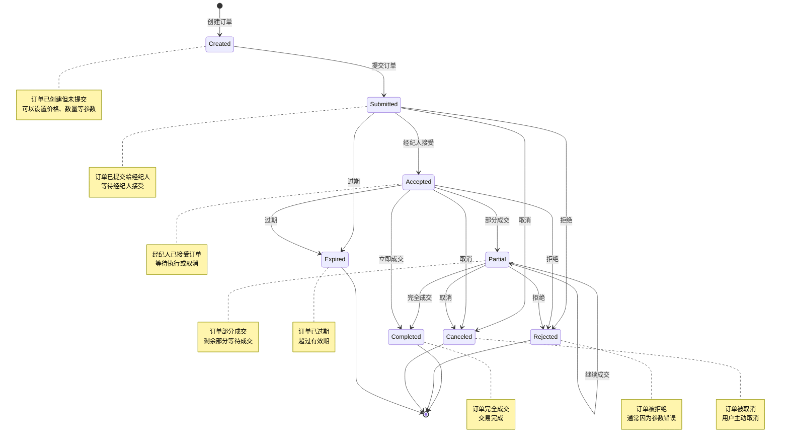


# 附录二：Backtrader 核心类图 (继承关系和关联关系)


> > "在软件工程中，统一建模语言（UML）中的类图是一种静态结构图，它通过显示系统的类、它们的属性、操作（或方法）以及对象之间的关系来描述系统的结构。"
> >
> > -Wikipedia
>
> 类图是面向对象建模的主要构建块。它用于应用结构的一般概念建模，以及将模型转换为编程代码的详细建模。类图也可用于数据建模。类图中的类表示主要元素、应用中的交互以及要编程的类。


## 核心引擎类：Cerebro

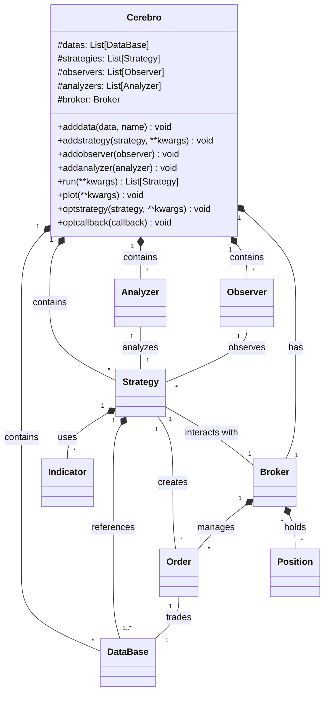


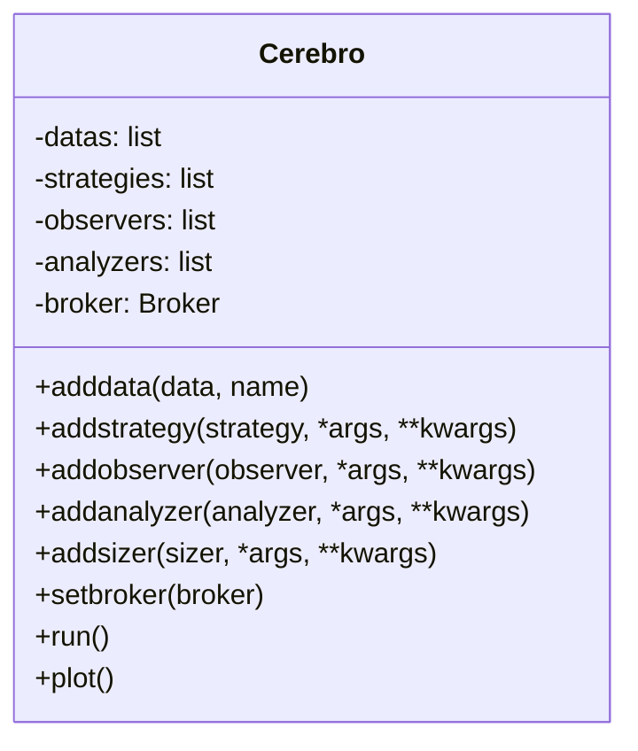


## 顶级基类:LineSeries


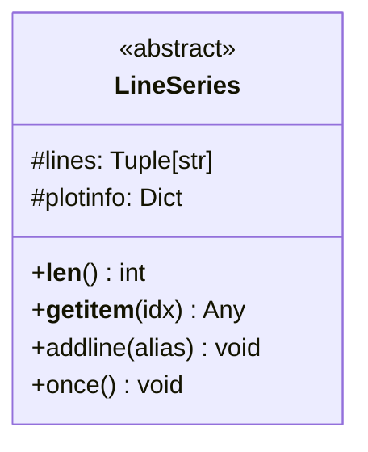


## 数据相关类:DataBase


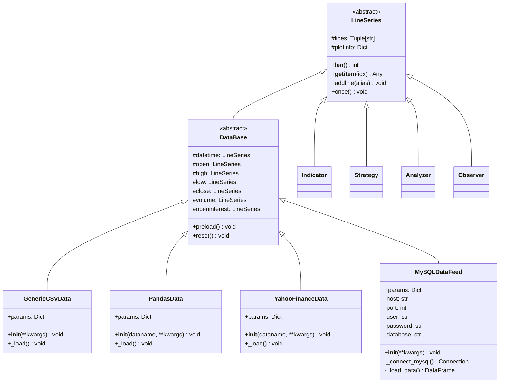


## 订单相关类:Order

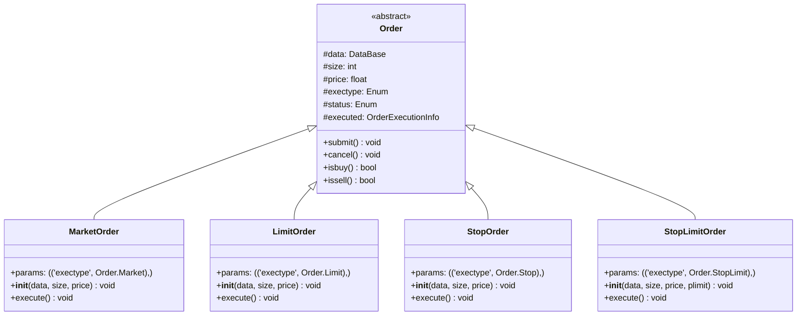


## 策略相关类 | Strategy

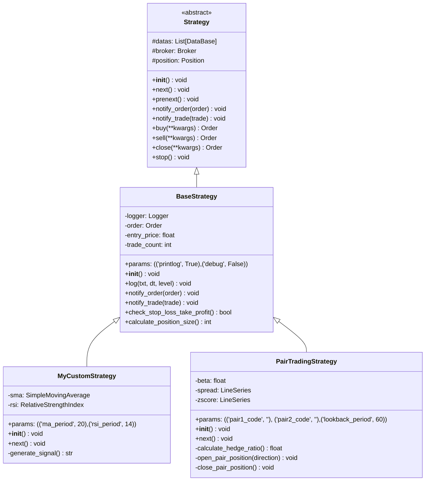


## 指标相关类:Indicator

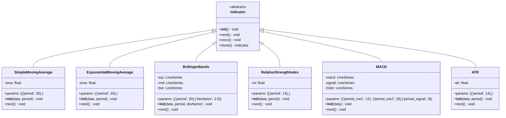


## 经纪人相关类  | Broker

### Broker类图

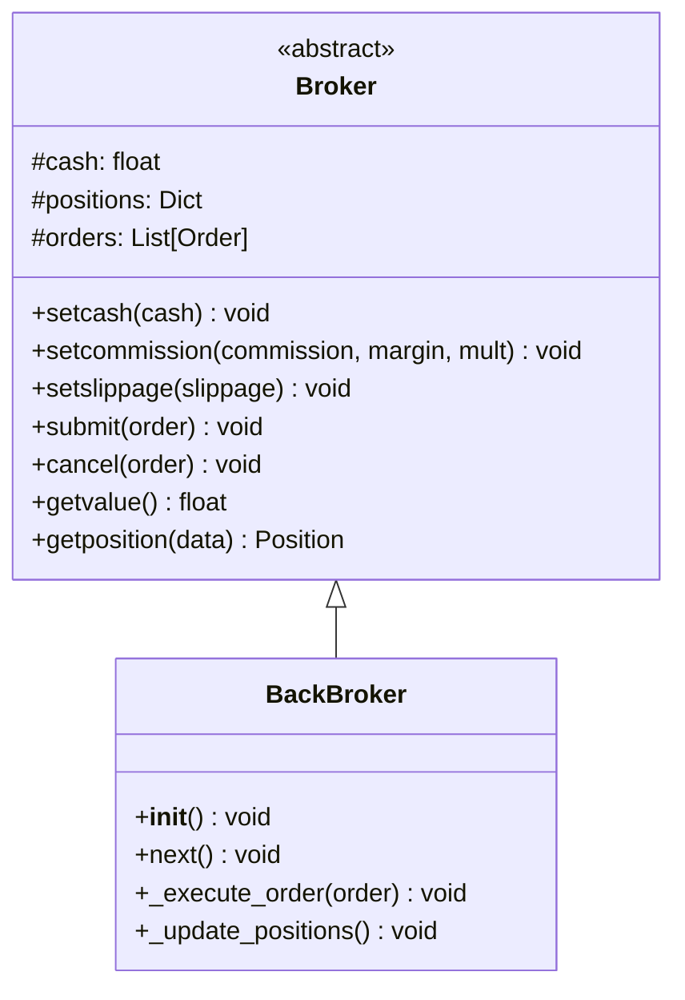


### Broker Layer架构关系图

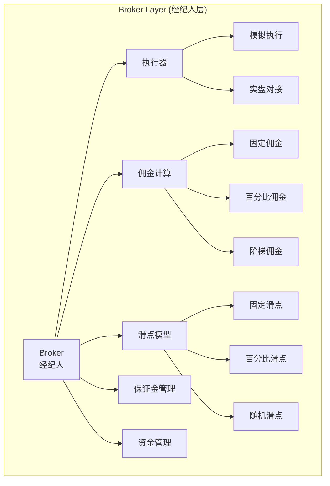


##  观察者相关类 | Observer

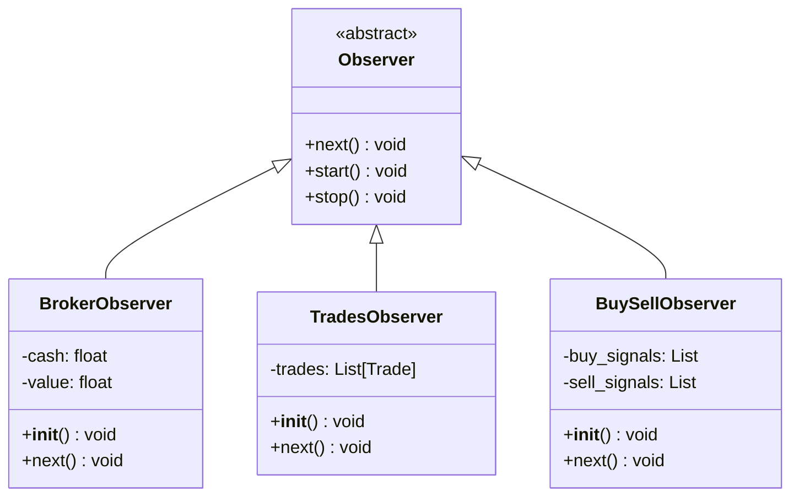


## 分析器相关类 | Analyzer

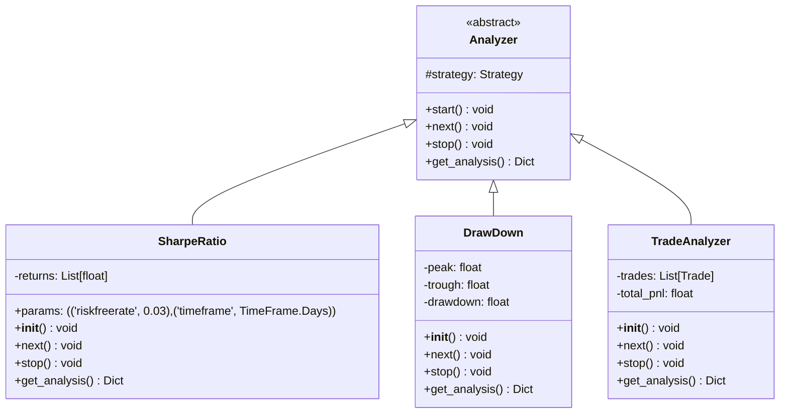


# 附录三：Backtrader 数据流图

- **Input Layer 输入层**
- **Data Processing数据处理层**
- **Core Engine 核心引擎层**
- **Strategy Layer 策略层**
- **Execution Layer执行层**
- **Analysis Layer分析层**
- **Output Layer输出层**


```mermaid
flowchart TD
    subgraph A[输入层<br/>]
        A1[CSV文件]
        A2[数据库]
        A3[API接口]
        A4[Pandas DataFrame]
    end
    
    subgraph B[数据处理层<br/>]
        B1[数据加载器<br/>Data Loader]
        B2[数据清洗<br/>Data Cleaning]
        B3[数据对齐<br/>Data Alignment]
        B4[缺失值处理<br/>Missing Value]
        B5[数据缓存<br/>Data Cache]
    end
    
    subgraph C[核心引擎层<br/>]
        C1[Cerebro<br/>回测引擎]
    end
    
    subgraph D[策略层<br/>]
        D1[策略初始化<br/>Strategy.\_\_init\_\_]
        D2[指标计算<br/>Indicators]
        D3[信号生成<br/>Signal Generation]
        D4[仓位管理<br/>Position Management]
        D5[风险管理<br/>Risk Management]
    end
    
    subgraph E[执行层<br/>]
        E1[订单生成<br/>Order Creation]
        E2[订单执行<br/>Order Execution]
        E3[佣金计算<br/>Commission]
        E4[滑点模拟<br/>Slippage]
        E5[仓位更新<br/>Position Update]
    end
    
    subgraph F[分析层<br/>]
        F1[绩效分析<br/>Performance]
        F2[风险分析<br/>Risk Analysis]
        F3[交易分析<br/>Trade Analysis]
        F4[统计检验<br/>Statistical Tests]
        F5[报告生成<br/>Report Generation]
    end
    
    subgraph G[输出层<br/>]
        G1[HTML报告]
        G2[PDF报告]
        G3[图表可视化]
        G4[Excel导出]
        G5[JSON数据]
    end
    
    %% 数据流
    A --> B1
    B1 --> B2
    B2 --> B3
    B3 --> B4
    B4 --> B5
    B5 --> C1
    
    C1 --> D1
    D1 --> D2
    D2 --> D3
    D3 --> D4
    D4 --> D5
    D5 --> E1
    
    E1 --> E2
    E2 --> E3
    E3 --> E4
    E4 --> E5
    E5 --> F1
    
    F1 --> F2
    F2 --> F3
    F3 --> F4
    F4 --> F5
    F5 --> G
    
    %% 反馈循环
    F1 -.-> D5
    F2 -.-> D4
    F3 -.-> D3
```


# 附录四:Backtrader策略生命周期图


> “状态图是计算机科学及相关字段中用于描述系统行为的一种图表。状态图要求所描述的系统由有限数量的状态组成；有时，情况确实如此，而有时这是一个合理的抽象。”维基百科


- **策略的初始化阶段：完成数据加载和技术指标及交易信号的计算**
- **回测执行阶段：获取当前数据点    ➡  执行策略逻辑  ➡  订单处理  ➡  记录结果   🔄  执行下一个数据点 ➡  执行策略逻辑 .......   **
- **分析报告阶段：计算出来的绩效指标是否符合预期？资金管理是否符合预期？风控管理是否符合预期？**
- **下一个策略优化循环周期**

```mermaid
stateDiagram-v2
    [*] --> 初始化阶段
    
    state 初始化阶段 {
        [*] --> 加载配置
        加载配置 --> 创建Cerebro
        创建Cerebro --> 添加数据源
        添加数据源 --> 添加策略
        添加策略 --> 添加分析器
        添加分析器 --> 添加观察者
        添加观察者 --> 设置经纪人
        设置经纪人 --> [*]
    }
    
    初始化阶段 --> 回测执行阶段
    
    state 回测执行阶段 {
        state 数据循环 <<fork>>
        [*] --> 数据循环
        
        数据循环 --> 获取数据点
        获取数据点 --> 执行策略逻辑
        
        state 执行策略逻辑 {
            [*] --> 指标计算
            指标计算 --> 信号生成
            信号生成 --> 仓位管理
            仓位管理 --> 风险管理
            风险管理 --> [*]
        }
        
        执行策略逻辑 --> 订单处理
        
        state 订单处理 {
            [*] --> 检查信号
            检查信号 --> 生成订单
            生成订单 --> 提交订单
            提交订单 --> 执行订单
            执行订单 --> 更新仓位
            更新仓位 --> [*]
        }
        
        订单处理 --> 记录结果
        记录结果 --> 数据循环 : 下一个数据点
        
        数据循环 --> [*] : 所有数据处理完成
    }
    
    回测执行阶段 --> 分析报告阶段
    
    state 分析报告阶段 {
        [*] --> 计算绩效指标
        计算绩效指标 --> 生成分析报告
        生成分析报告 --> 绘制图表
        绘制图表 --> 导出结果
        导出结果 --> [*]
    }
    
    分析报告阶段 --> [*]
```


# 附录五:Backtrader策略回测执行序列图


> 时序图是一种交互图，显示进程如何彼此运行以及以什么顺序运行。
>
> A Sequence diagram is an interaction diagram that shows how processes operate with one another and in what order.


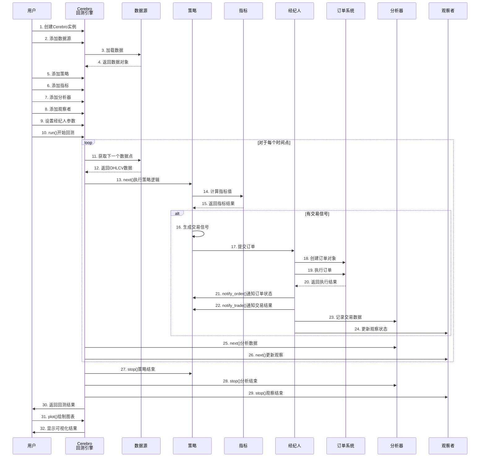


