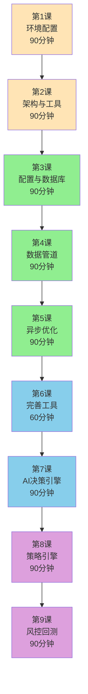
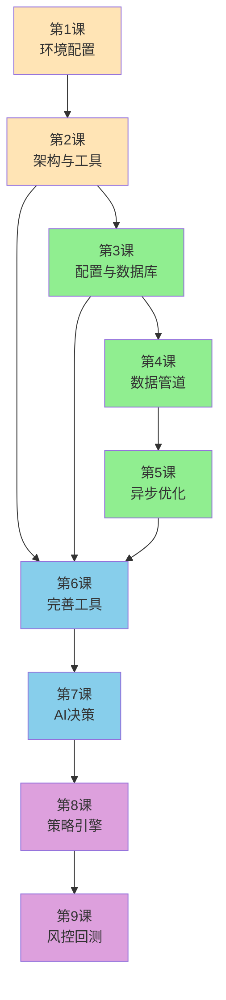

# CherryQuant 量化交易课程总览

> **课程体系版本**: v3.0
> **更新日期**: 2025-12-16
> **课程总时长**: 13.5小时（9课）
> **适用对象**: 金融系本科生、量化交易初学者

---

## 📚 课程结构



---

## 🎯 课程列表

### ✅ 第1课：量化交易入门与环境配置

**状态**: 已完成
**课时**: 90分钟
**难度**: ⭐
**目标**: 搭建完整的Python量化开发环境

**主要内容**:
- 量化交易基础概念
- Python 3.12+ 环境配置
- uv 包管理器使用
- VS Code 开发环境
- Git 版本控制

**核心技能**:
- ✅ 理解量化交易基本概念
- ✅ 搭建Python开发环境
- ✅ 使用uv管理项目依赖
- ✅ Git基础操作

---

### ✅ 第2课：项目架构设计与工具函数实现

**状态**: 已完成
**课时**: 90分钟
**难度**: ⭐⭐⭐
**目标**: 理解软件架构设计，实现基础工具函数

**主要内容**:
- 任务拆解方法
- 六边形架构设计
- 日期工具函数（date_utils.py）
- 合约工具函数（contract_utils.py）
- 交易所工具函数（exchange_utils.py）
- 单元测试编写

**核心技能**:
- ✅ 理解六边形架构
- ✅ 实现日期转换、合约解析
- ✅ 掌握CZCE 3位月份编码规则
- ✅ 编写单元测试

**依赖关系**:
- 前置：第1课
- 后续：第3课、第4课

---

### ✅ 第3课：配置管理与数据库设计

**状态**: 已完成
**课时**: 90分钟
**难度**: ⭐⭐⭐
**目标**: 掌握专业配置管理和数据库字段设计

**主要内容**:
- 单一 `config.toml`：用户级 `~/.config/cherryquant/config.toml` > 项目级 `config/config.toml` > 默认值（无隐式覆盖）
- Pydantic v2 严格校验（`extra="forbid"`、枚举约束、不可变模型）
- date(int YYYYMMDD) + datetime(UTC) 双字段策略
- MongoDB 索引设计
- make_date_timestamp 工具函数

**核心技能**:
- ✅ 对比两种配置方案
- ✅ 使用 Pydantic Field 验证
- ✅ 理解双字段策略优势
- ✅ 掌握 MongoDB 索引优化（100倍性能提升）

**依赖关系**:
- 前置：第1课、第2课
- 后续：第4课、第5课

---

### ✅ 第4课：数据管道与 Adapter 模式

**状态**: 已完成
**课时**: 90分钟
**难度**: ⭐⭐⭐⭐
**目标**: 掌握数据管道架构和 Adapter 设计模式

**主要内容**:
- Tushare API 调用
- 数据清洗流程（列名映射、类型转换）
- bulk_write + upsert 批量写入
- Adapter 抽象基类（ABC）设计
- TushareAdapter（远程API）
- LocalAdapter（本地MongoDB）
- MarketDataService（本地优先策略）

**核心技能**:
- ✅ 掌握 Tushare API
- ✅ 实现数据清洗流程
- ✅ bulk_write 批量操作（25倍性能提升）
- ✅ 掌握 Adapter 设计模式
- ✅ 本地优先策略（50-100x加速）

**依赖关系**:
- 前置：第3课（配置与数据库）
- 后续：第5课（异步优化）

**性能指标**:
- 批量写入：3秒/万条（vs 50秒循环插入）
- 本地查询：0.015秒（vs 1.253秒远程API）

---

### ✅ 第5课：异步编程与性能优化

**状态**: 已完成
**课时**: 90分钟
**难度**: ⭐⭐⭐⭐⭐
**目标**: 掌握 Python 异步编程，实现 10-50x 性能提升

**主要内容**:
- asyncio 核心概念（async/await、gather）
- motor 异步 MongoDB 驱动
- ThreadPoolExecutor + run_in_executor 包装同步 API
- Semaphore 并发控制
- RateLimiter 令牌桶限流
- AsyncRetry 自动重试（指数退避）
- 完整异步数据管道实现

**核心技能**:
- ✅ 掌握 async/await 语法
- ✅ 使用 motor 异步查询 MongoDB
- ✅ 包装 Tushare 为异步 API
- ✅ 并发控制避免资源耗尽
- ✅ 限流保护避免 API 被封

**依赖关系**:
- 前置：第4课（同步数据管道）
- 后续：第6课（完善工具）

**性能提升**:
- 同步 → 异步：8-50倍加速
- 10个并发：15.2秒 → 1.8秒

---

### 📅 第6课：完善工具函数

**状态**: 规划中
**课时**: 60分钟
**难度**: ⭐⭐
**目标**: 基于数据库实现交易日高级功能

**主要内容**:
- is_trade_date() 判断交易日
- get_next_trade_date() 下一交易日
- get_pre_trade_date() 前一交易日
- get_trade_dates() 批量查询
- LRU 缓存优化
- 批量查询优化（75倍性能提升）

**核心技能**:
- ⚪ 基于MongoDB实现交易日判断
- ⚪ 掌握Python LRU缓存
- ⚪ 批量查询性能优化
- ⚪ 边界情况处理

**依赖关系**:
- 前置：第2课（工具函数骨架）、第3-5课（数据支持）
- 后续：第7课、第8课

**性能指标**:
- 缓存查询：< 1ms
- 单次数据库查询：< 10ms
- 批量查询提升：75倍

---

### 📅 第7课：AI决策引擎实现

**状态**: 规划中
**课时**: 90分钟
**难度**: ⭐⭐⭐⭐
**目标**: 掌握基于大语言模型的量化交易决策

**主要内容**:
- AI在量化交易中的应用
- Prompt工程技巧
- LLM客户端封装
- 多LLM支持（OpenAI、通义千问、Kimi等）
- Python异步编程应用
- 并发性能优化
- 决策结果验证

**核心技能**:
- ⚪ 设计有效的Prompt
- ⚪ 封装OpenAI兼容API
- ⚪ 应用异步编程优化LLM调用
- ⚪ 使用asyncio.gather()并发
- ⚪ AI决策结果验证

**依赖关系**:
- 前置：第5课（异步编程）、第6课（工具函数）
- 后续：第8课（策略引擎集成）

**性能提升**:
- 异步并发：5倍加速（5个品种从15秒降至3秒）

---

### 📅 第8课：策略引擎设计

**状态**: 规划中
**课时**: 90分钟
**难度**: ⭐⭐⭐⭐
**目标**: 实现完整的量化交易策略引擎

**主要内容**:
- 策略引擎架构
- 技术指标计算（MA、MACD、RSI、布林带）
- 信号生成逻辑
- 策略回测框架
- 绩效评估指标
- AI决策集成

**核心技能**:
- ⚪ 设计策略引擎架构
- ⚪ 实现技术指标（向量化计算）
- ⚪ 策略回测与评估
- ⚪ 集成AI决策引擎

**依赖关系**:
- 前置：第6课（工具函数）、第7课（AI决策）
- 后续：第9课（风控）

---

### 📅 第9课：风险控制与回测系统

**状态**: 规划中
**课时**: 90分钟
**难度**: ⭐⭐⭐⭐
**目标**: 实现完整的风控和回测系统

**主要内容**:
- 风险管理框架
- 仓位管理算法（Kelly公式、ATR）
- 止损止盈策略
- 事件驱动回测引擎
- 性能分析报告
- 参数优化（网格搜索、Walk-Forward）

**核心技能**:
- ⚪ 风险指标计算（VaR、CVaR）
- ⚪ 仓位管理算法
- ⚪ 事件驱动回测引擎
- ⚪ 性能分析可视化

**依赖关系**:
- 前置：第8课（策略引擎）
- 后续：第10课（实盘交易，可选）

---

### 📅 第10课：实盘交易系统（可选）

**状态**: 规划中
**课时**: 90分钟
**难度**: ⭐⭐⭐⭐⭐
**目标**: 对接CTP实盘交易接口

**主要内容**:
- CTP接口入门
- 实时行情订阅
- 交易接口（下单、撤单、查询）
- 订单管理系统（OMS）
- 风控与监控
- 生产部署

**核心技能**:
- ⚪ CTP接口对接
- ⚪ vnpy框架使用
- ⚪ 实盘交易系统
- ⚪ 风险监控

**依赖关系**:
- 前置：第1-9课（所有核心课程）
- 完成课程体系

**⚠️ 风险提示**: 实盘交易风险极大，仅供学习研究

---

## 🔄 课程依赖关系图



**图例**:
- 🟢 绿色：已完成
- ⚪ 灰色：规划中
- 箭头：依赖关系

---

## 📊 技术栈总览

### 核心技术

| 技术 | 版本 | 用途 | 引入课程 |
|------|------|------|---------|
| Python | 3.12+ | 主要开发语言 | 第1课 |
| uv | latest | 包管理器 | 第1课 |
| pytest | 9.0+ | 单元测试 | 第2课 |
| Pydantic | 2.0+ | 配置管理与验证 | 第3课 |
| MongoDB | 7.0+ | 时序数据存储 | 第3课 |
| pymongo | latest | MongoDB同步驱动 | 第3课 |
| Tushare | latest | 金融数据接口 | 第4课 |
| motor | latest | MongoDB异步驱动 | 第5课 |
| asyncio | 内置 | 异步并发 | 第5课 |
| OpenAI API | - | LLM接口 | 第7课 |
| numpy | latest | 数值计算 | 第8课 |
| pandas | latest | 数据分析 | 第8课 |
| VNPy | 4.0+ | 交易框架 | 第10课 |

### 数据源

| 数据源 | 类型 | 用途 | 引入课程 |
|--------|------|------|---------|
| Tushare | 免费/积分 | 历史行情、交易日历 | 第4课 |
| CTP | 期货公司 | 实时行情、交易 | 第10课 |

### 开发工具

| 工具 | 用途 | 引入课程 |
|------|------|---------|
| VS Code | 代码编辑 | 第1课 |
| Git | 版本控制 | 第1课 |
| MongoDB Compass | 数据库可视化 | 第3课 |
| Docker | 容器化（可选） | 第10课 |

---

## 🎓 学习路径建议

### 路径1：标准学习路径（推荐）

**适用对象**：金融系本科生、量化交易初学者

**学习计划**：
- 第1-2周：第1-2课（环境 + 架构工具）
- 第3-4周：第3-4课（配置管理 + 数据管道）
- 第5-6周：第5-6课（异步优化 + 完善工具）
- 第7-8周：第7-8课（AI决策 + 策略引擎）
- 第9-10周：第9课（风控回测）
- 第11-12周：第10课（实盘交易，可选）+ 项目实战

**特点**：
- ✅ 循序渐进，扎实基础
- ✅ 每课都有配套作业
- ✅ 完整掌握量化交易全流程

---

### 路径2：快速上手路径

**适用对象**：有Python基础，想快速上手AI决策

**学习计划**：
- 第1周：第1-2课（快速完成）
- 第2周：第3-4课（配置 + 数据管道）
- 第3周：第5课（异步编程）
- 第4-5周：第6-7课（工具 + AI决策）
- 第6-7周：第8课（策略引擎）

**特点**:
- ✅ 聚焦AI决策核心
- ✅ 快速看到成果
- ⚠️ 需要一定Python基础

---

### 路径3：工程实践路径

**适用对象**：想深入学习量化系统工程化

**学习计划**：
- 深入学习第2课（六边形架构设计）
- 深入学习第3课（配置管理与数据库设计）
- 深入学习第4课（Adapter设计模式）
- 深入学习第5课（异步编程与性能优化）
- 深入学习第9课（事件驱动回测系统）

**特点**:
- ✅ 注重工程化
- ✅ 注重性能优化
- ✅ 适合系统开发岗位

---

## 📈 学习成果

### 完成全部课程后，你将能够：

**技术能力**:
- ✅ 搭建完整的量化交易系统
- ✅ 对接多种数据源（Tushare、CTP）
- ✅ 实现AI驱动的交易决策
- ✅ 设计并回测量化策略
- ✅ 实盘交易系统开发

**项目经验**:
- ✅ 完整的量化交易平台（CherryQuant）
- ✅ 可部署到生产环境的代码
- ✅ 完整的测试覆盖
- ✅ 规范的文档

**职业发展**:
- ✅ 量化研究员
- ✅ 算法交易工程师
- ✅ 金融数据工程师
- ✅ 量化策略开发

---

## 🔧 课程配套资源

### 代码仓库

```
CherryQuantCourse/
├── 课程文档/           # 全部课程文档
│   ├── 00_课程总览.md
│   ├── CherryQuant课程设计规范_v1.0.md
│   ├── 课程拆分与完善任务清单.md
│   ├── 第01课_量化交易入门与环境配置.md
│   ├── 第02课_项目架构设计与工具函数实现.md
│   ├── 第03课_配置管理与数据库设计_v3.0.md         # 🆕 完整框架
│   ├── 第04课_数据管道与Adapter模式_v3.0.md         # 🆕 完整框架
│   ├── 第05课_异步编程与性能优化_v3.0.md            # 🆕 完整框架
│   ├── 第06课_完善工具函数_框架要点.md              # 🆕 框架要点
│   ├── 第07课_AI决策引擎实现_框架要点.md            # 🆕 框架要点
│   ├── 第08课_策略引擎设计_框架要点.md              # 🆕 框架要点
│   ├── 第09课_风险控制与回测系统_框架要点.md        # 🆕 框架要点
│   ├── 第10课_实盘交易系统_框架要点.md              # 🆕 框架要点
│   └── _archive/       # 归档旧版本
├── 项目代码/
│   └── CherryQuant/
│       ├── src/cherryquant/
│       │   ├── config/          # 配置管理（第3课）
│       │   ├── utils/           # 工具函数（第2、6课）
│       │   ├── data/            # 数据模块（第4-5课）
│       │   ├── adapters/        # 适配器（第4-5课）
│       │   ├── ai/              # AI决策（第7课）
│       │   ├── strategy/        # 策略引擎（第8课）
│       │   ├── risk/            # 风控（第9课）
│       │   └── backtest/        # 回测（第9课）
│       ├── examples/
│       │   ├── lesson01/
│       │   ├── lesson02/
│       │   ├── lesson03/        # 🆕 配置管理示例
│       │   ├── lesson04/        # 🆕 数据管道示例
│       │   ├── lesson05/        # 🆕 异步编程示例
│       │   ├── lesson06/        # 工具函数示例
│       │   ├── lesson07/        # AI决策示例
│       │   ├── lesson08/        # 策略引擎示例
│       │   └── lesson09/        # 风控回测示例
│       └── tests/
└── 参考资料/
```

### 在线资源

- **官方文档**: https://github.com/cherryquant/cherryquant
- **问题反馈**: GitHub Issues
- **社区讨论**: （待建立）

---

## 📝 课程更新历史

### v3.0 (2025-01-25) - 第三课拆分更新

**变更内容**:
1. **课程拆分**：
   - 原第03课（180分钟）拆分为3课（各90分钟）
   - 新第03课：配置管理与数据库设计
   - 新第04课：数据管道与Adapter模式
   - 新第05课：异步编程与性能优化

2. **课程重新编号**：
   - 原第04课（完善工具）→ 新第06课
   - 原第05课（AI决策）→ 新第07课
   - 原第06课（策略引擎）→ 新第08课
   - 原第07课（风控回测）→ 新第09课
   - 原第08课（实盘交易）→ 新第10课（可选）

3. **课程时长调整**：
   - 总时长：12小时 → 13.5小时
   - 核心课程：9课（不含实盘交易）

**动机**：
- 原第03课内容过多（180分钟），难以在单次课程完成
- 拆分后每课时间合理（60-90分钟），便于学生消化
- 难度曲线更平滑，循序渐进
- 异步编程独立成课，突出重要性

**拆分效果**：
- ✅ 第03课：Pydantic v2 配置管理 + 双字段策略
- ✅ 第04课：同步数据管道 + Adapter模式
- ✅ 第05课：异步编程 → 10-50x性能提升

---

### v2.0 (2024-11-25) - 课程重组

**变更内容**:
1. **课程重组**：
   - 新增第3课：数据管道与存储
   - 新增第4课：完善工具函数
   - 原第3课（AI决策）→ 第5课

2. **依赖关系修正**：
   - 符合技术依赖：数据管道 → AI决策
   - 学习曲线更平滑

**动机**：
- 原设计将AI决策放在第3课，但缺少数据支持
- 为保证课程逻辑完整性，进行重组

---

### v1.0 (2024-11-24) - 初始版本

- 完成第1-3课（环境、架构、AI决策）
- 建立课程设计规范
- 创建示例代码和练习

---

## 🙋 常见问题

### Q1: 需要什么基础？

**A**:
- **必备**：Python基础（函数、类、异常处理）
- **可选**：金融市场基础知识
- **可选**：数据库基础

### Q2: 需要付费API吗？

**A**:
- **Tushare**: 免费（注册即送100积分，够用）
- **LLM API**: 可选（支持免费的Ollama，也支持付费API）
- **期货账户**: 第8课需要（可使用模拟账户）

### Q3: Mac/Windows/Linux都支持吗？

**A**:
- ✅ 所有主流操作系统都支持
- ✅ 课程中会提供多平台安装指南

### Q4: 完成课程需要多长时间？

**A**:
- **快速路径**: 4-6周（每周10小时）
- **标准路径**: 10-12周（每周5-8小时）
- **深入学习**: 16-20周（包含项目实战）

### Q5: 课程会持续更新吗？

**A**:
- ✅ 会根据技术发展更新
- ✅ 会根据学生反馈改进
- ✅ 新的量化技术会及时加入

---

## 📧 联系方式

- **课程作者**: CherryQuant 开发团队
- **GitHub**: https://github.com/cherryquant/cherryquant
- **问题反馈**: GitHub Issues

---

**文档版本**: v3.0
**最后更新**: 2025-01-25
**维护者**: CherryQuant 团队
