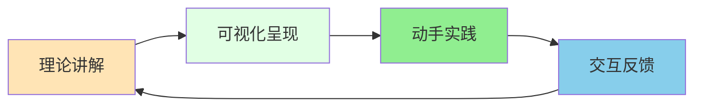
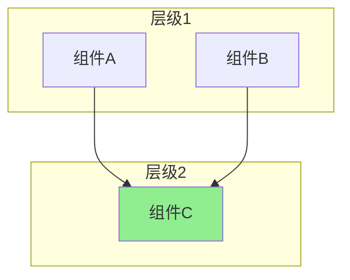
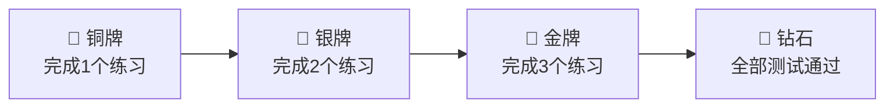

```mermaid
gantt
    title 第X课学习路径（预计XX分钟）
    dateFormat  mm
    section 理论学习
    Part 1    :a1, 00, 15m
    Part 2    :a2, after a1, 20m
    section 实践编码
    Part 3    :b1, after a2, 30m
```

# CherryQuant 课程设计规范 v1.0

> **版本**: v1.0
> **制定日期**: 2024-11-24
> **适用范围**: CherryQuant量化交易课程全系列（第1-8课）

---

## 📋 目录

- [1. 课程风格总原则](#1-课程风格总原则)
- [2. 文档结构规范](#2-文档结构规范)
- [3. 内容设计规范](#3-内容设计规范)
- [4. 可视化规范](#4-可视化规范)
- [5. 交互元素规范](#5-交互元素规范)
- [6. 代码规范](#6-代码规范)
- [7. 作业设计规范](#7-作业设计规范)
- [8. 教学支持规范](#8-教学支持规范)
- [9. 质量标准](#9-质量标准)

---

## 1. 课程风格总原则

### 1.1 核心理念

**"理论+实践+可视化+互动"四位一体**



### 1.2 设计原则

| 原则 | 说明 | 示例 |
|------|------|------|
| **渐进式学习** | 从简单到复杂，逐步深入 | 先讲日期工具，再讲合约解析 |
| **场景驱动** | 每个知识点都有真实场景 | "系统收到合约代码'rb2501.SHFE'，需要解析..." |
| **可视化优先** | 能画图就不用文字 | 用Mermaid架构图代替文字描述 |
| **即时反馈** | 学生能立即验证学习成果 | 每个函数都有测试用例 |
| **成就激励** | 游戏化设计，增强动力 | 完成作业获得"🏆认证" |

### 1.3 目标受众

- **学生**: Python基础（3个月+），对量化交易感兴趣
- **教师**: 有编程背景，需要标准化教学材料
- **自学者**: 希望系统学习量化交易

---

## 2. 文档结构规范

### 2.1 标准文档模板

每课文档**必须包含**以下结构（固定顺序）：

```
# 第X课：课程标题 vX.X

[元信息]
- 课时
- 目标
- 难度
- 版本

---

## 🗺️ 课程脑图
[Mermaid mindmap]

---

## 📋 课程概述

### 本课要解决的问题
[核心挑战]

### 学习目标
[Know-Do-Be三层面]

### 课程路线图
[Mermaid gantt图]

### 本课特色
[4个亮点]

---

## ✅ 课前检查清单

### 必备知识
### 环境配置
### 快速验证

---

## 🎯 学习进度追踪
[交互式复选框]

---

## Part 1: [主题] (XX分钟)
[内容...]

---

## Part 2-N: [其他部分]
[内容...]

---

## 📚 附录 A：完整代码参考
[可折叠代码块]

---

## 📚 附录 B：教学指南
[教师参考材料]

---

## 📝 课后作业
[分层作业设计]

---

## 🎓 总结
[要点回顾]

---

## 📖 扩展阅读
[延伸资源]
```

### 2.2 文件命名规范

```
课程文档:
- 第XX课_主题_vX.X.md
- 示例: 第02课_项目架构设计与工具函数实现_v2.0.md

改进总结:
- 第XX课_vX.X改进总结.md
- 示例: 第02课_v2.0改进总结.md

示例代码:
- examples/lessonXX/
- 示例: examples/lesson02/
```

### 2.3 版本标识

```markdown
**版本**: v2.0 (YYYY-MM-DD)
**作者**: CherryQuant 开发团队
**课程目标**: [一句话说明]
```

---

## 3. 内容设计规范

### 3.1 课程概述（必需）

#### 3.1.1 本课要解决的问题

**格式**:
```markdown
### 本课要解决的问题

**核心问题**: [一句话概括]

在第X课中，我们[已完成内容]。现在面临的挑战是：

- 🤔 [挑战1]
- 🤔 [挑战2]
- 🤔 [挑战3]

**真实案例**:（可选，如果有）
[具体例子]
```

#### 3.1.2 学习目标（Know-Do-Be框架）

**格式**:
```markdown
### 学习目标

完成本课后，你将能够：

**知识层面**（Know）：
- ✅ [知识点1]
- ✅ [知识点2]

**技能层面**（Do）：
- ✅ [技能1]
- ✅ [技能2]

**态度层面**（Be）：
- ✅ [态度/习惯1]
- ✅ [态度/习惯2]
```

#### 3.1.3 课程路线图（时间可视化）

**必须使用Mermaid Gantt图**:
```markdown
### 课程路线图



```mermaid
gantt
    title 第X课学习路径（预计XX分钟）
    dateFormat  mm
    section 理论学习
    Part 1    :a1, 00, 15m
    Part 2    :a2, after a1, 20m
    section 实践编码
    Part 3    :b1, after a2, 30m
    section 总结
    Part 4    :c1, after b1, 10m
```

**预计学习时间**: XX分钟
```

### 3.2 Part内容规范

#### 3.2.1 Part标题格式

```markdown
## Part X: [主题]（XX分钟）

### X.1 [子主题1]
[内容...]

### X.2 [子主题2]
[内容...]

---

### 🤔 思考题 X
<details>
<summary>💡 [问题]（点击查看答案）</summary>

[答案内容]
</details>

---
```

#### 3.2.2 内容编排原则

| 要素 | 规范 |
|------|------|
| **引入** | 用场景/故事开头 |
| **概念** | 定义清晰，配图说明 |
| **示例** | 代码精简（20-30行），完整代码放附录 |
| **对比** | 用表格对比（如：传统 vs AI） |
| **总结** | 每个Part结尾有要点回顾 |

### 3.3 语言风格

#### 3.3.1 语气

- ✅ 使用**第二人称**（"你"），亲切感
- ✅ 使用**口语化表达**，避免生硬
- ✅ 使用**比喻类比**，降低理解难度
- ❌ 避免过于学术化的表达

**示例**:
```markdown
✅ 好: "你可以把工具函数想象成螺丝刀、扳手这些基础工具"
❌ 差: "工具函数是软件工程中的基础抽象单元"
```

#### 3.3.2 表情符号使用

**适度使用**（每段1-2个）:
- 🎯 目标、要点
- ✅ 正确、完成
- ❌ 错误、避免
- 💡 提示、建议
- 🤔 思考、问题
- 📊 数据、图表
- 🏆 成就、认证
- ⚠️ 警告、注意

**避免过度**:
```markdown
❌ 差: 🎉🎉🎉 恭喜你！！！✨✨✨ 你太棒了！！！🔥🔥🔥
✅ 好: 🎉 恭喜完成第一个练习！
```

---

## 4. 可视化规范

### 4.1 Mermaid图表使用

**每课至少包含**:

| 图表类型 | 最少数量 | 用途 |
|---------|---------|------|
| **mindmap** | 1个 | 课程脑图（开头） |
| **gantt** | 1个 | 时间路线图 |
| **flowchart** | 2-3个 | 流程、架构 |
| **sequence** | 0-1个 | 交互流程（可选） |
| **graph** | 1-2个 | 关系、架构 |

### 4.2 架构图规范

**标准架构图模板**:


**配色规范**:
- 核心组件: `#90EE90` (绿色)
- 输入层: `#FFE4B5` (黄色)
- 输出层: `#E1FFE4` (浅绿)
- 警示: `#FFE4E1` (浅红)

### 4.3 表格使用

**对比表格**（必需）:
```markdown
| 维度 | 方案A | 方案B |
|------|------|------|
| [维度1] | [说明] | [说明] |
| [维度2] | [说明] | [说明] |
```

**统计表格**（推荐）:
```markdown
| 指标 | v1.0 | v2.0 | 提升 |
|------|------|------|------|
| [指标1] | XX | XX | +XX% |
```

---

## 5. 交互元素规范

### 5.1 课前检查清单

**标准格式**:
```markdown
## ✅ 课前检查清单

### 必备知识
在开始本课之前，请确认你已掌握：
- [ ] [知识点1]
- [ ] [知识点2]

### 环境配置
- [ ] [配置项1]
- [ ] [配置项2]

### 快速验证
运行以下命令，确保环境正常：
```bash
[验证命令]
```
```

### 5.2 学习进度追踪

**标准格式**:
```markdown
## 🎯 学习进度追踪

在学习过程中，勾选已完成的部分：

- [ ] **Part 1**: [内容]（XX分钟）
- [ ] **Part 2**: [内容]（XX分钟）
  - [ ] [子任务1]
  - [ ] [子任务2]
- [ ] **课后作业**: 完成X个作业

**完成后你将获得**: 🏆 **CherryQuant [主题]认证**
```

### 5.3 思考题设计

**标准格式**（每个Part 0-2个）:
```markdown
### 🤔 思考题 X

<details>
<summary>💡 [问题描述]（点击查看答案）</summary>

**问题分析**:
[分析...]

**答案**:
[答案内容]

**延伸**:（可选）
[相关知识]

</details>
```

### 5.4 成就系统（可选）

**格式**:
```markdown
## 🏆 学习成就

完成以下里程碑，成为[主题]大师！


```

---

## 6. 代码规范

### 6.1 代码位置原则

**主体内容**（Part 1-N）:
- ✅ 只放**关键代码片段**（20-30行）
- ✅ 只保留**概念解释性代码**
- ❌ 不放完整实现

**附录A**（完整代码参考）:
- ✅ 完整的函数实现
- ✅ 使用**可折叠区域**（`<details>`）
- ✅ 每个文件独立折叠

**示例目录**（examples/lessonXX/）:
- ✅ 可运行的完整代码
- ✅ 包含测试用例
- ✅ 有详细的README

### 6.2 代码注释规范

**Python代码**:
```python
def function_name(param: type) -> return_type:
    """
    函数功能（一句话）

    Args:
        param: 参数说明

    Returns:
        返回值说明

    为什么这样设计？（可选）
    [设计理由...]

    Examples:
        >>> function_name(value)
        expected_output
    """
    # 实现步骤1
    step1 = ...

    # 实现步骤2
    step2 = ...

    return result
```

### 6.3 代码展示规范

**主体内容中**:
```markdown
**核心函数**: `function_name()`

```python
def function_name(param: type) -> return_type:
    """函数说明"""
    # 关键逻辑
    return result
```

💡 **设计要点**: [简要说明]

📁 **完整实现**: 见附录 A.X
```

**附录中**:
```markdown
### A.X 函数名完整实现

<details>
<summary>📁 点击展开 <code>filename.py</code></summary>

```python
[完整代码]
```

</details>
```

### 6.4 类型提示规范

**Python 3.12+现代语法**（强制）:
```python
✅ 推荐:
def func(date: str | int | None = None) -> int:
    pass

❌ 避免:
from typing import Optional, Union
def func(date: Optional[Union[str, int]] = None) -> int:
    pass
```

---

## 7. 作业设计规范

### 7.1 作业分层

**每课3-5个作业**:

| 层级 | 难度 | 数量 | 特征 |
|------|------|------|------|
| **必做** | ⭐⭐ | 2-3个 | 巩固核心知识 |
| **选做** | ⭐⭐⭐ | 1-2个 | 提升能力 |
| **挑战** | ⭐⭐⭐⭐ | 0-1个 | 综合应用 |

### 7.2 作业标准格式

```markdown
#### 作业X：[标题] ⭐⭐ (必做)

**🎬 场景说明**:
[为什么需要这个功能？真实应用场景]

**📝 需求**:
实现 `function_name()` 函数

```python
def function_name(param: type) -> return_type:
    """
    [函数说明]

    场景：[使用场景]
    为什么需要：[必要性]

    Args:
        param: [说明]

    Returns:
        [说明]

    Examples:
        >>> function_name(value)
        expected_result
    """
    pass
```

**🧪 测试用例**:
```python
def test_function_name():
    # 普通情况
    assert function_name(input1) == expected1

    # 边界情况
    assert function_name(edge_case) == expected2
```

<details>
<summary>💡 实现提示（点击查看）</summary>

**思路**:
1. [步骤1]
2. [步骤2]

**伪代码**:
```python
[伪代码示例]
```

</details>

**📁 参考答案**: `examples/lessonXX/solutions/exerciseXX.py`
```

### 7.3 测试用例规范

**必须提供**:
- ✅ 普通情况（至少2个）
- ✅ 边界情况（至少2个）
- ✅ 异常情况（至少1个，如果适用）

---

## 8. 教学支持规范

### 8.1 教学指南（附录B）

**必须包含**:

```markdown
## 附录 B：教学指南

### B.1 课程时间分配

| 环节 | 时长 | 教学要点 | 互动方式 |
|------|------|----------|----------|
| **导入** | 5分钟 | [要点] | [方式] |
| **Part 1** | XX分钟 | [要点] | [方式] |
| ...

### B.2 常见学生问题

#### Q1: [问题]

**学生可能的想法**:
[...]

**教师应答**:
[推荐回答话术]

**演示代码**:（如果需要）
```python
[示例代码]
```

### B.3 板书建议

**第一块板书**: [主题]
```
[手绘板书内容]
```

### B.4 教学技巧

1. **类比法**: [...]
2. **渐进式提问**: [...]
3. **实时Live Coding**: [...]

### B.5 差异化教学

**学有余力的学生**:
- [建议]

**学习困难的学生**:
- [建议]
```

### 8.2 README文件规范

**examples/lessonXX/README.md**必须包含:

```markdown
# 第XX课 示例代码

## 📁 目录结构
[目录树]

## 🚀 快速开始
### 1. 安装依赖
### 2. 配置环境
### 3. 运行示例

## 📚 示例说明
[每个文件的说明]

## ✏️ 练习作业
[作业列表和参考答案位置]

## 💰 成本估算（如果涉及API）
[成本说明]

## ⚠️ 注意事项
[重要提示]
```

---

## 9. 质量标准

### 9.1 文档质量评分表

| 维度 | 优秀(9-10分) | 良好(7-8分) | 及格(6分) | 不及格(<6分) |
|------|------------|-----------|---------|------------|
| **可读性** | 结构清晰，层次分明 | 结构清晰 | 基本清晰 | 混乱 |
| **趣味性** | 场景生动，例子丰富 | 有案例 | 较枯燥 | 纯理论 |
| **条理性** | 逻辑完美，环环相扣 | 逻辑清晰 | 基本连贯 | 跳跃 |
| **实用性** | 代码完整可运行 | 代码基本完整 | 代码不完整 | 无代码 |
| **可视化** | 10+图表 | 5-9图表 | 1-4图表 | 无图表 |
| **互动性** | 15+互动元素 | 8-14元素 | 3-7元素 | 无互动 |
| **可教性** | 完整教学指南 | 基本教学指南 | 简单指南 | 无指南 |

**目标**: 每课总分 ≥ **8.0/10 (A级)**

### 9.2 必检项目清单

**发布前必须检查**:

#### 文档结构
- [ ] 课程脑图（mindmap）
- [ ] 课程概述（学习目标、路线图）
- [ ] 课前检查清单
- [ ] 学习进度追踪
- [ ] Part 1-N 完整
- [ ] 附录A（完整代码）
- [ ] 附录B（教学指南）
- [ ] 课后作业（3-5个）
- [ ] 总结和扩展阅读

#### 可视化
- [ ] Mermaid图表 ≥ 5个
- [ ] 表格 ≥ 3个
- [ ] 图表能正常渲染

#### 交互元素
- [ ] 思考题 ≥ 3个
- [ ] 折叠区域 ≥ 5个
- [ ] 复选框清单 ≥ 2个

#### 代码质量
- [ ] 所有代码都有类型提示
- [ ] 所有代码都有文档字符串
- [ ] 示例代码可运行
- [ ] 测试用例完整

#### 教学支持
- [ ] 教学指南完整
- [ ] 常见问题 ≥ 3个
- [ ] 板书建议 ≥ 2块
- [ ] 示例README完整

---

## 10. 版本管理规范

### 10.1 版本号规则

**格式**: vX.Y

- **X（主版本号）**: 内容大改（重写）时递增
  - v1.0 → v2.0: 完全重构
- **Y（次版本号）**: 小修正时递增
  - v2.0 → v2.1: 修正错误、优化细节

### 10.2 改进文档规范

**每次大版本升级必须创建改进总结**:
- 文件名: `第XX课_vX.Y改进总结.md`
- 内容: 对比表、改进点、文件清单、下一步建议

---

## 11. 风格一致性检查表

**跨课程风格一致性**:

| 项目 | 一致性要求 |
|------|----------|
| **文档结构** | 所有课程使用相同的模板 |
| **标题层级** | 统一使用#、##、### |
| **表情符号** | 统一的符号含义 |
| **配色方案** | Mermaid图统一配色 |
| **术语** | 统一专业术语（如"品种代码"而非"商品代码"） |
| **代码风格** | 统一类型提示、注释风格 |
| **作业格式** | 统一的作业模板 |

---

## 12. 参考示例

### 12.1 优秀课程示例

**第二课 v2.0**（标杆）:
- ✅ 文档行数: 2923行
- ✅ Mermaid图: 10+个
- ✅ 思考题: 6个
- ✅ 作业: 6个
- ✅ 总评分: 8.3/10 (A-)

**第三课 v2.0**（超越）:
- ✅ 文档行数: 1500行
- ✅ Mermaid图: 8个
- ✅ 代码行数: 990行
- ✅ 总评分: 8.6/10 (A)

### 12.2 待改进课程

**第一课 v1.0**（需重构）:
- ⚠️ 缺少课程脑图
- ⚠️ 缺少学习进度追踪
- ⚠️ 缺少思考题
- ⚠️ 缺少教学指南

---

## 13. 快速开始指南

### 13.1 创建新课程

**步骤**:
1. 复制文档模板（见2.1节）
2. 填写课程脑图（Mermaid mindmap）
3. 填写课程概述（学习目标、路线图）
4. 编写Part 1-N
5. 添加可视化图表（≥5个）
6. 设计作业（3-5个）
7. 编写教学指南
8. 运行质量检查（见9.2节）

### 13.2 改进现有课程

**步骤**:
1. 阅读现有课程，评分（见9.1节）
2. 对照规范，列出缺失项
3. 逐项补充（优先级：结构 > 可视化 > 交互）
4. 创建改进总结文档
5. 更新版本号

---

## 附录：Markdown代码片段库

### 课程脑图模板

```markdown
## 🗺️ 课程脑图

```mermaid
mindmap
  root((第X课<br/>[主题]))
    Part1[Part1主题]
      子主题1
      子主题2
    Part2[Part2主题]
      子主题1
    Part3[Part3主题]
```
```

### 时间路线图模板

```markdown

```

### 思考题模板

```markdown
### 🤔 思考题 X

<details>
<summary>💡 [问题]（点击查看答案）</summary>

**答案**:
[内容]

</details>
```

---

## 版本历史

| 版本 | 日期 | 变更说明 |
|------|------|---------|
| v1.0 | 2024-11-24 | 初始版本，总结第2-3课改进经验 |

---

**制定人**: Claude (Sonnet 4.5)
**审核人**: CherryQuant 课程团队
**下次审阅**: 2025-01-24（3个月后）

✅ 本规范是CherryQuant课程质量的保证，所有课程开发者必须遵守！
