# 第01课：量化交易入门与环境配置 v2.0

**课时**: 90 分钟
**目标**: 理解量化交易基础概念，完成开发环境配置
**难度**: ⭐ 入门级
**版本**: v2.0
**更新日期**: 2024-11-24

---

## 🗺️ 课程脑图

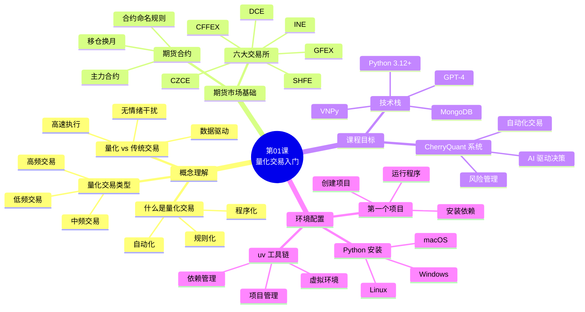

---

## 📋 课程概述

### 本课要解决的问题

**核心问题**：
1. ❓ 量化交易是什么？和传统交易有什么区别？
2. ❓ 如何从零开始搭建量化交易开发环境？
3. ❓ Python 项目如何组织？依赖如何管理？
4. ❓ 本课程要构建什么样的量化交易系统？

**现实痛点**：
- 😓 传统交易依赖感觉，容易被情绪支配
- 😓 手动盯盘耗时耗力，错过交易机会
- 😓 Python 环境配置复杂，依赖冲突频繁
- 😓 不知道从哪里开始，缺少系统学习路径

### 学习目标 (Know-Do-Be)

**📖 Know - 理解概念**：
- 理解量化交易的定义、优势和分类
- 了解中国期货市场基础（交易所、合约、主力合约）
- 认识 Python 生态工具（uv、venv、pip）
- 理解本课程的整体架构和技术栈

**🛠️ Do - 掌握技能**：
- 能够安装 Python 3.12+ 和 uv 工具
- 能够创建 Python 项目并管理依赖
- 能够运行第一个 Python 程序
- 能够使用 uv 的常用命令

**🎯 Be - 培养素质**：
- 建立系统化思维（从概念到实践）
- 养成使用现代工具的习惯
- 培养解决问题的能力（查文档、调试）
- 树立量化交易的正确认知

### 课程路线图

```mermaid
gantt
    title 第01课时间分配（90分钟）
    dateFormat HH:mm
    axisFormat %H:%M

    section 概念理解
    什么是量化交易         :00:00, 15m
    期货市场基础           :00:15, 10m
    课程目标与技术栈       :00:25, 10m

    section 环境配置
    Python 环境配置        :00:35, 15m
    uv 工具安装与使用      :00:50, 10m

    section 动手实践
    创建第一个项目         :01:00, 10m
    uv 命令详解            :01:10, 10m

    section 总结与作业
    课程总结               :01:20, 5m
    作业布置               :01:25, 5m
```

### 本课特色

- 🎬 **故事化引入**: 从真实交易场景引出量化交易概念
- 🔧 **现代工具链**: 使用 2024 年最新的 uv 工具（比传统工具快 10-100 倍）
- 📊 **可视化学习**: 5+ Mermaid 图表帮助理解
- 💻 **即学即用**: 课上完成第一个 Python 程序
- 🎯 **目标明确**: 清晰的学习路径和毕业项目

---

## ✅ 课前检查清单

### 必备知识

- [ ] 了解基本的计算机操作（文件管理、命令行基础）
- [ ] 知道如何下载和安装软件
- [ ] **不需要**任何编程基础（从零开始教）
- [ ] **不需要**金融背景（课程会讲解期货基础）

### 环境配置

- [ ] 操作系统：Windows 10+、macOS 10.15+、或 Linux
- [ ] 至少 5GB 可用磁盘空间
- [ ] 稳定的网络连接（用于下载工具和依赖）
- [ ] 文本编辑器（推荐 VS Code，课程会用到）
- [ ] 完成项目依赖安装：在项目根目录执行 `uv sync`（包含 Pydantic v2 / PyMongo 等后续课程所需依赖）

### 快速验证

**课后你应该能够**：
- [ ] 解释量化交易的定义和优势
- [ ] 说出中国 6 大期货交易所的名称
- [ ] 在终端运行 `python --version` 和 `uv --version`
- [ ] 创建 Python 项目并运行代码
- [ ] 使用 `uv sync` 完成课程依赖安装（含 Pydantic/Mongo 等第03课所需），熟练 `uv add`、`uv run` 等常用命令

---

## 🎯 学习进度追踪

**请在学习过程中勾选已完成的内容**：

- [ ] Part 1: 理解量化交易概念
- [ ] Part 2: 了解期货市场基础
- [ ] Part 3: 明确课程目标
- [ ] Part 4: 完成 Python 环境配置
- [ ] Part 5: 创建第一个项目
- [ ] Part 6: 掌握 uv 常用命令
- [ ] Part 7: 理解项目结构
- [ ] 作业 1: 环境配置验证 ⭐⭐
- [ ] 作业 2: Python 基础练习 ⭐⭐⭐
- [ ] 作业 3: 思考题 ⭐

---

## 📚 Part 1: 什么是量化交易？(15分钟)

### 1.1 从一个真实故事开始

**场景：小张的传统交易一天**

```
早上 9:00  - 打开交易软件，开始盯盘
上午 10:30 - 看到螺纹钢涨了 2%，心里痒痒，犹豫要不要买
          "会不会已经涨到顶了？再等等？"
中午 12:00 - 去吃午饭，回来发现涨了 5%！错过最佳买点 😭
下午 14:00 - 终于忍不住追高买入
下午 15:00 - 价格突然跳水，慌了，赶紧止损卖出
傍晚 17:00 - 盘后发现价格又涨回去了，卖早了 😭😭
晚上 22:00 - 一整天盯盘累死，还亏了 3000 元
```

**小张的问题在哪里？**

| 问题         | 原因             | 后果           |
| ------------ | ---------------- | -------------- |
| ❌ 错过机会   | 人不可能 24 小时盯盘 | 错过最佳买点   |
| ❌ 情绪化决策 | 贪婪和恐惧影响判断   | 追高杀跌       |
| ❌ 缺少依据   | 凭感觉，没有数据支撑 | 决策随意       |
| ❌ 执行太慢   | 手动操作，反应迟钝   | 滑点损失       |
| ❌ 无法复盘   | 没有记录交易过程     | 无法总结经验   |

**量化交易如何解决这些问题？**

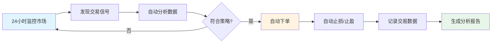

### 1.2 量化交易的定义

> **量化交易（Quantitative Trading）**
> = 用**计算机**执行 + **数学模型**分析 + **自动化**交易

**三个核心要素**：

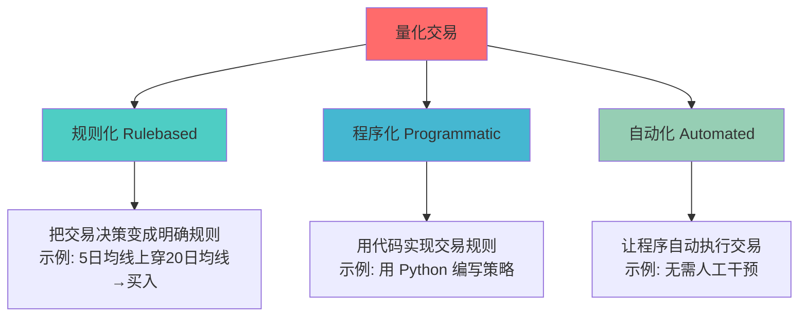

**量化交易 ≠ 高频交易**：
- 高频交易是量化交易的一种类型
- 本课程重点：**中低频策略**（日内到天级）
- AI 驱动的决策方式（区别于传统规则）

### 1.3 量化交易 vs 传统交易

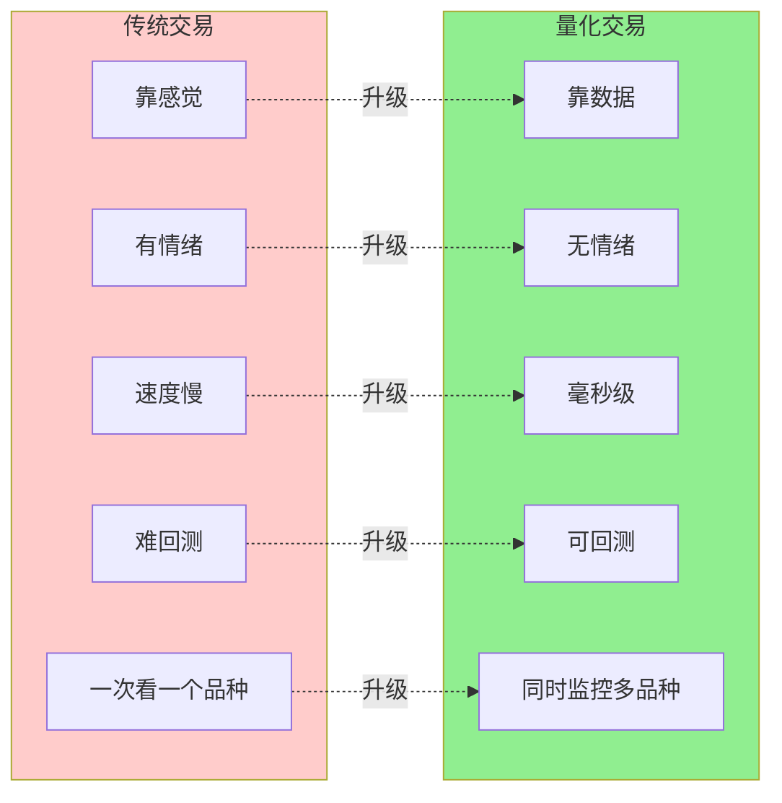

**详细对比**：

| 维度       | 传统交易           | 量化交易                     | 优势         |
| ---------- | ------------------ | ---------------------------- | ------------ |
| **决策依据** | 感觉、经验         | 数据、模型                   | ✅ 客观准确   |
| **情绪影响** | 恐惧、贪婪         | 无情绪                       | ✅ 纪律性强   |
| **执行速度** | 秒级（手动点击）   | 毫秒级（自动）               | ✅ 抓住机会   |
| **回测能力** | 难以回测历史策略   | 可用历史数据验证             | ✅ 降低风险   |
| **可复制性** | 依赖个人技能       | 代码可复制                   | ✅ 可规模化   |
| **监控范围** | 一次 1-2 个品种    | 同时监控几十个品种           | ✅ 分散风险   |
| **交易记录** | 手动记录，易遗漏   | 自动记录每笔交易             | ✅ 便于分析   |
| **学习曲线** | 依赖长期经验积累   | 可快速迭代优化               | ✅ 持续改进   |

### 1.4 量化交易的分类

#### 按交易频率分类

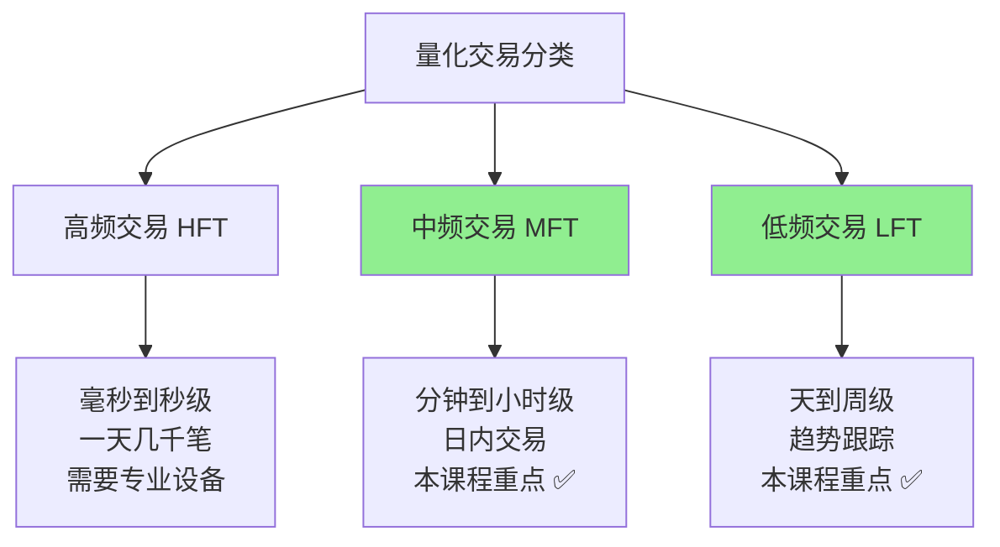

#### 按策略类型分类

| 策略类型     | 核心思想                 | 适用市场 | 本课程 |
| ------------ | ------------------------ | -------- | ------ |
| **趋势策略** | 跟随价格趋势（涨就买）   | 单边行情 | ✅     |
| **均值回归** | 价格偏离后会回归正常值   | 震荡行情 | ✅     |
| **套利策略** | 利用不同市场的价差       | 期现套利 | ❌     |
| **做市策略** | 提供流动性赚取价差       | 高频交易 | ❌     |
| **AI 策略**  | 用机器学习/大模型决策 🔥 | 全市场   | ✅     |

**本课程特色：AI 驱动的量化交易**

---

<details>
<summary><b>💡 思考题 1：量化交易是否适合所有人？</b></summary>

**问题**：量化交易看起来很好，是不是所有人都应该做量化交易？

**参考答案**：

**量化交易的优势**：
- ✅ 适合理性、纪律性强的投资者
- ✅ 适合有编程基础或愿意学习的人
- ✅ 适合能接受回测结果的人

**量化交易的局限**：
- ⚠️ 需要一定的技术门槛（Python、数学）
- ⚠️ 需要时间开发和优化策略
- ⚠️ 历史数据不能完全预测未来
- ⚠️ 极端行情（如黑天鹅事件）可能失效

**结论**：
- 量化交易是**工具**，不是**圣杯**
- 需要结合自身情况选择
- 本课程目标：让你**掌握工具**，**理性决策**

</details>

---

## 🏦 Part 2: 中国期货市场基础 (10分钟)

### 2.1 什么是期货？

**通俗解释**：

> **期货** = 未来某个时间的买卖合约

**生活中的例子**：

```
现实场景：
现在是 11 月，农民老李种了 100 亩小麦，预计明年 6 月收获。
老李担心明年小麦价格下跌，于是现在就和粮商约定：
"明年 6 月，我以 2500 元/吨的价格卖给你"

这就是期货合约的基本思想：
- 农民锁定了收益（不怕价格跌）
- 粮商锁定了成本（不怕价格涨）
- 双方都规避了价格波动风险
```

**金融市场的期货**：

```
品种：螺纹钢 (rb)
合约：rb2501
含义：2025 年 1 月交割的螺纹钢期货
规格：一手 = 10 吨
价格：3500 元/吨
保证金：约 15%（相当于 10 倍杠杆）

计算：
一手价值 = 3500 元/吨 × 10 吨 = 35,000 元
保证金   = 35,000 × 15% = 5,250 元
```

**期货的特点**：

| 特点       | 说明                       | 影响                 |
| ---------- | -------------------------- | -------------------- |
| **杠杆**   | 用 15% 保证金控制 100% 仓位 | 收益和风险都放大     |
| **双向**   | 可以做多（买涨）或做空（买跌） | 涨跌都有机会赚钱     |
| **T+0**    | 当天可以多次买卖           | 灵活但也容易过度交易 |
| **到期交割** | 合约到期需要实物交割或平仓 | 需要关注合约到期日   |

### 2.2 中国六大期货交易所

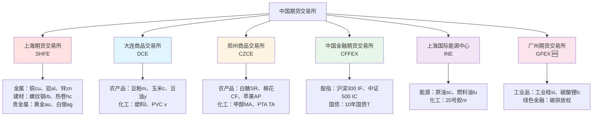

**重点品种记忆技巧**：

| 交易所 | 记忆口诀           | 代表品种               |
| ------ | ------------------ | ---------------------- |
| SHFE   | "上海金属大本营"   | 螺纹钢 rb、铜 cu、金 au |
| DCE    | "大连农产品基地"   | 豆粕 m、玉米 c、铁矿 i  |
| CZCE   | "郑州农化双雄"     | 白糖 SR、棉花 CF、甲醇 MA |
| CFFEX  | "中金股指国债"     | 沪深 300 IF、中证 500 IC |
| INE    | "能源国际化"       | 原油 sc                |
| GFEX   | "广期新能源"🆕     | 工业硅 si、碳酸锂 lc    |

### 2.3 期货合约命名规则 ⭐ 重要

**VNPy 标准格式**：

```
格式: 品种代码 + 年月 + 交易所

rb2501.SHFE
│  │   │
│  │   └─ 交易所代码（SHFE = 上海期货交易所）
│  └───── 交割月份（25 = 2025年, 01 = 1月）
└──────── 品种代码（rb = 螺纹钢 Rebar）
```

**⚠️ 重要：不同交易所编码规则不同**

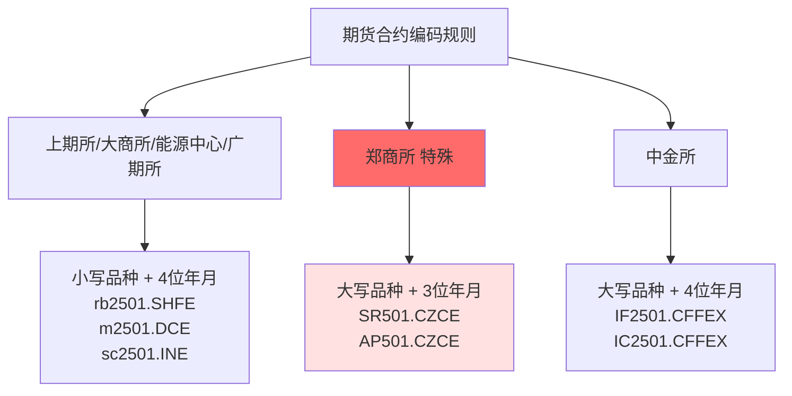

**编码规则总结表**：

| 交易所     | 品种大小写 | 月份位数 | 示例           | 说明                          |
| ---------- | ---------- | -------- | -------------- | ----------------------------- |
| **SHFE**   | **小写**   | 4 位     | `rb2501.SHFE`  | rb=螺纹钢, 2501=2025 年 1 月   |
| **DCE**    | **小写**   | 4 位     | `m2501.DCE`    | m=豆粕, 2501=2025 年 1 月      |
| **CZCE**⚠️ | **大写**   | **3 位** | `SR501.CZCE`   | SR=白糖, 501=2025 年 1 月（省略"20"） |
| **CFFEX**  | **大写**   | 4 位     | `IF2501.CFFEX` | IF=沪深 300, 2501=2025 年 1 月 |
| **INE**    | **小写**   | 4 位     | `sc2501.INE`   | sc=原油, 2501=2025 年 1 月     |
| **GFEX**   | **小写**   | 4 位     | `lc2501.GFEX`  | lc=碳酸锂, 2501=2025 年 1 月   |

**示例代码**（理解概念用）：

```python
# 正确的合约代码格式
contracts = {
    "螺纹钢": "rb2501.SHFE",    # ✅ 小写 + 4位
    "豆粕":   "m2501.DCE",      # ✅ 小写 + 4位
    "白糖":   "SR501.CZCE",     # ✅ 大写 + 3位（注意！）
    "沪深300": "IF2501.CFFEX",  # ✅ 大写 + 4位
}

# ❌ 常见错误
wrong_contracts = {
    "螺纹钢": "RB2501.SHFE",    # ❌ 应该小写 rb
    "白糖":   "SR2501.CZCE",    # ❌ 应该3位 SR501
}
```

### 2.4 主力合约 ⭐ 核心概念

**问题**：螺纹钢有 rb2412, rb2501, rb2502... 很多合约，我该交易哪个？

**答案**：**主力合约** = 成交量最大、流动性最好的合约

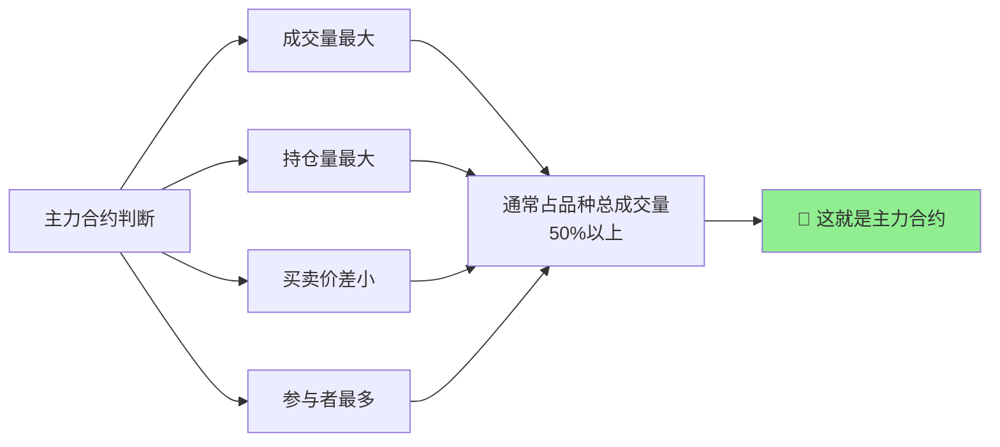

**实际案例**（2024-11-22 螺纹钢）：

```
合约      成交量      持仓量      价差      判断
───────────────────────────────────────────────
rb2412    50万手      10万手     0.5元    即将到期
rb2501   500万手 ✅   90万手 ✅   0.2元 ✅  主力合约 🎯
rb2502    20万手       5万手     1.0元    成交稀少
rb2505    80万手      15万手     0.8元    远月合约
```

**主力合约的特点**：

| 特点         | 说明                     | 对交易的影响       |
| ------------ | ------------------------ | ------------------ |
| 📊 成交量大   | 占品种 50%+ 成交量        | 容易买卖，不会卡单 |
| 💰 价差小     | 买卖价差通常 1-2 跳       | 交易成本低         |
| 👥 参与者多   | 机构和散户都在这里交易   | 价格发现最准确     |
| 🎯 流动性好   | 大单也能快速成交         | 适合程序化交易     |
| 📅 会换月     | 到期前要移仓到下一主力   | 需要跟踪主力变化   |

**移仓换月**（重要概念）：

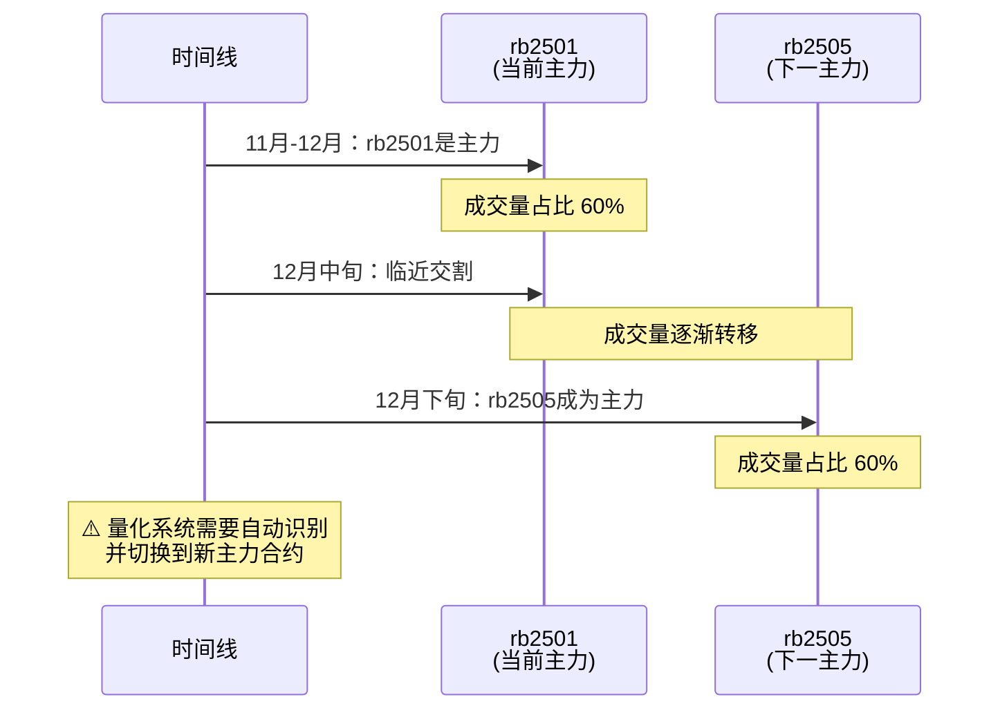

---

<details>
<summary><b>💡 思考题 2：为什么期货有主力合约，而股票没有？</b></summary>

**问题**：为什么期货市场有"主力合约"的概念，而股票市场没有？

**参考答案**：

**期货的特殊性**：
1. **多合约并存**：同一品种有多个不同月份的合约（rb2501、rb2502...）
2. **有到期日**：合约到期需要交割，投资者需要换月
3. **流动性分散**：需要集中到一个合约才能保证流动性

**股票的特点**：
1. **单一代码**：一只股票只有一个代码（如 600519 贵州茅台）
2. **无到期日**：只要公司存续，股票永久有效
3. **流动性集中**：所有交易都在同一个标的

**结论**：
- 期货的"主力合约"是为了**集中流动性**
- 量化交易必须**跟踪主力合约**，否则可能面临成交困难

</details>

---

## 🎯 Part 3: 本课程要做什么？(10分钟)

### 3.1 课程目标：构建 CherryQuant 系统

**我们要构建什么？**

> **CherryQuant** = Cherry（樱桃，寓意收获）+ Quant（量化）
> 一个 **AI 驱动的量化交易系统**

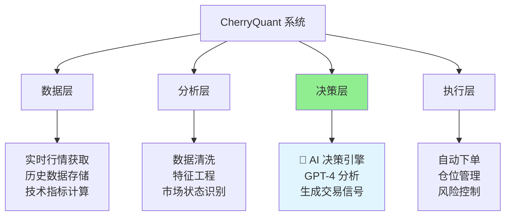

**系统核心功能**：

| 模块       | 功能                           | 技术                 |
| ---------- | ------------------------------ | -------------------- |
| 数据获取   | 实时行情、历史 K 线、基本面数据 | Tushare、VNPy        |
| 数据处理   | 清洗、归一化、技术指标计算     | Pandas、NumPy        |
| AI 决策 🔥 | GPT-4 分析市场，生成交易信号    | OpenAI API           |
| 策略回测   | 用历史数据测试策略有效性       | 自研回测引擎         |
| 风险管理   | 仓位控制、止损止盈             | 规则引擎             |
| 实盘交易   | 连接期货公司 CTP，自动下单      | VNPy                 |
| 监控报告   | 实时监控、交易记录、绩效分析   | MongoDB、可视化界面  |

### 3.2 课程特色：AI 驱动量化交易

**传统量化 vs AI 量化**：

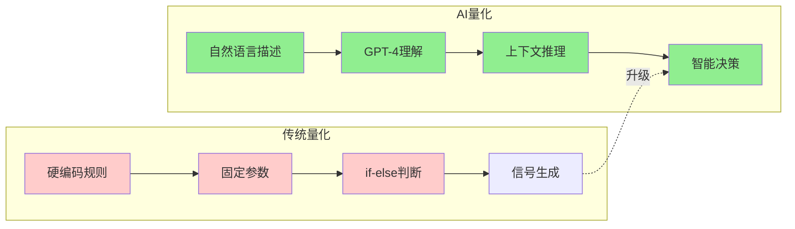

**对比示例**：

| 维度       | 传统量化                                       | AI 量化（本课程）                              |
| ---------- | ---------------------------------------------- | ---------------------------------------------- |
| 策略描述   | `if ma5 > ma20: buy()`                         | "当短期趋势转强且成交量放大时买入"             |
| 适应性     | 固定规则，市场变化需要手动调整                 | GPT-4 理解市场语境，自适应                     |
| 开发难度   | 需要编写复杂的判断逻辑                         | 用自然语言描述策略即可                         |
| 泛化能力   | 只对特定市场有效                               | 可应用到不同品种和市场                         |
| 可解释性   | 规则明确但僵化                                 | AI 给出决策理由                                |
| 学习曲线   | 需要深入理解技术指标和编程                     | 降低门槛，金融知识为主                         |

**AI 量化的优势**：

1. **零样本学习**：不需要大量历史数据训练模型
2. **自然语言驱动**：用中文描述策略，AI 理解执行
3. **上下文理解**：GPT-4 能理解市场新闻、情绪等非结构化信息
4. **快速迭代**：修改策略只需调整提示词（Prompt）

**AI 量化的挑战**：

- ⚠️ API 调用成本（需要优化 Prompt 和缓存）
- ⚠️ 响应延迟（适合中低频策略，不适合高频）
- ⚠️ 幻觉问题（需要验证和约束机制）

### 3.3 课程技术栈

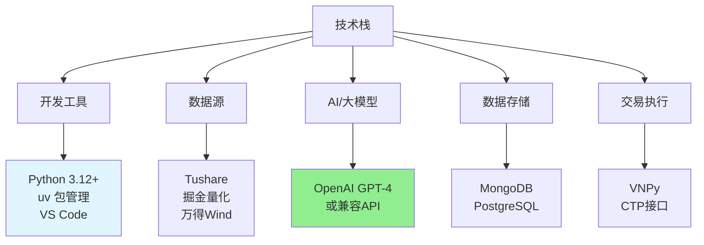

**为什么选择这些工具？**

| 工具      | 选择理由                       | 替代方案                    |
| --------- | ------------------------------ | --------------------------- |
| Python    | 量化行业标准，生态丰富         | C++（难）、R（不通用）      |
| uv        | 极快（10-100 倍），现代化       | pip（慢）、conda（重）      |
| Tushare   | 性价比高，数据全面             | Wind（贵）、掘金量化        |
| VNPy      | 国内最流行开源框架             | 自研（太复杂）              |
| GPT-4     | 标准接口，易迁移               | Claude、Gemini、国产大模型  |
| MongoDB   | NoSQL，适合时序数据             | PostgreSQL、ClickHouse      |

**技术栈的灵活性**：
- ✅ 数据源可替换：Tushare → 掘金量化/Wind
- ✅ 大模型可替换：GPT-4 → Claude/Gemini/国产模型
- ✅ 数据库可替换：MongoDB → PostgreSQL/MySQL
- ⚠️ VNPy 不易替换：与国内期货公司深度集成

### 3.4 课程路线图

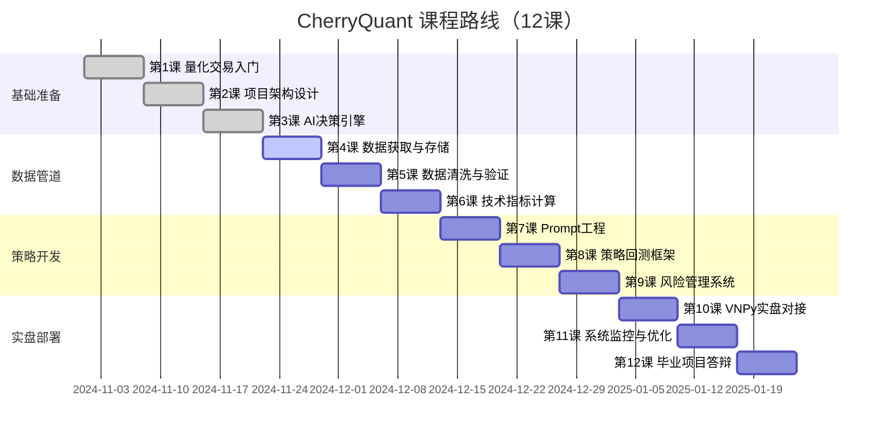

**每个阶段的成果**：

| 阶段       | 课程               | 交付成果                               |
| ---------- | ------------------ | -------------------------------------- |
| 基础准备   | 第 1-3 课          | 开发环境、项目骨架、AI 决策原型         |
| 数据管道   | 第 4-6 课          | 完整的数据获取、存储、处理流程         |
| 策略开发   | 第 7-9 课          | 可回测的 AI 策略，风险管理模块          |
| 实盘部署   | 第 10-12 课        | 连接实盘的完整交易系统                 |

---

<details>
<summary><b>💡 思考题 3：为什么选择 AI 驱动而不是传统技术指标？</b></summary>

**问题**：传统量化交易已经很成熟，为什么要用 GPT-4 这样的 AI？

**参考答案**：

**传统技术指标的局限**：
1. **规则僵化**：市场环境变化时，固定规则可能失效
2. **参数敏感**：需要不断优化参数，容易过拟合
3. **无法理解语境**：无法处理新闻、公告等非结构化信息
4. **开发周期长**：每个策略需要大量编码和测试

**AI 驱动的优势**：
1. **自适应**：GPT-4 能理解市场环境变化
2. **少样本**：不需要大量历史数据训练
3. **自然语言**：用中文描述策略，降低开发门槛
4. **可解释**：AI 会给出决策理由

**实际应用场景**：
- **传统技术指标**：适合趋势明确、规则清晰的市场（如突破策略）
- **AI 驱动**：适合需要综合判断的场景（如结合基本面和技术面）
- **混合策略**：用技术指标提供基础信号，AI 做最终决策

**本课程的选择**：
- 以 AI 驱动为主，探索新范式
- 但也会教授传统技术指标作为基础
- 鼓励学生尝试混合策略

</details>

---

## 💻 Part 4: Python 环境配置 (15分钟)

### 4.1 Python 简介

**什么是 Python？**

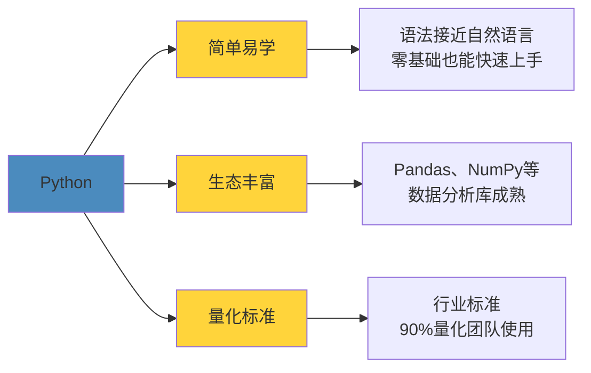

**Python vs 其他语言**：

| 语言   | 优势             | 劣势             | 量化应用     |
| ------ | ---------------- | ---------------- | ------------ |
| Python | 简单、库多、标准 | 速度较慢         | ✅ 推荐首选   |
| C++    | 速度极快         | 学习曲线陡峭     | 高频交易     |
| R      | 统计分析强       | 通用性差         | 学术研究     |
| Java   | 企业级、稳定     | 冗长、开发慢     | 大型系统后台 |
| Rust   | 安全、高性能     | 学习难度大       | 新兴选择     |

**Python 代码示例**（感受简洁性）：

```python
# Python 代码：计算期货收益
price = 3500
if price > 3400:
    print("价格上涨，考虑买入")

# 对比 C++ 代码（太复杂）
#include <iostream>
int main() {
    int price = 3500;
    if (price > 3400) {
        std::cout << "价格上涨，考虑买入" << std::endl;
    }
    return 0;
}
```

### 4.2 安装 Python 3.12+

**步骤 1：检查是否已安装**

打开终端（Terminal 或 PowerShell），输入：

```bash
python --version
# 或
python3 --version
```

**如果显示 Python 3.12.x 或更高版本，跳过安装；否则继续。**

---

#### Windows 安装

**方法 1：官网下载**（推荐新手）

1. 访问 https://www.python.org/downloads/
2. 下载 Python 3.12.x
3. ⚠️ **重要**：勾选 "Add Python to PATH"
4. 点击 "Install Now"
5. 安装完成后，重启终端验证：
   ```bash
   python --version
   ```

**方法 2：Scoop**（推荐有经验用户）

```powershell
# 1. 安装 Scoop（如果没有）
Set-ExecutionPolicy RemoteSigned -Scope CurrentUser
irm get.scoop.sh | iex

# 2. 安装 Python
scoop install python

# 3. 验证
python --version
```

---

#### macOS 安装

```bash
# 使用 Homebrew（如果没有 Homebrew，先安装：https://brew.sh）
brew install python@3.12

# 验证
python3 --version
```

---

#### Linux 安装

```bash
# Ubuntu/Debian
sudo apt update
sudo apt install python3.12 python3.12-venv python3.12-pip

# CentOS/RHEL/Fedora
sudo dnf install python3.12

# 验证
python3.12 --version
```

---

### 4.3 什么是虚拟环境？

**问题场景**：

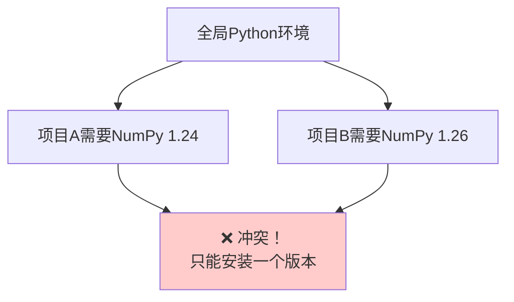

**解决方案：虚拟环境**

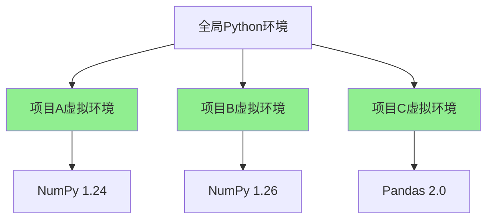

**虚拟环境的作用**：

1. **隔离依赖**：每个项目有独立的包，互不干扰
2. **版本管理**：可以在不同项目使用不同版本的库
3. **干净环境**：删除虚拟环境不影响全局 Python
4. **团队协作**：确保团队成员使用相同的依赖版本

### 4.4 安装 uv（现代化工具链）

**什么是 uv？**

> **uv** = 新一代 Python 包管理工具（2024 年发布）
> Rust 编写，速度比 pip 快 **10-100 倍** ⚡

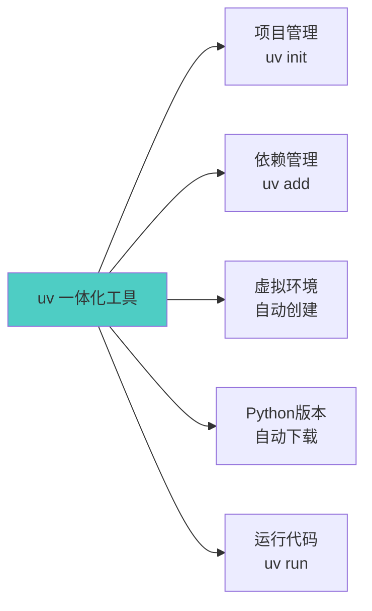

**uv vs 传统工具**：

| 工具       | 速度     | 功能                 | 推荐度         |
| ---------- | -------- | -------------------- | -------------- |
| **uv**     | **极快** | **一体化（推荐）** | **⭐⭐⭐⭐⭐** |
| pip        | 慢       | 仅包管理             | ⭐⭐           |
| virtualenv | 慢       | 仅虚拟环境           | ⭐⭐⭐         |
| conda      | 很慢     | 包+环境（体积大）    | ⭐⭐           |
| poetry     | 中等     | 项目+包（配置复杂）  | ⭐⭐⭐⭐       |

**安装 uv**：

```bash
# macOS / Linux
curl -LsSf https://astral.sh/uv/install.sh | sh

# Windows (PowerShell)
powershell -c "irm https://astral.sh/uv/install.ps1 | iex"
```

**验证安装**：

```bash
uv --version
# 应该显示：uv 0.5.x 或更高版本
```

⚠️ **如果命令找不到，重启终端后再试。**

---

## 🚀 Part 5: 创建第一个项目 (10分钟)

### 5.1 使用 uv 初始化项目

**步骤 1：创建项目目录**

```bash
mkdir CherryQuant
cd CherryQuant
```

**步骤 2：初始化项目**

```bash
uv init
```

**会发生什么？**

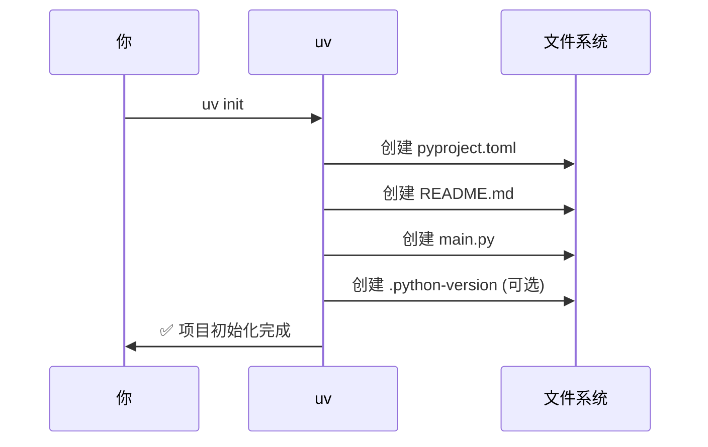

**生成的文件**：

```
CherryQuant/
├── .python-version    # Python版本（可能会创建）
├── README.md          # 项目说明
├── main.py            # 主程序入口
└── pyproject.toml     # 项目配置文件
```

**步骤 3：查看项目结构**

```bash
ls -la
# 或 Windows: dir
```

### 5.2 安装第一个库

```bash
uv add requests
```

**会发生什么？**

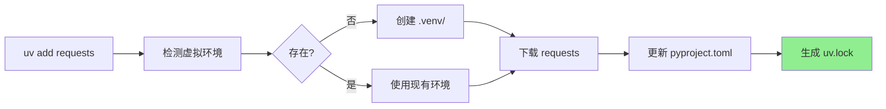

**验证安装**：

```bash
uv pip list
```

应该看到 `requests` 和它的依赖。

### 5.3 运行第一个程序

**创建文件 `hello.py`**（在项目根目录）：

<details>
<summary><b>📁 完整代码：hello.py</b></summary>

```python
# hello.py
"""
CherryQuant 第一个程序
验证 Python 环境和网络连接
"""

print("=" * 60)
print("🍒 欢迎来到 CherryQuant 量化交易系统！")
print("📅 今天是你量化交易学习的第一天")
print("=" * 60)

# 尝试导入库
try:
    import requests
    print(f"\n✅ requests 库已安装，版本：{requests.__version__}")
except ImportError as e:
    print(f"\n❌ requests 库未安装：{e}")
    exit(1)

# 尝试获取网页（验证网络）
try:
    print("\n正在测试网络连接...")
    response = requests.get("https://www.python.org", timeout=5)
    print(f"✅ 网络连接正常，状态码：{response.status_code}")
except Exception as e:
    print(f"❌ 网络连接失败：{e}")

print("\n" + "=" * 60)
print("🎉 环境配置完成！准备开始量化交易之旅！")
print("=" * 60)
```

</details>

**运行程序**：

```bash
uv run hello.py
```

**期望输出**：

```
============================================================
🍒 欢迎来到 CherryQuant 量化交易系统！
📅 今天是你量化交易学习的第一天
============================================================

✅ requests 库已安装，版本：2.31.0

正在测试网络连接...
✅ 网络连接正常，状态码：200

============================================================
🎉 环境配置完成！准备开始量化交易之旅！
============================================================
```

**🎊 恭喜！你成功创建并运行了第一个 Python 项目！**

---

## 📖 Part 6: uv 常用命令详解 (10分钟)

### 6.1 项目管理命令

| 命令            | 说明             | 使用场景             |
| --------------- | ---------------- | -------------------- |
| `uv init`       | 创建应用程序项目 | 新建交易系统         |
| `uv init --lib` | 创建库项目       | 开发 Python 包        |
| `uv sync`       | 同步依赖         | 克隆项目后安装依赖   |

```bash
# 示例
uv init my-trading-bot     # 创建应用
cd my-trading-bot
uv sync                     # 安装依赖
```

### 6.2 依赖管理命令

| 命令                  | 说明         | 示例                        |
| --------------------- | ------------ | --------------------------- |
| `uv add <包名>`       | 添加生产依赖 | `uv add pandas numpy`       |
| `uv add --dev <包名>` | 添加开发依赖 | `uv add --dev pytest black` |
| `uv remove <包名>`    | 移除依赖     | `uv remove pandas`          |
| `uv tree`             | 查看依赖树   | `uv tree`                   |

```bash
# 示例
uv add pandas numpy matplotlib    # 添加多个包
uv add tushare==1.4.24            # 指定版本
uv add --dev pytest               # 开发依赖
uv remove matplotlib              # 移除包
```

### 6.3 运行代码命令

| 命令            | 说明             | 使用场景         |
| --------------- | ---------------- | ---------------- |
| `uv run <脚本>` | 运行 Python 脚本 | `uv run main.py` |
| `uv run python` | 启动交互式 REPL   | 测试代码片段     |
| `uv run pytest` | 运行测试         | `uv run pytest`  |

```bash
# 示例
uv run main.py              # 运行主程序
uv run python               # 进入交互式环境
uv run pytest tests/        # 运行测试
```

### 6.4 查看信息命令

| 命令                 | 说明         | 示例                 |
| -------------------- | ------------ | -------------------- |
| `uv pip list`        | 列出所有包   | `uv pip list`        |
| `uv pip show <包名>` | 查看包详情   | `uv pip show pandas` |
| `uv pip freeze`      | 导出依赖列表 | `uv pip freeze`      |

### 6.5 虚拟环境命令

**⚠️ 注意：通常不需要手动操作虚拟环境**

```bash
# 推荐方式：使用 uv run（自动使用虚拟环境）
uv run python script.py

# 手动激活虚拟环境（不推荐，除非连续运行多个命令）
source .venv/bin/activate  # macOS/Linux
.venv\Scripts\activate     # Windows

# 激活后可直接使用命令
python script.py
pytest

# 完成后退出
deactivate
```

### 6.6 常用工作流程

**场景 1：创建新项目**

```bash
uv init my-project          # 创建项目
cd my-project
uv add pandas numpy         # 添加依赖
uv run python main.py       # 运行代码
```

**场景 2：克隆已有项目**

```bash
git clone <repo-url>
cd project
uv sync                     # 安装所有依赖
uv run python main.py       # 运行代码
```

**场景 3：开发调试**

```bash
uv add --dev pytest ipdb    # 添加开发工具
uv run pytest               # 运行测试
uv run python               # 启动交互式调试
```

---

## 📁 Part 7: 课程项目结构 (5分钟)

### 7.1 最终项目结构

```
CherryQuant/                     # 项目根目录
├── src/                         # 最终的完整系统代码
│   └── cherryquant/
│       ├── ai/                  # AI 决策引擎
│       ├── data/                # 数据管理
│       ├── trading/             # 交易执行
│       ├── backtest/            # 回测引擎
│       └── utils/               # 工具函数
│
├── examples/                    # 课程练习和示例 ← 重点！
│   ├── lesson01/                # 第1课：环境配置
│   │   ├── hello.py
│   │   └── basic.py
│   ├── lesson02/                # 第2课：项目架构
│   ├── lesson03/                # 第3课：AI决策引擎
│   └── ...
│
├── tests/                       # 测试代码
│   ├── unit/                    # 单元测试
│   ├── integration/             # 集成测试
│   └── performance/             # 性能测试
│
├── docs/                        # 文档
│   ├── architecture/            # 架构设计
│   ├── api/                     # API文档
│   └── course/                  # 课程文档
│
├── config/                      # 配置文件（对齐当前仓库）
│   ├── config.toml              # 系统配置（项目默认）
│   └── futures_config.toml      # 业务静态字典
│
├── .venv/                       # 虚拟环境（uv自动创建）
├── pyproject.toml               # 项目配置
├── uv.lock                      # 依赖锁定文件
└── README.md                    # 项目说明
```

### 7.2 examples 的作用

**为什么需要 examples 目录？**

```mermaid
graph LR
    A[examples/<br/>课程练习] --> B[理解概念]
    B --> C[独立实验]
    C --> D[验证功能]
    D --> E[整合到 src/]
    E --> F[完整系统]

    style A fill:#ffe1e1
    style F fill:#90ee90
```

**工作流程**：

1. **学习阶段**：在 `examples/lessonN/` 做练习
2. **实验阶段**：随便试，不影响主项目
3. **理解阶段**：运行成功，理解原理
4. **集成阶段**：把核心代码整合到 `src/`
5. **完成阶段**：得到完整的交易系统

### 7.3 创建 examples 目录

```bash
# 在项目根目录
mkdir -p examples/lesson01
cd examples/lesson01
```

现在可以开始做第一课的练习了！

---

## 📚 附录 A：完整代码参考

### A.1 hello.py（环境验证）

<details>
<summary><b>📄 查看完整代码</b></summary>

```python
# hello.py
"""
CherryQuant 第一个程序
验证 Python 环境和网络连接
"""

print("=" * 60)
print("🍒 欢迎来到 CherryQuant 量化交易系统！")
print("📅 今天是你量化交易学习的第一天")
print("=" * 60)

# 尝试导入库
try:
    import requests
    print(f"\n✅ requests 库已安装，版本：{requests.__version__}")
except ImportError as e:
    print(f"\n❌ requests 库未安装：{e}")
    exit(1)

# 尝试获取网页（验证网络）
try:
    print("\n正在测试网络连接...")
    response = requests.get("https://www.python.org", timeout=5)
    print(f"✅ 网络连接正常，状态码：{response.status_code}")
except Exception as e:
    print(f"❌ 网络连接失败：{e}")

print("\n" + "=" * 60)
print("🎉 环境配置完成！准备开始量化交易之旅！")
print("=" * 60)
```

**运行方式**：
```bash
uv run hello.py
```

</details>

### A.2 basic.py（Python基础练习）

<details>
<summary><b>📄 查看完整代码</b></summary>

```python
# examples/lesson01/basic.py
"""
Python 基础练习：期货交易计算
涵盖：变量、列表、字典、函数、条件、循环
"""

# ============================================================
# 1. 变量和打印
# ============================================================
trader_name = "张三"
initial_capital = 100000  # 初始资金10万
print("=" * 60)
print(f"交易员：{trader_name}")
print(f"初始资金：{initial_capital:,} 元")
print("=" * 60)

# ============================================================
# 2. 列表：跟踪多个品种
# ============================================================
futures_list = ["rb2501.SHFE", "cu2501.SHFE", "au2501.SHFE"]
print(f"\n📊 关注品种：{futures_list}")
print(f"   品种数量：{len(futures_list)}")

# ============================================================
# 3. 字典：品种详细信息
# ============================================================
rb_info = {
    "code": "rb2501.SHFE",
    "name": "螺纹钢",
    "exchange": "SHFE",
    "current_price": 3500,
    "unit": "元/吨",
    "multiplier": 10,  # 一手10吨
}

print(f"\n📝 品种信息：")
for key, value in rb_info.items():
    print(f"   {key}: {value}")

# ============================================================
# 4. 函数：计算收益
# ============================================================
def calculate_profit(
    buy_price: float,
    sell_price: float,
    lots: int,
    multiplier: int = 10
) -> float:
    """
    计算期货交易收益

    参数:
        buy_price: 买入价格（元/吨）
        sell_price: 卖出价格（元/吨）
        lots: 交易手数
        multiplier: 合约乘数（一手多少吨）

    返回:
        profit: 收益（元）

    示例:
        >>> calculate_profit(3500, 3600, 1, 10)
        1000.0
    """
    profit = (sell_price - buy_price) * lots * multiplier
    return profit

# 测试函数
profit = calculate_profit(
    buy_price=3500,
    sell_price=3600,
    lots=1
)
print(f"\n💰 交易收益：{profit:,.0f} 元")

# ============================================================
# 5. 条件判断：判断盈亏
# ============================================================
if profit > 0:
    print("✅ 盈利！")
elif profit < 0:
    print("❌ 亏损！")
else:
    print("➖ 持平")

# ============================================================
# 6. 循环：批量计算
# ============================================================
print("\n📈 批量计算不同卖价的收益：")
print("-" * 60)
print(f"{'卖价':<10} {'收益':<15} {'盈亏比':<10}")
print("-" * 60)

buy_price = 3500
sell_prices = [3480, 3500, 3520, 3550, 3600]

for sell_price in sell_prices:
    p = calculate_profit(buy_price, sell_price, 1)
    profit_ratio = (sell_price - buy_price) / buy_price * 100
    status = "盈利" if p > 0 else ("亏损" if p < 0 else "持平")
    print(f"{sell_price:<10} {p:>+8,.0f} 元    {profit_ratio:>+6.2f}%  {status}")

print("-" * 60)

# ============================================================
# 7. 综合案例：模拟一笔交易
# ============================================================
print("\n🎯 模拟一笔完整交易：")
print("=" * 60)

# 交易参数
contract = "rb2501.SHFE"
entry_price = 3500
stop_loss = 3450
profit_target = 3600
position_size = 2  # 2手

# 计算风险收益比
risk = (entry_price - stop_loss) * position_size * 10
reward = (profit_target - entry_price) * position_size * 10
risk_reward_ratio = reward / risk if risk > 0 else 0

print(f"合约：{contract}")
print(f"入场价：{entry_price} 元/吨")
print(f"止损价：{stop_loss} 元/吨")
print(f"目标价：{profit_target} 元/吨")
print(f"仓位：{position_size} 手")
print(f"\n最大风险：{risk:,.0f} 元")
print(f"预期收益：{reward:,.0f} 元")
print(f"风险收益比：1:{risk_reward_ratio:.2f}")

if risk_reward_ratio >= 2:
    print("\n✅ 风险收益比良好，可以交易")
else:
    print("\n⚠️ 风险收益比不足，建议调整参数")

print("=" * 60)
print("\n🎉 Python 基础练习完成！")
```

**运行方式**：
```bash
uv run examples/lesson01/basic.py
```

</details>

---

## 📚 附录 B：教学指南

### B.1 教学时间分配

| 部分   | 内容                 | 时间   | 教学方式     | 重点                 |
| ------ | -------------------- | ------ | ------------ | -------------------- |
| Part 1 | 量化交易概念         | 15 分钟 | 讲授+案例    | 故事引入，激发兴趣   |
| Part 2 | 期货市场基础         | 10 分钟 | 讲授+图表    | 主力合约概念         |
| Part 3 | 课程目标             | 10 分钟 | 展示+讨论    | 明确学习路径         |
| Part 4 | Python 环境配置       | 15 分钟 | 演示+实操    | 确保每个学生成功安装 |
| Part 5 | 创建第一个项目       | 10 分钟 | 演示+实操    | 运行第一个程序       |
| Part 6 | uv 命令详解           | 10 分钟 | 演示+速查表  | 常用命令             |
| Part 7 | 项目结构             | 5 分钟  | 讲解         | 理解 examples 作用    |
| 总结   | 回顾+作业布置        | 10 分钟 | 总结+答疑    | 布置作业             |
| 预留   | 答疑+个别辅导        | 5 分钟  | 自由         | 解决个别问题         |

### B.2 教学重点与难点

**重点**：
1. ✅ 量化交易的定义和优势（Part 1）
2. ✅ 主力合约的概念（Part 2.4）
3. ✅ 虚拟环境的必要性（Part 4.3）
4. ✅ uv 的使用方法（Part 5-6）
5. ✅ 成功运行第一个程序（Part 5.3）

**难点**：
1. ⚠️ 期货合约命名规则（不同交易所不同）
2. ⚠️ Python 环境配置（Windows 用户可能遇到 PATH 问题）
3. ⚠️ 命令行操作（部分学生不熟悉终端）
4. ⚠️ uv 与 pip 的区别（概念转换）

**应对策略**：
- 提供详细的截图和步骤说明
- 准备常见问题 FAQ
- 鼓励学生互相帮助
- 课后提供录屏回看

### B.3 常见问题与解答

**Q1: Python 安装后命令找不到？**

**A**:
1. Windows：检查是否勾选了 "Add Python to PATH"，如果没有，重新安装
2. 重启终端或 IDE
3. 使用完整路径：`C:\Users\用户名\AppData\Local\Programs\Python\Python312\python.exe`

---

**Q2: uv 命令找不到？**

**A**:
1. 重启终端
2. 检查 PATH：`echo $PATH` (macOS/Linux) 或 `echo %PATH%` (Windows)
3. 手动添加到 PATH：通常在 `~/.cargo/bin/` (macOS/Linux) 或 `%USERPROFILE%\.cargo\bin\` (Windows)

---

**Q3: uv add 下载很慢？**

**A**:
1. 检查网络连接
2. 使用国内镜像（如果支持）
3. 考虑使用代理

---

**Q4: 为什么不用 Anaconda？**

**A**:
- Anaconda 体积大（几个 GB），安装慢
- 环境切换慢
- uv 更快、更现代
- 本课程推荐 uv，但学生可以选择自己熟悉的工具

---

**Q5: 量化交易需要数学基础吗？**

**A**:
- 基础策略：高中数学即可（加减乘除、百分比）
- AI 策略（本课程）：降低了数学门槛
- 高级策略：需要统计学、微积分知识
- 建议：边学边补充相关知识

### B.4 课后跟进建议

1. **作业检查**：
   - 查看学生提交的截图（环境验证）
   - 运行学生的 basic.py 代码
   - 批改思考题答案

2. **常见错误反馈**：
   - 整理班级共性问题
   - 下节课开始前统一讲解

3. **进度跟踪**：
   - 统计完成作业的学生比例
   - 对进度落后的学生提供额外辅导

4. **资源推荐**：
   - Python 基础教程链接
   - 量化交易入门文章
   - 期货市场科普视频

### B.5 板书建议

**第一部分：量化交易概念**

```
量化交易 = 规则化 + 程序化 + 自动化

传统交易 vs 量化交易
├─ 感觉 → 数据
├─ 情绪 → 无情绪
├─ 慢 → 毫秒级
└─ 难回测 → 可回测
```

**第二部分：期货合约**

```
合约命名：rb2501.SHFE
          ↓  ↓   ↓
       品种 年月 交易所

主力合约 = 成交量最大 + 流动性最好
```

**第三部分：uv 命令**

```
uv init       # 创建项目
uv add <包>   # 安装依赖
uv run <脚本> # 运行代码
uv pip list   # 查看已安装包
```

---

## 📝 课后作业

### 作业 1: 环境配置验证 ⭐⭐ (必做)

**任务目标**：
验证 Python 和 uv 已正确安装

**提交要求**：
提交 3 张截图（可以合并成一张）：

1. `python --version` 的输出（显示 3.12.x 或更高）
2. `uv --version` 的输出（显示 0.5.x 或更高）
3. `uv run hello.py` 的完整输出

**评分标准**：
- 3 个命令都成功运行：100 分
- 部分成功：按比例给分
- 附加分：解决了某个错误并记录解决过程（+10 分）

**参考示例**：

```bash
# 命令
python --version
uv --version
uv run hello.py

# 期望输出（示例）
Python 3.12.1
uv 0.5.4
============================================================
🍒 欢迎来到 CherryQuant 量化交易系统！
...
```

---

### 作业 2: Python 基础练习 ⭐⭐⭐ (必做)

**任务场景**：

你是一名量化交易员，需要用 Python 实现期货交易的基础计算功能。

**任务要求**：

1. 在 `examples/lesson01/basic.py` 实现以下功能：
   - 定义交易员姓名和初始资金
   - 创建关注品种列表（至少 3 个期货合约）
   - 用字典存储一个品种的详细信息
   - 编写 `calculate_profit()` 函数计算收益
   - 用循环批量计算不同价格的盈亏

2. 运行程序，确保无错误

3. 提交：
   - `basic.py` 的完整代码
   - 运行结果截图

**参考框架**（见附录 A.2）

**评分标准**：
- 代码能够运行（40 分）
- 实现所有功能（40 分）
- 代码规范、有注释（10 分）
- 输出格式清晰美观（10 分）
- 附加分：扩展功能（如计算保证金占用、风险收益比）（+10 分）

---

### 作业 3: 思考题 ⭐ (选做)

**任务要求**：

在 `examples/lesson01/思考题.md` 回答以下问题：

**问题 1：量化交易的优势**
- 为什么量化交易比人工交易有优势？
- 至少列举 3 点，并结合实际案例说明

**问题 2：主力合约**
- 主力合约是如何确定的？
- 为什么量化交易要跟踪主力合约而不是随便选一个合约？

**问题 3：工具选择**
- uv 相比传统的 pip/virtualenv 有什么优势？
- 为什么本课程选择 Python 而不是其他语言（如 C++、Java）？

**评分标准**：
- 理解准确（50 分）
- 论述清晰（30 分）
- 有自己的思考（20 分）
- 附加分：查阅资料并引用（+10 分）

**提交方式**：
创建 Markdown 文件，用清晰的格式组织答案

---

## 🎓 本课总结

### 今天学到了什么？

**📖 概念层面**：
- ✅ 理解了量化交易的定义和优势
- ✅ 了解了中国期货市场基础（6 大交易所、合约命名、主力合约）
- ✅ 明确了本课程的目标和技术栈
- ✅ 认识了 AI 驱动量化交易的特点

**🛠️ 技能层面**：
- ✅ 安装了 Python 3.12+ 和 uv
- ✅ 创建了第一个 Python 项目
- ✅ 运行了第一个程序
- ✅ 掌握了 uv 的常用命令

**🎯 素质层面**：
- ✅ 建立了系统化学习的思维
- ✅ 养成了使用现代工具的习惯
- ✅ 树立了量化交易的正确认知

### 下一课预告

**第02课：项目架构设计与工具函数实现**

**内容预览**：
1. CherryQuant 系统架构设计
2. Python 项目组织最佳实践
3. 工具函数实现（时间处理、日期转换）
4. 期货合约解析工具
5. 项目配置管理

**准备工作**：
- 复习 Python 基础（变量、函数、类）
- 思考：如何设计一个可扩展的量化交易系统？
- 预习：Python 模块和包的概念

---

## 📖 扩展阅读

### 量化交易入门

- [掘金量化](https://www.myquant.cn/) - 在线量化平台
- [聚宽量化](https://www.joinquant.com/) - 量化社区和回测平台
- [米筐量化](https://www.ricequant.com/) - 专业量化平台

### Python 学习

- [Python 官方教程（中文）](https://docs.python.org/zh-cn/3/tutorial/)
- [廖雪峰 Python 教程](https://www.liaoxuefeng.com/wiki/1016959663602400)
- [Real Python](https://realpython.com/) - 高质量 Python 教程

### 工具文档

- [uv 官方文档](https://docs.astral.sh/uv/) ⭐ 本课程工具
- [Poetry 官方文档](https://python-poetry.org/docs/) - 备选工具
- [pyenv 官方文档](https://github.com/pyenv/pyenv) - Python 版本管理

### 期货市场

- [中国期货业协会](http://www.cfachina.org/) - 行业官方网站
- [上海期货交易所](https://www.shfe.com.cn/)
- [大连商品交易所](http://www.dce.com.cn/)
- [郑州商品交易所](http://www.czce.com.cn/)

### Python 工具生态对比

<details>
<summary><b>📖 Python 包管理工具详细对比</b></summary>

#### 版本管理工具

**pyenv** - Python 版本管理器

```bash
# 安装 pyenv（macOS）
brew install pyenv

# 常用命令
pyenv install 3.12.0      # 安装 Python 3.12.0
pyenv global 3.12.0       # 设置全局版本
pyenv local 3.11.0        # 设置项目版本
pyenv versions            # 查看已安装版本
```

**用途**：
- ✅ 在同一台机器上管理多个 Python 版本
- ✅ 项目 A 用 3.12，项目 B 用 3.11，互不冲突
- ⚠️ 只管理 Python 版本，不管理包

---

#### 包管理工具对比

| 工具       | 类型        | 速度 | 特点             | 适用场景         |
| ---------- | ----------- | ---- | ---------------- | ---------------- |
| **pip**    | 包管理器    | 慢   | Python 标准工具  | 所有场景（传统） |
| **poetry** | 包+项目管理 | 中等 | 功能丰富，配置多 | 复杂项目、发布库 |
| **uv**     | 一体化工具  | 极快 | 简单、现代、快速 | **推荐本课程**   |

**Poetry 详解**：

```bash
# 安装 Poetry
curl -sSL https://install.python-poetry.org | python3 -

# 创建项目
poetry new my-project

# 添加依赖
poetry add pandas numpy

# 运行代码
poetry run python script.py
```

**Poetry vs uv**：

| 对比项             | Poetry        | uv             |
| ------------------ | ------------- | -------------- |
| **安装速度**       | 慢（10-30 秒） | 极快（1-3 秒）  |
| **学习曲线**       | 配置复杂      | 简单直观       |
| **依赖解析**       | 慢            | 快（Rust 实现） |
| **Python 版本管理** | 不支持        | 自动管理       |
| **成熟度**         | 2018 年推出    | 2024 年推出     |

**为什么本课程选择 uv？**

1. ⚡ **速度极快** - 安装依赖快 10-100 倍
2. 🎯 **简单易学** - 命令直观，零基础友好
3. 🔄 **一体化** - 项目、包、环境、Python 版本全管理
4. 🚀 **现代化** - 2024 年新工具，代表未来趋势

---

#### 虚拟环境工具对比

| 工具           | 速度 | 特点             | 推荐度     |
| -------------- | ---- | ---------------- | ---------- |
| **venv**       | 慢   | Python 标准库    | ⭐⭐       |
| **virtualenv** | 慢   | 第三方增强版     | ⭐⭐⭐     |
| **conda**      | 很慢 | Anaconda，体积大 | ⭐⭐       |
| **uv venv**    | 极快 | Rust 实现        | ⭐⭐⭐⭐⭐ |

**Conda（Anaconda）**：

```bash
# 创建环境
conda create -n myenv python=3.12

# 激活环境
conda activate myenv

# 安装包
conda install pandas numpy
```

**Conda 的问题**：

- ❌ 安装包极慢（几分钟）
- ❌ 体积巨大（几个 GB）
- ❌ 环境切换慢
- ✅ 优点：包含科学计算库的预编译版本

---

#### 推荐方案

**初学者（本课程）**：

```
uv（一体化工具）
```

**团队协作**：

```
pyenv（统一Python版本）+ uv（包管理）
```

**复杂项目**：

```
pyenv + poetry + pre-commit
```

**数据科学（Windows）**：

```
Anaconda（如果需要预编译的科学计算库）
```

</details>

---

**课程版本**: v2.0
**更新日期**: 2024-11-24
**更新内容**:
- ✅ 新增课程脑图和路线图
- ✅ 新增课程概述（Know-Do-Be 学习目标）
- ✅ 新增课前检查清单和学习进度追踪
- ✅ 新增 5+ Mermaid 可视化图表
- ✅ 新增 3 个思考题（带折叠答案）
- ✅ 重组代码到附录（collapsible sections）
- ✅ 新增教学指南（附录 B）
- ✅ 优化作业设计（3 个层次，带场景）
- ✅ 修正期货合约编码规则（CZCE 3 位年月）
- ✅ 强化主力合约概念讲解
- ✅ 扩展 uv 工具生态对比

**适用对象**: 金融系学生（零编程基础）
