# 第 2 课：项目架构设计与工具函数实现 v3.0（对齐当前代码）

**课时**: 90 分钟  
**目标**: 认识六边形架构、掌握配置驱动理念，读懂并运用 CherryQuant 工具层实现  
**难度**: ⭐⭐⭐  
**版本**: v3.0 (2025-12-12)

---

## 🗺️ 课程脑图

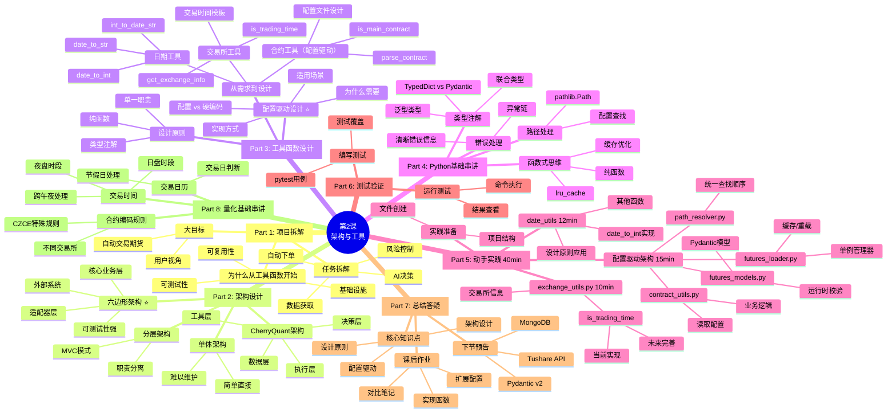

---

## 📋 课程概述

### 本课要解决的问题

- 怎么把量化系统拆得可实现、可测试？  
- 如何用六边形架构隔离外部依赖？  
- 工具函数层为何要走“配置驱动”，而不是把品种和规则硬写进代码？

### 本课与当前仓库版本的关系（非常重要）
本仓库的“项目代码”已经按照第03课的思路做过一次系统性重构，因此：
- 第02课讲的是“从 0 到 1 搭好工具层 + 配置驱动”的核心思想（让你理解**为什么这么拆**）。
- 你在仓库里看到的是“第02课产出 + 第03课重构”的结果（让你看到**怎么演进到更工程化**）。

对应关系（以当前仓库为准）：
- 工具函数：`src/cherryquant/utils/date_utils.py`、`src/cherryquant/utils/contract_utils.py`、`src/cherryquant/utils/exchange_utils.py`
- 业务配置（期货品种/交易时间）：`config/futures_config.toml`
- 业务配置加载（重构后）：`src/cherryquant/config/path_resolver.py`、`src/cherryquant/config/futures_models.py`、`src/cherryquant/config/futures_loader.py`

### 学习目标

1. 理解 CherryQuant 的六边形架构位置：工具层是核心业务的基石。  
2. 读懂并使用 `date_utils`、`contract_utils`、`exchange_utils` 的现有实现。  
3. 亲手补充/扩展配置驱动数据，避免重复编码。  
4. 设计可测的接口（stub/缓存/类型注解），为后续课程埋点。  
5. 将 Python 基础、架构基础、量化基础融入实操演示，面向大学生课堂。
6. 形成一份可课堂演示的“示范课”脚本，讲清楚为什么从工具层开工。

### 课程路线图


### 本课特色

- ✨ 理论与仓库代码一一对应，避免重复贴大段代码。  
- ✨ 配置驱动：业务数据放配置，逻辑留在代码。  
- ✨ 清晰路径：直接引用 `项目代码/CherryQuant` 下的具体文件。  
- ✨ 可扩展：留出交易日、夜盘等后续章节的扩展位。

---

## ✅ 课前检查清单

- [ ] Python 3.12+，已安装 uv（`uv --version`）  
- [ ] 已克隆仓库，能看到 `项目代码/CherryQuant` 与 `课程文档`  
- [ ] 了解类型注解与 pytest 的基础用法  
- [ ] 复习第01课的环境配置

---

## 🎯 学习进度追踪

- [ ] Part 1 项目拆解与动机  
- [ ] Part 2 架构对比与六边形  
- [ ] Part 3 配置驱动理念  
- [ ] Part 4 Python 基础串讲  
- [ ] Part 5 工具层代码导览  
- [ ] Part 6 动手实践  
- [ ] Part 7 测试与作业  
- [ ] Part 8 量化基础串讲

---

## 🏗️ Part 1: 项目拆解与动机 (15分钟)

**课堂目标**：回答“这么复杂的系统，为什么从工具函数开始？”

### 1.1 大目标与用户视角

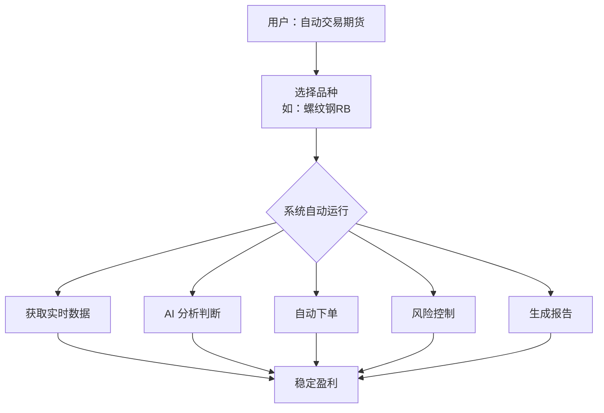

### 1.2 第一层拆解：五大业务模块

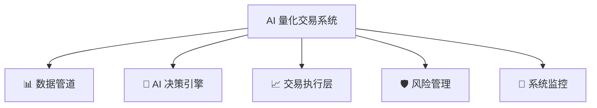

### 1.3 第二层拆解：公共支撑（工具层）

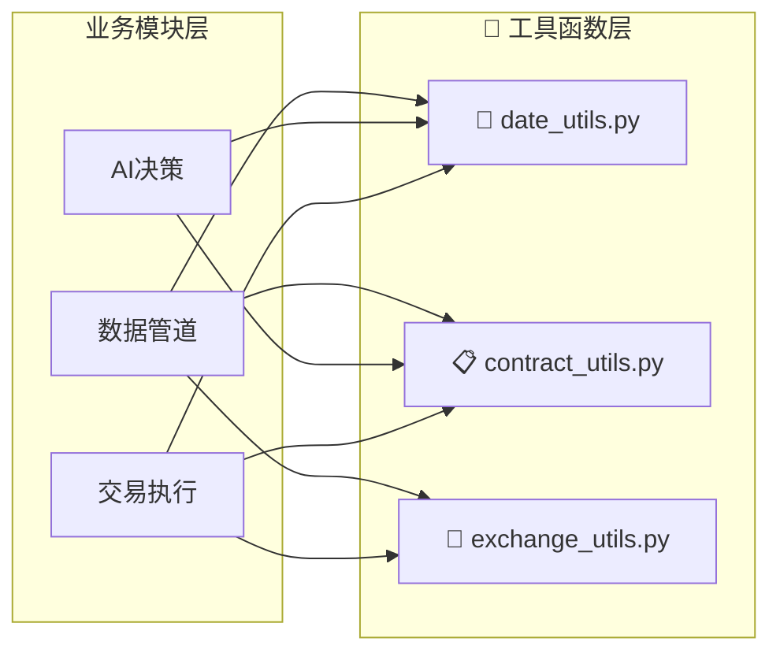

### 1.4 为什么先做工具层？

| 理由 | 说明 | 学习价值 |
| --- | --- | --- |
| 复杂度低 | 纯函数，输入→输出 | 快速建立信心 |
| 独立性强 | 不依赖外部系统 | 易于单测 |
| 复用性高 | 所有上层都会用 | 一次编写处处用 |
| 易测/易改 | 逻辑统一、可缓存 | 后续改动风险低 |

课堂提示：让学生对比“在策略里到处手写日期转换” vs “调用 `date_to_int` 一处维护”。

### 1.5 本课与后续课的边界

- **本课**：配置驱动理念 + 工具层实现（不依赖外部 API/DB）。  
- **第03课**：落地系统级配置（单一 `config.toml` + 明确优先级 + 严格校验），入口为 `cherryquant.config.get_settings()`。  
- **第04课**：接入 Tushare/MongoDB，补全数据管道，复用 `get_settings()` + 工具层。  
- **第05-08课**：AI 决策、策略引擎、实盘执行。

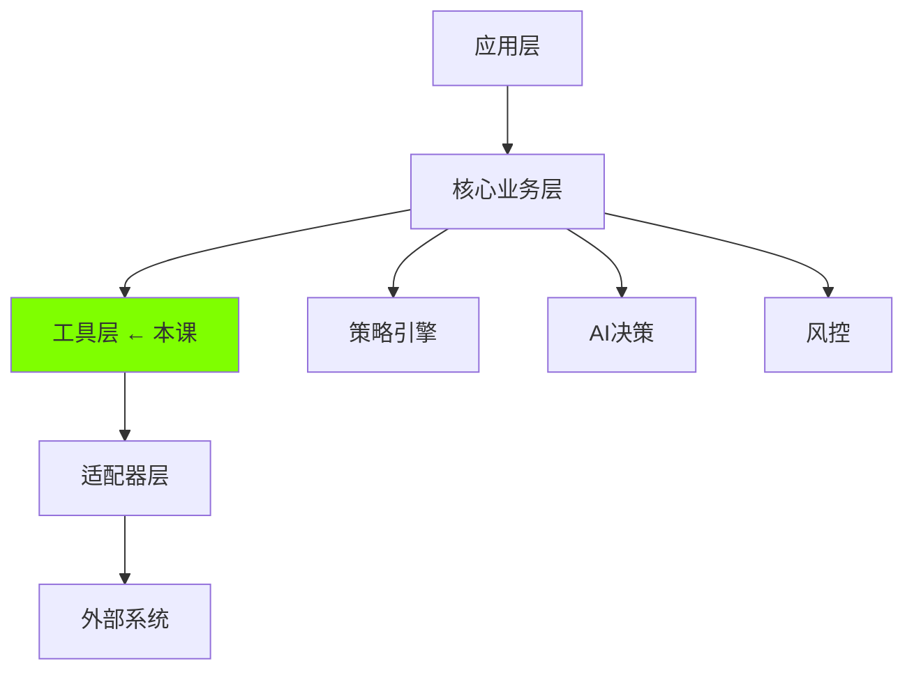

---

## 🏛️ Part 2: 架构对比与六边形选型 (15分钟)

课堂讨论：单体 → 分层 → 六边形的优缺点。

- 单体：快，但耦合高、不可测。  
- 分层：清晰，但上层紧耦合下层，切换外部依赖困难。  
- 六边形（我们的选择）：核心业务与外部隔离，通过适配器对接数据源/AI/交易接口。
- **测试友好**：可注入 Mock/假数据； **替换友好**：Tushare → 掘金，仅换适配器； **扩展友好**：新增 AI/交易所，不动核心。

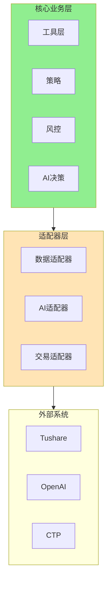

提问：如果 Tushare 宕机，六边形架构下怎么切换到掘金？（答案：换适配器，核心不动）

> 提示：业务规则配置（`futures_config.toml`）由工具层读取；系统级运行配置在第03课通过单一 `config.toml` + `get_settings()` 统一加载（无隐式覆盖），二者分层不冲突。

---

## 🔧 Part 3: 工具函数设计与配置驱动理念 (15分钟)

### 3.1 工具函数设计原则

在实现具体工具函数之前，我们先学习三个核心设计原则。

#### 原则 1：单一职责

**定义**：一个函数只做一件事

**反例**：

```python
# ❌ 函数做了太多事
def process_data_and_trade(date, symbol):
    # 1. 日期转换
    date_int = convert_date(date)
    # 2. 获取数据
    data = fetch_data(symbol)
    # 3. 分析
    decision = analyze(data)
    # 4. 下单
    place_order(decision)
    # 太多职责！
```

**正例**：

```python
# ✅ 每个函数职责单一
def date_to_int(date): pass           # 只负责日期转换
def fetch_data(symbol): pass          # 只负责获取数据
def analyze(data): pass               # 只负责分析
def place_order(decision): pass       # 只负责下单
```

**好处**：

- ✅ 易于测试（测试一个功能）
- ✅ 易于复用（需要日期转换就调用date_to_int）
- ✅ 易于维护（修改不影响其他功能）

---

#### 原则 2：纯函数（Pure Function）

**定义**：相同输入 → 相同输出，无副作用

**纯函数示例**：

```python
# ✅ 纯函数
def date_to_int(date: str) -> int:
    return int(date.replace('-', ''))

# 相同输入，相同输出
assert date_to_int("2024-01-26") == 20240126
assert date_to_int("2024-01-26") == 20240126  # 结果一样
```

**非纯函数示例**：

```python
# ❌ 非纯函数（有副作用）
counter = 0

def count_calls(date: str) -> int:
    global counter
    counter += 1  # 副作用：修改全局变量
    return int(date.replace('-', ''))

# 相同输入，不同输出
assert count_calls("2024-01-26") == 20240126
assert counter == 1  # counter 被修改了
```

**为什么工具函数要用纯函数？**

| 优势        | 说明                         |
| ----------- | ---------------------------- |
| ✅ 可预测   | 不会被外部状态影响           |
| ✅ 易测试   | 不需要setup/teardown         |
| ✅ 可缓存   | 结果可以缓存（`@lru_cache`） |
| ✅ 并发安全 | 多线程调用无问题             |

---

#### 原则 3：明确的类型注解

**为什么需要类型注解？**

```python
# ❌ 没有类型注解
def process(data):  # data是什么类型？
    return data * 2  # 返回什么类型？

# 调用时不知道怎么用
result = process(???)  # IDE没有提示

# ---

# ✅ 有类型注解
def process(data: int) -> int:
    """将数字翻倍"""
    return data * 2

# 调用时IDE有提示
result: int = process(5)  # IDE知道返回int
```

**本课使用 Python 3.12+ 现代语法**：

```python
# ✅ 推荐：现代类型注解
def date_to_int(date: str | int | datetime.date | None) -> int:
    """支持多种输入类型"""
    pass

def get_contracts() -> list[str]:
    """返回字符串列表"""
    pass

def parse_contract(code: str) -> dict[str, str | int]:
    """返回包含字符串和整数的字典"""
    pass
```

**不推荐的旧语法**（Python 3.8）：

```python
# ❌ 旧语法（不推荐）
from typing import Optional, List, Dict, Union

def date_to_int(date: Optional[Union[str, int]]) -> int:
    pass

def get_contracts() -> List[str]:
    pass
```

---

### 3.2 核心设计理念：配置驱动开发

> 💡 **为什么这一节很重要？**
>
> 在实现具体工具函数之前，我们先建立一个重要的设计理念：**配置驱动开发（Configuration Driven Design）**。这是构建可维护量化系统的关键。

#### 3.2.1 问题场景：期货品种管理的挑战

假设我们要实现一个函数，解析期货合约代码并返回中文名称：

```python
def parse_contract(code: str) -> dict:
    """
    解析 'rb2506.SHFE' 返回 {'name': '螺纹钢', ...}
    """
    # 如何知道 'rb' 对应 '螺纹钢'？
```

**挑战**：中国期货市场有100+个活跃品种，分布在5个交易所，而且：
- ✅ 新品种持续上市（如工业硅、碳酸锂）
- ✅ 不同交易所有不同的代码规则（上期所小写、郑商所大写）
- ✅ 代码格式各异（4位年月 vs 3位年月）

---

#### 3.2.2 ❌ 传统做法：硬编码（不推荐）

```python
# ❌ 硬编码方式
PRODUCT_NAMES = {
    'rb': '螺纹钢',
    'cu': '铜',
    'au': '黄金',
    # ... 上百个品种全写在代码里
}

def parse_contract(code: str)-> dict:
    product = extract_product(code)
    name = PRODUCT_NAMES.get(product, '未知品种')
    return {'name': name}
```

**问题分析**：

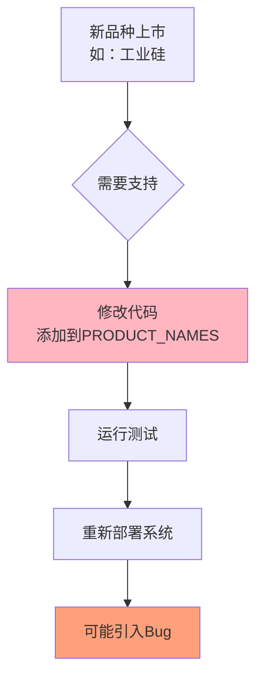

**后果**：
- ❌ **维护噩梦**：每次新品种上市都要改代码、测试、部署
- ❌ **风险高**：修改代码可能引入新Bug
- ❌ **环境隔离差**：开发环境和生产环境的品种列表需要分支代码
- ❌ **团队协作难**：多人修改同一个代码文件易冲突

---

#### 3.2.3 ✅ 最佳实践：配置驱动（推荐）

**核心思想**：将**业务规则**（品种列表、交易所规则）从**代码逻辑**中分离


**配置驱动的优势**：

| 优势 | 说明 |
|------|------|
| ✅ **零代码修改** | 新品种只需编辑配置文件，无需修改代码 |
| ✅ **环境隔离** | 不同环境使用不同配置文件 |
| ✅ **易于测试** | 测试时使用测试配置文件 |
| ✅ **团队协作** | 配置文件可独立管理，减少代码冲突 |
| ✅ **动态更新** | 运行时重新加载配置，无需重启系统 |
|| ✅ **分层清晰** | 业务规则在 TOML；系统运行参数在第03课的 `config.toml` + `get_settings()`，互不干扰 |

### 3.3 与系统级配置的衔接（预告第03课）
- **业务配置**：`config/futures_config.toml` 由 `src/cherryquant/config/path_resolver.py` + `futures_loader.py` 读取，供 `contract_utils/exchange_utils` 使用。  
- **系统配置**：第03课起使用单一 `config.toml`（用户级 `~/.config/cherryquant/config.toml` > 项目级 `config/config.toml` > 默认值）统一管理 AI/Mongo/数据源等运行参数。  
- **代码入口**：使用 `from cherryquant.config import get_settings` 获取生效配置（无隐式覆盖、无多来源合并）。  
- **提示**：配置分层不冲突：业务规则留在 TOML；系统运行参数放入 `config.toml`，避免硬编码。

---

#### 3.2.4 配置驱动的实现方式

在接下来的 Part 4 实践中，我们将：

1. **创建配置文件** `config/futures_config.toml`，存储所有期货品种信息
2. **实现配置管理器** `FuturesConfigManager`（单例 + 缓存 + 可重载），统一加载/校验配置
3. **在工具函数中应用** 让 `parse_contract()` / `is_trading_time()` 等函数从配置读取数据

**关键差异示例**：

```python
# ❌ 硬编码：新品种需要修改代码
PRODUCT_NAMES = {'rb': '螺纹钢', 'cu': '铜', ...}
name = PRODUCT_NAMES.get(product, '未知品种')

# ✅ 配置驱动：新品种只需编辑配置文件
from cherryquant.config.futures_loader import get_futures_config_manager

cfg = get_futures_config_manager().config
info = cfg.exchanges["SHFE"].products.get(product)  # 从 futures_config.toml 读取
name = info.name if info else "未知品种"
```

---

#### 🤔 思考题

<details>
<summary>💡 除了期货品种，还有哪些信息适合用配置驱动？哪些不适合？（点击查看答案）</summary>

**✅ 适合配置驱动的信息**（业务规则）：
- ✅ 期货品种信息（本节示例）
- ✅ 交易所交易时间（日盘9:00-15:00，夜盘21:00-23:00）
- ✅ 手续费率表（不同品种费率不同）
- ✅ 保证金比例（可能按交易所通知调整）
- ✅ 节假日列表

**❌ 不适合配置驱动的信息**（核心算法）：
- ❌ 数据解析逻辑（如何解析Tushare返回的DataFrame）
- ❌ 信号计算算法（均线策略的具体计算）
- ❌ 风控规则逻辑（风控触发条件的代码实现）

**判断标准**：
- **数据性质**的信息 → 配置文件
- **算法逻辑**的代码 → 代码实现

</details>

---

### 3.3 从需求到设计（应用配置驱动理念）

现在我们将设计原则和配置驱动理念应用到具体需求中。

#### 需求场景 1：判断今天是否可交易

**用户需求**：

> "系统应该在交易日自动运行，周末和节假日不运行"

**分析**：

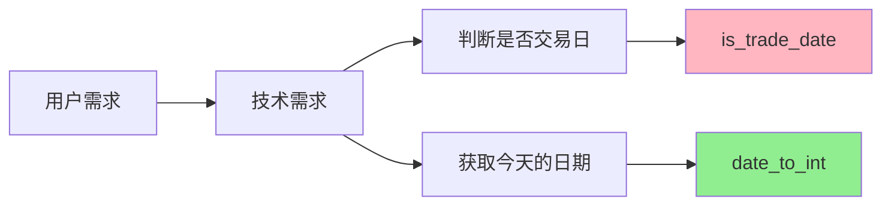

**函数设计**：

```python
# ✅ 第2课实现（纯函数示例）
def date_to_int(date: str | int | datetime.date | None = None) -> int:
    """将各种日期格式转换为整数格式"""
    pass

# ⏸️ 第4课实现（需要数据库，可结合配置驱动）
def is_trade_date(date: int, exchange: str = "SHFE") -> bool:
    """判断是否为交易日（需要查询交易日历数据库）"""
    # 未来可扩展：节假日列表可配置化
    pass
```

---

#### 需求场景 2：解析合约代码（配置驱动示例）

**用户需求**：

> "系统收到合约代码 'rb2501.SHFE'，需要知道这是什么品种、哪个月份、哪个交易所"

**分析**：

```python
# 输入（VNPy标准格式：上期所品种小写）
contract_code = "rb2501.SHFE"

# 输出（我们需要提取的信息）
{
    'product': 'rb',           # 品种：螺纹钢（上期所小写）
    'year': 2025,              # 年份
    'month': 1,                # 月份
    'exchange': 'SHFE',        # 交易所
    'name': '螺纹钢',           # 中文名称（从配置读取）
    'full_code': 'rb2501.SHFE' # 完整代码
}
```

**⚠️ VNPy合约编码规范**：

- **上期所（SHFE/INE）**: 品种**小写** + 4位年月，如 `rb2501.SHFE`、`au2506.SHFE`
- **大商所（DCE）**: 品种**小写** + 4位年月，如 `m2501.DCE`、`i2505.DCE`
- **郑商所（CZCE）**: 品种**大写** + **3位**年月，如 `AP501.CZCE`、`SR501.CZCE`（注意：只有3位，省略"20"）
- **中金所（CFFEX）**: 品种**大写** + 4位年月，如 `IF2501.CFFEX`
- **广期所（GFEX）**: 品种**小写** + 4位年月，如 `lc2501.GFEX`

**函数设计（应用配置驱动）**：

```python
def parse_contract(contract_code: str) -> "ContractInfo":
    """
    解析期货合约代码（遵循 VNPy 规范）

    🔧 应用配置驱动：品种信息从 `config/futures_config.toml` 读取

    Returns:
        ContractInfo（Pydantic 模型，可用属性访问字段）

    Examples:
        >>> info = parse_contract('rb2501.SHFE')
        >>> info.product, info.exchange, info.name
        ('rb', 'SHFE', '螺纹钢')
        >>> parse_contract('AP501.CZCE').product
        'AP'
    """
    ...
```

---

#### 需求场景 3：判断当前是否在交易时段（可配置化）

**用户需求**：

> "系统应该只在交易时间内下单，非交易时间禁止下单"

**中国期货交易时间**：

| 时段 | 时间                       | 说明         |
| ---- | -------------------------- | ------------ |
| 上午 | 09:00-11:30                | 日盘         |
| 下午 | 13:30-15:00                | 日盘         |
| 夜盘 | 21:00-23:00 或 21:00-02:30 | 不同品种不同 |

**函数设计（可扩展为配置驱动）**：

```python
def is_trading_time(
    product: str,
    check_time: datetime.datetime | str | int | None = None,
) -> bool:
    """
    判断给定时间是否处于品种的交易时段（基于配置，不依赖外部API）

    Args:
        product: 品种代码，例如 'rb'、'CU'、'IF'
        check_time:
            - datetime：直接使用
            - str：必须包含时间信息（如 "2024-01-02 22:00" 或 "20240102T220000"），仅日期会报错
            - int：必须包含时间信息（YYYYMMDDHHMM 或 YYYYMMDDHHMMSS），仅日期会报错
            - None：使用当前本地时间

    Returns:
        True 如果在交易时间内，否则 False
    """
    ...
```

---

### 3.4 工具函数清单（以当前仓库为准）

#### ✅ 本课重点：工具层 + 配置驱动

| 模块（代码位置） | 函数 | 功能 | 设计理念 |
| --- | --- | --- | --- |
| `src/cherryquant/utils/date_utils.py` | `date_to_int()` / `date_to_str()` / `int_to_date_str()` | 日期格式统一 | 纯函数 + 类型注解 |
| `src/cherryquant/utils/date_utils.py` | `make_date_timestamp()` | 日期→毫秒时间戳 | 纯函数复用 |
| `src/cherryquant/utils/contract_utils.py` | `parse_contract()` | 合约解析（含 888/000） | 配置驱动（TOML）+ 规则归一化 |
| `src/cherryquant/utils/contract_utils.py` | `is_main_contract()` / `is_continuous_contract()` | 主力/连续识别 | 小函数 + 可测试 |
| `src/cherryquant/utils/exchange_utils.py` | `get_exchange_info()` | 查交易所信息 | 配置驱动（TOML） |
| `src/cherryquant/utils/exchange_utils.py` | `get_trading_time_info()` | 查交易时间模板 | 配置驱动（TOML） |
| `src/cherryquant/utils/exchange_utils.py` | `is_trading_time()` | 交易时段判断（含跨午夜） | 配置驱动 + 边界处理 |

> 说明：第02课早期版本中出现过 `build_contract_code()`、`get_exchange_name()` 等练习函数；当前仓库已收敛为更小、更清晰的 API（并用测试覆盖）。

---

#### ⏸️ 第4课实现（依赖数据库，可结合配置驱动）

| 模块              | 函数                    | 功能           | 为什么推迟？                  | 可配置化扩展          |
| ----------------- | ----------------------- | -------------- | ----------------------------- | --------------------- |
| **date_utils.py** | `is_trade_date()`       | 判断交易日     | 需要交易日历数据（第3课下载） | 节假日列表可配置      |
|                   | `get_trade_dates()`     | 获取交易日列表 | 需要查询数据库                | 查询规则可配置        |
|                   | `get_next_trade_date()` | 获取下一交易日 | 需要查询数据库                | 节假日处理规则可配置  |

**依赖关系图**：

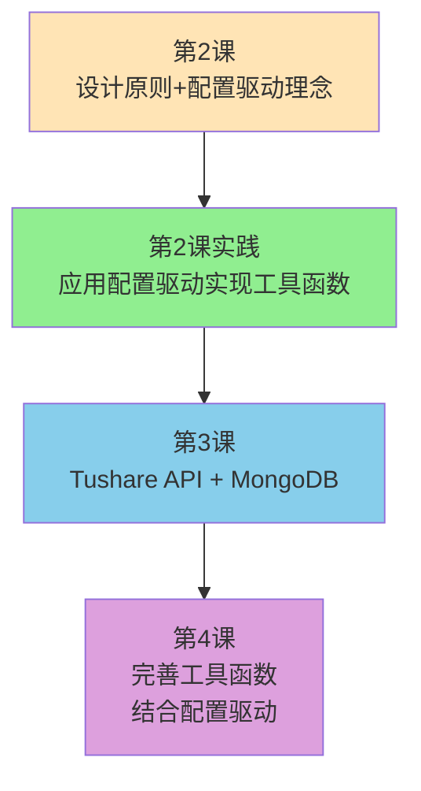

---

### 3.5 实战：设计一个工具函数（应用配置驱动）

#### 练习：设计日期加减函数

**需求**：实现一个函数，计算N天后的日期

**步骤1：明确输入输出**

| 项目     | 说明             | 示例                        |
| -------- | ---------------- | --------------------------- |
| 输入     | 原日期 + 天数    | `20240126`, `5`             |
| 输出     | 新日期           | `20240131`                  |
| 边界情况 | 跨月、跨年、负数 | `20240131 + 1` → `20240201` |

**步骤2：设计函数签名（应用设计原则）**

```python
def add_days(date: DateLike, days: int) -> int:
    """
    将日期加上指定天数
    
    🔧 应用设计原则：
    1. 单一职责：只做日期加减
    2. 纯函数：相同输入 → 相同输出
    3. 类型注解：明确输入输出类型

    Args:
        date: 原日期（支持多种格式）
        days: 要增加的天数（可以为负数）

    Returns:
        新日期（整数格式）

    Examples:
        >>> add_days(20240126, 5)
        20240131
        >>> add_days(20240126, -1)
        20240125
        >>> add_days("2024-01-26", 5)
        20240131
    """
    pass
```

**步骤3：考虑实现方式（复用已有函数）**

<details>
<summary>💡 提示：如何实现？（点击查看）</summary>

**方案：复用已有函数，保持单一职责**

```python
# 复用第2课实现的 date_to_int 函数
def add_days(date: DateLike, days: int) -> int:
    # 1. 转换为整数格式（复用已有函数）
    date_int = date_to_int(date)
    
    # 2. 转换为datetime对象
    dt = datetime.strptime(str(date_int), "%Y%m%d")
    
    # 3. 加上天数
    new_dt = dt + timedelta(days=days)
    
    # 4. 转换回整数格式
    return int(new_dt.strftime("%Y%m%d"))
```

**设计理念应用**：

- ✅ **单一职责**：只做日期加减，日期转换复用 `date_to_int`
- ✅ **纯函数**：相同输入 → 相同输出，无副作用
- ✅ **代码复用**：利用已有工具函数，减少重复代码
- ✅ **易于测试**：可以单独测试日期加减逻辑

**扩展思考**：如果未来需要支持**工作日计算**（跳过周末和节假日），如何设计？
- 方案1：硬编码周末跳过逻辑 ❌
- 方案2：配置驱动，从配置文件读取节假日列表 ✅
- 方案3：依赖外部API，查询交易日历 ⏸️（第4课）

</details>

---

## 🐍 Part 4: Python 基础串讲 (15分钟)

> 通过项目里的真实代码展示 Python 现代语法，用"读代码"带"学语法"。

### 4.1 类型注解与 TypedDict

#### 现代类型注解语法（Python 3.12+）

**联合类型**：

```python
# ✅ Python 3.12+ 推荐语法
DateLike = str | int | datetime.date | datetime.datetime | None

def date_to_int(date: DateLike) -> int:
    """支持多种输入类型"""
    pass

# ❌ 旧语法（Python 3.8）- 不推荐
from typing import Union, Optional
DateLike = Union[str, int, datetime.date, datetime.datetime, None]
```

**泛型类型**：

```python
# ✅ Python 3.12+ 推荐语法
def get_contracts() -> list[str]:
    """返回字符串列表"""
    pass

def parse_contract(code: str) -> dict[str, str | int]:
    """返回包含字符串和整数的字典"""
    pass

# ❌ 旧语法（Python 3.8）- 不推荐
from typing import List, Dict
def get_contracts() -> List[str]:
    pass
```

---

#### TypedDict：给字典加上"结构说明书"

**什么是 TypedDict？**

在 Python 中，字典（dict）是最常用的数据结构，但它有一个问题：**缺乏结构约束**。

```python
# ❌ 普通字典：IDE 无法提示，容易写错字段名
contract_info = {
    'product': 'rb',
    'year': 2025,
    'month': 1,
    'exchange': 'SHFE',
    'name': '螺纹钢'
}

# 访问字段时，IDE 无法自动补全
print(contract_info['prodcut'])  # 拼写错误，运行时才报错 ❌
```

**TypedDict 的作用**：为字典定义"结构说明书"，让 IDE 能够：
- ✅ 自动补全字段名
- ✅ 检查字段类型
- ✅ 提示缺少必填字段

```python
from typing import TypedDict

# ✅ 使用 TypedDict 定义结构
class ContractInfo(TypedDict):
    product: str       # 品种代码
    year: int          # 年份
    month: int         # 月份
    exchange: str      # 交易所
    name: str          # 中文名称
    full_code: str     # 完整代码

# 函数返回值使用 TypedDict
def parse_contract(contract_code: str) -> ContractInfo:
    """解析合约代码，返回结构化信息"""
    # ... 解析逻辑 ...
    return {
        'product': 'rb',
        'year': 2025,
        'month': 1,
        'exchange': 'SHFE',
        'name': '螺纹钢',
        'full_code': 'rb2501.SHFE'
    }

# 使用时，IDE 会自动补全字段
info = parse_contract('rb2501.SHFE')
print(info['product'])   # IDE 自动补全 ✅
print(info['exchange'])  # IDE 自动补全 ✅
```

**TypedDict 在我们场景下的应用示例**：

```python
from typing import TypedDict

# 定义合约信息结构
class ContractInfo(TypedDict):
    product: str
    year: int
    month: int
    exchange: str
    name: str
    full_code: str

# 定义品种信息结构
class ProductInfo(TypedDict):
    name: str
    multiplier: int
    tick_size: float

# 定义交易所信息结构
class ExchangeInfo(TypedDict):
    name: str
    product_case: str  # 'upper' or 'lower'
    year_format: str   # '4digit' or '3digit'
    products: dict[str, ProductInfo]

# 使用 TypedDict 的函数
def get_product_info(product: str, exchange: str) -> ProductInfo | None:
    """从配置获取品种信息"""
    # ... 从 TOML 读取配置 ...
    return {
        'name': '螺纹钢',
        'multiplier': 10,
        'tick_size': 1.0
    }
```

---

#### TypedDict 的局限性

虽然 TypedDict 提供了类型提示，但它有一个**致命缺陷**：

> **TypedDict 只是静态类型提示，不做运行时校验！**

```python
from typing import TypedDict

class TradingSession(TypedDict):
    name: str
    start: str  # 期望格式 'HH:MM'
    end: str    # 期望格式 'HH:MM'

# ❌ 即使格式错误，TypedDict 也不会报错
session: TradingSession = {
    'name': '日盘',
    'start': '25:00',  # 无效时间！但 TypedDict 不会检查
    'end': 'invalid'   # 无效格式！但 TypedDict 不会检查
}

# 程序继续运行，直到使用时才出错 ❌
```

**在量化系统中的风险**：

我们的配置来自 `futures_config.toml` 文件，存在以下风险：
- ❌ 手动编辑 TOML 时可能写错字段名（如 `prodcut` 而非 `product`）
- ❌ 时间格式错误（如 `25:00` 而非 `09:00`）
- ❌ 必填字段缺失（如忘记填写 `multiplier`）
- ❌ 数据类型错误（如 `multiplier: "10"` 而非 `multiplier: 10`）

**TypedDict 无法在程序启动时发现这些错误**，只能在运行时报错，可能导致：
- 🔥 交易时段判断错误，错过交易机会
- 🔥 合约解析失败，无法下单
- 🔥 配置错误导致系统崩溃

---

#### 为什么选择 Pydantic v2？

**Pydantic 的核心优势**：**运行时校验 + 自动类型转换**

```python
from pydantic import BaseModel, field_validator

class TradingSession(BaseModel):
    name: str
    start: str
    end: str
    crosses_midnight: bool = False

    @field_validator("start", "end")
    @classmethod
    def validate_time_format(cls, v: str) -> str:
        """校验时间格式必须是 'HH:MM'"""
        if not v or len(v) != 5 or v[2] != ':':
            raise ValueError(f"时间格式必须是 'HH:MM'，当前值: {v}")
        
        hour, minute = v.split(':')
        if not (0 <= int(hour) <= 23 and 0 <= int(minute) <= 59):
            raise ValueError(f"无效的时间: {v}")
        
        return v

# ✅ 程序启动时就会校验配置
try:
    session = TradingSession(
        name='日盘',
        start='25:00',  # 无效时间
        end='15:00'
    )
except ValueError as e:
    print(f"配置错误: {e}")  # 立即发现错误！
    # 输出: 配置错误: 无效的时间: 25:00
```

**Pydantic vs TypedDict 对比**：

| 特性 | TypedDict | Pydantic BaseModel |
|------|-----------|-------------------|
| **IDE 类型提示** | ✅ 支持 | ✅ 支持 |
| **运行时校验** | ❌ 不支持 | ✅ 支持 |
| **自定义验证器** | ❌ 不支持 | ✅ 支持（`@field_validator`） |
| **自动类型转换** | ❌ 不支持 | ✅ 支持（如 `"10"` → `10`） |
| **默认值** | ⚠️ 有限支持 | ✅ 完整支持 |
| **嵌套模型** | ⚠️ 复杂 | ✅ 简单 |
| **错误提示** | ❌ 无 | ✅ 详细的错误信息 |
| **适用场景** | 简单的内部数据结构 | 配置管理、API 数据校验 |

---

#### 项目中的实际应用（当前仓库）

```python
# src/cherryquant/config/futures_models.py

from pydantic import BaseModel, Field, field_validator

class TradingSession(BaseModel):
    """交易时段模型（带运行时校验）"""
    name: str
    start: str
    end: str
    crosses_midnight: bool = False

    @field_validator("start", "end")
    @classmethod
    def validate_time_format(cls, v: str) -> str:
        """校验时间格式 'HH:MM'"""
        # 校验逻辑...
        return v

class ProductInfo(BaseModel):
    """品种信息模型"""
    name: str
    multiplier: int
    tick_size: float

class ExchangeInfo(BaseModel):
    """交易所信息模型"""
    name: str
    product_case: str  # 'upper' or 'lower'
    year_format: str   # '4digit' or '3digit'
    products: dict[str, ProductInfo]

class FuturesConfig(BaseModel):
    """期货配置总模型"""
    trading_hours: dict[str, "TradingHoursTemplate"]
    exchanges: dict[str, ExchangeInfo]

# src/cherryquant/config/futures_loader.py

import tomllib
from pathlib import Path

def load_futures_config() -> FuturesConfig:
    """加载并校验期货配置"""
    config_path = Path("config/futures_config.toml")
    
    with open(config_path, "rb") as f:
        raw_data = tomllib.load(f)
    
    # ✅ Pydantic 在这里做运行时校验
    # 如果配置有错误，立即抛出详细的错误信息
    return FuturesConfig.model_validate(raw_data)
```

**实际效果对比**：

```python
# ❌ 使用 TypedDict：配置错误不会被发现
config_dict = load_toml("futures_config.toml")  # 返回普通 dict
# 即使 TOML 中有错误，程序继续运行
# 直到使用时才报错 ❌

# ✅ 使用 Pydantic：程序启动时立即校验
try:
    config = load_futures_config()  # 返回 FuturesConfig（Pydantic 模型）
except ValidationError as e:
    print("配置文件错误，请检查:")
    print(e)
    # 输出详细的错误信息，包括：
    # - 哪个字段有问题
    # - 期望的类型/格式
    # - 实际的值
    sys.exit(1)  # 启动时就发现错误，避免运行时崩溃 ✅
```

---

### 4.2 函数式思维与纯函数

#### 纯函数的定义

**纯函数**：相同输入 → 相同输出，无副作用

```python
# ✅ 纯函数示例
def date_to_int(date: str) -> int:
    """相同输入，相同输出"""
    return int(date.replace('-', ''))

# 可预测性
assert date_to_int("2024-01-26") == 20240126
assert date_to_int("2024-01-26") == 20240126  # 结果一样

# ❌ 非纯函数示例
counter = 0

def count_calls(date: str) -> int:
    global counter
    counter += 1  # 副作用：修改全局变量
    return int(date.replace('-', ''))

# 不可预测
count_calls("2024-01-26")  # counter = 1
count_calls("2024-01-26")  # counter = 2，副作用影响了外部状态
```

---

#### @lru_cache 装饰器与单例模式

**核心原理**：
`@lru_cache` (Least Recently Used Cache) 会在内存中缓存函数的返回值。当函数再次以相同的参数被调用时，直接返回缓存结果，不再执行函数体。

**关键参数 `maxsize`**：
- `maxsize`: 指定缓存保存的最大条目数。
- 当缓存满了，会自动丢弃"最近最少使用"的数据。
- 默认值为 128。

**场景 1：缓存计算结果（使用默认值或较大值）**

当函数有参数，且参数会经常变化时（如斐波那契数列、复杂指标计算），我们需要缓存多个不同输入对应的结果。

```python
from functools import lru_cache

# maxsize=128: 最多缓存最近 128 次不同参数的计算结果
@lru_cache(maxsize=128)
def expensive_calculation(n: int) -> int:
    """模拟耗时计算"""
    print(f"执行复杂计算: {n}...")
    return n * n

# 第一次调用 n=5：执行代码
r1 = expensive_calculation(5)  # 输出: 执行复杂计算: 5...

# 第一次调用 n=10：执行代码
r2 = expensive_calculation(10) # 输出: 执行复杂计算: 10...

# 第二次调用 n=5：参数相同，命中缓存
r3 = expensive_calculation(5)  # 无输出，直接返回之前算好的结果
```

**场景 2：项目中的单例模式（使用 `maxsize=1`）**

在量化系统中，配置管理器（Configuration Manager）应该是**全局唯一**的。

```python
# src/cherryquant/config/futures_loader.py

# maxsize=1: 因为函数无参数，永远只有一个返回值，缓存1条足矣
@lru_cache(maxsize=1)
def get_futures_config_manager():
    """获取期货配置管理器（单例）"""
    # 这一行代码在整个程序生命周期中只会执行一次
    print("Initializing Config Manager...")
    return FuturesConfigManager()
```

**为什么这里设置为 `maxsize=1`？**
- **无参数**：`get_futures_config_manager()` 不需要任何参数。
- **唯一性**：无论调用多少次，输入条件（无）都是一样的，所以输出永远是同一个对象实例。
- **内存与语义**：设置为 1 既节省微乎其微的内存，更重要的是**在语义上明确表达：这是一个单例**。

> **设计模式点拨**：在 Python 中，实现线程安全的单例模式，最简单优雅的方式之一就是对无参工厂函数使用 `@lru_cache`。

**项目中的应用效果（当前仓库）**：

```python
cfg1 = get_futures_config_manager()  # 首次调用：读取文件 -> 解析 -> 校验 -> 创建对象 -> 存入缓存
cfg2 = get_futures_config_manager()  # 后续调用：直接从缓存返回同一个对象
```python
print(cfg1 is cfg2)  # True，证明是同一个实例
```

> [!NOTE] 进阶知识：线程安全与 No-GIL (Python 3.13+)
>
> 1.  **线程安全性**：`functools.lru_cache` 内部是**线程安全**的（Thread-Safe）。它使用锁（Lock）来保护缓存字典，因此多线程并发调用不会破坏其内部数据结构，也不会死锁。
> 2.  **并发执行（Race Condition）**：虽然缓存结构安全，但在**高并发首次调用**时，如果缓存为空，`get_futures_config_manager` 函数体可能会被执行多次（多个线程同时判断缓存未命中）。
>     - 对于**无副作用**的配置加载（读取文件），多次执行是可以接受的，最终只有一个结果会留在缓存中。
>     - 如果是**昂贵资源**（如创建数据库连接池），建议在函数内部再加一把锁。
> 3.  **No-GIL 支持**：在 Python 3.13+ 的自由线程（free-threading）版本中，标准库（包括 `lru_cache`）已经做了专门适配，通过细粒度锁保证安全性，依然是实现单例的最佳实践之一。

**配置热更新（课堂演示点）**：

```python
# 修改 futures_config.toml 后，可显式重载
mgr = get_futures_config_manager()
mgr.reload()
```

---

### 4.3 错误处理

#### 设计清晰的错误信息

**反例**：

```python
# ❌ 错误信息不明确
def date_to_int(date: str) -> int:
    try:
        return int(date.replace('-', ''))
    except Exception:
        raise ValueError("Invalid date")  # 不知道哪里错了
```

**正例**：

```python
# ✅ 错误信息明确
def date_to_int(date: str) -> int:
    try:
        date_str = date.replace('-', '').replace('/', '').strip()
        _ = datetime.datetime.strptime(date_str, "%Y%m%d")
        return int(date_str)
    except ValueError as e:
        raise ValueError(
            f"Invalid date string '{date}': {str(e)}\n" +
            f"Expected format: 'YYYY-MM-DD' or 'YYYYMMDD'"
        ) from e
```

**错误信息设计原则**：

1. **包含原始输入**：让用户知道哪个输入有问题
2. **说明期望格式**：告诉用户正确的格式是什么
3. **保留原始异常**：使用 `from e` 保留异常链

---

### 4.4 路径与配置查找

#### pathlib.Path vs os.path

**传统方式（os.path）**：

```python
# ❌ 使用 os.path（不推荐）
import os

config_path = os.path.join(
    os.path.expanduser("~"),
    ".config",
    "cherryquant",
    "futures_config.toml"
)

if os.path.exists(config_path):
    with open(config_path, 'r') as f:
        config = f.read()
```

**现代方式（pathlib.Path）**：

```python
# ✅ 使用 pathlib.Path（推荐）
from pathlib import Path

config_path = Path.home() / ".config" / "cherryquant" / "futures_config.toml"

if config_path.exists():
    config = config_path.read_text()
```

**pathlib.Path 的优势**：

| 特性 | os.path | pathlib.Path |
|------|---------|--------------|
| **路径拼接** | `os.path.join(a, b, c)` | `a / b / c` |
| **用户目录** | `os.path.expanduser("~")` | `Path.home()` |
| **文件存在** | `os.path.exists(path)` | `path.exists()` |
| **读取文件** | `open(path).read()` | `path.read_text()` |
| **操作方式** | 字符串函数调用 | Path 对象方法调用 |

**为什么推荐 `pathlib` (Path 对象)？**
- **语义明确**：`Path` 对象明确表示"这是一个文件路径"，而字符串只是普通文本，容易混淆。
- **链式调用**：可以像 `p.cwd().parent.joinpath("config")` 这样顺滑操作，而 `os.path` 需要层层嵌套 `os.path.join(os.path.dirname(os.getcwd()), "config")`，可读性差。
- **运算符重载**：支持使用 `/` 运算符进行路径拼接（如 `Path.home() / "data"`），非常直观。
- **功能内聚**：把路径相关的操作（如 `.exists()`, `.read_text()`）都封装在对象内部，不需要引入多个模块（如 `os`, `glob`, `shutil`）。

#### 项目中的配置查找实现（统一入口）

当前仓库已经把“配置文件查找顺序”抽到独立模块 `ConfigPathResolver`，避免每个工具函数各写一遍。

```python
# src/cherryquant/config/path_resolver.py

from pathlib import Path

class ConfigPathResolver:
    USER_CONFIG_DIR: Path = Path.home() / ".config" / "cherryquant"
    PROJECT_CONFIG_DIR: Path = Path(__file__).parents[3] / "config"

    @classmethod
    def resolve(cls, filename: str, custom_path: str | Path | None = None) -> Path | None:
        # 1) custom_path
        # 2) ~/.config/cherryquant/
        # 3) <project_root>/config/
        ...
```

**路径层级说明（仍然适用）**：

```
项目根目录/
├── config/
│   └── futures_config.toml  ← 项目配置
├── src/
│   └── cherryquant/
│       └── config/
│           └── path_resolver.py  ← __file__
└── ...

Path(__file__).parents[0]  # config/
Path(__file__).parents[1]  # cherryquant/
Path(__file__).parents[2]  # src/
Path(__file__).parents[3]  # 项目根目录/
```

#### 演示 3：Pydantic 模型的 IDE 支持（以及为什么更安全）

1. 打开 `src/cherryquant/config/futures_models.py`，看 `FuturesConfig / ExchangeInfo / TradingSession` 的字段定义
2. 打开 `src/cherryquant/config/futures_loader.py`，看 `FuturesConfig.model_validate(raw_data)` 如何在启动时校验配置
3. 在 REPL 中演示“解析合约 + 字段自动补全”：

```python
>>> from cherryquant.utils.contract_utils import parse_contract
>>> info = parse_contract('rb2501.SHFE')
>>> info.exchange
'SHFE'
>>> info.name
'螺纹钢'
```

---

### 4.5 Python 基础知识点总结

| 知识点 | 传统方式 | 现代方式（Python 3.12+） | 项目应用 |
|--------|---------|------------------------|----------|
| **联合类型** | `Union[str, int]` | `str \| int` | `DateLike` |
| **可选类型** | `Optional[str]` | `str \| None` | 函数参数 |
| **泛型列表** | `List[str]` | `list[str]` | 返回值类型 |
| **泛型字典** | `Dict[str, int]` | `dict[str, int]` | 配置结构 |
| **路径处理** | `os.path` | `pathlib.Path` | 配置查找 |
| **函数缓存** | 手动实现 | `@lru_cache` | 配置加载 |

---

## 💻 Part 5: 动手实践 (40分钟)

**目标**：应用配置驱动设计理念，实现3个核心工具模块

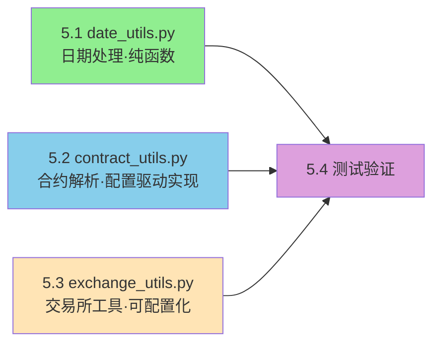

**实践重点**：
- 🔧 **应用设计原则**：单一职责、纯函数、类型注解
- ⭐ **配置驱动实现**：将期货品种信息从代码分离到配置文件
- 🧪 **测试驱动**：为每个函数编写测试用例

### 5.1 实践准备


在开始编码前，确保项目结构正确：

```bash
# 项目结构（对齐当前仓库）
CherryQuant/
├── src/
│   ├── cherryquant/
│   │   ├── config/                 # 配置管理（第03课重构成果）
│   │   │   ├── path_resolver.py     # 统一查找顺序
│   │   │   ├── futures_models.py    # Pydantic 模型（运行时校验）
│   │   │   ├── futures_loader.py    # 单例管理器（加载/缓存/重载）
│   │   │   ├── models.py            # 全局配置 schema（CherryQuantSettings）
│   │   │   └── settings.py          # Loader: get_settings/get_settings_source/reload_settings
│   │   ├── utils/                   # 工具函数模块（第02课重点）
│   │   │   ├── __init__.py
│   │   │   ├── date_utils.py
│   │   │   ├── contract_utils.py
│   │   │   └── exchange_utils.py
│   │   └── __init__.py
├── config/                         # 配置文件（TOML）
│   ├── futures_config.toml          # 业务静态字典
│   └── config.toml                  # 系统运行默认配置
├── tests/
│   └── test_utils/
│       ├── test_date_utils.py
│       ├── test_contract_utils.py
│       └── test_exchange_utils.py
├── pyproject.toml
└── README.md
```

**创建目录结构**：

```bash
# 在项目根目录执行
mkdir -p src/cherryquant/utils
mkdir -p config
mkdir -p tests/test_utils

# 创建初始化文件
touch src/cherryquant/utils/__init__.py
touch src/cherryquant/__init__.py
touch tests/test_utils/__init__.py

# 创建工具函数文件
touch src/cherryquant/utils/date_utils.py
touch src/cherryquant/utils/contract_utils.py
touch src/cherryquant/utils/exchange_utils.py

# 创建配置管理模块（第03课重构后的代码位置；如从零写可创建骨架）
mkdir -p src/cherryquant/config

touch src/cherryquant/config/path_resolver.py
touch src/cherryquant/config/futures_models.py
touch src/cherryquant/config/futures_loader.py

touch src/cherryquant/config/models.py
touch src/cherryquant/config/settings.py

# 创建配置文件
touch config/futures_config.toml
touch config/config.toml
```

**文件说明**：

| 文件 | 作用 | 实现时间 |
|------|------|----------|
| `date_utils.py` | 日期格式转换、时间戳生成 | Part 5.2 |
| `futures_models.py` | Pydantic 模型（运行时校验） | Part 5.3 讲解点 |
| `path_resolver.py` | 配置路径查找（统一顺序） | Part 5.3 讲解点 |
| `futures_loader.py` | 配置管理器（单例/缓存/重载） | Part 5.3 讲解点 |
| `contract_utils.py` | 合约解析、配置应用 | Part 5.3 |
| `exchange_utils.py` | 交易所信息查询、交易时间判断 | Part 5.4 |
| `futures_config.toml` | 期货品种配置文件 | Part 5.3 |

---

### 5.2 实现 date_utils.py（应用设计原则，12分钟）

#### 步骤1：创建文件结构

```bash
# 在项目根目录执行
cd ~/Projects/CherryQuant

# 创建工具模块目录
mkdir -p src/cherryquant/utils

# 创建文件
touch src/cherryquant/utils/__init__.py
touch src/cherryquant/utils/date_utils.py
```

---

#### 步骤2：一起实现第一个函数（应用设计原则）

让我们一起实现 `date_to_int()` 函数，应用Part 3学习的设计原则。

**🔧 设计原则应用**：
- ✅ **单一职责**：只做日期格式转换
- ✅ **纯函数**：相同输入 → 相同输出，无副作用
- ✅ **类型注解**：明确支持多种输入类型

**需求分析**：

| 输入类型           | 示例                                    | 输出                      |
| ------------------ | --------------------------------------- | ------------------------- |
| None               | `None`                                  | 今天的日期（如 20241124） |
| 整数               | `20240126`                              | `20240126`                |
| 字符串（带分隔符） | `"2024-01-26"`                          | `20240126`                |
| 字符串（无分隔符） | `"20240126"`                            | `20240126`                |
| date对象           | `datetime.date(2024, 1, 26)`            | `20240126`                |
| datetime对象       | `datetime.datetime(2024, 1, 26, 10, 0)` | `20240126`                |

**实现思路**：

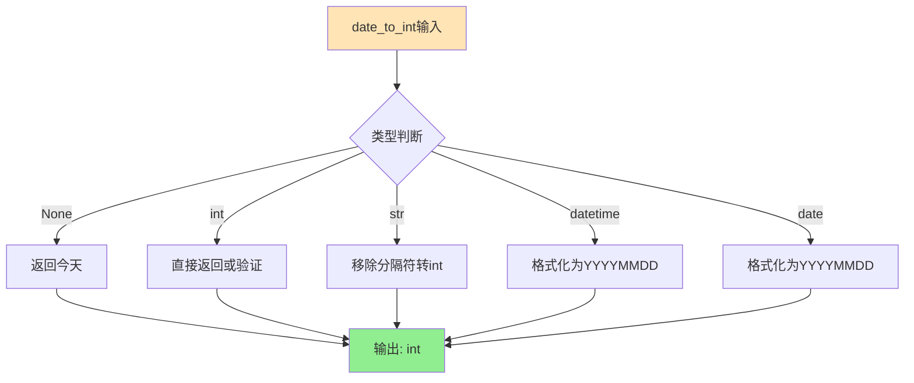

**完整实现**：

打开 `src/cherryquant/utils/date_utils.py`，对照阅读当前仓库实现（不需要抄写）。课堂重点关注：
- `DateLike` 类型别名
- `date_to_int()` 如何统一处理 str/int/date/datetime
- 为什么要提供 `validate` 参数（性能 vs 安全）

```python
"""
日期工具函数模块

提供日期格式转换、时间戳生成等功能
"""

from functools import lru_cache
from typing import Any
import datetime

# 类型别名：支持多种日期输入格式
DateLike = str | int | datetime.date | datetime.datetime | None


def date_to_int(date: DateLike, validate: bool = True) -> int:
    """
    将日期转换为整数格式 (YYYYMMDD)

    支持的输入格式：
    - None: 返回今天的日期
    - int: 如 20240126（8位整数）
    - str: "2024-01-26" 或 "20240126"
    - datetime.date: date 对象
    - datetime.datetime: datetime 对象

    Args:
        date: 需要转换的日期
        validate: 是否验证日期有效性，False 可提高性能（批量处理时使用）

    Returns:
        int: 整数格式的日期，如 20240126

    Raises:
        ValueError: 日期格式无效

    Examples:
        >>> date_to_int(None)  # 返回今天
        20241124
        >>> date_to_int(20240126)
        20240126
        >>> date_to_int("2024-01-26")
        20240126
        >>> date_to_int(datetime.date(2024, 1, 26))
        20240126
    """
    # 1. None → 今天
    if date is None:
        return int(datetime.date.today().strftime("%Y%m%d"))

    # 2. 处理整数类型
    if isinstance(date, int):
        if not validate:
            # 快速路径：不验证，直接返回
            return date
        else:
            # 验证路径：检查日期有效性
            date_str = str(date)[:8]
            try:
                _ = datetime.datetime.strptime(date_str, "%Y%m%d")
                return int(date_str)
            except ValueError as e:
                raise ValueError(f"Invalid date integer '{date}': {str(e)}") from e

    # 3. 处理 datetime 对象
    if isinstance(date, datetime.datetime):
        return int(date.strftime("%Y%m%d"))

    # 4. 处理 date 对象
    if isinstance(date, datetime.date):
        return int(date.strftime("%Y%m%d"))

    # 5. 处理字符串类型
    # 移除所有分隔符（-, /, .）
    date_str = date.replace("-", "").replace("/", "").replace(".", "").strip()
    try:
        _ = datetime.datetime.strptime(date_str, "%Y%m%d")
        return int(date_str)
    except ValueError as e:
        raise ValueError(f"Invalid date string '{date}': {str(e)}") from e
```

**代码讲解**：

1. **类型别名** (`DateLike`)：

   ```python
   DateLike = str | int | datetime.date | datetime.datetime | None
   ```

   - 定义一个类型别名，表示函数可以接受这5种类型
   - 使代码更简洁易读

2. **性能优化参数** (`validate`)：

   ```python
   def date_to_int(date: DateLike, validate: bool = True) -> int:
   ```

   - 默认验证日期有效性（安全）
   - 批量处理时可设置 `validate=False`（快速）

3. **详细的docstring**：
   - 说明支持的格式
   - 提供使用示例
   - 标注可能的异常

---

#### 步骤3：实现其他函数（自己动手）

现在轮到你了！尝试实现以下函数：

**函数2：`int_to_date_str()`**

```python
def int_to_date_str(date_int: int, format: str = "%Y-%m-%d") -> str:
    """
    将整数格式日期转换为字符串格式

    Args:
        date_int: 整数格式日期（如 20240126）
        format: 输出格式，默认 '%Y-%m-%d'

    Returns:
        str: 格式化的日期字符串

    Examples:
        >>> int_to_date_str(20240126)
        '2024-01-26'
        >>> int_to_date_str(20240126, format='%Y/%m/%d')
        '2024/01/26'
    """
    # TODO: 你的实现
    pass
```

<details>
<summary>💡 提示：如何实现？（点击查看）</summary>

**实现思路**：

1. 将整数转换为字符串 `str(date_int)`
2. 使用 `datetime.strptime()` 解析
3. 使用 `strftime()` 格式化输出

**参考实现** （尝试自己写，实在不会再看）：

```python
def int_to_date_str(date_int: int, format: str = "%Y-%m-%d") -> str:
    try:
        return datetime.datetime.strptime(str(date_int)[:8], "%Y%m%d").strftime(format)
    except Exception as e:
        raise ValueError(f"Invalid date integer '{date_int}': {str(e)}") from e
```

</details>

---

**函数3：`date_to_str()`**

这个函数很简单，复用前面的函数即可：

```python
def date_to_str(date: DateLike, format: str = "%Y-%m-%d") -> str:
    """
    将各种日期格式转换为字符串

    Args:
        date: 日期（支持多种格式）
        format: 输出格式，默认 '%Y-%m-%d'

    Returns:
        str: 格式化的日期字符串

    Examples:
        >>> date_to_str(20240126)
        '2024-01-26'
        >>> date_to_str("20240126")
        '2024-01-26'
    """
    # TODO: 你的实现（提示：复用 date_to_int 和 int_to_date_str）
    pass
```

<details>
<summary>💡 答案（点击查看）</summary>

```python
def date_to_str(date: DateLike, format: str = "%Y-%m-%d") -> str:
    date_int = date_to_int(date)  # 先转为int
    return int_to_date_str(date_int, format)  # 再转为str
```

**关键点**：函数复用！

</details>

---

#### 步骤4：添加交易日函数的stub

这些函数需要数据库支持，第4课才实现，现在先定义接口：

```python
# ==================== 交易日相关函数（第4课实现）====================

@lru_cache(maxsize=1024)
def is_trade_date(cursor_date: DateLike = None, exchange: str = "SHSE") -> bool:
    """
    判断指定日期是否为交易日

    ⚠️ 此函数需要数据库支持，将在第4课实现
    ⚠️ 前置条件：
        1. 第3课：通过 Tushare API 下载交易日历数据
        2. 第3课：将交易日历保存到 MongoDB
        3. 第4课：从 MongoDB 读取数据并实现本函数

    Args:
        cursor_date: 日期，None 表示今天
        exchange: 交易所代码（SHSE=上交所, SZSE=深交所等）

    Returns:
        bool: True 表示交易日

    Examples:
        >>> is_trade_date('20240126')  # 第4课实现
        True
    """
    raise NotImplementedError(
        "此功能需要交易日历数据支持。\n"
        "实现路径：\n"
        "  第3课：Tushare API → 下载交易日历 → 保存到 MongoDB\n"
        "  第4课：MongoDB → 读取数据 → 实现 is_trade_date()\n"
    )
```

**为什么要写stub？**

- ✅ 明确函数接口（参数、返回值）
- ✅ 提醒学生这个功能存在，但暂不实现
- ✅ 避免有人尝试使用未实现的功能

---

### 5.3 实现配置驱动架构（15分钟）

#### 场景说明

**问题**：我们收到一个合约代码 `"rb2501.SHFE"`（VNPy格式），需要提取信息

**🔧 配置驱动实践**：应用Part 3学习的配置驱动理念，将品种信息从代码分离到配置文件

**期望输出**：

```python
{
    'product': 'rb',           # 品种代码
    'year': 2025,              # 交割年份
    'month': 1,                # 交割月份
    'exchange': 'SHFE',        # 交易所
    'name': '螺纹钢',           # 中文名称（从配置读取）
    'full_code': 'rb2501.SHFE',
    'contract_month': '2501',
    'trading_hours': 'day_and_night_2300'
}
```

---

#### 步骤1：阅读配置数据模型 futures_models.py（Pydantic）
当前仓库已把期货配置结构写成 Pydantic 模型（替代 TypedDict），位置：`src/cherryquant/config/futures_models.py`。

你需要理解两件事：
1) 这些模型描述了 `config/futures_config.toml` 的“结构合同”
2) 启动时用 `model_validate()` 校验配置，能提前发现错误（比如时间格式写错）

课堂只需要看关键字段即可：
```python
# src/cherryquant/config/futures_models.py

class TradingSession(BaseModel):
    name: str
    start: str  # 'HH:MM'
    end: str    # 'HH:MM'
    crosses_midnight: bool = False

class FuturesConfig(BaseModel):
    trading_hours: dict[str, TradingHoursTemplate]
    exchanges: dict[str, ExchangeInfo]
```

---

#### 步骤2：阅读配置查找顺序与加载器（path_resolver.py + futures_loader.py）
当前仓库把“去哪找配置文件”与“怎么加载/缓存配置”拆成两层：
- `src/cherryquant/config/path_resolver.py`：统一查找顺序（custom > 用户级 ~/.config > 项目级 config）
- `src/cherryquant/config/futures_loader.py`：单例管理器，负责读取 TOML 并做 Pydantic 校验

你需要抓住这条主线：
```python
from cherryquant.config.futures_loader import get_futures_config_manager

cfg = get_futures_config_manager().config  # 第一次会加载 + 校验；之后命中缓存
```

---

#### 步骤3：理解 futures_config.toml 的结构（只读即可）
当前仓库使用的 TOML 结构（节选）见 `config/futures_config.toml`。重点是两块：
- `trading_hours.<template>.sessions`：交易时段列表（支持跨午夜）
- `exchanges.<EXCHANGE>.products.<product>`：品种 → 名称 + 交易时间模板

节选示例（与仓库风格一致，使用 `[[...]]` 数组表）：
```toml
[trading_hours.day_only]
description = "仅日盘交易，无夜盘"

[[trading_hours.day_only.sessions]]
name = "morning"
start = "09:00"
end = "11:30"

[[trading_hours.day_only.sessions]]
name = "afternoon"
start = "13:30"
end = "15:00"

[exchanges.SHFE]
name = "上海期货交易所"
product_case = "lower"
year_format = "4_digit"

[exchanges.SHFE.products.rb]
name = "螺纹钢"
trading_hours = "day_and_night_23"
```

---

#### 步骤4：阅读并理解合约解析模块 contract_utils.py（以当前仓库为准）
当前仓库已经提供了完整实现：`src/cherryquant/utils/contract_utils.py`。

你需要抓住 3 个“工程化关键点”：
1) **依赖反转**：工具函数不直接读文件，而是通过 `get_futures_config_manager()` 获取已加载/校验的配置
2) **规则归一化**：按交易所 `product_case` 规则把品种代码统一成 upper/lower，保证查表稳定
3) **返回结构化结果**：返回 `ContractInfo`（Pydantic 模型），字段用属性访问，便于 IDE 补全与测试

演示：
```python
>>> from cherryquant.utils.contract_utils import parse_contract, is_main_contract
>>> info = parse_contract('rb2501.SHFE')
>>> info.product, info.exchange, info.name
('rb', 'SHFE', '螺纹钢')
>>> is_main_contract('rb888.SHFE')
True
```

> 完整实现请直接打开：`项目代码/CherryQuant/src/cherryquant/utils/contract_utils.py`。

---

#### 配置驱动架构总结（对齐当前仓库）

**模块职责划分**：

| 模块 | 职责 | 关键函数/入口 |
|------|------|--------------|
| `src/cherryquant/config/futures_models.py` | 配置结构合同（运行时校验） | `FuturesConfig.model_validate()` |
| `src/cherryquant/config/path_resolver.py` | 配置查找顺序统一 | `ConfigPathResolver.resolve()` |
| `src/cherryquant/config/futures_loader.py` | 配置加载 + 缓存 + 重载 | `get_futures_config_manager()` / `reload()` |
| `src/cherryquant/utils/contract_utils.py` | 合约业务逻辑 | `parse_contract()` / `is_main_contract()` |
| `config/futures_config.toml` | 业务配置数据 | 品种信息、交易时间模板 |

**配置驱动优势**：

1. **职责分离**：路径查找 / 配置校验 / 业务逻辑各自独立
2. **易于测试**：测试只关心 `parse_contract/is_trading_time` 的输入输出；配置读取集中在 loader
3. **易于维护**：新品种只需编辑配置文件（无需改代码）
4. **性能优化**：单例 + 缓存，避免重复加载

---

### 5.4 实现 exchange_utils.py（可配置化设计，10分钟）

> 📖 **完整代码参考**：完整实现请参考附录A.3或项目代码。

交易所工具函数提供交易所信息查询、交易时间判断等功能，应用配置驱动理念从配置文件读取信息。

#### 核心函数说明

**1. `get_exchange_info()` / `get_trading_time_info()`**

从配置文件读取交易所信息和交易时间模板。

**2. `is_trading_time()` - 交易时间判断（当前实现）**

> ⚠️ **重要说明**：当前实现是**不完整版本**，仅作为配置驱动设计的示例

**当前实现特点**：
- ✅ **已实现**：基于时间的判断（判断是否在交易时段内）
- ✅ **已实现**：支持多种输入格式（`datetime|date|str|int|None`）
- ✅ **已实现**：处理夜盘跨午夜逻辑
- ✅ **已实现**：从配置文件读取交易时间模板
- ❌ **未实现**：交易日判断（无法判断是否为交易日）

**当前实现的局限性**：

```python
# ❌ 当前实现的问题示例
is_trading_time('rb', datetime(2025, 1, 1, 10, 0))
# 返回 True - 但 2025-01-01 是元旦假期，不是交易日！

is_trading_time('rb', datetime(2025, 1, 6, 10, 0))  
# 返回 True - 但 2025-01-06 是周一，可能是交易日，也可能是假期
```

**完整实现需要**：

```python
def is_trading_time(product: str, check_time: datetime | None = None) -> bool:
    """
    判断给定时间是否处于品种的交易时段
    
    完整实现需要两个条件：
    1. ✅ 在交易时段内（已实现）
    2. ❌ 是交易日（未实现，需要第6课的交易日历数据）
    """
    # 步骤1：判断是否在交易时段内（已实现）
    if not _is_in_trading_hours(product, check_time):
        return False
    
    # 步骤2：判断是否为交易日（未实现，需要数据库支持）
    # if not is_trade_date(check_time):  # 第6课实现
    #     return False
    
    return True
```

**未来完善路径**：

| 课程 | 实现内容 | 依赖 |
|------|---------|------|
| **第02课（当前）** | ✅ 基于时间的判断 | 配置文件（trading_hours） |
| **第03课** | ✅ 下载交易日历数据 | Tushare API |
| **第04课** | ✅ 保存交易日历到MongoDB | 数据库 |
| **第06课** | ✅ 实现 `is_trade_date()` | 数据库查询 |
| **第06课** | ✅ 完善 `is_trading_time()` | `is_trade_date()` + 时间判断 |

**为什么分阶段实现？**

1. **第02课重点**：配置驱动设计理念
   - 展示如何从配置文件读取交易时间
   - 演示纯函数设计（基于时间的判断）

2. **第06课重点**：数据库集成
   - 实现交易日判断（`is_trade_date()`）
   - 完善 `is_trading_time()` 函数
   - 综合应用配置驱动 + 数据库查询

**当前可用场景**：

```python
# ✅ 适用场景：已知是交易日，只需判断时间
if is_trading_time('rb', datetime(2025, 1, 2, 10, 0)):
    print("在交易时段内")

# ✅ 适用场景：判断当前时间是否在交易时段
if is_trading_time('rb'):  # 使用当前时间
    print("当前在交易时段内（但可能不是交易日）")
```

**完整版本示例（第06课）**：

```python
# ✅ 完整实现（第06课）
def is_trading_time_complete(product: str, check_time: datetime | None = None) -> bool:
    """
    判断给定时间是否处于品种的交易时段（完整版）
    
    同时满足两个条件：
    1. 在交易时段内
    2. 是交易日
    """
    from .date_utils import is_trade_date  # 第06课实现
    
    dt = check_time or datetime.now()
    
    # 条件1：在交易时段内
    if not is_trading_time(product, dt):  # 复用第02课的实现
        return False
    
    # 条件2：是交易日
    if not is_trade_date(dt):
        return False
    
    return True
```

---

## 🧪 Part 6: 测试验证 (5分钟)

**建议测试路径**  
- 新建 `tests/test_utils/`，为 `date_to_int`、`parse_contract`、`get_trading_time_info` 写 3~5 个用例；运行 `uv run pytest`。  
- 如未安装依赖，可先用 `python -m pytest` 运行最小化测试。

### 6.1 编写测试用例

创建 `tests/test_utils/test_date_utils.py`：

```python
"""
测试 date_utils 模块
"""

import pytest
from datetime import date, datetime
from cherryquant.utils.date_utils import date_to_int, int_to_date_str, date_to_str


class TestDateToInt:
    """测试 date_to_int 函数"""
    
    def test_none_returns_today(self):
        """测试 None 返回今天的日期"""
        result = date_to_int(None)
        expected = int(date.today().strftime("%Y%m%d"))
        assert result == expected
    
    def test_int_input(self):
        """测试整数输入"""
        assert date_to_int(20240126) == 20240126
    
    def test_string_with_dash(self):
        """测试带横线的字符串"""
        assert date_to_int("2024-01-26") == 20240126
    
    def test_date_object(self):
        """测试 date 对象"""
        assert date_to_int(date(2024, 1, 26)) == 20240126
    
    def test_datetime_object(self):
        """测试 datetime 对象"""
        assert date_to_int(datetime(2024, 1, 26, 10, 0)) == 20240126
    
    def test_invalid_date_raises_error(self):
        """测试无效日期抛出异常"""
        with pytest.raises(ValueError):
            date_to_int("2024-02-30")  # 2月没有30号


class TestIntToDateStr:
    """测试 int_to_date_str 函数"""
    
    def test_default_format(self):
        """测试默认格式"""
        assert int_to_date_str(20240126) == "2024-01-26"
    
    def test_custom_format(self):
        """测试自定义格式"""
        assert int_to_date_str(20240126, format="%Y/%m/%d") == "2024/01/26"


class TestDateToStr:
    """测试 date_to_str 函数"""
    
    def test_int_input(self):
        """测试整数输入"""
        assert date_to_str(20240126) == "2024-01-26"
    
    def test_string_input(self):
        """测试字符串输入"""
        assert date_to_str("20240126") == "2024-01-26"
```

### 6.2 运行测试

```bash
# 在项目根目录执行
uv run pytest tests/test_utils/test_date_utils.py -v

# 或使用 python -m pytest
python -m pytest tests/test_utils/test_date_utils.py -v
```

**期望输出**：

```
tests/test_utils/test_date_utils.py::TestDateToInt::test_none_returns_today PASSED
tests/test_utils/test_date_utils.py::TestDateToInt::test_int_input PASSED
tests/test_utils/test_date_utils.py::TestDateToInt::test_string_with_dash PASSED
tests/test_utils/test_date_utils.py::TestDateToInt::test_date_object PASSED
tests/test_utils/test_date_utils.py::TestDateToInt::test_datetime_object PASSED
tests/test_utils/test_date_utils.py::TestDateToInt::test_invalid_date_raises_error PASSED
tests/test_utils/test_date_utils.py::TestIntToDateStr::test_default_format PASSED
tests/test_utils/test_IntToDateStr::test_custom_format PASSED
tests/test_utils/test_date_utils.py::TestDateToStr::test_int_input PASSED
tests/test_utils/test_date_utils.py::TestDateToStr::test_string_input PASSED

========== 10 passed in 0.05s ==========
```

---

## 📊 Part 7: 总结与答疑 (5分钟)

### 7.1 本课学到了什么

#### 核心知识点

1. **架构设计**
   - ✅ 理解六边形架构及其优势
   - ✅ 掌握核心业务与外部系统的隔离方法
   - ✅ 了解适配器模式的应用场景

2. **配置驱动设计** ⭐ 本课重点
   - ✅ 理解配置驱动的核心理念：业务规则与代码逻辑分离
   - ✅ 掌握配置文件的设计与使用（TOML格式）
   - ✅ 学会使用 `lru_cache` 优化配置加载性能
   - ✅ 理解配置驱动的优势：零代码修改、环境隔离、易于测试

3. **工具函数设计原则**
   - ✅ 单一职责原则
   - ✅ 纯函数设计
   - ✅ 明确的类型注解

4. **Python 现代语法**
   - ✅ 类型别名（`DateLike`）
   - ✅ 联合类型（`str | int | None`）
   - ✅ `@lru_cache` 装饰器
   - ✅ `pathlib.Path` 路径处理

#### 实践成果

- ✅ 实现了 `date_utils.py` 的核心函数
- ✅ 理解了配置驱动的合约解析方案
- ✅ 学会了编写单元测试
- ✅ 建立了可扩展的工具函数架构

---

### 7.2 课后作业

#### 作业 1：扩展配置文件（必做）

在 `config/futures_config.toml` 中添加至少 **10个** 新品种，要求：
- 覆盖至少 3 个不同的交易所
- 包含不同的交易时间模板
- 验证 `parse_contract()` 能正确解析所有新品种

**提示**：参考附录A.4 的完整配置文件。

---

#### 作业 2：实现日期加减函数（必做）

实现 `add_days()` 函数（参考 Part 3.5 的设计），要求：
- 支持多种日期输入格式
- 支持正负天数
- 编写至少 5 个测试用例

---

#### 作业 3：配置驱动对比笔记（必做）

写一份"配置驱动 vs 硬编码"对比笔记，放入 `课程笔记/`，包含：
- 两种方案的优缺点对比
- 实际应用场景分析
- 你的理解和思考

---

#### 作业 4：实现交易时间判断（选做）

基于 `exchange_utils.py`，实现一个简单的 `is_trading_time()` 函数雏形，要求：
- 仅基于 `trading_hours` 模板判断
- 不访问外部数据
- 支持日盘时间判断

---

### 7.3 下节预告

**第03课：配置管理与数据库设计**

我们将学习：
1. **Pydantic v2** 管理系统配置（API密钥、数据库连接等）
2. **MongoDB** 数据库设计与使用
3. **Tushare API** 对接与数据下载
4. 完善工具函数（实现 `is_trade_date()` 等）

**两种配置方案对比**：

|| 配置类型 | 技术方案 | 适用场景 | 本课/下课 |
||---------|---------|---------|----------|
|| **业务规则配置** | TOML文件 | 静态的业务规则数据 | ✅ 本课已实现 |
|| **系统运行配置** | 单一 config.toml（用户>项目>默认；无隐式覆盖） | 系统运行参数（AI/DB/数据源等） | ✅ 第03课已实现 |

---

## 📈 Part 8: 量化基础串讲 (10 分钟)

本节将结合刚刚实现的工具函数，串讲量化交易的基础知识，帮助你理解"为什么要这么写代码"。

### 8.1 合约编码规则与交易所差异

在中国期货市场，不同交易所的合约代码格式是不统一的。`contract_utils.parse_contract` 的核心价值就在于**把这些混乱的格式统一成标准化的结构**。

**各交易所格式对比**：

| 交易所 | 原始代码示例 | 格式特点 | 标准化问题 |
|--------|--------------|----------|------------|
| **SHFE** (上期所) | `rb2501` | 品种小写 + 4位年月 | 需补全 `.SHFE` |
| **DCE** (大商所) | `m2501` | 品种小写 + 4位年月 | 需补全 `.DCE` |
| **CZCE** (郑商所) | `AP501` | 品种大写 + **3位**年月 | 年份少1位 (5 vs 25) |
| **CFFEX** (中金所) | `IF2501` | 品种大写 + 4位年月 | 需补全 `.CFFEX` |

**工具函数的处理逻辑**：
1. **自动补全**：根据配置自动为 `rb2501` 加上后缀。
2. **年份统一**：自动将郑商所的 `501` 转换为 `2501` (增加 `20` 前缀)。
3. **大小写规范**：根据 VNPy 标准，将所有品种代码统一转换为配置中定义的 `product_case` (如小写)。

**特殊合约的处理**：
- **888 (主力连续)**：代表持仓量最大的合约（回测最常用）。`parse_contract` 会识别并标记 `is_continuous=True`。
- **000 (指数连续)**：基于加权算法合成的指数合约（不可交易，仅供参考）。

---

### 8.2 交易时间与夜盘机制

期货市场的交易时间远比股票复杂，特别是**夜盘（Night Trading）**机制。

**时间模板对比**：

| 模板名称 | 时段说明 | 适用场景 | 难点 |
|----------|----------|----------|------|
| `day_only` | 09:00-15:00 | 股指期货(IF), 国债(T) | 简单，同股票 |
| `night_small` | 21:00-23:00 | 螺纹(rb), 沥青(bu) | 两个分离时段 |
| `night_late` | 21:00-**02:30** | 黄金(au), 白银(ag) | **跨午夜 (Cross Midnight)** |

**跨午夜带来的工程挑战**：
- 当时间是 `01:00` 时，它是属于**昨天**的夜盘，还是**今天**的早盘？
- **解决方案**：引入 `TradingSession` 和 `crosses_midnight` 字段。在配置中明确标记哪些时段跨越了 0 点，`exchange_utils` 内部会自动处理日期偏移（Offset）。

---

### 8.3 交易日历与数据管道初探（预告）

在 `date_utils` 中，你可能注意到了 `is_trade_date` 目前是空的（Stub）。

**为什么现在不实现？**
- 准确判断交易日需要**国家法定节假日数据**（国务院每年12月发布）。
- 这是一个**外部依赖**数据，不应该写死在代码里。

**未来 roadmap**：
1. **第03课**：调用 Tushare API 下载官方交易日历。
2. **第04课**：设计数据管道，将日历存入 MongoDB 数据库。
3. **第06课**：完善 `is_trade_date`，改为查询数据库。

这就是**接口先行，实现后置**的开发模式 —— 无论底层实现如何变化，上层业务代码（如 `is_trading_time`）的调用方式保持不变。

---

### 8.4 风险提示与工程化思维

**为什么你要花这么多精力做"配置驱动"？**

1. **操作风险 (Operational Risk)**：
   - 假如你硬编码了 `rb` 的保证金是 10%。交易所突然调整到 12%，作为个人开发者，你很难立刻去改代码并重新部署。
   - **配置驱动**允许你只改一个文本文件，甚至通过 API 动态更新配置，极大降低了运维风险。

2. **反馈回路 (Feedback Loops)**：
   - 为什么要求写单元测试？
   - 量化交易涉及真金白银。单元测试是你代码的**第一道防线**。
   - `test_contract_utils.py` 只需 0.1秒 就能告诉你所有交易所的解析逻辑是否正确，而人工测试需要几分钟。**快反馈**是高质量工程的核心。

---

## 📚 附录

### 附录 A: 代码入口

**工具函数模块（第02课重点）**：
- `项目代码/CherryQuant/src/cherryquant/utils/date_utils.py`  
- `项目代码/CherryQuant/src/cherryquant/utils/contract_utils.py`  
- `项目代码/CherryQuant/src/cherryquant/utils/exchange_utils.py`

**业务配置加载（第03课重构后的实现）**：
- `项目代码/CherryQuant/src/cherryquant/config/path_resolver.py`  
- `项目代码/CherryQuant/src/cherryquant/config/futures_models.py`  
- `项目代码/CherryQuant/src/cherryquant/config/futures_loader.py`

**配置文件**：
- `项目代码/CherryQuant/config/futures_config.toml`

**测试文件**：
- `项目代码/CherryQuant/tests/test_utils/test_date_utils.py`
- `项目代码/CherryQuant/tests/test_utils/test_contract_utils.py`
- `项目代码/CherryQuant/tests/test_utils/test_exchange_utils.py`

---

### 附录 B: 参考规范与下一课

**设计规范**：
- `课程文档/CherryQuant课程设计规范.md`

**下一课内容**：
- 第03课将接入 Tushare + MongoDB，完善交易日历后回到 `date_utils` 补全接口。
- 学习 Pydantic v2 进行系统配置管理
- 设计 MongoDB 数据库架构

---

### 附录 C: 常见问题

#### Q1: 为什么要使用配置驱动而不是硬编码？

**A**: 配置驱动的核心优势：
1. **零代码修改**：新品种上市只需编辑配置文件
2. **环境隔离**：开发/测试/生产环境使用不同配置
3. **易于测试**：测试时使用测试配置文件
4. **团队协作**：配置文件独立管理，减少代码冲突
5. **动态更新**：运行时重新加载配置，无需重启系统

#### Q2: 什么时候应该使用配置驱动？

**A**: 判断标准：
- ✅ **适合配置驱动**：数据性质的信息（品种列表、交易时间、费率表等）
- ❌ **不适合配置驱动**：算法逻辑的代码（数据解析、信号计算、风控规则等）

#### Q3: 如何在配置驱动和硬编码之间取舍？

**A**: 考虑以下因素：
1. **变化频率**：经常变化的 → 配置驱动
2. **业务性质**：业务规则 → 配置驱动；核心算法 → 代码实现
3. **团队规模**：多人协作 → 配置驱动更友好
4. **环境需求**：需要多环境隔离 → 配置驱动

#### Q4: `lru_cache` 什么时候会失效？

**A**: 以下情况会导致缓存失效：
1. 程序重启
2. 手动调用 `cache_clear()`
3. 缓存满了（超过 `maxsize`），最久未使用的条目会被移除

#### Q5: 为什么 `date_to_int` 需要 `validate` 参数？

**A**: 性能优化：
- `validate=True`（默认）：安全，验证日期有效性
- `validate=False`：快速，批量处理时使用（如处理10万条数据）

---

### 附录 D: 设计原则详解 —— 依赖反转 (DIP)

在课程中我们提到了"工具函数不直接读文件，而是通过管理器获取配置"，这就是**依赖反转原则 (Dependency Inversion Principle, DIP)** 的体现。

#### D.1 这是什么？

- **传统方式（依赖细节）**：高层模块直接依赖低层模块（具体实现）。
  - 例如：`parse_contract` 函数里写死了 `open('config.toml')`。
  - 问题：如果我想改读数据库配置，或者测试时想用内存字典，就必须修改 `parse_contract` 的代码。

- **反转方式（依赖抽象）**：高层模块和低层模块都依赖于抽象。
  - 例如：`parse_contract` 依赖于一个"能提供配置的对象"（Config Manager），而不关心配置存在哪里。

#### D.2 对比示例

**❌ 传统方式（紧耦合）**：

```python
# utils/contract_utils.py
import tomllib

def parse_contract(code: str):
    # ❌ 依赖细节：函数内部直接读取文件
    # 如果文件路径变了、或者格式变了，这个业务函数就要改
    with open("config.toml", "rb") as f:
        data = tomllib.load(f)
    
    # ... 业务逻辑 ...
```

**✅ 依赖反转方式（解耦）**：

```python
# 1. 定义接口/抽象（隐式或显式）
# 这里的"抽象"就是 get_futures_config_manager() 返回的 Config 对象结构

# utils/contract_utils.py
from cherryquant.config.futures_loader import get_futures_config_manager

def parse_contract(code: str):
    # ✅ 依赖抽象：只请求"配置对象"，不关心它怎么来的
    # 配置可能来自 TOML、数据库、或者测试时的 Mock 对象
    cfg = get_futures_config_manager().config
    
    # ... 业务逻辑 ...
```

#### D.3 带来的好处

1.  **可测试性**：测试时，我们可以注入一个伪造的配置管理器（Mock），而不需要真的去创建配置文件。
2.  **灵活性**：如果未来要把配置存到 Redis 或 MongoDB，只需修改 `futures_loader.py`，所有业务函数（`parse_contract`, `is_trading_time` 等）完全不用改！
3.  **关注点分离**：业务函数只管业务逻辑（解析代码），配置加载模块只管加载文件，互不干扰。

这就是为什么我们在第2课就引入 `FuturesConfigManager` 的原因：**为了未来的扩展性和可维护性打好基础。**

---

### 附录 E: 扩展阅读

#### 推荐资源

1. **Python 类型注解**
   - [PEP 484 – Type Hints](https://peps.python.org/pep-0484/)
   - [PEP 604 – Union Types](https://peps.python.org/pep-0604/)

2. **配置管理**
   - [TOML 规范](https://toml.io/)
   - [Pydantic 文档](https://docs.pydantic.dev/)

3. **六边形架构**
   - [Hexagonal Architecture](https://alistair.cockburn.us/hexagonal-architecture/)
   - [Clean Architecture](https://blog.cleancoder.com/uncle-bob/2012/08/13/the-clean-architecture.html)

4. **测试驱动开发**
   - [pytest 文档](https://docs.pytest.org/)
   - [Test-Driven Development](https://martinfowler.com/bliki/TestDrivenDevelopment.html)

---

## 🎓 课程完成检查清单

完成本课后，你应该能够：

- [ ] 理解六边形架构的核心思想
- [ ] 掌握配置驱动设计理念
- [ ] 实现基本的日期工具函数
- [ ] 理解配置文件的设计与使用
- [ ] 编写单元测试验证代码
- [ ] 应用设计原则（单一职责、纯函数、类型注解）
- [ ] 完成所有课后作业

**恭喜你完成第02课！** 🎉

下节课见！

---

**课程版本**: v3.0 (2025-12-12)  
**最后更新**: 2025-12-12
