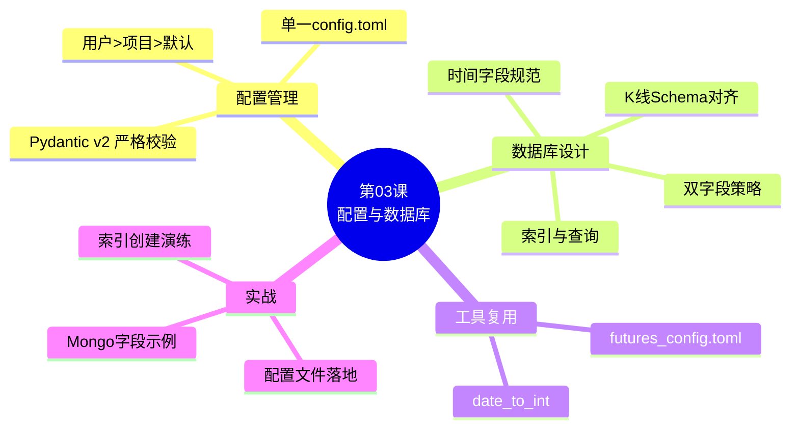
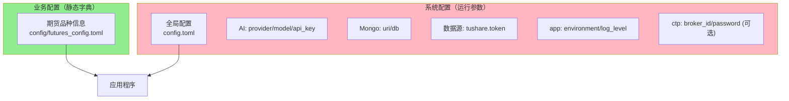
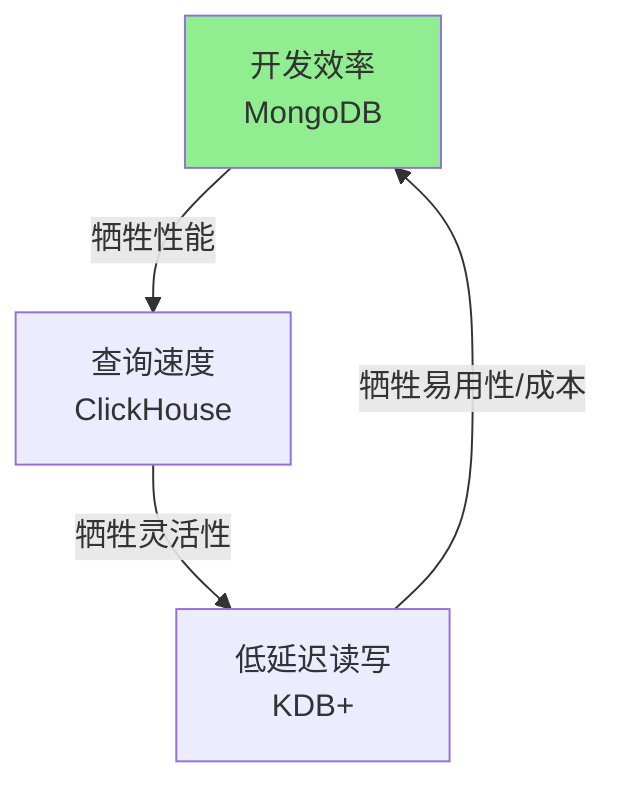
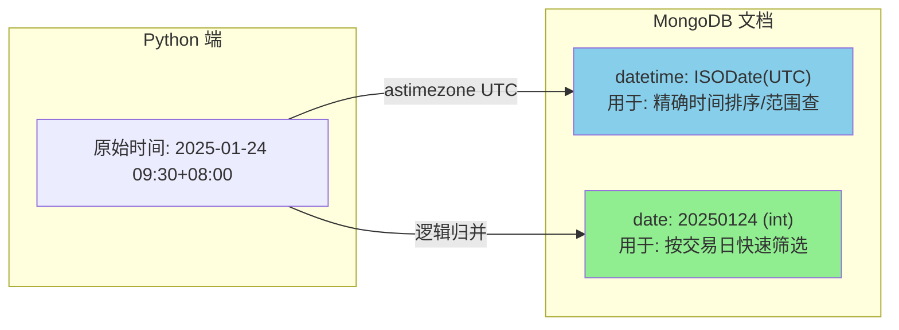
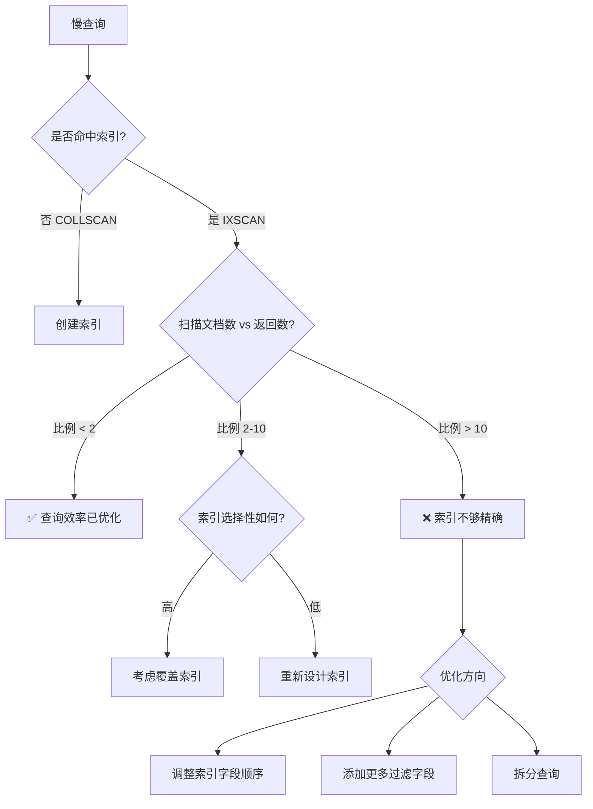

# 第03课：配置管理与数据库设计 v3.3（对齐当前代码：单一 config.toml + 严格校验）

**课时**: 90 分钟  **难度**: ⭐⭐⭐⭐  **前置课程**: 第01课（环境与工具链）、第02课（六边形架构与工具层）  **版本**: v3.3 (2025-12-16)

---

## 🗺️ 课程脑图



---

## 📋 课程概述

### 本课相对于第02课的优化与衔接
- **系统级配置统一**：新增 `CherryQuantSettings`（Pydantic v2 `BaseModel`），聚合 `AppConfig/AIConfig/CTPConfig/MongoConfig/DataSourceConfig/...`。
- **单一配置文件**：只使用 `config.toml` 管理系统配置（包含 environment/log_level/ai/mongo/data_source 等）。
- **加载规则足够简单**：用户级 `~/.config/cherryquant/config.toml` > 项目级 `config/config.toml` > 代码默认值。
- **更严格、更可控**：配置模型 `extra="forbid"`，禁止未知字段；并对部分关键字段做枚举约束（如 environment/log_level/provider）。
- **业务配置保持不变**：期货静态字典 `config/futures_config.toml` 继续由 `src/cherryquant/config/futures_loader.py` 加载（Pydantic 校验 + 单例缓存）。

### 本课定位
- **承接**：第02课已经确立“配置驱动的工具层”（尤其是 `futures_config.toml` + `utils`）。
- **目标**：补齐“系统级配置入口（Settings）”与“数据库字段设计”，形成可落地基线。
- **不做**：本课不引入隐式覆盖、不引入多来源配置合并（避免隐式行为）。

---

## 🎯 学习目标

1) 设计并落地一套清晰的配置管理方案：保留 `futures_config.toml`，新增全局 `config.toml`。
2) 用工业级方式管理敏感信息：将 token/key 放在用户级 `~/.config/cherryquant/config.toml`，避免进入仓库。
3) 统一数据库时间字段设计：`date`（int YYYYMMDD）+ `datetime`（UTC ISODate），并制定索引建议。

---

## ✅ 课前准备检查

- [ ] 已完成第01课环境配置（uv、Python 3.12+）。
- [ ] 已完成第02课工具层阅读，了解 `config/futures_config.toml`、`src/cherryquant/config/futures_loader.py`、`src/cherryquant/utils/date_utils.py`。
- [ ] 在代码项目根目录可运行 `uv run pytest`。
- [ ] 已执行 `uv sync` 安装依赖（本仓库使用 Pydantic v2）。

---

## 🏗️ Part 1: 配置管理方案（30分钟）

> 本节目标：用“单一 TOML + 强校验 + 明确优先级”的方式管理全局配置，让行为可预测、可教学、可上生产。

### 1.1 配置全景图：我们要管理什么？



### 1.2 配置文件在哪里？（优先级）

1. `~/.config/cherryquant/config.toml`（用户级，优先级最高；建议放敏感信息）
2. `config/config.toml`（项目级默认配置；建议提交到仓库作为示范）
3. 都不存在时：使用代码默认值（`CherryQuantSettings()`）

### 1.3 代码入口（与仓库对齐）

- Schema：`src/cherryquant/config/models.py`（`CherryQuantSettings`）
- Loader：`src/cherryquant/config/settings.py`（`get_settings/get_settings_source/reload_settings`）

使用示例：

```python
from cherryquant.config import get_settings, get_settings_source

settings = get_settings()
print(get_settings_source())
print(settings.app.environment)
print(settings.mongo.uri)
```

### 1.4 “更严格”的关键点（工业级规范）

本课程的配置模型采用严格策略：

- `extra="forbid"`：配置文件里写错字段名会直接报错（防止“悄悄失效”）。
- 关键字段枚举约束：
  - `app.environment`: development/testing/staging/production
  - `app.log_level`: DEBUG/INFO/WARNING/ERROR/CRITICAL
  - `ai.provider`: openai/azure/anthropic/local
- 模型不可变（frozen）：避免运行时把配置当作可变状态修改。

如果配置文件有错误，会抛出 `ConfigLoadError`，并带可读的定位信息（字段路径 + 错误原因）。

### 1.5 让学生快速跑起来（推荐流程）

```bash
# 1) 创建用户级配置
mkdir -p ~/.config/cherryquant
cp config/config.toml ~/.config/cherryquant/config.toml

# 2) 编辑 ~/.config/cherryquant/config.toml
#    填入 data_source.tushare.token / ai.api_key 等

# 3) 验证
uv run pytest
```

---
## 💾 Part 2: 数据库设计与 MongoDB 基础（35分钟）

> 本节目标：理解 NoSQL 在量化场景的优势，掌握时间字段设计规范，学会创建高效索引。

### 2.1 数据库选型：理想与现实

在量化交易领域，数据库的选择往往引发激烈的争论。如果你去面试一家高频交易公司，他们可能使用的是 KDB+ 或 ClickHouse，而不是 MongoDB。

**为什么本课程选择 MongoDB？**

并不是因为它性能最强，而是因为它最**敏捷**，最适合**中低频策略研究**。

| 维度 | MongoDB | ClickHouse / DolphinDB | KDB+ |
|------|---------|------------------------|------|
| **类型** | 文档型 (NoSQL) | 列式存储 (OLAP) | 时序数据库 |
| **优势** | **Schema-less** (极度灵活) | **查询极快** (海量聚合) | **低延迟** (纳秒级) |
| **劣势** | 存储空间大、复杂查询慢 | 运维复杂、Schema 严格 | 极贵、学习曲线陡峭 (Q语言) |
| **适用场景** | 策略研究、异构数据、实盘配置 | 历史 Tick 数据回测、BAR 存取 | 高频交易实盘、L3 数据 |
| **Python** | 原生字典支持 (PyMongo) | 需要 ORM 或 SQL 拼接 | 需要专门的接口库 |

**量化场景的"不可能三角"**：



> **架构师视角**：
> - **实盘交易**：我们用 MongoDB 存储配置、交易日志、持仓状态（灵活性 > 性能）。
> - **行情中心**：工业级方案会引入 ClickHouse 存储海量 Tick 数据。
> - **教学/研究**：MongoDB 是性价比最高的起点，足以支撑分钟级策略和全市场日线数据。

---

### 2.2 BSON 数据类型

MongoDB 使用 BSON（Binary JSON）格式存储数据。了解 BSON 类型对正确设计字段至关重要：

| BSON 类型 | Python 类型 | 示例 | 量化场景 |
|-----------|------------|------|---------|
| `ObjectId` | `bson.ObjectId` | `ObjectId("507f1f77bcf86cd799439011")` | 自动生成的 `_id` |
| `String` | `str` | `"rb2505"` | 合约代码 |
| `Int32/Int64` | `int` | `20250124` | 日期整数 |
| `Double` | `float` | `3800.5` | 价格 |
| `Date` | `datetime.datetime` | `ISODate("2025-01-24T01:30:00Z")` | 精确时间戳 |
| `Boolean` | `bool` | `true` | 是否主力合约 |
| `Array` | `list` | `[3800, 3810, 3795]` | 历史价格 |
| `Document` | `dict` | `{"open": 3800, "close": 3810}` | 嵌套结构 |

**ObjectId 的隐藏功能**：

```python
from bson import ObjectId

oid = ObjectId()
print(oid)                    # 507f1f77bcf86cd799439011
print(oid.generation_time)    # 2025-01-24 01:30:00+00:00 (创建时间，UTC)

# ObjectId 前4字节是时间戳，可用于粗略时间范围查询
```

> **注意**：虽然 ObjectId 包含时间戳，但不应依赖它做精确时间查询。始终显式存储 `datetime` 字段。

---

### 2.3 时间字段设计：特性与优化

在 MongoDB 中处理时间，需要理解其底层机制，并结合量化查询习惯进行优化。

#### 机制：MongoDB 强制 UTC

MongoDB 的 `ISODate` 类型在底层**只存储 UTC 时间戳**。
- 如果你存入一个 naive datetime（无时区），MongoDB 会**直接当作 UTC 处理**。
- 这会导致严重的"时间平移"问题（例如北京时间 9:30 被当作 UTC 9:30，读出来变成北京时间 17:30）。

**✅ 正确做法**：在 Python 端将时间统一转换为 **UTC aware datetime** 后再存入。

#### 优化：为什么需要 date (int) 字段？

虽然有了 `datetime`，我们强烈建议增加一个 `date` (int) 字段，原因如下：
1.  **查询便利**：无需构造 `Start/End` 时间范围即可查询“某标的某天”的数据（例如 `{"symbol": "rb2505", "frequency": "1m", "date": 20250124}`）。
2.  **交易日概念**：夜盘数据的时间跨度可能涉及两天，但属于同一个"交易日"。用 `date` 字段标记逻辑交易日更加清晰。
3.  **性能**：整数索引比时间范围查询略快。

#### 最终方案：双字段策略



**字段规范**：

| 字段 | 类型 | 示例 | 核心用途 |
|------|------|------|------|
| `datetime` | `ISODate (UTC)` | `2025-01-24T01:30:00Z` | **唯一事实**：数据发生的物理时间 |
| `date` | `int` | `20250124` | **便利索引**：数据的逻辑交易日 |

---

#### 正确的时间转换代码

```python
import datetime
from zoneinfo import ZoneInfo  # Python 3.9+

# 方式1：使用 zoneinfo（推荐）
tz_beijing = ZoneInfo("Asia/Shanghai")
dt_bj = datetime.datetime(2025, 1, 24, 9, 30, tzinfo=tz_beijing)
dt_utc = dt_bj.astimezone(ZoneInfo("UTC"))

print(f"北京时间: {dt_bj}")   # 2025-01-24 09:30:00+08:00
print(f"UTC 时间: {dt_utc}")  # 2025-01-24 01:30:00+00:00

# 方式2：使用 datetime.timezone（兼容性更好）
tz_cst = datetime.timezone(datetime.timedelta(hours=8))
dt_bj = datetime.datetime(2025, 1, 24, 9, 30, tzinfo=tz_cst)
dt_utc = dt_bj.astimezone(datetime.timezone.utc)
```

**关键原则**：
1. **存储**：始终使用 UTC 存入数据库
2. **显示**：查询后转换回本地时区显示
3. **aware datetime**：始终使用带时区信息的 datetime

> [!NOTE] 简繁之辩：如果不做外盘，需要这么麻烦吗？
> 如果你的系统**仅**交易中国期货（单一时区），确实可以简化处理（例如统一忽略时区，全当 naive datetime）。
> 但本课程坚持 **UTC 标准化** 方案，是因为：
> 1. **扩展性**：一旦涉及外盘（如美股、LME），时区混乱是灾难性的。
> 2. **标准化**：PyMongo 对 UTC 的支持是原生且强制的，顺势而为代码更少。

---

### 2.4 写入示例

```python
from pymongo import MongoClient
from cherryquant.config import get_settings
from cherryquant.utils.date_utils import date_to_int
import datetime
from zoneinfo import ZoneInfo

# 加载配置
settings = get_settings()
client = MongoClient(settings.mongo.uri)
coll = client[settings.mongo.db]["klines"]

# 构造时间（北京时间 → UTC）
tz_beijing = ZoneInfo("Asia/Shanghai")
dt_bj = datetime.datetime(2025, 1, 24, 9, 30, tzinfo=tz_beijing)
dt_utc = dt_bj.astimezone(ZoneInfo("UTC"))

# 构造文档
doc = {
    "symbol": "rb2505",
    "frequency": "1m",
    "date": date_to_int(dt_bj),      # 20250124 (复用工具函数)
    "datetime": dt_utc,               # UTC ISODate
    "open": 3800.0,
    "high": 3820.0,
    "low": 3795.0,
    "close": 3810.5,
    "volume": 12345,
}

# 写入
result = coll.insert_one(doc)
print(f"插入文档 ID: {result.inserted_id}")
```

---

### 2.5 索引设计

#### 为什么需要索引？

没有索引时，MongoDB 需要扫描整个集合来查找数据（Collection Scan）。索引就像书的目录，可以快速定位数据。

**索引的代价**：
- ✅ 加速查询
- ❌ 占用存储空间
- ❌ 减慢写入速度（需要更新索引）

#### 复合索引与最左前缀原则

```python
# 创建复合索引：(symbol, frequency, date)
# 1 = 升序, -1 = 降序
coll.create_index([("symbol", 1), ("frequency", 1), ("date", 1)], name="idx_symbol_frequency_date")
```

**最左前缀原则**：复合索引 `(symbol, frequency, date)` 可以支持以下查询：

| 查询条件 | 是否命中索引 |
|---------|------------|
| `{"symbol": "rb2505"}` | ✅ 命中（使用第1个字段） |
| `{"symbol": "rb2505", "frequency": "1m"}` | ✅ 命中（使用前2个字段） |
| `{"symbol": "rb2505", "frequency": "1m", "date": 20250124}` | ✅ 完全命中 |
| `{"symbol": "rb2505", "frequency": "1m", "date": {"$gte": 20250101}}` | ✅ 命中 |
| `{"symbol": "rb2505", "date": 20250124}` | ⚠️ 只能部分命中（会扫描该 symbol 的所有 frequency） |
| `{"date": 20250124}` | ❌ 不命中（跳过了第1个字段） |

> **设计原则**：把选择性高（唯一值多）的字段放在前面。

---

#### 使用 explain() 检查索引

```python
# 检查查询是否命中索引
result = coll.find({"symbol": "rb2505", "frequency": "1m", "date": 20250124}).explain("executionStats")

# 关键字段（注意：有时会出现 FETCH -> IXSCAN 的组合）
stages = result.get("executionStats", {}).get("executionStages", {})
stage = stages.get("stage")
if stage == "FETCH" and isinstance(stages.get("inputStage"), dict):
    stage = stages["inputStage"].get("stage", stage)
print(stage)
# IXSCAN = 索引扫描 ✅
# COLLSCAN = 全集合扫描 ❌
```

---

### 2.6 典型集合设计

> [!TIP]
> 为了与第04课的采集/入库示例保持一致，本课程后续统一使用集合名 `klines`（很多同学习惯称为 bars，本质等价）。

| 集合 | 必备字段 | 推荐索引 | 说明 |
|------|---------|---------|------|
| `klines` | `symbol`, `frequency`, `date`, `datetime`, `open`, `high`, `low`, `close`, `volume` | `(symbol, frequency, datetime)`（unique）+ `(symbol, frequency, date)` | 日K/分钟K（第04课落库） |
| `ticks` | `symbol`, `date`, `datetime`, `price`, `volume`, `open_interest` | `(symbol, datetime)` | Tick 数据 |
| `trade_logs` | `order_id`, `symbol`, `side`, `qty`, `price`, `date`, `datetime` | `(order_id)`, `(symbol, date)` | 交易记录 |
| `ai_logs` | `session_id`, `prompt`, `response`, `datetime`, `cost` | `(session_id)`, `(datetime)` | AI 调用日志 |
| `trade_calendar` | `date`, `exchange`, `is_open` | `(date)`, `(exchange, date)` | 交易日历 |

---

### 2.6.1 K 线（Kline/Bar）Schema：与第04课对齐

K 线数据最常见的访问模式是：**按标的（symbol）+ 频率（frequency）+ 时间范围**查询；而写入侧（第04课）通常会使用 `bulk_write + upsert` 做增量更新。

因此建议把下面三者作为“逻辑主键”（并创建唯一索引）：
- `symbol`：标的/合约代码（如 `rb2505`、`600000.SH`）
- `frequency`：周期（第04课接口参数命名为 `frequency`，如 `1m`、`5m`、`1d`）
- `datetime`：K 线对应的时间点（统一存 UTC ISODate；建议语义为“bar close time”或“bar start time”，二选一全库一致）

**推荐字段（分钟K/日K通用）**：

| 字段 | 类型 | 示例 | 说明 |
|------|------|------|------|
| `symbol` | `str` | `"rb2505"` | 标的/合约 |
| `exchange` | `str` | `"SHFE"` | 可选：交易所/市场（便于分市场统计） |
| `frequency` | `str` | `"1m"` | 周期：`1m/5m/15m/1d/...` |
| `date` | `int` | `20250124` | **逻辑交易日**（夜盘归并时尤为重要） |
| `datetime` | `ISODate(UTC)` | `2025-01-24T01:30:00Z` | **物理时间**（唯一事实） |
| `open/high/low/close` | `float` | `3800.0` | OHLC |
| `volume` | `int` | `12345` | 成交量 |
| `amount` | `float` | `12345678.9` | 可选：成交额（有些数据源字段名叫 `turnover`） |
| `open_interest` | `int` | `98765` | 可选：持仓量（期货常用，有些数据源字段名叫 `oi`） |
| `source` | `str` | `"tushare"` | 可选：数据来源（第04课 Adapter 会用到） |

**示例文档**：

```python
doc = {
    "symbol": "rb2505",
    "exchange": "SHFE",
    "frequency": "1m",
    "date": 20250124,
    "datetime": dt_utc,  # UTC aware datetime -> MongoDB ISODate
    "open": 3800.0,
    "high": 3820.0,
    "low": 3795.0,
    "close": 3810.5,
    "volume": 12345,
    "open_interest": 98765,
    "source": "tushare",
}
```

**关键索引（强烈建议）**：

```python
# 逻辑主键：用于 upsert 去重（第04课 bulk_write 的关键前置条件）
coll.create_index(
    [("symbol", 1), ("frequency", 1), ("datetime", 1)],
    unique=True,
    name="uniq_symbol_frequency_datetime",
)

# 典型读取：按日取分钟K、或按交易日聚合
coll.create_index([("symbol", 1), ("frequency", 1), ("date", 1)], name="idx_symbol_frequency_date")
```

**与第04课 upsert 写入对齐**（核心是“过滤条件=逻辑主键”）：

```python
from pymongo import UpdateOne

op = UpdateOne(
    {"symbol": doc["symbol"], "frequency": doc["frequency"], "datetime": doc["datetime"]},
    {"$set": doc},
    upsert=True,
)
```

> [!TIP]
> 如果你明确只存**日线**（`frequency="1d"`）且保证“每个 symbol 每个交易日只有一根 K 线”，可以把逻辑主键简化为 `(symbol, date)`（第04课的入门示例即为此写法）。一旦引入分钟K/多周期，请升级为 `(symbol, frequency, datetime)`，否则会发生“同一天多根K线互相覆盖/去重冲突”。

> [!NOTE]
> `date` 字段推荐语义是“交易日”而非“自然日”。夜盘跨日时，`datetime` 可能落在自然日的前一天/后一天，但 `date` 仍应归并到同一个交易日；第06课会用交易日历把这件事做得更严谨。

> [!TIP]
> 关联阅读：第04课「1.3 bulk_write批量写入」会在该逻辑主键的前提下实现 `bulk_write + upsert` 的高性能落库。

---

### 2.6.2 一个集合 vs 多个集合（按周期拆分）

两种常见方案都能工作，关键是与团队的查询习惯保持一致：

- **方案 A：单集合 `klines` + `frequency` 字段**（本课程默认）
  - 优点：写入/查询入口统一；便于做跨周期统计（带过滤）。
  - 缺点：集合更大，索引更重；不同周期的数据分布不均时可能影响局部性能。

- **方案 B：按周期拆分集合**（如 `klines_1m`, `klines_1d`）
  - 优点：索引更轻，容量/性能更可控；易做冷热分层。
  - 缺点：代码里多一个“根据 frequency 路由集合”的步骤；跨周期查询更麻烦。

> 选择建议：如果你已经确定“绝大多数策略只用一种周期”（例如只做日线），方案 B 更省心；否则用方案 A 更通用。

---

### 2.6.3 可选进阶：MongoDB Time Series Collection（了解即可）

如果你的 MongoDB 版本支持 Time Series Collection，可以把 `datetime` 设为 `timeField`，把 `symbol/frequency/exchange` 放进 `metaField`，能获得更好的压缩与时序写入体验：

```javascript
db.createCollection("klines_ts", {
  timeseries: { timeField: "datetime", metaField: "meta", granularity: "minutes" }
})
```

这属于“可选优化”，不影响本课程第03/04课的核心实现（普通集合 + 复合索引也足够）。

---

### 2.7 常见陷阱与最佳实践

#### ❌ 陷阱1：使用 naive datetime

```python
# ❌ 错误
dt = datetime.datetime.now()  # naive datetime，无时区信息

# ✅ 正确
dt = datetime.datetime.now(datetime.timezone.utc)  # aware datetime
```

#### ❌ 陷阱2：过度索引

```python
# ❌ 为每个字段都建索引
coll.create_index("symbol")
coll.create_index("date")
coll.create_index("close")
coll.create_index("volume")
# 写入性能会很差！

# ✅ 只为常用查询建索引
coll.create_index([("symbol", 1), ("frequency", 1), ("date", 1)])
```

#### ✅ 最佳实践：TTL 索引自动清理

对于日志类数据，可以设置 TTL（Time To Live）索引自动删除过期文档：

```python
# 30天后自动删除
coll.create_index("datetime", expireAfterSeconds=30*24*60*60)
```

---

<details>
<summary>🤔 思考题：设计一个"策略信号"集合（点击查看答案）</summary>

**场景**：策略产生买卖信号，需要记录信号详情。

**设计方案**：

```python
signal_doc = {
    "strategy_id": "ma_cross_01",      # 策略ID
    "symbol": "rb2505",                 # 合约
    "date": 20250124,                   # 交易日
    "datetime": dt_utc,                 # 信号时间 (UTC)
    "signal_type": "buy",               # buy / sell / close
    "price": 3800.5,                    # 信号价格
    "quantity": 10,                     # 建议手数
    "confidence": 0.85,                 # 置信度
    "reason": "5日均线上穿20日均线",      # 信号原因
    "executed": False,                  # 是否已执行
}

# 推荐索引
coll.create_index([("strategy_id", 1), ("date", -1)])  # 按策略查最近信号
coll.create_index([("symbol", 1), ("datetime", -1)])   # 按合约查时间序列
coll.create_index([("executed", 1), ("datetime", 1)])  # 查未执行的信号
```

</details>

---

### 2.8 MongoDB 查询进阶

> 本节目标：掌握聚合管道的使用，学会高效查询时序数据的常用模式。

在量化场景中，我们经常需要执行复杂查询：如统计某品种的日均成交量、计算多个合约的收益率、筛选满足条件的交易日等。MongoDB 的聚合管道（Aggregation Pipeline）是实现这些需求的强大工具。

---

#### 2.8.1 聚合管道基础

**聚合管道的概念**：类似于 Unix 管道，数据从一个阶段流向下一个阶段，每个阶段对数据进行转换。


**常用阶段**：

| 阶段 | 作用 | 类比 SQL |
|------|------|---------|
| `$match` | 筛选文档 | `WHERE` |
| `$group` | 分组聚合 | `GROUP BY` |
| `$project` | 选择/计算字段 | `SELECT` |
| `$sort` | 排序 | `ORDER BY` |
| `$limit` | 限制数量 | `LIMIT` |
| `$skip` | 跳过前N个 | `OFFSET` |
| `$unwind` | 展开数组 | - |
| `$lookup` | 关联查询 | `JOIN` |

---

#### 2.8.2 实战案例：K线数据聚合

**案例1：统计某品种的日均成交量**

```python
from pymongo import MongoClient
from cherryquant.config import get_settings

settings = get_settings()
client = MongoClient(settings.mongo.uri)
coll = client[settings.mongo.db]["klines"]

# 聚合管道
pipeline = [
    # 1. 筛选：只看rb品种的日线数据
    {"$match": {
        "symbol": {"$regex": "^rb"},  # 以rb开头
        "frequency": "1d",
        "date": {"$gte": 20250101, "$lte": 20250131}
    }},
    
    # 2. 分组：按symbol分组，计算平均成交量
    {"$group": {
        "_id": "$symbol",
        "avg_volume": {"$avg": "$volume"},
        "max_volume": {"$max": "$volume"},
        "min_volume": {"$min": "$volume"},
        "count": {"$sum": 1}
    }},
    
    # 3. 排序：按平均成交量降序
    {"$sort": {"avg_volume": -1}},
    
    # 4. 投影：重命名字段
    {"$project": {
        "symbol": "$_id",
        "avg_volume": 1,
        "max_volume": 1,
        "min_volume": 1,
        "trading_days": "$count",
        "_id": 0  # 不返回_id
    }}
]

results = list(coll.aggregate(pipeline))
for doc in results:
    print(f"{doc['symbol']}: 日均{doc['avg_volume']:.0f}手，"
          f"最大{doc['max_volume']}手，交易{doc['trading_days']}天")
```

**输出示例**：
```
rb2505: 日均123456手，最大200000手，交易21天
rb2506: 日均98765手，最大150000手，交易21天
```

---

**案例2：计算某合约的收益率序列**

```python
# 查询rb2505的1月份日线，计算每日涨跌幅
pipeline = [
    {"$match": {
        "symbol": "rb2505",
        "frequency": "1d",
        "date": {"$gte": 20250101, "$lte": 20250131}
    }},
    
    {"$sort": {"date": 1}},  # 按日期升序
    
    # 计算涨跌幅（需要用 $addFields + 窗口函数，MongoDB 5.0+）
    {"$setWindowFields": {
        "sortBy": {"date": 1},
        "output": {
            "prev_close": {
                "$shift": {
                    "output": "$close",
                    "by": -1  # 前一天的收盘价
                }
            }
        }
    }},
    
    # 计算收益率
    {"$addFields": {
        "return_pct": {
            "$cond": {
                "if": {"$ne": ["$prev_close", None]},
                "then": {
                    "$multiply": [
                        {"$divide": [
                            {"$subtract": ["$close", "$prev_close"]},
                            "$prev_close"
                        ]},
                        100
                    ]
                },
                "else": None
            }
        }
    }},
    
    {"$project": {
        "date": 1,
        "close": 1,
        "prev_close": 1,
        "return_pct": 1,
        "_id": 0
    }}
]

results = list(coll.aggregate(pipeline))
for doc in results:
    if doc.get("return_pct"):
        print(f"{doc['date']}: {doc['close']:.2f}, 涨跌{doc['return_pct']:+.2f}%")
```

> **注意**：`$setWindowFields` 是 MongoDB 5.0+ 的特性。如果使用旧版本，需要在应用层计算收益率。

---

#### 2.8.3 时序数据常用查询模式

**模式1：按时间范围查询**

```python
# 查询某合约某时间段的分钟K
query = {
    "symbol": "rb2505",
    "frequency": "1m",
    "datetime": {
        "$gte": datetime(2025, 1, 24, 1, 30, tzinfo=timezone.utc),  # UTC时间
        "$lt": datetime(2025, 1, 24, 3, 0, tzinfo=timezone.utc)
    }
}

# 使用索引：(symbol, frequency, datetime)
cursor = coll.find(query).sort("datetime", 1)
```

**模式2：按交易日查询（推荐）**

```python
# 查询某合约某交易日的所有分钟K（更简洁）
query = {
    "symbol": "rb2505",
    "frequency": "1m",
    "date": 20250124
}

# 使用索引：(symbol, frequency, date)
cursor = coll.find(query).sort("datetime", 1)
```

> **对比**：第二种方式无需构造时间范围，且可以正确处理夜盘数据（跨零点但属于同一交易日）。

---

**模式3：多合约同时查询**

```python
# 查询多个合约的最新K线
symbols = ["rb2505", "rb2506", "rb2507"]
pipeline = [
    {"$match": {
        "symbol": {"$in": symbols},
        "frequency": "1d"
    }},
    
    # 按symbol分组，取每组的最大date
    {"$sort": {"date": -1}},
    {"$group": {
        "_id": "$symbol",
        "latest": {"$first": "$$ROOT"}  # 取第一个文档（最新）
    }},
    
    {"$replaceRoot": {"newRoot": "$latest"}}
]

latest_klines = list(coll.aggregate(pipeline))
```

---

**模式4：条件筛选（如价格突破）**

```python
# 查找收盘价突破20日高点的K线
pipeline = [
    {"$match": {
        "symbol": "rb2505",
        "frequency": "1d",
        "date": {"$gte": 20250101}
    }},
    
    {"$sort": {"date": 1}},
    
    # 计算20日最高价（窗口函数）
    {"$setWindowFields": {
        "sortBy": {"date": 1},
        "output": {
            "high_20d": {
                "$max": "$high",
                "window": {
                    "documents": [-19, 0]  # 当前及前19个文档
                }
            }
        }
    }},
    
    # 筛选：收盘价 > 20日最高价
    {"$match": {
        "$expr": {"$gt": ["$close", "$high_20d"]}
    }},
    
    {"$project": {
        "date": 1,
        "close": 1,
        "high_20d": 1,
        "breakthrough": {
            "$subtract": ["$close", "$high_20d"]
        },
        "_id": 0
    }}
]

breakthroughs = list(coll.aggregate(pipeline))
print(f"发现{len(breakthroughs)}次突破")
```

---

#### 2.8.4 聚合管道性能优化

**优化原则**：

1. **尽早 $match**：在管道开头筛选数据，减少后续阶段的文档数量
2. **使用索引**：$match 阶段如果放在开头且条件命中索引，性能最佳
3. **避免 $unwind 大数组**：展开数组会导致文档数量激增
4. **投影减少字段**：$project 删除不需要的字段，减少内存占用

**优化示例**：

```python
# ❌ 低效：先分组再筛选
pipeline = [
    {"$group": {"_id": "$symbol", "count": {"$sum": 1}}},
    {"$match": {"_id": "rb2505"}}  # 已经分组了所有symbol，浪费
]

# ✅ 高效：先筛选再分组
pipeline = [
    {"$match": {"symbol": "rb2505"}},  # 命中索引
    {"$group": {"_id": "$symbol", "count": {"$sum": 1}}}
]
```

---

### 2.9 性能优化实战

> 本节目标：学会使用 explain() 分析查询性能，掌握索引优化决策方法。

#### 2.9.1 explain() 详解

**explain() 的三个模式**：

| 模式 | 返回信息 | 用途 |
|------|---------|------|
| `"queryPlanner"` | 查询计划 | 查看是否命中索引 |
| `"executionStats"` | 执行统计 | 查看扫描文档数、耗时 |
| `"allPlansExecution"` | 所有候选计划 | 调试索引选择问题 |

**使用示例**：

```python
query = {
    "symbol": "rb2505",
    "frequency": "1m",
    "date": {"$gte": 20250101, "$lte": 20250131}
}

explain_result = coll.find(query).explain("executionStats")

# 解析关键指标
stats = explain_result["executionStats"]
print(f"执行时间: {stats['executionTimeMillis']}ms")
print(f"扫描文档数: {stats['totalDocsExamined']}")
print(f"返回文档数: {stats['nReturned']}")
print(f"扫描索引键数: {stats['totalKeysExamined']}")

# 判断效率
if stats['totalDocsExamined'] > stats['nReturned'] * 10:
    print("⚠️ 警告：扫描了过多无关文档，考虑优化索引")
```

**关键指标解读**：

| 指标 | 含义 | 理想值 |
|------|------|--------|
| `executionTimeMillis` | 执行耗时（毫秒） | < 100ms（简单查询） |
| `totalDocsExamined` | 扫描的文档数 | ≈ `nReturned`（精确命中） |
| `totalKeysExamined` | 扫描的索引键数 | ≈ `nReturned` |
| `nReturned` | 返回的文档数 | 查询结果大小 |
| `stage` | 查询策略 | `IXSCAN`（索引扫描） |

---

#### 2.9.2 慢查询定位

**MongoDB 慢查询日志**：

```javascript
// 启用慢查询日志（阈值100ms）
db.setProfilingLevel(1, { slowms: 100 });

// 查看慢查询
db.system.profile.find().sort({ ts: -1 }).limit(5);
```

**Python 侧监控**：

```python
import time
from functools import wraps

def profile_query(func):
    """装饰器：记录查询耗时"""
    @wraps(func)
    def wrapper(*args, **kwargs):
        start = time.time()
        result = func(*args, **kwargs)
        elapsed = (time.time() - start) * 1000
        
        if elapsed > 100:  # 超过100ms
            print(f"⚠️ 慢查询 {func.__name__}: {elapsed:.2f}ms")
        
        return result
    return wrapper

@profile_query
def query_klines(symbol, start_date, end_date):
    return list(coll.find({
        "symbol": symbol,
        "frequency": "1d",
        "date": {"$gte": start_date, "$lte": end_date}
    }))
```

---

#### 2.9.3 索引优化决策树



**实际案例**：

```python
# 场景：查询某品种某月的分钟K
query = {
    "symbol": "rb2505",
    "frequency": "1m",
    "date": {"$gte": 20250101, "$lte": 20250131}
}

# 当前索引：(symbol, frequency, datetime)
# 问题：date范围查询没有用上索引的第三个字段

explain = coll.find(query).explain("executionStats")
print(explain["executionStats"]["totalDocsExamined"])  # 可能扫描了整月数据

# 解决方案：添加 (symbol, frequency, date) 索引
coll.create_index([
    ("symbol", 1),
    ("frequency", 1),
    ("date", 1)  # date作为索引字段，而非datetime
], name="idx_symbol_frequency_date")

# 再次查询，性能提升
explain2 = coll.find(query).explain("executionStats")
print(explain2["executionStats"]["totalDocsExamined"])  # 显著减少
```

---

#### 2.9.4 覆盖索引（Covered Query）

**概念**：查询只需要访问索引，无需读取文档本身。

```python
# 创建包含所需字段的索引
coll.create_index([
    ("symbol", 1),
    ("frequency", 1),
    ("date", 1),
    ("close", 1)  # 包含要查询的字段
], name="idx_covered")

# 查询：只需要 symbol, date, close
query = {"symbol": "rb2505", "frequency": "1d"}
projection = {"symbol": 1, "date": 1, "close": 1, "_id": 0}

result = coll.find(query, projection)
explain = result.explain("executionStats")

# 检查是否覆盖
if explain["executionStats"]["executionStages"]["stage"] == "IXSCAN":
    if "FETCH" not in str(explain):
        print("✅ 覆盖索引：无需读取文档")
```

> **注意**：覆盖索引可以显著提升性能，但会增加索引大小。只对高频查询使用。

---

### 2.10 数据生命周期管理

> 本节目标：理解数据分层存储策略，掌握自动清理和归档方法。

#### 2.10.1 冷热数据分层

**量化数据的生命周期**：


**分层策略**：

| 类别 | 时间范围 | 存储方式 | 访问频率 | 查询延迟 |
|------|---------|---------|---------|---------|
| **热数据** | 近30天 | MongoDB（内存+SSD） | 极高 | <10ms |
| **温数据** | 30-180天 | MongoDB（压缩） | 中等 | <100ms |
| **冷数据** | 6个月-3年 | Parquet文件 | 低 | <1s |
| **归档数据** | 3年+ | 对象存储（S3/OSS） | 极低 | >5s |

---

#### 2.10.2 TTL 索引自动清理

**场景**：日志、信号等临时数据，保留固定时间后自动删除。

```python
# 创建TTL索引：30天后自动删除
coll_logs = db["ai_logs"]
coll_logs.create_index(
    "datetime",
    expireAfterSeconds=30 * 24 * 60 * 60,  # 30天
    name="ttl_cleanup"
)

# 写入文档，MongoDB会自动清理过期数据
import datetime as dt
coll_logs.insert_one({
    "session_id": "abc123",
    "prompt": "...",
    "datetime": dt.datetime.now(dt.timezone.utc),  # 必须是ISODate类型
    "cost": 0.05
})
```

**TTL 原理**：
- MongoDB 后台线程每60秒检查一次
- 删除 `datetime + expireAfterSeconds < 当前时间` 的文档
- **注意**：`datetime` 字段必须是 `Date` 类型（不能是int）

---

#### 2.10.3 手动归档策略

**步骤1：导出旧数据到Parquet**

```python
import pandas as pd
from pymongo import MongoClient

def archive_old_klines(cutoff_date: int):
    """归档指定日期之前的K线数据"""
    
    client = MongoClient("mongodb://localhost:27017")
    coll = client["cherryquant"]["klines"]
    
    # 1. 查询旧数据
    query = {"frequency": "1d", "date": {"$lt": cutoff_date}}
    cursor = coll.find(query)
    
    # 2. 转为DataFrame
    df = pd.DataFrame(list(cursor))
    if df.empty:
        print("没有需要归档的数据")
        return
    
    # 3. 保存为Parquet（按年月分区）
    df["year_month"] = df["date"].astype(str).str[:6]
    for ym, group in df.groupby("year_month"):
        output_file = f"/data/archive/klines_{ym}.parquet"
        group.drop("year_month", axis=1).to_parquet(output_file, compression="snappy")
        print(f"归档 {len(group)} 条记录到 {output_file}")
    
    # 4. 删除已归档数据
    result = coll.delete_many(query)
    print(f"删除 {result.deleted_count} 条记录")

# 归档180天前的数据
from cherryquant.utils.date_utils import date_to_int
import datetime as dt
cutoff = date_to_int((dt.date.today() - dt.timedelta(days=180)).isoformat())
archive_old_klines(cutoff)
```

---

**✅ 为什么要引入 DuckDB？**

在归档场景下，我们推荐使用 **DuckDB** 配合 Parquet，而非继续使用 Pandas，原因如下：

1.  **进程内 SQL 引擎**：DuckDB 就像“只读分析版”的 SQLite，无需安装服务端，`pip install duckdb` 即可使用。
2.  **智能读取（谓词下推）**：当你查询 `symbol='rb2505'` 时，DuckDB 会利用 Parquet 的元数据，**只读取**包含该合约的数据块，速度比 Pandas 加载整个文件快几个数量级。
3.  **SQL 查文件**：支持直接用 SQL 查询文件系统，如 `SELECT * FROM 'data/*.parquet'`，无需手动编写循环加载代码。

**步骤2：读取归档数据**

```python
import duckdb

def query_archived_klines(symbol: str, start_date: int, end_date: int):
    """查询归档数据（使用DuckDB扫描Parquet）"""
    
    # 计算需要扫描的文件
    start_ym = str(start_date)[:6]
    end_ym = str(end_date)[:6]
    
    # 使用DuckDB扫描Parquet文件
    con = duckdb.connect()
    query = f"""
    SELECT * FROM read_parquet('/data/archive/klines_*.parquet')
    WHERE symbol = '{symbol}'
      AND date >= {start_date}
      AND date <= {end_date}
    ORDER BY date
    """
    
    df = con.execute(query).df()
    return df

# 使用示例
df_archived = query_archived_klines("rb2301", 20230101, 20231231)
print(f"查询到归档数据 {len(df_archived)} 条")
```

---

#### 2.10.4 备份与恢复

**备份策略**：

```bash
# 1. 全量备份（每周）
mongodump --uri="mongodb://localhost:27017" \
          --db=cherryquant \
          --out=/backup/$(date +%Y%m%d)

# 2. 增量备份（每日）- 使用 oplog
mongodump --uri="mongodb://localhost:27017" \
          --oplog \
          --out=/backup/incremental/$(date +%Y%m%d)

# 3. 压缩备份
tar -czf /backup/cherryquant_$(date +%Y%m%d).tar.gz /backup/$(date +%Y%m%d)
```

**恢复示例**：

```bash
# 恢复指定备份
mongorestore --uri="mongodb://localhost:27017" \
             --db=cherryquant \
             /backup/20250115/cherryquant
```

---

<details>
<summary>思考题：如何设计一个"查询路由"，自动决定从MongoDB还是Parquet读取数据？（点击查看答案）</summary>

**设计方案**：

```python
from datetime import date, timedelta
from cherryquant.utils.date_utils import date_to_int

class KlineDataRouter:
    """K线数据路由：自动选择MongoDB或归档文件"""
    
    def __init__(self, mongo_coll, archive_dir: str, hot_days: int = 30):
        self.coll = mongo_coll
        self.archive_dir = archive_dir
        self.hot_cutoff = date_to_int((date.today() - timedelta(days=hot_days)).isoformat())
    
    def query(self, symbol: str, start_date: int, end_date: int):
        """智能路由查询"""
        
        # 情况1：全部是热数据
        if start_date >= self.hot_cutoff:
            print(f"→ MongoDB查询（热数据）")
            return self._query_mongo(symbol, start_date, end_date)
        
        # 情况2：全部是冷数据
        if end_date < self.hot_cutoff:
            print(f"→ Parquet查询（冷数据）")
            return self._query_archive(symbol, start_date, end_date)
        
        # 情况3：跨越热/冷边界
        print(f"→ 混合查询（MongoDB + Parquet）")
        df_cold = self._query_archive(symbol, start_date, self.hot_cutoff - 1)
        df_hot = self._query_mongo(symbol, self.hot_cutoff, end_date)
        
        import pandas as pd
        return pd.concat([df_cold, df_hot], ignore_index=True)
    
    def _query_mongo(self, symbol, start_date, end_date):
        cursor = self.coll.find({
            "symbol": symbol,
            "frequency": "1d",
            "date": {"$gte": start_date, "$lte": end_date}
        }).sort("date", 1)
        
        import pandas as pd
        return pd.DataFrame(list(cursor))
    
    def _query_archive(self, symbol, start_date, end_date):
        import duckdb
        con = duckdb.connect()
        query = f"""
        SELECT * FROM read_parquet('{self.archive_dir}/klines_*.parquet')
        WHERE symbol = '{symbol}'
          AND date >= {start_date} AND date <= {end_date}
        ORDER BY date
        """
        return con.execute(query).df()

# 使用示例
router = KlineDataRouter(coll, "/data/archive", hot_days=30)

# 自动路由：查询近60天数据（会自动合并MongoDB+Parquet）
df = router.query("rb2505", 20241215, 20250215)
```

</details>

---

## 🔁 Part 3: 工具复用与架构对齐（15分钟）

> 本节目标：把第02课的“工具层/业务配置”和第03课的“系统配置”对齐，让学生能清晰理解：什么放在 `futures_config.toml`，什么放在 `config.toml`。

### 3.1 调用对照（第02课 → 第03课）

- 期货业务配置（静态字典）：`get_futures_config_manager().config`
- 全局系统配置（运行参数）：`get_settings()`

```python
from cherryquant.config import get_settings
from cherryquant.config.futures_loader import get_futures_config_manager

settings = get_settings()
fcfg = get_futures_config_manager().config

print(settings.mongo.uri)
print(list(fcfg.exchanges.keys())[:3])
```

### 3.2 配置分层策略（强制要求）

| 配置文件 | 职责 | 是否建议提交 |
|---|---|---|
| `config/futures_config.toml` | 期货品种/交易时间等业务规则（变化慢） | ✅ 建议提交 |
| `config/config.toml` | 项目默认系统配置（示范） | ✅ 建议提交 |
| `~/.config/cherryquant/config.toml` | 用户级覆盖（包含 token/key 等） | ❌ 不提交 |

---

## 💻 Part 4: 动手实践（25分钟）

> 本节目标：把配置文件落地，并完成一次 MongoDB 写入 + 索引创建。

### 4.1 步骤1：创建用户级配置文件

```bash
mkdir -p ~/.config/cherryquant
cp config/config.toml ~/.config/cherryquant/config.toml
```

编辑 `~/.config/cherryquant/config.toml`：
- 填写 `data_source.tushare.token`（如需要第04课的数据下载）
- 如需 AI 功能，填写 `ai.api_key`

### 4.2 步骤2：验证配置加载来源

```python
from cherryquant.config import get_settings, get_settings_source

settings = get_settings()
print('source=', get_settings_source())
print('env=', settings.app.environment)
print('log=', settings.app.log_level)
print('mongo=', settings.mongo.uri, settings.mongo.db)
```

> 预期：source 应该指向用户级 `~/.config/cherryquant/config.toml`（若你创建了它）。

### 4.3 步骤3：写入一条 K 线示例数据

```python
import datetime
from zoneinfo import ZoneInfo

from pymongo import MongoClient

from cherryquant.config import get_settings
from cherryquant.utils.date_utils import date_to_int

settings = get_settings()
client = MongoClient(settings.mongo.uri)
coll = client[settings.mongo.db]["klines"]

# 北京时间 -> UTC
dt_bj = datetime.datetime(2025, 1, 24, 9, 30, tzinfo=ZoneInfo('Asia/Shanghai'))
dt_utc = dt_bj.astimezone(ZoneInfo('UTC'))

doc = {
    "symbol": "rb2505",
    "frequency": "1m",
    "date": date_to_int(dt_bj),
    "datetime": dt_utc,
    "open": 3800.0,
    "high": 3820.0,
    "low": 3795.0,
    "close": 3810.5,
    "volume": 12345,
}

coll.insert_one(doc)
print('inserted')
```

### 4.4 步骤4：创建核心索引

```python
from pymongo import MongoClient
from cherryquant.config import get_settings

settings = get_settings()
coll = MongoClient(settings.mongo.uri)[settings.mongo.db]["klines"]

coll.create_index(
    [("symbol", 1), ("frequency", 1), ("datetime", 1)],
    name="uniq_symbol_frequency_datetime",
    unique=True,
)
coll.create_index(
    [("symbol", 1), ("frequency", 1), ("date", 1)],
    name="idx_symbol_frequency_date",
)
print('indexes created')
```

---

## 🧪 Part 5: 测试与验证（15分钟）

- 代码侧验证：`uv run pytest`
- 配置侧重点测试：`tests/test_config/test_settings_merge.py`（验证用户级 > 项目级 > 默认值，以及错误 TOML 报错）

---

## 🧩 Part 6: 课后作业

### 作业 1：扩展 Settings（必做）

在 `src/cherryquant/config/models.py` 中新增一个 `StrategyConfig`，并把它挂到 `CherryQuantSettings`：
- `ma_short`: int，默认 5
- `ma_long`: int，默认 20
- `stop_loss`: float，默认 0.02

要求：
- 使用 Pydantic v2 `@field_validator` 校验：`ma_short < ma_long`
- 新增字段必须遵循本课的严格策略：`extra="forbid"`、`frozen=True`
- 在 `config/config.toml` 中给出示范配置（可注释）
- 增加/更新测试，确保错误配置能被拒绝

### 作业 2：集合设计（必做）

设计一个 `positions` 集合用于记录持仓：
- 列出必备字段（symbol/side/qty/cost/date/datetime 等）
- 设计合理索引（至少 2 个）
- 写出示例文档

---

## 🔜 下节预告

**第04课：数据管道与 Adapter 模式**
- Tushare Adapter
- 本地 Mongo Adapter
- Service 层如何做“本地优先、远端兜底”

---

## 📚 附录：与仓库结构对齐

### 代码文件索引（与当前代码一致）

- 配置模块：
  - `src/cherryquant/config/models.py`
  - `src/cherryquant/config/settings.py`
  - `src/cherryquant/config/path_resolver.py`
  - `src/cherryquant/config/prompt_loader.py`
- 配置文件：
  - `config/config.toml`
  - `config/futures_config.toml`

### 扩展阅读

- Pydantic（BaseModel / validators / SecretStr / ConfigDict）
  - https://docs.pydantic.dev/
- MongoDB / PyMongo
  - https://www.mongodb.com/docs/drivers/pymongo/
