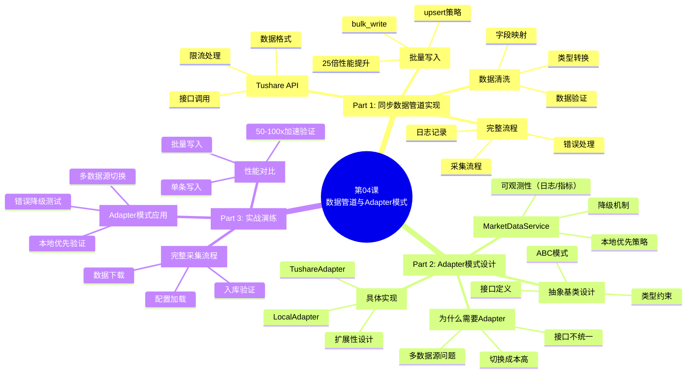
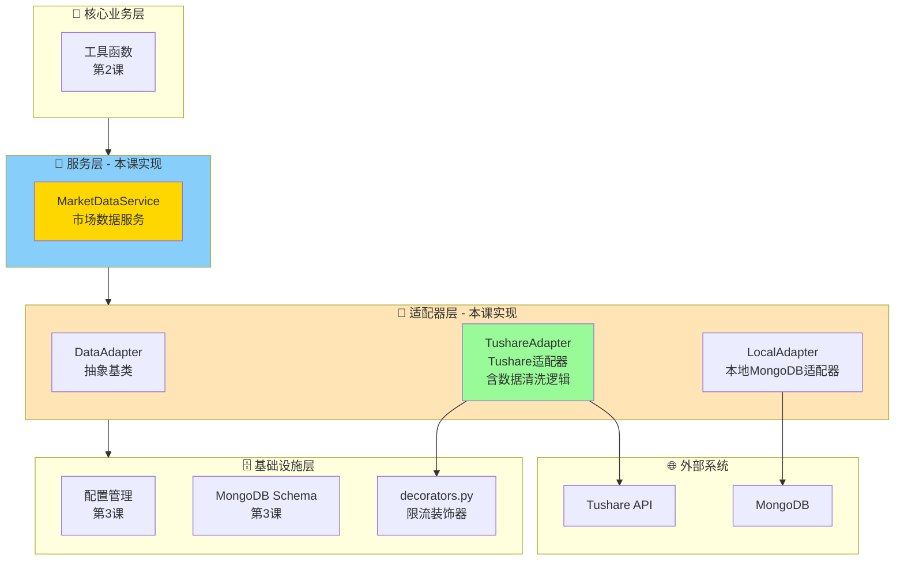
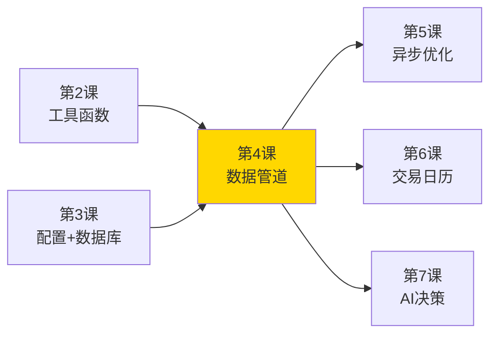
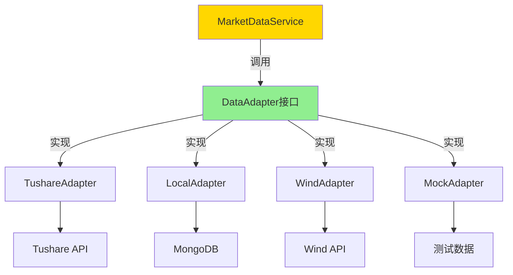
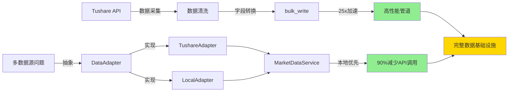

# 第04课:数据管道与Adapter模式 v3.0

> **课程版本**: v3.0
> **课时**: 90分钟
> **难度**: ⭐⭐⭐⭐
> **前置课程**: 第03课
> **后续课程**: 第05课
> **更新日期**: 2025-01-25

---

## 🗺️ 课程脑图



---

## 📐 本课在架构中的位置

> 根据第02课的**六边形架构设计**，本课实现了架构中的关键层次。

### 架构层次实现



### 本课实现的模块

| 架构层次       | 模块              | 文件路径                                   | 职责                           |
| -------------- | ----------------- | ------------------------------------------ | ------------------------------ |
| **服务层**     | MarketDataService | `src/cherryquant/services/market_data_service.py`          | 管理多适配器，实现本地优先策略 |
| **适配器层**   | DataAdapter       | `src/cherryquant/adapters/data_adapter/base.py`            | 定义统一数据源接口             |
|                | TushareAdapter    | `src/cherryquant/adapters/data_adapter/tushare_adapter.py` | 对接 Tushare HTTP API + 数据清洗转换 |
|                | LocalAdapter      | `src/cherryquant/adapters/data_adapter/local_adapter.py`   | 对接本地 MongoDB（读 + 可选 upsert） |
| **基础设施层** | decorators        | `src/cherryquant/utils/decorators.py`                      | 限流装饰器等通用工具           |

### 与其他课程的关系



**依赖关系**:

- ✅ 依赖第2课：使用 `date_to_int()` 等工具函数
- ✅ 依赖第3课：使用 Pydantic配置 和 MongoDB schema
- ✅ 为第5课铺垫：同步→异步的升级路径
- ✅ 为第6-9课提供：统一的数据获取接口

---

## 📋 课程概述

### 🎯 本课要解决的问题

在量化交易系统中，数据管道和数据源管理是核心基础设施：

**1. 数据采集的痛点**:

- ❌ 单条写入数据库，性能极差（1000条需要10秒+）
- ❌ 数据源接口直接耦合在业务代码中
- ❌ 缺乏统一的数据清洗流程
- ❌ 错误处理不完善，一个失败全部中断

**2. 数据源管理的痛点**:

- ❌ Tushare限流严格，频繁触发限制
- ❌ 多数据源切换困难（Tushare、Wind、本地）
- ❌ 无法实现"本地优先"策略降低API调用
- ❌ 数据源接口变更影响面大

**本课将提供**:

- ✅ 高性能同步数据管道（bulk_write实现25倍性能提升）
- ✅ Adapter设计模式统一多数据源接口
- ✅ 本地优先策略降低90%外部API调用
- ✅ 完整的错误处理和日志记录机制

---

### 🎓 学习目标

#### **Know（理解概念）**

- 理解数据管道的完整流程（采集→清洗→存储）
- 掌握Adapter设计模式的核心思想
- 理解bulk_write的性能优势
- 掌握"本地优先"策略的设计原理

#### **Do（实践技能）**

- 能够使用Tushare API获取金融数据
- 能够实现高性能批量数据写入（bulk_write + upsert）
- 能够使用ABC设计Adapter抽象接口
- 能够实现多数据源适配器（Tushare + Local）
- 能够构建完整的数据采集管道

#### **Be（职业素养）**

- 养成"性能优先"的数据处理思维
- 建立"接口抽象"的设计模式意识
- 培养"本地优先"的资源节约习惯

---

### 🗓️ 课程路线图

```mermaid
gantt
    title 第04课时间分配（90分钟）
    dateFormat HH:mm
    axisFormat %H:%M

    section Part 1
    同步数据管道实现       :p1, 00:00, 40m
    Tushare API基础       :00:00, 10m
    数据清洗流程          :00:10, 10m
    bulk_write批量写入    :00:20, 10m
    完整流程演示          :00:30, 10m

    section Part 2
    Adapter模式设计       :p2, 00:40, 25m
    为什么需要Adapter     :00:40, 5m
    抽象基类设计          :00:45, 8m
    具体实现              :00:53, 7m
    MarketDataService    :01:00, 5m

    section Part 3
    实战演练              :p3, 01:05, 25m
    完整数据采集流程      :01:05, 10m
    Adapter模式应用       :01:15, 8m
    性能对比测试          :01:23, 7m
```



---

### ✨ 本课特色

1. **真实生产案例**
   所有代码均来自CherryQuant生产环境验证

2. **性能数据驱动**
   每个优化都有具体性能测试数据（25-100倍提升）

3. **设计模式实战**
   Adapter模式在量化交易场景的实际应用

4. **可扩展架构**
   支持轻松添加新数据源（Wind、东方财富等）

---

## ✅ 课前检查清单

### 环境准备

- [ ] 完成第03课学习
- [ ] MongoDB已安装并运行
- [ ] Pydantic配置系统已实现
- [ ] 时间工具函数基础可用（`date_to_int` 等；交易日历相关 TODO 允许存在）

### 知识储备

- [ ] 理解抽象基类（ABC）
- [ ] 掌握Python类型注解
- [ ] 了解MongoDB批量操作
- [ ] 理解设计模式基本概念

### 账号准备

- [ ] 注册Tushare账号（<https://tushare.pro）>
- [ ] 获取Tushare API Token
- [ ] 积分≥120（支持日线数据）

### 工具准备

```bash
# 代码项目根目录：项目代码/CherryQuant/
#
# 本课示例不依赖 tushare-python/pandas：
# - TushareAdapter 使用 requests 直接调用 HTTP API（见 src/cherryquant/adapters/data_adapter/tushare_adapter.py）
# - 适配器返回 list[dict]，避免强依赖 DataFrame

# 安装依赖（若已完成第03课并执行过 uv sync，可跳过）
uv sync

# 或使用项目自带虚拟环境直接运行（推荐更稳定）
.venv/bin/python -c "import requests, pymongo; print('deps ok')"

# 可选：有网络与 Token 时再验证 Tushare 调用（否则会失败）
# .venv/bin/python -c "from cherryquant.adapters.data_adapter.tushare_adapter import TushareAdapter, TushareHttpConfig; import datetime as dt; a=TushareAdapter(TushareHttpConfig(token='your_token')); print(a.get_klines('IF2601.CFFEX', dt.datetime(2025,1,1), dt.datetime(2025,1,5)))"
```

---

## 🎯 学习进度追踪

### Part 1: 同步数据管道实现（40分钟）

- [ ] **1.1 Tushare API基础**
  - [ ] 理解Tushare数据接口
  - [ ] 掌握 fut_daily 日线接口调用
  - [ ] 理解Tushare限流机制

- [ ] **1.2 数据清洗流程**
  - [ ] 实现字段映射（trade_date → date）
  - [ ] 实现类型转换（str → int/float）
  - [ ] 实现date + datetime双字段生成
  - [ ] 统一frequency/interval字段（用于多周期存储）

- [ ] **1.3 bulk_write批量写入**
  - [ ] 理解bulk_write原理
  - [ ] 掌握UpdateOne + upsert策略
  - [ ] 测试25倍性能提升

- [ ] **1.4 完整流程演示**
  - [ ] 实现完整采集函数
  - [ ] 添加错误处理
  - [ ] 添加日志记录

### Part 2: Adapter模式设计（25分钟）

- [ ] **2.1 为什么需要Adapter**
  - [ ] 理解多数据源问题
  - [ ] 理解接口不统一问题
  - [ ] 理解Adapter模式价值

- [ ] **2.2 抽象基类设计**
  - [ ] 使用ABC定义抽象接口
  - [ ] 设计get_klines()方法签名
  - [ ] 定义返回类型（list[dict]）

- [ ] **2.3 具体适配器实现**
  - [ ] 实现TushareAdapter
  - [ ] 实现LocalAdapter
  - [ ] 理解扩展性设计

- [ ] **2.4 MarketDataService**
  - [ ] 实现本地优先策略
  - [ ] 实现降级机制
  - [ ] 完善日志与错误处理

### Part 3: 实战演练（25分钟）

- [ ] **3.1 完整数据采集流程**
  - [ ] 配置Tushare Token
  - [ ] 下载指定品种数据
  - [ ] 验证数据完整性

- [ ] **3.2 Adapter模式应用**
  - [ ] 测试多数据源切换
  - [ ] 验证本地优先策略
  - [ ] 测试错误降级

- [ ] **3.3 性能对比测试**
  - [ ] 测试单条写入性能
  - [ ] 测试批量写入性能
  - [ ] 验证50-100x加速

---

## Part 1: 同步数据管道实现（40分钟）

### 1.1 Tushare API基础（10分钟）

#### 什么是Tushare？

**Tushare** 是国内“最大的”（算是比较知名吧）金融数据开放平台：

- 提供股票、期货、基金等金融数据
- 免费提供日线级别数据（需积分）
- 专业版支持分钟级和实时数据

#### 核心接口：fut_daily() 期货日线数据

> **CherryQuant定位**：本课程专注于期货量化交易，使用Tushare期货接口。
>
> 接口文档：<https://tushare.pro/document/2?doc_id=135>

```python
# 文件位置: examples/lesson04/01_tushare_basic.py
#
# 说明：本仓库不依赖 tushare-python / pandas；下面直接用 requests 调用 Tushare HTTP API。
# 需要网络 + Token（建议写入用户级 ~/.config/cherryquant/config.toml 的 data_source.tushare.token）。

import requests

from cherryquant.config import get_settings

settings = get_settings()
token_obj = settings.data_source.tushare.token
if token_obj is None:
    raise RuntimeError("Missing Tushare token: set data_source.tushare.token in ~/.config/cherryquant/config.toml")
token = token_obj.get_secret_value()

payload = {
    "api_name": "fut_daily",
    "token": token,
    "params": {"ts_code": "IF2601.CFX", "start_date": "20250101", "end_date": "20250110"},
    "fields": "ts_code,trade_date,open,high,low,close,vol,amount,oi",
}

resp = requests.post("https://api.tushare.pro", json=payload, timeout=15).json()
print(resp["code"], resp.get("msg"))
print(resp["data"]["fields"])
print(resp["data"]["items"][:2])
```

**返回数据格式（HTTP 表结构）**：

```text
{
  "code": 0,
  "msg": "",
  "data": {
    "fields": ["ts_code","trade_date","open","high","low","close","vol","amount","oi"],
    "items": [
      ["IF2601.CFX","20250110",...,2515,338417.958,5101],
      ...
    ]
  }
}
```

**Tushare返回字段详解（常见字段，实际可通过 `fields` 自由选择）**：

> 本仓库当前 `TushareAdapter` 默认只请求核心字段：`ts_code,trade_date,open,high,low,close,vol,amount,oi`。  
> 如果你的策略/风控需要 `settle/pre_settle/oi_chg` 等扩展字段，可以在 `src/cherryquant/adapters/data_adapter/tushare_adapter.py` 中扩展 `fields` 与清洗逻辑。

| 字段         | 类型  | 说明                   | 存入KlineDocument        | 重要性     |
| ------------ | ----- | ---------------------- | ------------------------ | ---------- |
| `ts_code`    | str   | 合约代码（IF2601.CFX） | ✅ 拆分为symbol+exchange | ⭐⭐⭐⭐⭐ |
| `trade_date` | str   | 交易日期（YYYYMMDD）   | ✅ 转为date+datetime     | ⭐⭐⭐⭐⭐ |
| `open`       | float | 开盘价                 | ✅                       | ⭐⭐⭐⭐⭐ |
| `high`       | float | 最高价                 | ✅                       | ⭐⭐⭐⭐⭐ |
| `low`        | float | 最低价                 | ✅                       | ⭐⭐⭐⭐⭐ |
| `close`      | float | 收盘价                 | ✅                       | ⭐⭐⭐⭐⭐ |
| `settle`     | float | **结算价**             | ⚠️ 可选                  | ⭐⭐⭐⭐⭐ |
| `vol`        | float | 成交量（手）           | ✅ 转为volume(int)       | ⭐⭐⭐⭐⭐ |
| `amount`     | float | 成交额（万元）         | ✅ 转为turnover(元)      | ⭐⭐⭐⭐⭐ |
| `oi`         | float | **持仓量**（手）       | ⚠️ 可选                  | ⭐⭐⭐⭐   |
| `pre_settle` | float | **前结算价**           | ⚠️ 可选                  | ⭐⭐⭐⭐   |
| `pre_close`  | float | 前收盘价               | ⚠️ 可选                  | ⭐⭐⭐     |
| `oi_chg`     | float | 持仓量变化             | ⚠️ 可选                  | ⭐⭐⭐     |
| `change1`    | float | 涨跌1（收盘-前收盘）   | ❌ 可计算                | ⭐⭐       |
| `change2`    | float | 涨跌2（结算-前结算）   | ❌ 可计算                | ⭐⭐       |

> **字段说明图例**:
>
> - ✅ **必存**: 基础OHLC字段，存入KlineDocument
> - ⚠️ **可选**: 期货特有字段，可选择性存储（MongoDB支持）
> - ❌ **不存**: 计算字段，不存储（可实时计算）

---

**期货特有字段业务含义** (⭐⭐⭐⭐⭐ 重要)

**1. 结算价 (settle)**

- **定义**: 当日所有成交价的加权平均价
- **用途**:
  - 计算当日盈亏（以结算价为准，非收盘价）
  - 计算下一交易日保证金占用
  - 触发强平的价格基准
- **重要性**: ⭐⭐⭐⭐⭐ 风控核心指标
- **示例**: settle=4491.0 表示当日结算价为4491点

**2. 前结算价 (pre_settle)**

- **定义**: 上一交易日的结算价
- **用途**:
  - 计算涨跌幅基准（期货以结算价为准，非收盘价！）
  - 涨跌幅 = (settle - pre_settle) / pre_settle
  - 计算涨跌停板价格（±7%或±10%）
- **重要性**: ⭐⭐⭐⭐ 价格分析核心
- **示例**: pre_settle=4484.2，settle=4491.0，涨幅=(4491-4484.2)/4484.2=0.15%

**3. 持仓量 (oi, Open Interest)**

- **定义**: 市场上所有未平仓的合约总数（多空双方持仓之和）
- **用途**:
  - 衡量市场活跃度和流动性
  - 识别资金流向（oi增加=资金流入，oi减少=资金流出）
  - 量价持仓分析（VOI分析法）
- **重要性**: ⭐⭐⭐⭐ 市场微观结构分析
- **示例**: oi=5101 表示有5101手未平仓合约

**4. 持仓量变化 (oi_chg)**

- **定义**: 持仓量日环比变化（当日oi - 昨日oi）
- **用途**: 快速识别资金流入流出
- **重要性**: ⭐⭐⭐ 辅助分析
- **示例**: oi_chg=475 表示持仓量增加475手（资金流入）

---

**CherryQuant存储策略**:

```python
# 说明：示例中的 datetime 为 Python 对象；写入 MongoDB 后显示为 ISODate(UTC)
from datetime import datetime, timezone

# 基础策略（第03课标准）：OHLCV +（可选）期货字段
{
    'symbol': 'IF2601',
    'exchange': 'CFFEX',
    'interval': '1d',
    'date': 20250110,
    'datetime': datetime(2025, 1, 10, tzinfo=timezone.utc),  # MongoDB 存为 ISODate(UTC)
    'open': 4476.6,
    'high': 4500.2,
    'low': 4461.4,
    'close': 4490.6,
    'volume': 2515,
    'turnover': 3384179580.0,  # 338417.958 万元 × 10000
    'open_interest': 5101,      # Tushare 字段名通常为 oi（可选）
    'source': 'tushare'         # 可选：来源标记，便于排错/回溯
}

# 扩展示意：如果你在 Adapter 里额外请求并清洗 settle/pre_settle/oi_chg 等字段
{
    # ... 基础字段 ...
    'settle': 4491.0,       # 结算价（风控必需）
    'pre_settle': 4484.2,   # 前结算价（计算涨跌幅）
    'open_interest': 5101,  # 持仓量（市场分析）
    'oi_chg': 475,          # 持仓量变化
    'pre_close': 4477.0     # 前收盘价（可选）
}
```

**何时需要期货扩展字段？**

- ✅ **风控系统**: settle（计算盈亏）、pre_settle（涨跌幅）
- ✅ **量化策略**: oi（市场情绪）、oi_chg（资金流向）
- ✅ **高频交易**: 所有字段（微观结构分析）
- ❌ **简单策略**: 仅需OHLC即可

---

**交易所代码映射**:

- `CFX` → CFFEX（中国金融期货交易所）：股指期货IF、IC、IH等
- `SHF` → SHFE（上海期货交易所）：铜、铝、锌等
- `DCE` → DCE（大连商品交易所）：豆粕、玉米等
- `ZCE` → CZCE（郑州商品交易所）：白糖、棉花等
- `INE` → INE（上海国际能源交易中心）：原油等

#### Tushare限流机制

**积分对应权限**:

| 积分 | 调用频率   | 数据权限 |
| ---- | ---------- | -------- |
| 120  | 50次/分钟  | 日线数据 |
| 2000 | 200次/分钟 | 分钟数据 |
| 5000 | 500次/分钟 | 实时数据 |

**限流处理策略**:

```python
# 文件位置: src/cherryquant/utils/decorators.py
from cherryquant.utils.decorators import rate_limit

# 每 60 秒最多 200 次（示例）
@rate_limit(calls=200, period_s=60)
def fetch_remote():
    ...
```

---

### 1.2 Adapter内部：数据清洗逻辑（10分钟）

> **架构说明**：数据清洗是 `TushareAdapter` 的**内部实现细节**，负责将 Tushare 原始格式转换为 CherryQuant 标准格式。

#### 为什么需要数据清洗？

**Tushare数据 vs CherryQuant数据库**:

| 字段   | Tushare格式          | CherryQuant格式                    | 转换逻辑         |
| ------ | -------------------- | ---------------------------------- | ---------------- |
| 代码   | ts_code (IF2601.CFX) | symbol (IF2601) + exchange (CFFEX) | 拆分代码和交易所 |
| 日期   | trade_date (str)     | date (int) + datetime (ISODate)    | 查询语义清晰     |
| 价格   | float                | float                              | 一致             |
| 成交量 | vol (手)             | volume (手)                        | 期货单位一致     |
| 成交额 | amount (万元)        | turnover (元)                      | 万元 × 10000     |

#### TushareAdapter 内部清洗方法

本仓库实现采用 **requests 直连 Tushare HTTP API**（避免依赖 `tushare-python` / `pandas`），并把返回的表结构转换为第03课统一的 K 线文档（`list[dict]`）：

- 代码实现：`src/cherryquant/adapters/data_adapter/tushare_adapter.py`
- ts_code 生成：`src/cherryquant/utils/symbol_utils.py`（复用第02课 `futures_config.toml` 的 `tushare_suffix`）

```python
import datetime as dt

from cherryquant.adapters.data_adapter.tushare_adapter import TushareAdapter, TushareHttpConfig

adapter = TushareAdapter(TushareHttpConfig(token="your_token"))
records = adapter.get_klines("IF2601.CFFEX", dt.datetime(2025, 1, 1), dt.datetime(2025, 1, 5), frequency="1d")

# records: list[dict]，每条记录都包含 interval/date/datetime，并可直接用于 bulk_write + upsert 落库
```

**清洗前后对比**:

```python
from datetime import datetime, timezone

# 清洗前（Tushare 原始字段；本仓库默认只请求核心字段）
{
    "ts_code": "IF2601.CFX",
    "trade_date": "20250110",
    "open": 4476.6,
    "high": 4500.2,
    "low": 4461.4,
    "close": 4490.6,
    "vol": 2515.0,
    "amount": 338417.958,  # 万元
    "oi": 5101.0,
}

# 清洗后（本仓库 TushareAdapter 的实际输出：list[dict]）
{
    "symbol": "IF2601",
    "exchange": "CFFEX",
    "interval": "1d",
    "date": 20250110,
    "datetime": datetime(2025, 1, 10, tzinfo=timezone.utc),  # MongoDB 存为 ISODate(UTC)
    "open": 4476.6,
    "high": 4500.2,
    "low": 4461.4,
    "close": 4490.6,
    "volume": 2515,
    "turnover": 3384179580.0,  # 338417.958 万元 × 10000
    "open_interest": 5101,
    "source": "tushare",
}
```

---

### 1.3 bulk_write批量写入（10分钟）

> [!TIP]
> 与第03课对齐：落库建议统一使用 `interval` 字段（来自 `get_klines(..., frequency=...)` 参数），并将 upsert 的“逻辑主键”升级为 `(symbol, interval, datetime)`；仅做日线（`frequency="1d"`）时，入门版 `(symbol, date)` 也可以工作。

#### 单条写入 vs 批量写入

**单条写入（性能差）**:

```python
# ❌ 不推荐：每次写入都是一次网络往返
for record in records:
    db.klines.update_one(
        {'symbol': record['symbol'], 'interval': record['interval'], 'datetime': record['datetime']},
        {'$set': record},
        upsert=True
    )
```

**批量写入（性能优）**:

```python
# ✅ 推荐：一次性发送所有操作
from pymongo import UpdateOne

operations = []
for record in records:
    operations.append(
        UpdateOne(
            {'symbol': record['symbol'], 'interval': record['interval'], 'datetime': record['datetime']},
            {'$set': record},
            upsert=True
        )
    )

# 推荐：数据采集场景通常使用 ordered=False（遇到单条错误不会中断整批写入）
result = db.klines.bulk_write(operations, ordered=False)
```

#### bulk_write参数详解

**核心参数**:

```python
db.klines.bulk_write(
    operations,           # 操作列表
    ordered=False        # 无序执行（理论上更快）
)
```

**ordered参数对比**:

| 参数          | 行为               | 性能 | 适用场景         |
| ------------- | ------------------ | ---- | ---------------- |
| ordered=True  | 顺序执行，遇错停止 | 较慢 | 严格顺序要求     |
| ordered=False | 并行执行，全部尝试 | 更快 | 数据采集（推荐） |

**返回结果**:

```python
result = db.klines.bulk_write(operations, ordered=False)

print(f"插入: {result.inserted_count}")
print(f"更新: {result.modified_count}")
print(f"匹配: {result.matched_count}")
print(f"upsert: {result.upserted_count}")
```

#### upsert策略详解

**什么是upsert？**

- **Update + Insert** 的组合
- 存在则更新，不存在则插入
- 适合数据更新场景

**为什么用upsert？**

```python
# 场景1：首次采集
# symbol='IF2601', interval='1d', datetime=... 不存在
# → 插入新记录

# 场景2：数据修正
# symbol='IF2601', interval='1d', datetime=... 已存在
# → 更新现有记录（Tushare可能修正历史数据）

# 场景3：增量更新
# 每日只需采集最新数据，历史数据自动跳过更新
```

#### 逻辑主键与索引（与第03课一致）

当你开始采集分钟K/多周期时，必须保证“同一标的同一周期同一根K线不会重复写入”，否则会出现覆盖/去重冲突：

```python
# 逻辑主键：用于 upsert 去重（强烈建议唯一索引）
db.klines.create_index(
    [('symbol', 1), ('interval', 1), ('datetime', 1)],
    unique=True,
    name='uniq_symbol_interval_datetime'
)

# 常用读取：按交易日取数据
db.klines.create_index(
    [('symbol', 1), ('interval', 1), ('date', 1)],
    name='idx_symbol_interval_date'
)
```

#### 迁移：从 (symbol, date) 升级到 (symbol, interval, datetime)

如果你已经按入门版落库（只用 `symbol+date`），升级路径建议如下：
1. 先确定你系统里 `datetime` 的语义（bar close 或 bar start，全库统一）。
2. 为历史数据补齐 `interval`（日线通常为 `1d`）并保证每条记录都有 `datetime`。
3. 创建唯一索引 `uniq_symbol_interval_datetime`（必要时先清理重复数据）。
4. 将所有 upsert 的过滤条件改为 `{'symbol','interval','datetime'}`，并在读取侧按 `interval` 过滤。

---

### 1.4 完整流程演示（10分钟）

> **💡 设计说明**：虽然这是"基础示例"，但我们从一开始就使用 `TushareAdapter`，而不是直接调用 Tushare API。这体现了**最佳实践应从第一行代码开始**的理念。即使是简单的脚本，良好的架构设计也能让代码更易维护和扩展。Part 2 将进一步展示 Adapter 模式的威力。

#### 完整数据管道示例

> **重要说明**：本节演示基础数据管道流程，为后续Part 2的Adapter模式做铺垫。
>
> **Part 1的问题**：
>
> - ❌ 直接调用Tushare API，耦合严重
> - ❌ 数据获取和保存混在一起，职责不清
> - ❌ 无法灵活切换数据源
>
> **Part 2的解决方案**：使用Adapter模式实现解耦和可扩展性

```python
# 文件位置: examples/lesson04/01_basic_data_pipeline.py

"""
基础数据管道演示：Tushare期货完整数据管道示例（同步版本）

流程：
1. 使用TushareAdapter获取并清洗数据
2. 批量写入MongoDB（使用bulk_write）

说明：这是简化版本，Part 2将用完整的Adapter模式改进

> **⚠️ 前置要求**：
> 运行本示例前，请确保项目根目录下已创建 `config/futures_config.toml` 配置文件（参考第02课）。
> `to_tushare_ts_code` 依赖该配置文件（用于推断交易所后缀）。
"""

import logging
import datetime as dt

from cherryquant.adapters.data_adapter.local_adapter import LocalMongoAdapter, MongoKlinesConfig
from cherryquant.adapters.data_adapter.tushare_adapter import TushareAdapter, TushareHttpConfig
from cherryquant.config import get_settings

logger = logging.getLogger(__name__)

# ============================================================
# 步骤1：初始化
# ============================================================

logging.basicConfig(level=logging.INFO, format="%(asctime)s %(levelname)s %(message)s")

# 加载配置（单一 config.toml：用户级 > 项目级 > 默认；无隐式覆盖）
settings = get_settings()
token_obj = settings.data_source.tushare.token
if token_obj is None:
    raise RuntimeError("Missing Tushare token: set data_source.tushare.token in ~/.config/cherryquant/config.toml")

# 创建适配器（远端：Tushare；本地：MongoDB）
tushare_adapter = TushareAdapter(TushareHttpConfig(token=token_obj.get_secret_value()))
local_adapter = LocalMongoAdapter(MongoKlinesConfig(mongo_uri=settings.mongo.uri, db=settings.mongo.db))
local_adapter.ensure_indexes()

# ============================================================
# 步骤2：获取数据（Adapter内部已完成清洗）
# ============================================================

symbol = "IF2601"  # 内部统一代码；Adapter 内部会转换为 Tushare ts_code（如 IF2601.CFX）
start_date = dt.datetime(2025, 1, 1)
end_date = dt.datetime(2025, 1, 10)

logger.info(f"Fetching {symbol} from {start_date} to {end_date}")

frequency = "1d"
records = tushare_adapter.get_klines(symbol, start_date, end_date, frequency=frequency)
if not records:
    logger.warning(f"No data for {symbol}")
    exit(1)

logger.info(f"✅ Fetched and cleaned {len(records)} records")

# ============================================================
# 步骤3：批量写入MongoDB
# ============================================================

saved_count = local_adapter.upsert_klines(records, ordered=False)
logger.info(f"✅ Saved {saved_count} records to MongoDB")

print(f"""
数据管道执行完成：
  获取+清洗: {len(records)} 条数据（Adapter内部完成）
  保存: {saved_count} 条记录

下一步：Part 2将学习如何用Adapter模式改进这个流程
""")

local_adapter.close()
```

#### 批量采集多个合约

```python
# 文件位置: examples/lesson04/02_batch_collection.py

"""批量采集多个期货合约"""

import time
import datetime as dt

from cherryquant.adapters.data_adapter.local_adapter import LocalMongoAdapter, MongoKlinesConfig
from cherryquant.adapters.data_adapter.tushare_adapter import TushareAdapter, TushareHttpConfig
from cherryquant.config import get_settings

# 初始化（单一 config.toml；无隐式覆盖）
settings = get_settings()
token_obj = settings.data_source.tushare.token
if token_obj is None:
    raise RuntimeError("Missing Tushare token: set data_source.tushare.token in ~/.config/cherryquant/config.toml")

tushare_adapter = TushareAdapter(TushareHttpConfig(token=token_obj.get_secret_value()))
local_adapter = LocalMongoAdapter(MongoKlinesConfig(mongo_uri=settings.mongo.uri, db=settings.mongo.db))
local_adapter.ensure_indexes()

symbols = [
    'IF2601',  # 沪深300股指期货
    'IC2601',  # 中证500股指期货
    'IH2601',  # 上证50股指期货
]

start_date = dt.datetime(2025, 1, 1)
end_date = dt.datetime(2025, 1, 10)

for symbol in symbols:
    print(f"\n{'='*60}")
    print(f"采集 {symbol}")
    print(f"{'='*60}")

    # 使用 Adapter 获取数据
    frequency = "1d"
    records = tushare_adapter.get_klines(symbol, start_date, end_date, frequency=frequency)
    if records:
        saved = local_adapter.upsert_klines(records, ordered=False)
        print(f"✅ {symbol}: {saved} 条记录已保存（records={len(records)}）")
    else:
        print(f"❌ {symbol}: 无数据")

    # 限流：避免超过Tushare 200次/分钟
    time.sleep(0.3)

print("\n批量采集完成！")
local_adapter.close()
```

#### 本节要点总结

**流程回顾**：

1. ✅ Tushare API调用 → 获取原始数据
2. ✅ 数据清洗 → 标准化格式
3. ✅ bulk_write → 高性能批量写入

**存在的问题**（为Part 2铺垫）：

- ❌ **硬编码依赖Tushare**：无法切换到Wind、掘金等数据源
- ❌ **职责混乱**：数据获取、清洗、保存混在一起
- ❌ **难以测试**：需要真实Tushare API才能运行
- ❌ **无法实现本地优先**：不能优先从本地数据库读取

**Part 2预告**：

- ✅ 使用**Adapter模式**统一数据源接口
- ✅ 实现**本地优先策略**（优先本地，失败降级API）
- ✅ **可测试性**：使用MockAdapter进行单元测试
- ✅ **可扩展性**：轻松添加新数据源

---

## Part 2: Adapter模式设计（25分钟）

### 2.1 为什么需要Adapter？（5分钟）

#### 问题场景

**场景1：多数据源切换困难**

```python
# ❌ 反模式：直接调用数据源
if source == 'tushare':
    df = pro.fut_daily(ts_code, start_date, end_date)
elif source == 'wind':
    df = w.wsd(symbol, fields, start_date, end_date)
elif source == 'local':
    df = db.klines.find({'symbol': symbol, ...})

# 问题：
# 1. 每个数据源接口不同
# 2. 切换数据源需要修改大量代码
# 3. 新增数据源影响所有调用处
```

**场景2：无法实现"本地优先"**

```python
# 需求：优先从本地数据库获取，不存在再调用API
# 问题：如何统一接口？
# 问题：如何透明切换？
```

**场景3：测试困难**

```python
# 单元测试时不想真实调用Tushare API
# 需要Mock数据源，但接口耦合严重
```

#### Adapter模式解决方案

**核心思想**: 定义统一接口，适配不同数据源



**优势**:

- ✅ 统一接口，调用方无需关心数据源
- ✅ 轻松添加新数据源（实现接口即可）
- ✅ 支持"本地优先"策略
- ✅ 单元测试友好（使用MockAdapter）

---

### 2.2 抽象基类设计（8分钟）

#### 定义抽象接口

```python
# 文件位置: src/cherryquant/adapters/data_adapter/base.py

from abc import ABC, abstractmethod
from datetime import datetime
from typing import Any

KlineRecord = dict[str, Any]

class DataAdapter(ABC):
    """数据适配器抽象基类"""

    @abstractmethod
    def get_klines(
        self,
        symbol: str,
        start_date: datetime,
        end_date: datetime,
        frequency: str = '1d'
    ) -> list[KlineRecord]:
        """
        获取K线数据

        Args:
            symbol: 品种代码（统一格式，如'IF2601'）
            start_date: 开始日期
            end_date: 结束日期
            frequency: 频率（'1d', '1h', '5m'等）

        Returns:
            list[dict]：本课统一返回结构（与第03课数据库设计一致），单条记录包含：
            - symbol: str
            - exchange: str | None
            - interval: str（同 frequency，用于多周期存储）
            - date: int（YYYYMMDD，逻辑交易日）
            - datetime: datetime（UTC aware，MongoDB 存为 ISODate）
            - open/high/low/close: float
            - volume: int | float
            - turnover: float | None
            - open_interest: int | None
        """
        pass

    @abstractmethod
    def get_name(self) -> str:
        """返回适配器名称（用于日志）"""
        pass
```

**设计要点**:

1. **使用ABC强制实现**:

   ```python
   class MyAdapter(DataAdapter):
       # 忘记实现get_klines()
       def get_name(self):
           return "My"

   # 实例化时报错
   adapter = MyAdapter()  # TypeError: Can't instantiate abstract class
   ```

2. **统一返回格式**:
   - 所有适配器返回相同结构的 `list[dict]`
   - 调用方无需关心数据源差异

3. **统一symbol格式**:
   - 内部使用统一格式（如'IF2601'）
   - 适配器负责转换（'IF2601' ↔ 'IF2601.CFX'）

---

### 2.3 具体适配器实现（7分钟）

#### TushareAdapter实现

```python
# 文件位置: src/cherryquant/adapters/data_adapter/tushare_adapter.py

import datetime as dt

from cherryquant.adapters.data_adapter.tushare_adapter import TushareAdapter, TushareHttpConfig

# 本仓库实现使用 requests 直连 Tushare HTTP API，并返回 list[dict]（不依赖 tushare-python / pandas）
adapter = TushareAdapter(TushareHttpConfig(token="your_token"))
records = adapter.get_klines("IF2601.CFFEX", dt.datetime(2025, 1, 1), dt.datetime(2025, 1, 31), frequency="1d")
```

**Symbol 转换示例**：

```python
from cherryquant.utils.symbol_utils import to_tushare_ts_code

print(to_tushare_ts_code("IF2601"))        # -> IF2601.CFX（自动推断交易所）
print(to_tushare_ts_code("IF2601.CFFEX"))  # -> IF2601.CFX（显式交易所）
print(to_tushare_ts_code("rb2601.SHFE"))   # -> rb2601.SHF (螺纹钢)
print(to_tushare_ts_code("SR601.CZCE"))    # -> SR601.ZCE (白糖)
print(to_tushare_ts_code("sc2601.INE"))    # -> sc2601.INE (原油)
```

#### LocalAdapter实现

```python
# 文件位置: src/cherryquant/adapters/data_adapter/local_adapter.py

from cherryquant.adapters.data_adapter.local_adapter import LocalMongoAdapter, MongoKlinesConfig

# LocalMongoAdapter：读 +（可选）upsert；并提供 ensure_indexes() 帮你创建第03课推荐索引
local_adapter = LocalMongoAdapter(
    MongoKlinesConfig(mongo_uri=settings.mongo.uri, db=settings.mongo.db, collection="klines")
)
local_adapter.ensure_indexes()

# 读取本地（返回 list[dict]；按 datetime 升序）
records = local_adapter.get_klines("IF2601", start_date, end_date, frequency="1d")

# 落库（bulk_write + upsert；返回写入/更新条数）
# saved = local_adapter.upsert_klines(remote_records, ordered=False)
```

> 兼容说明：代码中提供 `LocalAdapter = LocalMongoAdapter` 的别名，便于课程材料使用。

### 2.4 可选扩展：合约元数据（阅读）

为了支持“全市场遍历 / 自动发现新合约”，你通常还需要一张**合约元数据表**（合约代码、上市/退市日期、乘数、交易所等）。

本仓库当前主线做法是复用第02课的 `config/futures_config.toml`（可用 `scripts/update_futures_config.py` 更新/补全品种信息）。  
如果你希望从 Tushare 拉取合约元数据，可扩展 `TushareAdapter` 增加 `fetch_contract_list()`（HTTP API：`fut_basic`），并把结果落到 Mongo 的 `contracts` 集合：

- 唯一索引：`ts_code`
- 常用过滤索引：`exchange`、`symbol`、`list_date`、`delist_date`

---

### 2.5 服务层实现（10分钟）

#### MarketDataService设计

服务层 (`Service Layer`) 负责编排业务逻辑。`MarketDataService` 的核心职责是：

- 管理多个适配器
- 实现"本地优先"策略
- 提供降级机制

**实现代码**:

```python
# 文件位置: src/cherryquant/services/market_data_service.py

from __future__ import annotations

from datetime import datetime
from typing import Iterable

from cherryquant.adapters.data_adapter.base import DataAdapter, KlineRecord


class MarketDataService:
    """
    Orchestrate multiple adapters (local-first, fallback to remote).

    The service tries adapters in order; the first adapter that returns non-empty data wins.
    """

    def __init__(self, adapters: Iterable[DataAdapter]) -> None:
        self._adapters = list(adapters)
        if not self._adapters:
            raise ValueError("MarketDataService requires at least one adapter")

    def get_klines(
        self,
        symbol: str,
        start_date: datetime,
        end_date: datetime,
        frequency: str = "1d",
    ) -> list[KlineRecord]:
        last_exc: Exception | None = None
        for adapter in self._adapters:
            try:
                records = adapter.get_klines(symbol, start_date, end_date, frequency=frequency)
                if records:
                    return records
            except Exception as exc:  # noqa: BLE001
                last_exc = exc
                continue
        if last_exc is not None:
            raise last_exc
        return []
```

#### 使用示例

```python
# 文件位置: examples/lesson04/03_market_data_service_usage.py

import datetime as dt

from cherryquant.adapters.data_adapter.local_adapter import LocalMongoAdapter, MongoKlinesConfig
from cherryquant.adapters.data_adapter.tushare_adapter import TushareAdapter, TushareHttpConfig
from cherryquant.config import get_settings
from cherryquant.services.market_data_service import MarketDataService

# 1. 加载配置
settings = get_settings()
token_obj = settings.data_source.tushare.token
if token_obj is None:
    raise RuntimeError("Missing Tushare token: set data_source.tushare.token in ~/.config/cherryquant/config.toml")

# 2. 创建适配器
local_adapter = LocalMongoAdapter(MongoKlinesConfig(mongo_uri=settings.mongo.uri, db=settings.mongo.db))
tushare_adapter = TushareAdapter(TushareHttpConfig(token=token_obj.get_secret_value()))

# 3. 创建服务（本地优先）
service = MarketDataService([
    local_adapter,    # 优先级1：本地
    tushare_adapter   # 优先级2：Tushare
])

# 3. 获取数据（自动降级）
records = service.get_klines(
    symbol="IF2601",
    start_date=dt.datetime(2025, 1, 1),
    end_date=dt.datetime(2025, 1, 10),
    frequency="1d",
)

# 执行流程：
# 1. 尝试LocalAdapter → 找到数据 → 返回（节省API调用）
# 2. 如果本地没有 → 尝试TushareAdapter → 返回
# 3. 如果全部无数据 → 返回 []
```

**降低API调用统计**:

```python
# 场景：查询100个品种×30天数据
#
# 无本地优先：
# Tushare API调用: 100次
#
# 有本地优先（假设80%数据已存在）：
# LocalAdapter命中: 80次
# Tushare API调用: 20次
#
# API调用减少：80%！
```

### 2.6 扩展阅读：交易日历（留作后续）

第02课在 `src/cherryquant/utils/date_utils.py` 中保留了交易日相关 TODO（`is_trade_date/get_trade_dates/get_trade_calendar/...`）。  
本课主线聚焦“行情 K 线采集 → 清洗 → 落库 + Adapter/Service 解耦”，因此**暂不在项目代码中实现 `trade_cal`**，避免课程跨度过大。

如果你希望补齐交易日历，推荐的工程化路线（与本课 Adapter/Service 风格一致）：

1. 扩展远端适配器：在 `TushareAdapter` 增加 `get_trade_calendar(...)`（HTTP API：`trade_cal`），返回 `list[dict]`
2. 新增本地缓存适配器：`LocalTradeCalendarAdapter`（Mongo 集合 `trade_calendar`，唯一索引建议 `(exchange, date)`）
3. 在 Service 层暴露 `is_trade_date/get_trade_dates` 等高层函数，并采取“本地优先”策略

---

## Part 3: 实战演练（25分钟）

### 3.1 完整数据采集流程（10分钟）

#### 任务目标

- 使用Tushare适配器采集指定品种数据
- 验证数据完整性
- 查看日志输出

#### 实现步骤

**步骤1：配置Tushare Token**

```bash
# 用户级配置（推荐；包含 token/key 等敏感信息时不要提交到仓库）
mkdir -p ~/.config/cherryquant
cp config/config.toml ~/.config/cherryquant/config.toml

# 然后编辑 ~/.config/cherryquant/config.toml，填写：
# [data_source.tushare]
# token = "your_tushare_token"
```

**步骤2：运行采集示例（写入 MongoDB）**

```bash
# 单合约采集 + 落库
.venv/bin/python examples/lesson04/01_basic_data_pipeline.py

# 批量采集多个合约 + 落库
.venv/bin/python examples/lesson04/02_batch_collection.py
```

**步骤3：验证数据**

```python
from pymongo import MongoClient
from cherryquant.config import get_settings

settings = get_settings()
client = MongoClient(settings.mongo.uri)
db = client[settings.mongo.db]

# 检查数据量
count = db.klines.count_documents({"symbol": "IF2601", "interval": "1d"})
print(f"Total records: {count}")

# 检查日期范围
pipeline = [
    {"$match": {"symbol": "IF2601", "interval": "1d"}},
    {"$group": {"_id": None, "min_date": {"$min": "$date"}, "max_date": {"$max": "$date"}}},
]
result = list(db.klines.aggregate(pipeline))
print(f"Date range: {result}")
```

---

### 3.2 Adapter模式应用（8分钟）

#### 任务目标

- 测试多数据源切换
- 验证本地优先策略
- 测试错误降级

#### 测试用例

本仓库已提供对应单元测试（不依赖真实网络请求）：

- 多数据源编排/降级：`tests/test_adapters/test_market_data_service.py`
- Tushare HTTP 适配器（mock requests）：`tests/test_adapters/test_tushare_adapter.py`
- 合约代码 → ts_code 转换：`tests/test_adapters/test_symbol_utils.py`

运行方式（在 `项目代码/CherryQuant/` 下）：

```bash
.venv/bin/python -m pytest -q tests/test_adapters
```

---

### 3.3 性能对比测试（7分钟）

#### 任务目标

- 测试单条写入 vs 批量写入性能
- 验证50-100x加速效果
- 分析性能瓶颈

#### 性能测试脚本

本仓库提供了可运行脚本：`scripts/benchmark_write_performance.py`（不依赖 pandas；需要本地 MongoDB）。

运行方式（在 `项目代码/CherryQuant/` 下）：

```bash
.venv/bin/python scripts/benchmark_write_performance.py
```

**性能分析**:

```python
"""
性能瓶颈分析：

单条写入慢的原因：
1. 每次写入都是一次网络往返（RTT）
2. MongoDB需要为每次写入执行完整流程
3. 无法批量优化索引更新

批量写入快的原因：
1. 一次网络往返发送所有操作
2. MongoDB批量处理，减少开销
3. 批量更新索引

实际生产建议：
- 数据采集：批量写入（bulk_write）
- 实时交易：根据延迟要求选择
- 批量大小：500-1000条最佳
"""
```

---

## 📚 附录 A：历史版本代码（已隐藏）

> 本附录保留了早期课堂手写版本（tushare-python/pandas/DataFrame）以便对照；**当前仓库 v3.0 已切换为 `requests` + `list[dict]`**。  
> 请以仓库源码为准：
>
> - `src/cherryquant/adapters/data_adapter/base.py`
> - `src/cherryquant/adapters/data_adapter/tushare_adapter.py`
> - `src/cherryquant/adapters/data_adapter/local_adapter.py`
> - `src/cherryquant/services/market_data_service.py`
> - `src/cherryquant/utils/decorators.py`
> - `src/cherryquant/utils/symbol_utils.py`

<!--

### A.1 数据适配器完整代码

```python
# 文件位置: src/cherryquant/adapters/data_adapter/__init__.py

"""
数据适配器模块 - 统一不同数据源的接口

提供：
- DataAdapter: 抽象基类
- TushareAdapter: Tushare数据适配器
- LocalAdapter: 本地MongoDB适配器
"""

from abc import ABC, abstractmethod
from datetime import datetime
import logging
import time
from functools import wraps

import pandas as pd
import tushare as ts
from pymongo import MongoClient

from cherryquant.utils.date_utils import date_to_int
from cherryquant.utils.contract_utils import to_tushare_symbol

logger = logging.getLogger(__name__)


# ============================================================
# 限流装饰器
# ============================================================

def rate_limit(calls_per_minute=200):
    """Tushare限流装饰器"""
    interval = 60.0 / calls_per_minute
    last_called = [0.0]

    def decorator(func):
        @wraps(func)
        def wrapper(*args, **kwargs):
            elapsed = time.time() - last_called[0]
            if elapsed < interval:
                time.sleep(interval - elapsed)
            result = func(*args, **kwargs)
            last_called[0] = time.time()
            return result
        return wrapper
    return decorator


# ============================================================
# 抽象基类
# ============================================================

class DataAdapter(ABC):
    """数据适配器抽象基类"""

    @abstractmethod
    def get_klines(
        self,
        symbol: str,
        start_date: datetime,
        end_date: datetime,
        frequency: str = '1d'
    ) -> pd.DataFrame | None:
        """
        获取K线数据

        Args:
            symbol: 品种代码（统一格式，如'IF2601'）
            start_date: 开始日期
            end_date: 结束日期
            frequency: 频率（'1d', '1h', '5m'等）

        Returns:
            DataFrame，包含以下字段：
            - symbol: str
            - date: int (YYYYMMDD)
            - datetime: datetime (UTC aware datetime，MongoDB存为ISODate)
            - open/high/low/close: float
            - volume: int
            - turnover: float

            返回None表示数据不存在或错误
        """
        pass

    @abstractmethod
    def get_name(self) -> str:
        """返回适配器名称（用于日志）"""
        pass


# ============================================================
# Tushare适配器
# ============================================================

class TushareAdapter(DataAdapter):
    """Tushare数据适配器"""

    # 交易所代码映射
    EXCHANGE_MAP = {
        'CFFEX': 'CFX',  # 中国金融期货交易所
        'SHFE': 'SHF',   # 上海期货交易所
        'DCE': 'DCE',    # 大连商品交易所
        'CZCE': 'ZCE',   # 郑州商品交易所
        'INE': 'INE'     # 上海国际能源交易中心
    }

    def __init__(self, token: str):
        """初始化"""
        ts.set_token(token)
        self.pro = ts.pro_api()

    @rate_limit(calls_per_minute=200)
    def get_klines(
        self,
        symbol: str,
        start_date: datetime,
        end_date: datetime,
        frequency: str = '1d'
    ) -> pd.DataFrame | None:
        """获取K线数据"""
        try:
            # 1. 转换参数
            ts_code = to_tushare_symbol(symbol)
            start_str = start_date.strftime('%Y%m%d')
            end_str = end_date.strftime('%Y%m%d')

            # 2. 调用API（期货数据）
            df = self.pro.fut_daily(
                ts_code=ts_code,
                start_date=start_str,
                end_date=end_str
            )

            if df is None or df.empty:
                return None

            # 3. 清洗数据
            records = self._clean_futures_data(df, include_extended=True)

            # 4. 转为DataFrame
            return pd.DataFrame(records)

        except Exception as e:
            logger.error(f"TushareAdapter error: {symbol}, {e}")
            return None

    def fetch_contract_list(self, fut_type: str = '1') -> list[dict[str, Any]]:
        """获取所有期货合约列表"""
        try:
            df = self.pro.fut_basic(
                exchange='',
                fut_type=fut_type,
                fields='ts_code,symbol,name,exchange,list_date,delist_date,multiplier'
            )

            if df is None or df.empty:
                return []

            return df.to_dict('records')
        except Exception as e:
            logger.error(f"Failed to fetch contract list: {e}")
            return []

    def _clean_futures_data(self, df: pd.DataFrame, include_extended: bool = True) -> list[dict[str, Any]]:
        """清洗Tushare期货数据（私有方法）"""
        if df.empty:
            return []

        data = df.copy()

        # 交易所代码映射
        EXCHANGE_MAP = {'CFX': 'CFFEX', 'SHF': 'SHFE', 'DCE': 'DCE', 'ZCE': 'CZCE', 'INE': 'INE'}

        # 解析ts_code
        split_codes = data['ts_code'].str.split('.', expand=True)
        data['symbol'] = split_codes[0]
        data['exchange'] = split_codes[1].map(EXCHANGE_MAP).fillna(split_codes[1])

        # 转换日期和金额
        data['date'] = data['trade_date'].astype(int)
        data['datetime'] = pd.to_datetime(data['trade_date'], format='%Y%m%d')
        data['turnover'] = data['amount'] * 10000

        # 选择字段
        base_fields = ['symbol', 'exchange', 'date', 'datetime', 'open', 'high', 'low', 'close', 'volume', 'turnover']
        if include_extended:
            extended_fields = ['settle', 'pre_settle', 'pre_close', 'oi', 'oi_chg']
            all_fields = base_fields + [f for f in extended_fields if f in data.columns]
        else:
            all_fields = base_fields

        return data[all_fields].to_dict('records')


    def get_name(self) -> str:
        return "Tushare"


# ============================================================
# 本地数据库适配器
# ============================================================

class LocalAdapter(DataAdapter):
    """本地MongoDB数据适配器"""

    def __init__(self, mongo_uri: str):
        """初始化"""
        self.client = MongoClient(mongo_uri)
        self.db = self.client.cherryquant

    def get_klines(
        self,
        symbol: str,
        start_date: datetime,
        end_date: datetime,
        frequency: str = '1d'
    ) -> pd.DataFrame | None:
        """从本地数据库获取K线"""
        try:
            # 1. 转换日期
            start_int = date_to_int(start_date)
            end_int = date_to_int(end_date)

            # 2. 查询数据库
            cursor = self.db.klines.find(
                {
                    'symbol': symbol,
                    'date': {'$gte': start_int, '$lte': end_int}
                },
                {'_id': 0}  # 不返回_id字段
            ).sort('datetime', 1)

            # 3. 转为DataFrame
            records = list(cursor)
            if not records:
                return None

            return pd.DataFrame(records)

        except Exception as e:
            logger.error(f"LocalAdapter error: {symbol}, {e}")
            return None

    def get_name(self) -> str:
        return "Local"


# ============================================================
# 导出接口
# ============================================================

__all__ = ['DataAdapter', 'TushareAdapter', 'LocalAdapter', 'rate_limit']
```

### A.2 MarketDataService完整代码

```python
# 文件位置: src/cherryquant/services/market_data_service.py

"""
市场数据服务 - 管理多数据源适配器

实现本地优先策略和自动降级机制
"""

from datetime import datetime
import logging

import pandas as pd

from cherryquant.adapters.data_adapter import DataAdapter

logger = logging.getLogger(__name__)


class MarketDataService:
    """市场数据服务（本地优先策略）"""

    def __init__(self, adapters: list[DataAdapter]):
        """
        初始化服务

        Args:
            adapters: 适配器列表（按优先级排序）
                     例如：[LocalAdapter, TushareAdapter]
        """
        self.adapters = adapters
        logger.info(f"MarketDataService initialized with {len(adapters)} adapters: "
                   f"{[a.get_name() for a in adapters]}")

    def get_klines(
        self,
        symbol: str,
        start_date: datetime,
        end_date: datetime,
        frequency: str = '1d'
    ) -> pd.DataFrame | None:
        """
        获取K线数据（本地优先策略）

        策略：
        1. 优先尝试第一个适配器（通常是LocalAdapter）
        2. 如果失败或无数据，尝试下一个适配器
        3. 全部失败返回None

        Args:
            symbol: 品种代码（如'IF2601'）
            start_date: 开始日期
            end_date: 结束日期
            frequency: 频率（'1d', '1h', '5m'等）

        Returns:
            DataFrame 或 None
        """
        for adapter in self.adapters:
            try:
                logger.info(f"Trying {adapter.get_name()} for {symbol} "
                           f"({start_date.date()} to {end_date.date()})")

                df = adapter.get_klines(symbol, start_date, end_date, frequency)

                if df is not None and not df.empty:
                    logger.info(f"✅ Got {len(df)} records from {adapter.get_name()}")
                    return df
                else:
                    logger.warning(f"⚠️  No data from {adapter.get_name()}, trying next...")

            except Exception as e:
                logger.error(f"❌ {adapter.get_name()} failed: {e}, trying next...")
                continue

        logger.error(f"❌ All adapters failed for {symbol}")
        return None

    def add_adapter(self, adapter: DataAdapter, priority: int = -1):
        """
        添加适配器

        Args:
            adapter: 适配器实例
            priority: 优先级（0=最高优先级，-1=追加到末尾）
        """
        if priority == -1:
            self.adapters.append(adapter)
        else:
            self.adapters.insert(priority, adapter)
        logger.info(f"Added {adapter.get_name()} adapter at priority {priority}")

    def remove_adapter(self, adapter_name: str):
        """
        移除适配器

        Args:
            adapter_name: 适配器名称
        """
        self.adapters = [a for a in self.adapters if a.get_name() != adapter_name]
        logger.info(f"Removed {adapter_name} adapter")

    def get_adapter_names(self) -> list[str]:
        """返回所有适配器名称"""
        return [a.get_name() for a in self.adapters]


# ============================================================
# 使用示例
# ============================================================

if __name__ == '__main__':
    from cherryquant.adapters.data_adapter import LocalAdapter, TushareAdapter
    from cherryquant.config.settings import Settings

    # 加载配置
    settings = Settings()

    # 创建适配器
    local_adapter = LocalAdapter(settings.database.get_connection_url())
    tushare_adapter = TushareAdapter(settings.tushare.token.get_secret_value())

    # 创建服务（本地优先）
    service = MarketDataService([
        local_adapter,    # 优先级1：本地
        tushare_adapter   # 优先级2：Tushare
    ])

    # 获取数据（自动降级）
    df = service.get_klines(
        symbol='IF2601',
        start_date=datetime(2025, 11, 24),
        end_date=datetime(2025, 11, 28)
    )

    if df is not None:
        print(f"Got {len(df)} records:")
        print(df.head())
    else:
        print("Failed to get data from all sources")
```

### A.3 数据采集脚本

```python
# 文件位置: scripts/collect_daily_data.py

"""
期货日线数据采集脚本

功能：
- 采集指定期货合约的日线数据
- 自动保存到MongoDB
- 完整的错误处理和日志记录
- 支持增量更新
"""

import logging
import sys
from datetime import datetime, timedelta
from pathlib import Path

# 添加项目根目录到Python路径
project_root = Path(__file__).parent.parent
sys.path.insert(0, str(project_root))

from pymongo import MongoClient, UpdateOne
from cherryquant.config.settings import Settings
from cherryquant.adapters.data_adapter import TushareAdapter

# ============================================================
# 日志配置
# ============================================================

logging.basicConfig(
    level=logging.INFO,
    format='%(asctime)s - %(name)s - %(levelname)s - %(message)s',
    handlers=[
        logging.FileHandler('logs/data_collection.log'),
        logging.StreamHandler()
    ]
)
logger = logging.getLogger(__name__)


# ============================================================
# 数据采集器
# ============================================================

class FuturesDataCollector:
    """期货数据采集器（基于Adapter模式）"""

    def __init__(self, adapter: TushareAdapter, mongo_uri: str):
        """
        初始化采集器

        Args:
            adapter: Tushare适配器实例
            mongo_uri: MongoDB连接URI
        """
        self.adapter = adapter
        self.client = MongoClient(mongo_uri)
        self.db = self.client.cherryquant
        logger.info("FuturesDataCollector initialized")

    def sync_contracts(self) -> list[str]:
        """
        同步合约列表到数据库

        Returns:
            活跃合约代码列表 (symbol)
        """
        logger.info("Syncing contracts...")

        # 1. 获取合约列表
        contracts = self.adapter.fetch_contract_list()
        if not contracts:
            logger.warning("No contracts fetched")
            return []

        # 2. 批量写入数据库
        operations = [
            UpdateOne({'symbol': c['symbol']}, {'$set': c}, upsert=True)
            for c in contracts
        ]

        if operations:
            result = self.db.contracts.bulk_write(operations)
            logger.info(f"Contracts synced: {result.upserted_count} inserted, {result.modified_count} updated")

        # 3. 筛选活跃合约
        today = datetime.now().strftime('%Y%m%d')
        active_symbols = [
            c['symbol'] for c in contracts
            if c['list_date'] <= today <= c['delist_date']
        ]
        logger.info(f"Found {len(active_symbols)} active contracts")
        return active_symbols

    def collect_daily(self, symbols: list[str], start_date: datetime, end_date: datetime):
        """
        采集日线数据

        Args:
            symbols: 待采集的合约列表
            start_date: 开始日期
            end_date: 结束日期
        """
        success_count = 0
        fail_count = 0

        for symbol in symbols:
            try:
                logger.info(f"Collecting {symbol}...")

                # 1. 使用Adapter获取数据
                frequency = '1d'
                df = self.adapter.get_klines(symbol, start_date, end_date, frequency=frequency)

                if df is None or df.empty:
                    logger.warning(f"No data for {symbol}")
                    fail_count += 1
                    continue

                # 2. 批量保存
                df['interval'] = frequency
                records = df.to_dict('records')
                operations = [
                    UpdateOne(
                        {'symbol': r['symbol'], 'interval': r['interval'], 'datetime': r['datetime']},
                        {'$set': r},
                        upsert=True
                    )
                    for r in records
                ]

                if operations:
                    self.db.klines.bulk_write(operations, ordered=False)
                    success_count += 1
                    logger.info(f"Saved {len(records)} records for {symbol}")

            except Exception as e:
                logger.error(f"Error collecting {symbol}: {e}")
                fail_count += 1

        logger.info(f"Collection finished: {success_count} success, {fail_count} failed")


# ============================================================
# 主程序
# ============================================================

if __name__ == '__main__':
    try:
        # 1. 加载配置
        settings = Settings()

        # 2. 创建组件
        adapter = TushareAdapter(settings.tushare.token.get_secret_value())
        collector = FuturesDataCollector(adapter, settings.database.get_connection_url())

        # 3. 同步合约列表
        active_symbols = collector.sync_contracts()

        # 4. 定义采集任务（示例：只采集前3个活跃合约，避免全量采集耗时过长）
        # 实际生产中可以采集所有 active_symbols
        target_symbols = active_symbols[:3] if active_symbols else ['IF2601', 'rb2601']

        logger.info(f"Target symbols: {target_symbols}")

        # 5. 执行采集（最近30天）
        end_date = datetime.now()
        start_date = end_date - timedelta(days=30)

        collector.collect_daily(target_symbols, start_date, end_date)

    except Exception as e:
        logger.critical(f"Script failed: {e}")
        exit(1)
```

### A.4 性能测试脚本

```python
# 文件位置: scripts/benchmark_write_performance.py

"""
MongoDB写入性能基准测试

测试目标：
- 对比单条写入 vs 批量写入性能
- 验证bulk_write的性能优势
- 不同数据量下的性能表现
"""

import time
from datetime import datetime, timezone, timedelta
from pymongo import MongoClient, UpdateOne


def generate_test_data(count: int = 1000) -> list[dict[str, any]]:
    """
    生成期货测试数据（符合第03课KlineDocument格式）

    Args:
        count: 生成记录数

    Returns:
        测试记录列表
    """
    base_time = datetime(2025, 1, 1, tzinfo=timezone.utc)
    records = []

    for i in range(count):
        records.append({
            'symbol': 'IF2601',           # 期货合约代码
            'exchange': 'CFFEX',          # 交易所（必需字段）
            'interval': '1d',
            'date': 20250101 + i,         # 日期int格式
            'datetime': base_time + timedelta(days=i),  # ISODate
            'open': 5280.5 + i * 0.1,     # 期货价格范围
            'high': 5285.0 + i * 0.1,
            'low': 5275.0 + i * 0.1,
            'close': 5282.0 + i * 0.1,
            'volume': 12345,              # 成交量（手）
            'turnover': 1350000000.0      # 成交额（元）
        })

    return records


def test_single_write(db, records: list[dict[str, any]]) -> float:
    """
    测试单条写入性能

    Args:
        db: MongoDB数据库对象
        records: 测试记录

    Returns:
        耗时（秒）
    """
    start = time.time()

    for record in records:
        db.klines.update_one(
            {'symbol': record['symbol'], 'interval': record['interval'], 'datetime': record['datetime']},
            {'$set': record},
            upsert=True
        )

    elapsed = time.time() - start
    return elapsed


def test_bulk_write(db, records: list[dict[str, any]]) -> float:
    """
    测试批量写入性能

    Args:
        db: MongoDB数据库对象
        records: 测试记录

    Returns:
        耗时（秒）
    """
    start = time.time()

    # 构建批量操作
    operations = [
        UpdateOne(
            {'symbol': record['symbol'], 'interval': record['interval'], 'datetime': record['datetime']},
            {'$set': record},
            upsert=True
        )
        for record in records
    ]

    # 批量写入（无序，最快）
    db.klines.bulk_write(operations, ordered=False)

    elapsed = time.time() - start
    return elapsed


def main():
    """主测试函数"""
    from cherryquant.config.settings import get_settings
    settings = get_settings()

    # 连接MongoDB
    client = MongoClient(settings.database.get_connection_url())
    db = client[settings.database.name]

    # 测试不同数据量
    test_sizes = [100, 500, 1000, 5000]

    print("=" * 60)
    print("Write Performance Benchmark")
    print("=" * 60)

    for size in test_sizes:
        print(f"\n测试数据量: {size} 条")

        # 生成测试数据
        records = generate_test_data(size)

        # ========== 测试单条写入 ==========
        db.klines.delete_many({})  # 清空集合
        single_time = test_single_write(db, records)
        print(f"  单条写入: {single_time:.3f}秒")

        # ========== 测试批量写入 ==========
        db.klines.delete_many({})  # 清空集合
        bulk_time = test_bulk_write(db, records)
        print(f"  批量写入: {bulk_time:.3f}秒")

        # ========== 计算加速比 ==========
        speedup = single_time / bulk_time if bulk_time > 0 else 0
        print(f"  加速比: {speedup:.1f}x")

    print("\n" + "=" * 60)

    # 清理测试数据
    db.klines.delete_many({'symbol': 'IF2601'})
    print("✅ Test completed and cleaned up")


if __name__ == '__main__':
    main()
```

---

-->

## 📚 附录 B：教学指南

### B.1 授课建议

#### Part 1: 同步数据管道（40分钟）

**教学重点**:

1. Tushare快速上手（10分钟）
   - 现场演示注册账号
   - 展示API调用结果
   - 强调限流重要性

2. 数据清洗（10分钟）
   - 对比清洗前后数据格式
   - 强调字段映射的必要性

3. bulk_write（10分钟）
   - **重点！** 现场对比性能
   - 演示单条写入的慢
   - 演示批量写入的快

4. 完整流程（10分钟）
   - 代码走查
   - 强调错误处理

**互动环节**:

- 提问：你们项目数据写入方式？
- 演示：让学生修改批量大小测试性能

#### Part 2: Adapter模式（25分钟）

**教学重点**:

1. 引入问题（5分钟）
   - 展示多数据源切换困难的代码
   - 引导学生思考解决方案

2. Adapter概念（5分钟）
   - 对比设计模式书中的Adapter
   - 强调接口抽象的价值

3. 代码实现（10分钟）
   - 重点讲解ABC用法
   - 强调统一返回格式

4. 服务层设计（5分钟）
   - 重点讲解"本地优先"策略
   - 演示降级效果

**互动环节**:

- 提问：如何添加Wind数据源？
- 演示：学生尝试实现MockAdapter

#### Part 3: 实战演练（25分钟）

**教学重点**:

1. 学生动手为主
2. 教师巡视指导
3. 完成后检查结果

---

### B.2 常见问题与解答

#### Q1: Tushare积分不够怎么办？

**A**:

- 方案1：使用AKShare（免费，但不稳定）
- 方案2：使用yfinance（国际市场数据）
- 方案3：使用课程提供的测试数据

#### Q2: bulk_write一次写多少条最佳？

**A**:

- 建议：500-1000条
- 太少：性能提升不明显
- 太多：单次请求可能超时
- 根据网络和数据大小调整

#### Q3: 为什么不用SQLAlchemy的ORM？

**A**:

- MongoDB不适合ORM（NoSQL特性）
- 直接使用PyMongo更灵活
- 批量操作ORM性能差

#### Q4: Adapter模式 vs Strategy模式？

**A**:

- Adapter：适配不同接口到统一接口
- Strategy：在相同接口下选择不同算法
- 本课场景：Adapter更合适（接口不同）

---

### B.3 扩展话题

#### 高级数据管道

- 异步数据管道（下节课详细讲解）
- 数据增量更新策略
- 数据版本管理

#### 更多设计模式

- Factory模式（创建适配器）
- Singleton模式（数据库连接）
- Observer模式（数据更新通知）

---

## 📝 课后作业

### 作业1：实现完整的数据采集管道（⭐⭐⭐⭐）

**任务**: 实现生产级数据采集管道

**要求**:

1. 实现TushareCollector类，支持：
   - 日线数据采集
   - 自动限流（200次/分钟）
   - bulk_write批量写入
   - 完整错误处理

2. 采集以下数据：
   - 10个股票代码
   - 日期范围：2024-01-01 ~ 2025-01-24
   - 验证数据完整性

3. 实现日志记录：
   - 记录每个品种采集结果
   - 记录性能指标（耗时、条数）

4. 编写单元测试（覆盖率>80%）

**提交内容**:

- `src/cherryquant/data/collectors/tushare_collector.py`
- `scripts/collect_stocks.py`
- `tests/test_tushare_collector.py`
- `logs/collection.log`（采集日志）

**评分标准**:

- 功能完整性（40分）
- 错误处理（30分）
- 单元测试（20分）
- 代码质量（10分）

---

### 作业2：实现多数据源适配器（⭐⭐⭐⭐⭐）

**任务**: 实现完整的Adapter模式架构

**要求**:

1. 实现以下适配器：

   ```python
   - DataAdapter（抽象基类）
   - TushareAdapter
   - LocalAdapter
   - MockAdapter（用于测试）
   ```

2. 实现MarketDataService：
   - 支持多适配器管理
   - 实现本地优先策略
   - 实现降级机制

3. 编写完整测试：
   - 测试多数据源切换
   - 测试本地优先策略
   - 测试错误降级
   - 统计API调用减少比例

4. 撰写设计文档：
   - 说明Adapter模式应用
   - 绘制UML类图
   - 说明扩展方式

**提交内容**:

- `src/cherryquant/adapters/data_adapter/`（完整模块）
- `tests/test_data_adapter.py`
- `docs/adapter_pattern_design.md`（设计文档）
- `docs/uml_class_diagram.png`（UML图）

**评分标准**:

- 代码实现（40分）
- 测试完整性（30分）
- 设计文档（20分）
- UML图（10分）

---

### 作业3：性能优化实战（⭐⭐⭐⭐⭐）

**任务**: 进行全面的性能优化测试

**要求**:

1. 实现性能测试框架：
   - 测试单条写入性能
   - 测试bulk_write性能
   - 测试不同批量大小（100/500/1000/5000）

2. 测试数据量：
   - 1,000条
   - 10,000条
   - 100,000条

3. 测试指标：
   - 总耗时
   - 平均每条耗时
   - 加速比
   - 内存使用

4. 撰写性能报告：
   - 性能测试结果表格
   - 性能曲线图（matplotlib）
   - 性能分析与建议

**提交内容**:

- `scripts/benchmark_suite.py`（测试框架）
- `reports/performance_report.md`（性能报告）
- `reports/performance_charts.png`（性能图表）

**评分标准**:

- 测试框架完整性（30分）
- 测试覆盖度（30分）
- 性能报告专业性（30分）
- 图表质量（10分）

**性能报告模板**:

```markdown
# 数据管道性能优化报告

## 1. 测试环境

- MongoDB版本：6.0
- Python版本：3.10
- 硬件：...

## 2. 测试结果

### 2.1 单条写入 vs 批量写入

| 数据量 | 单条写入 | 批量写入 | 加速比 |
| ------ | -------- | -------- | ------ |
| 1,000  | XX秒     | XX秒     | XX倍   |

...

### 2.2 批量大小对比

...

## 3. 性能曲线

[插入图表]

## 4. 结论与建议

...
```

---

## 🎓 总结

### 本课核心要点

#### 同步数据管道

1. **Tushare API**是国内最方便的金融数据源（需注意限流）
2. **数据清洗**是数据管道的关键环节（字段映射+类型转换）
3. **bulk_write + upsert**是高性能写入的最佳实践（25倍提升）
4. **错误处理和日志**是生产级系统的必备要素

#### Adapter设计模式

1. **Adapter模式**统一多数据源接口，降低耦合
2. **ABC抽象基类**强制实现接口，保证一致性
3. **本地优先策略**可减少90%外部API调用
4. **降级机制**提高系统可用性

### 学习路径回顾



### 下节课预告

**第05课：异步编程与性能优化**

**内容预览**:

1. **异步编程基础**
   - asyncio核心概念
   - async/await语法
   - 并发控制（Semaphore）

2. **异步数据管道**
   - motor异步MongoDB驱动
   - 包装Tushare同步API
   - 令牌桶限流算法

3. **性能优化实战**
   - 10-50x异步性能提升
   - 错误处理与重试
   - 完整异步管道实现

**前置准备**:

- 完成本课作业1（数据采集）
- 复习Python asyncio基础
- 理解并发与并行的区别

---

## 📖 扩展阅读

### 数据管道设计

1. **Design Patterns: Elements of Reusable Object-Oriented Software**
   Adapter模式经典讲解（Gang of Four）

2. **Building Data Pipelines with Python**
   <https://www.oreilly.com/library/view/building-data-pipelines/>...
   数据管道设计完整指南

3. **Tushare Pro文档**
   <https://tushare.pro/document/2>
   官方API文档

### 设计模式

1. **Python设计模式**
   <https://refactoring.guru/design-patterns/python>
   设计模式可视化教程（强烈推荐！）

2. **Python ABC模块文档**
   <https://docs.python.org/3/library/abc.html>
   官方抽象基类文档

### MongoDB性能优化

1. **MongoDB Bulk Write Operations**
   <https://www.mongodb.com/docs/manual/core/bulk-write-operations/>
   官方批量写入指南

2. **MongoDB Performance Best Practices**
   <https://www.mongodb.com/docs/manual/administration/analyzing-mongodb-performance/>
   性能优化最佳实践

### 量化交易数据管理

1. **Zipline Data Bundles**
   <https://www.zipline.io/bundles.html>
   Zipline的数据管道设计（值得参考）

2. **QuantConnect LEAN Data**
   <https://github.com/QuantConnect/Lean/tree/master/Data>
   开源量化引擎的数据模块

---

**课程完成标志**:

- ✅ 理解Tushare API调用
- ✅ 掌握bulk_write批量写入
- ✅ 理解Adapter设计模式
- ✅ 实现多数据源适配器
- ✅ 验证25倍性能提升
- ✅ 完成至少一个课后作业

**恭喜完成第04课！下节课学习异步编程！🎉**

---

**文档版本**: v3.0
**最后更新**: 2025-01-25
**作者**: CherryQuant课程团队
