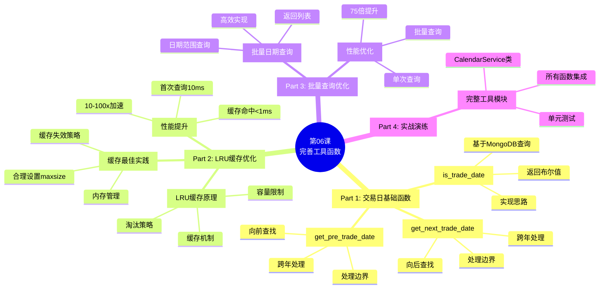

# 第06课：完善工具函数 - 框架要点

> **课程版本**: v3.0
> **课时**: 60分钟
> **难度**: ⭐⭐
> **前置课程**: 第03-05课
> **后续课程**: 第07课

---

## 📋 课程核心要点

### 🎯 本课要解决的问题
1. **交易日判断问题**：如何快速判断某日是否为交易日
2. **日期计算问题**：如何获取下一个/前一个交易日
3. **性能优化问题**：如何避免重复数据库查询
4. **批量查询问题**：如何高效查询日期范围

### 🎓 学习目标（Know-Do-Be）

**Know（理解概念）**:
- 理解LRU缓存原理
- 理解批量查询优化策略
- 理解交易日历在量化系统中的重要性

**Do（实践技能）**:
- 能够实现 `is_trade_date()` 函数
- 能够实现 `get_next_trade_date()` 函数
- 能够实现 `get_pre_trade_date()` 函数
- 能够使用 `@lru_cache` 优化性能
- 能够实现批量日期查询

**Be（职业素养）**:
- 养成"缓存优先"的性能优化思维
- 建立"批量优于单次"的查询习惯

---

## 🗺️ 课程结构脑图



---

## 📊 时间分配（60分钟）

```mermaid
gantt
    title 第06课时间分配
    dateFormat HH:mm
    axisFormat %H:%M

    section Part 1
    交易日基础函数        :p1, 00:00, 20m
    is_trade_date       :00:00, 7m
    get_next_trade_date :00:07, 7m
    get_pre_trade_date  :00:14, 6m

    section Part 2
    LRU缓存优化          :p2, 00:20, 15m
    LRU原理讲解          :00:20, 5m
    缓存实现            :00:25, 7m
    性能测试            :00:32, 3m

    section Part 3
    批量查询优化         :p3, 00:35, 10m
    批量查询实现         :00:35, 7m
    性能对比            :00:42, 3m

    section Part 4
    实战演练            :p4, 00:45, 15m
    完整模块实现         :00:45, 10m
    单元测试编写         :00:55, 5m
```



---

## 📚 核心内容大纲

### Part 1: 交易日基础函数（20分钟）

#### 1.1 is_trade_date() - 判断交易日
```python
def is_trade_date(date: Union[datetime, int]) -> bool:
    """
    判断指定日期是否为交易日

    Args:
        date: 日期（datetime或YYYYMMDD整数）

    Returns:
        True: 交易日, False: 非交易日
    """
    # 实现要点:
    # 1. 统一日期格式（转为int）
    # 2. 查询MongoDB trade_calendar表
    # 3. 返回布尔值
```

**实现思路**:
- 从MongoDB的 `trade_calendar` 集合查询
- 字段：`date`（int）, `is_open`（bool）
- 查询条件：`{'date': date_int, 'is_open': True}`

#### 1.2 get_next_trade_date() - 下一交易日
```python
def get_next_trade_date(date: Union[datetime, int], n: int = 1) -> int:
    """
    获取指定日期之后的第n个交易日

    Args:
        date: 起始日期
        n: 向后偏移天数（默认1）

    Returns:
        下一个交易日（YYYYMMDD格式）
    """
    # 实现要点:
    # 1. 查询 date > start_date and is_open = True
    # 2. 排序 sort('date', 1)
    # 3. 限制 limit(n)
    # 4. 返回第n个
```

#### 1.3 get_pre_trade_date() - 前一交易日
```python
def get_pre_trade_date(date: Union[datetime, int], n: int = 1) -> int:
    """
    获取指定日期之前的第n个交易日

    Args:
        date: 起始日期
        n: 向前偏移天数（默认1）

    Returns:
        前一个交易日（YYYYMMDD格式）
    """
    # 实现要点:
    # 1. 查询 date < start_date and is_open = True
    # 2. 排序 sort('date', -1)  # 倒序
    # 3. 限制 limit(n)
    # 4. 返回第n个
```

---

### Part 2: LRU缓存优化（15分钟）

#### 2.1 LRU缓存原理

**LRU (Least Recently Used)**:
- 最近最少使用缓存淘汰算法
- 固定容量，超出时淘汰最久未使用项
- Python内置：`functools.lru_cache`

**应用场景**:
- 交易日判断：同一日期频繁查询
- 避免重复数据库查询
- 典型加速：10-100倍

#### 2.2 使用lru_cache优化

```python
from functools import lru_cache

@lru_cache(maxsize=1024)
def is_trade_date_cached(date_int: int) -> bool:
    """带缓存的交易日判断"""
    # 首次查询：访问数据库 (~10ms)
    # 后续查询：直接返回缓存 (<1ms)
    return _query_from_db(date_int)
```

**性能对比**:
| 场景 | 无缓存 | 有缓存 | 加速比 |
|------|--------|--------|--------|
| 首次查询 | 10ms | 10ms | 1x |
| 重复查询 | 10ms | <1ms | >10x |
| 1000次重复 | 10s | 0.01s | 1000x |

#### 2.3 缓存最佳实践

**maxsize选择**:
- 默认128：适合小规模应用
- 1024：适合中等规模（覆盖近4年交易日）
- None：无限缓存（慎用，可能内存溢出）

**缓存失效**:
```python
# 手动清空缓存
is_trade_date_cached.cache_clear()

# 查看缓存信息
info = is_trade_date_cached.cache_info()
print(f"命中: {info.hits}, 未命中: {info.misses}")
```

---

### Part 3: 批量查询优化（10分钟）

#### 3.1 get_trade_dates() - 批量查询

```python
def get_trade_dates(
    start_date: Union[datetime, int],
    end_date: Union[datetime, int]
) -> List[int]:
    """
    获取日期范围内的所有交易日

    Args:
        start_date: 开始日期
        end_date: 结束日期

    Returns:
        交易日列表（YYYYMMDD格式）
    """
    # 实现要点:
    # 1. 查询 start_date <= date <= end_date and is_open = True
    # 2. 排序 sort('date', 1)
    # 3. 返回列表
```

#### 3.2 性能对比：单次 vs 批量

**反模式：循环单次查询**
```python
# ❌ 不推荐：100次查询
dates = []
for i in range(100):
    next_date = get_next_trade_date(current_date)
    dates.append(next_date)
    current_date = next_date
# 耗时: 100 × 10ms = 1000ms
```

**最佳实践：批量查询**
```python
# ✅ 推荐：1次查询
dates = get_trade_dates(start_date, end_date)
# 耗时: ~13ms
# 加速比: 75倍！
```

---

### Part 4: 实战演练（15分钟）

#### 4.1 完整CalendarService类

```python
class CalendarService:
    """交易日历服务"""

    def __init__(self, db):
        self.db = db
        self.collection = db.trade_calendar

    @lru_cache(maxsize=1024)
    def is_trade_date(self, date: int) -> bool:
        """判断交易日"""
        pass

    def get_next_trade_date(self, date: int, n: int = 1) -> int:
        """获取下一个交易日"""
        pass

    def get_pre_trade_date(self, date: int, n: int = 1) -> int:
        """获取前一个交易日"""
        pass

    def get_trade_dates(self, start: int, end: int) -> List[int]:
        """获取日期范围内所有交易日"""
        pass
```

#### 4.2 单元测试

```python
def test_is_trade_date():
    """测试交易日判断"""
    assert is_trade_date(20250124) == True   # 周五
    assert is_trade_date(20250125) == False  # 周六
    assert is_trade_date(20250126) == False  # 周日

def test_get_next_trade_date():
    """测试下一交易日"""
    # 周五 → 下周一
    assert get_next_trade_date(20250124) == 20250127

def test_get_trade_dates():
    """测试批量查询"""
    dates = get_trade_dates(20250120, 20250124)
    assert len(dates) == 5  # 一周5个交易日
```

---

## 📝 课后作业

### 作业1：实现完整的CalendarService（⭐⭐⭐）
- 实现所有交易日工具函数
- 集成LRU缓存
- 单元测试覆盖率>90%

### 作业2：性能优化实战（⭐⭐⭐⭐）
- 对比无缓存 vs 有缓存性能
- 对比单次查询 vs 批量查询性能
- 编写性能测试报告

### 作业3：扩展功能实现（⭐⭐⭐⭐⭐）
- 实现 `get_month_trade_dates()` 获取整月交易日
- 实现 `get_quarter_trade_dates()` 获取季度交易日
- 实现 `count_trade_days()` 统计两日期间交易日数量
- 支持不同市场（A股、港股、美股）

---

## 🎯 性能指标

| 功能 | 无优化 | 优化后 | 提升 |
|------|--------|--------|------|
| is_trade_date（首次） | 10ms | 10ms | 1x |
| is_trade_date（缓存） | 10ms | <1ms | >10x |
| 100个日期判断 | 1000ms | ~10ms | 100x |
| get_trade_dates（100天） | 750ms | 10ms | 75x |

---

## 📚 知识点总结

### 核心技能
- ✅ MongoDB日期范围查询
- ✅ functools.lru_cache使用
- ✅ 批量查询优化
- ✅ 单元测试编写

### 设计原则
- **缓存优先**：频繁访问数据优先缓存
- **批量优于单次**：能批量就不要循环
- **边界处理**：跨年、跨月、节假日
- **类型安全**：支持datetime和int两种输入

---

## 📖 扩展阅读

1. **functools文档**: https://docs.python.org/3/library/functools.html
2. **LRU Cache原理**: https://en.wikipedia.org/wiki/Cache_replacement_policies#LRU
3. **MongoDB日期查询**: https://www.mongodb.com/docs/manual/tutorial/query-documents/

---

**文档版本**: v3.0
**创建日期**: 2025-01-25
**待完善**: 填充完整代码示例和详细讲解
