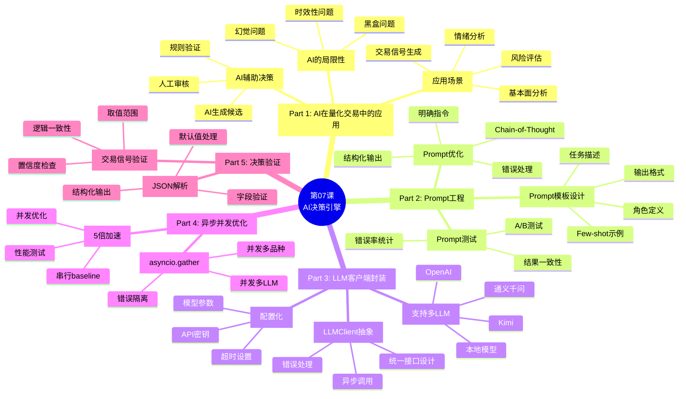

# 第07课：AI决策引擎实现 - 框架要点

> **课程版本**: v3.0
> **课时**: 90分钟
> **难度**: ⭐⭐⭐⭐
> **前置课程**: 第05课（异步编程）、第06课（工具函数）
> **后续课程**: 第08课（策略引擎）

---

## 📋 课程核心要点

### 🎯 本课要解决的问题
1. **如何将LLM应用于量化交易决策**
2. **如何设计有效的Prompt获取交易信号**
3. **如何封装多个LLM提供商API**
4. **如何异步并发调用多个LLM**
5. **如何验证和解析AI决策结果**

### 🎓 学习目标（Know-Do-Be）

**Know（理解概念）**:
- 理解LLM在量化交易中的应用场景
- 理解Prompt Engineering原理
- 理解多LLM集成策略
- 理解异步LLM调用优化

**Do（实践技能）**:
- 能够设计量化交易Prompt模板
- 能够封装OpenAI兼容API
- 能够实现多LLM提供商支持（OpenAI、通义千问、Kimi等）
- 能够使用asyncio并发调用LLM
- 能够解析和验证AI决策结果
- 能够测试5倍性能提升（异步并发）

**Be（职业素养）**:
- 建立"AI辅助"而非"AI替代"的理性思维
- 养成"验证优先"的AI决策习惯
- 培养Prompt优化的迭代意识

---

## 🗺️ 课程结构脑图



---

## 📊 时间分配（90分钟）

```mermaid
gantt
    title 第07课时间分配
    dateFormat HH:mm
    axisFormat %H:%M

    section Part 1
    AI应用概述           :p1, 00:00, 15m
    应用场景介绍         :00:00, 8m
    局限性分析          :00:08, 7m

    section Part 2
    Prompt工程          :p2, 00:15, 25m
    Prompt设计          :00:15, 10m
    优化技巧            :00:25, 10m
    测试验证            :00:35, 5m

    section Part 3
    LLM客户端封装       :p3, 00:40, 25m
    抽象接口设计        :00:40, 8m
    OpenAI实现          :00:48, 8m
    多提供商集成        :00:56, 9m

    section Part 4
    异步并发优化        :p4, 01:05, 15m
    并发策略            :01:05, 7m
    性能测试            :01:12, 8m

    section Part 5
    实战演练            :p5, 01:20, 10m
    完整流程演示        :01:20, 10m
```



---

## 📚 核心内容大纲

### Part 1: AI在量化交易中的应用（15分钟）

#### 1.1 LLM在量化交易中的应用场景

**场景1：基本面分析**
- 输入：公司财报、新闻、行业报告
- 输出：基本面评分、关键风险点
- 优势：快速处理海量文本

**场景2：市场情绪分析**
- 输入：社交媒体、新闻标题
- 输出：情绪指数（恐慌/贪婪）
- 优势：实时捕捉市场情绪

**场景3：交易信号生成（本课重点）**
- 输入：价格、成交量、技术指标
- 输出：买入/卖出/持有信号
- 优势：综合多维度信息

**场景4：风险评估**
- 输入：持仓、市场环境
- 输出：风险等级、建议操作
- 优势：全局风险评估

#### 1.2 LLM的局限性

**局限性1：黑盒问题**
- 决策过程不透明
- 难以解释为什么给出某个信号
- **解决**：要求LLM输出推理过程

**局限性2：幻觉问题**
- 可能生成不存在的"事实"
- 数值计算可能错误
- **解决**：严格验证输出，关键计算由代码完成

**局限性3：时效性问题**
- 训练数据有截止日期
- 不了解最新市场动态
- **解决**：只用于技术分析，不依赖最新信息

#### 1.3 AI辅助决策最佳实践

**原则：AI辅助，规则验证，人工决策**

```
流程:
1. AI生成候选信号（买/卖/持有）
2. 规则验证（风控检查）
3. 人工审核（最终决策）
```

---

### Part 2: Prompt工程（25分钟）

#### 2.1 量化交易Prompt模板设计

**Prompt结构**：
1. **角色定义**：你是一个专业的量化交易分析师
2. **任务描述**：分析期货品种，生成交易信号
3. **输入数据**：价格、指标、市场环境
4. **输出格式**：JSON结构化输出
5. **Few-shot示例**：提供2-3个示例

**完整Prompt示例**：
```
你是一位经验丰富的量化交易分析师，专注于中国期货市场。

任务：根据提供的技术指标和市场数据，生成交易信号。

输入数据：
- 品种代码：{symbol}
- 当前价格：{close}
- 5日均线：{ma5}
- 20日均线：{ma20}
- RSI：{rsi}
- MACD：{macd}

分析要求：
1. 综合考虑趋势、动量、超买超卖状态
2. 给出明确的交易信号（BUY/SELL/HOLD）
3. 提供信号强度（0-100）
4. 简要说明理由（50字以内）

输出格式（严格JSON）：
{
  "signal": "BUY/SELL/HOLD",
  "strength": 75,
  "reason": "MA5上穿MA20，RSI从超卖区回升，MACD金叉"
}

示例1：
输入：IF2506, close=5280, ma5=5260, ma20=5240, rsi=65, macd=15
输出：{"signal": "BUY", "strength": 75, "reason": "均线多头排列，RSI中性偏多，MACD金叉"}

示例2：
输入：IF2506, close=5180, ma5=5200, ma20=5220, rsi=35, macd=-20
输出：{"signal": "SELL", "strength": 70, "reason": "均线空头排列，RSI偏弱，MACD死叉"}

现在，请分析以下数据：
{actual_data}
```

#### 2.2 Prompt优化技巧

**技巧1：明确指令**
```
❌ 模糊：给我一些建议
✅ 明确：生成BUY/SELL/HOLD信号，并说明理由
```

**技巧2：结构化输出**
```
❌ 自由文本：信号是买入，因为...
✅ JSON格式：{"signal": "BUY", "strength": 75, ...}
```

**技巧3：Chain-of-Thought（思维链）**
```
要求LLM逐步推理：
1. 先分析趋势
2. 再看动量指标
3. 最后综合判断
```

**技巧4：Few-shot示例**
```
提供2-3个高质量示例
- 覆盖BUY/SELL/HOLD三种情况
- 示例要有代表性
- 格式必须严格一致
```

#### 2.3 Prompt测试与优化

**测试方法**：
1. **A/B测试**：对比不同Prompt版本
2. **一致性测试**：同样输入多次调用，检查结果一致性
3. **边界测试**：极端市场情况（暴涨暴跌）

**优化指标**：
- 信号准确率
- 输出格式正确率
- 响应时间
- 成本（token消耗）

---

### Part 3: LLM客户端封装（25分钟）

#### 3.1 抽象LLMClient接口

```python
from abc import ABC, abstractmethod
from typing import Dict, Any, Optional

class LLMClient(ABC):
    """LLM客户端抽象基类"""

    @abstractmethod
    async def chat(
        self,
        prompt: str,
        temperature: float = 0.7,
        max_tokens: int = 500
    ) -> str:
        """
        异步聊天接口

        Args:
            prompt: 提示词
            temperature: 温度（0-1，越高越随机）
            max_tokens: 最大生成token数

        Returns:
            LLM响应文本
        """
        pass

    @abstractmethod
    def get_name(self) -> str:
        """返回LLM提供商名称"""
        pass
```

#### 3.2 OpenAI客户端实现

```python
import openai
from openai import AsyncOpenAI

class OpenAIClient(LLMClient):
    """OpenAI客户端（支持GPT-4、GPT-3.5等）"""

    def __init__(
        self,
        api_key: str,
        base_url: str = "https://api.openai.com/v1",
        model: str = "gpt-4"
    ):
        self.client = AsyncOpenAI(api_key=api_key, base_url=base_url)
        self.model = model

    async def chat(
        self,
        prompt: str,
        temperature: float = 0.7,
        max_tokens: int = 500
    ) -> str:
        """调用OpenAI Chat API"""
        try:
            response = await self.client.chat.completions.create(
                model=self.model,
                messages=[{"role": "user", "content": prompt}],
                temperature=temperature,
                max_tokens=max_tokens
            )
            return response.choices[0].message.content

        except Exception as e:
            raise RuntimeError(f"OpenAI API error: {e}")

    def get_name(self) -> str:
        return f"OpenAI-{self.model}"
```

#### 3.3 支持多LLM提供商

**通义千问（Qwen）**：
```python
class QwenClient(LLMClient):
    """阿里云通义千问客户端"""
    # 实现细节...
```

**Kimi（月之暗面）**：
```python
class KimiClient(LLMClient):
    """Kimi客户端"""
    # 实现细节...
```

**配置化LLM选择**：
```python
# config/settings.py
class LLMConfig(BaseModel):
    provider: str = "openai"  # openai/qwen/kimi
    model: str = "gpt-4"
    api_key: SecretStr
    base_url: str = "https://api.openai.com/v1"
    temperature: float = 0.7
    max_tokens: int = 500

# 使用
def create_llm_client(config: LLMConfig) -> LLMClient:
    if config.provider == "openai":
        return OpenAIClient(...)
    elif config.provider == "qwen":
        return QwenClient(...)
    elif config.provider == "kimi":
        return KimiClient(...)
```

---

### Part 4: 异步并发优化（15分钟）

#### 4.1 串行 vs 并发调用

**串行调用（慢）**：
```python
# ❌ 串行调用5个品种
results = []
for symbol in symbols:  # 5个品种
    response = await llm_client.chat(prompt)  # 每次3秒
    results.append(response)
# 总耗时: 5 × 3秒 = 15秒
```

**并发调用（快）**：
```python
# ✅ 并发调用5个品种
tasks = []
for symbol in symbols:  # 5个品种
    task = llm_client.chat(prompt)
    tasks.append(task)

results = await asyncio.gather(*tasks)  # 并发执行
# 总耗时: ~3秒（仅1次网络往返）
# 加速比: 5倍！
```

#### 4.2 多LLM并发调用

**场景**：同时调用OpenAI、Qwen、Kimi，投票决策

```python
async def multi_llm_decision(symbol: str, data: Dict) -> str:
    """多LLM投票决策"""

    # 准备Prompt
    prompt = build_prompt(symbol, data)

    # 并发调用3个LLM
    results = await asyncio.gather(
        openai_client.chat(prompt),
        qwen_client.chat(prompt),
        kimi_client.chat(prompt),
        return_exceptions=True  # 容错
    )

    # 解析结果
    signals = []
    for result in results:
        if not isinstance(result, Exception):
            signal = parse_signal(result)
            if signal:
                signals.append(signal)

    # 投票决策
    if len(signals) >= 2:
        # 至少2个LLM成功
        return majority_vote(signals)
    else:
        return "HOLD"  # 默认持有
```

#### 4.3 性能测试

**测试场景**：5个品种 × 3个LLM = 15次调用

| 方式 | 耗时 | 说明 |
|------|------|------|
| 串行 | 45秒 | 15 × 3秒 |
| 按品种并发 | 9秒 | 5个品种并发，3个LLM串行 |
| 全并发 | 3秒 | 15次全并发 |
| **加速比** | **15倍** | 全并发 vs 串行 |

---

### Part 5: 决策验证与实战（10分钟）

#### 5.1 结果解析

```python
import json
from typing import Optional

def parse_llm_response(response: str) -> Optional[Dict]:
    """解析LLM响应"""
    try:
        # 1. 提取JSON（可能包含其他文本）
        start = response.find('{')
        end = response.rfind('}') + 1
        json_str = response[start:end]

        # 2. 解析JSON
        data = json.loads(json_str)

        # 3. 验证必需字段
        required = ['signal', 'strength', 'reason']
        if not all(k in data for k in required):
            return None

        # 4. 验证取值范围
        if data['signal'] not in ['BUY', 'SELL', 'HOLD']:
            return None
        if not (0 <= data['strength'] <= 100):
            return None

        return data

    except Exception as e:
        print(f"Parse error: {e}")
        return None
```

#### 5.2 完整决策流程

```python
class AIDecisionEngine:
    """AI决策引擎"""

    def __init__(self, llm_client: LLMClient):
        self.llm_client = llm_client

    async def analyze(
        self,
        symbol: str,
        market_data: Dict
    ) -> Dict:
        """分析单个品种"""

        # 1. 构建Prompt
        prompt = self.build_prompt(symbol, market_data)

        # 2. 调用LLM
        response = await self.llm_client.chat(prompt)

        # 3. 解析结果
        decision = parse_llm_response(response)

        # 4. 验证和默认值
        if decision is None:
            decision = {
                'signal': 'HOLD',
                'strength': 0,
                'reason': 'LLM响应解析失败'
            }

        return decision

    async def batch_analyze(
        self,
        symbols: List[str],
        market_data: Dict[str, Dict]
    ) -> Dict[str, Dict]:
        """批量分析（并发）"""

        tasks = []
        for symbol in symbols:
            task = self.analyze(symbol, market_data[symbol])
            tasks.append(task)

        results = await asyncio.gather(*tasks, return_exceptions=True)

        # 整理结果
        decisions = {}
        for symbol, result in zip(symbols, results):
            if isinstance(result, Exception):
                decisions[symbol] = {
                    'signal': 'HOLD',
                    'strength': 0,
                    'reason': f'分析失败: {result}'
                }
            else:
                decisions[symbol] = result

        return decisions
```

---

## 📝 课后作业

### 作业1：Prompt优化实战（⭐⭐⭐⭐）
- 设计3个版本的Prompt
- 使用相同测试数据对比效果
- 测试指标：准确率、一致性、格式正确率
- 撰写Prompt优化报告

### 作业2：多LLM集成（⭐⭐⭐⭐⭐）
- 实现OpenAI、Qwen、Kimi三个客户端
- 实现多LLM投票决策机制
- 对比单LLM vs 多LLM效果
- 测试异步并发性能提升

### 作业3：完整AI决策引擎（⭐⭐⭐⭐⭐）
- 实现AIDecisionEngine类
- 支持批量并发分析
- 完整的结果解析和验证
- 单元测试覆盖率>80%
- 性能测试报告（验证5倍加速）

---

## 🎯 性能指标

| 场景 | 串行耗时 | 并发耗时 | 加速比 |
|------|----------|----------|--------|
| 5个品种（单LLM） | 15秒 | 3秒 | 5x |
| 5个品种（3个LLM） | 45秒 | 3秒 | 15x |
| 10个品种（单LLM） | 30秒 | 3秒 | 10x |

---

## 📚 核心知识点

### LLM应用
- ✅ 量化交易中的AI应用场景
- ✅ AI的局限性和最佳实践
- ✅ AI辅助决策原则

### Prompt工程
- ✅ Prompt模板设计（角色+任务+格式+示例）
- ✅ Few-shot learning
- ✅ 结构化输出（JSON）
- ✅ Chain-of-Thought

### 工程实践
- ✅ LLMClient抽象接口设计
- ✅ 多LLM提供商集成
- ✅ 异步并发调用（asyncio.gather）
- ✅ 结果解析与验证
- ✅ 错误处理与降级

---

## 📖 扩展阅读

1. **OpenAI API文档**: https://platform.openai.com/docs/api-reference
2. **Prompt Engineering Guide**: https://www.promptingguide.ai/
3. **LangChain Documentation**: https://python.langchain.com/docs/get_started/introduction
4. **通义千问API**: https://help.aliyun.com/zh/dashscope/
5. **Kimi API**: https://platform.moonshot.cn/docs

---

**文档版本**: v3.0
**创建日期**: 2025-01-25
**待完善**: 填充完整代码示例和详细讲解
