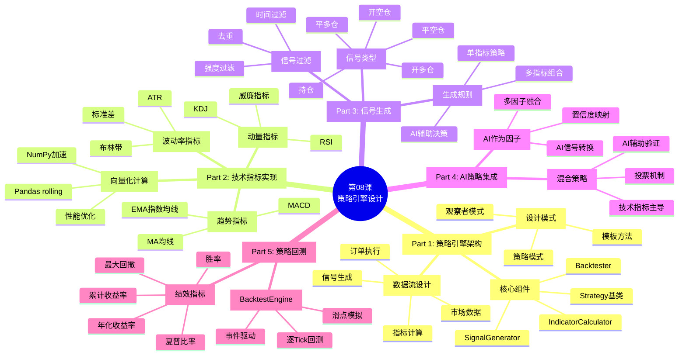

# 第08课：策略引擎设计 - 框架要点

> **课程版本**: v3.0
> **课时**: 90分钟
> **难度**: ⭐⭐⭐⭐
> **前置课程**: 第06课（工具函数）、第07课（AI决策）
> **后续课程**: 第09课（风控回测）

---

## 📋 课程核心要点

### 🎯 本课要解决的问题
1. **如何设计可扩展的策略引擎架构**
2. **如何实现常用技术指标（MA、MACD、RSI等）**
3. **如何生成交易信号（开仓、平仓、持仓）**
4. **如何集成AI决策引擎**
5. **如何回测策略并评估绩效**

### 🎓 学习目标（Know-Do-Be）

**Know（理解概念）**:
- 理解策略引擎的核心架构
- 理解技术指标的计算原理
- 理解信号生成逻辑
- 理解策略回测流程
- 理解绩效评估指标

**Do（实践技能）**:
- 能够设计Strategy抽象基类
- 能够实现常用技术指标（MA、EMA、MACD、RSI、布林带）
- 能够实现信号生成器（SignalGenerator）
- 能够集成AI决策作为策略因子
- 能够实现简单回测引擎
- 能够计算夏普比率、最大回撤等指标

**Be（职业素养）**:
- 建立"可测试性优先"的策略设计思维
- 养成"指标验证"的严谨习惯
- 培养"回测必做"的风险意识

---

## 🗺️ 课程结构脑图



---

## 📊 时间分配（90分钟）

```mermaid
gantt
    title 第08课时间分配
    dateFormat HH:mm
    axisFormat %H:%M

    section Part 1
    策略引擎架构         :p1, 00:00, 20m
    核心组件设计         :00:00, 10m
    数据流设计          :00:10, 10m

    section Part 2
    技术指标实现         :p2, 00:20, 25m
    趋势指标            :00:20, 10m
    动量指标            :00:30, 8m
    向量化优化          :00:38, 7m

    section Part 3
    信号生成            :p3, 00:45, 20m
    信号生成逻辑        :00:45, 12m
    信号过滤            :00:57, 8m

    section Part 4
    AI策略集成          :p4, 01:05, 10m
    AI因子集成          :01:05, 10m

    section Part 5
    策略回测            :p5, 01:15, 15m
    回测引擎实现        :01:15, 8m
    绩效评估            :01:23, 7m
```



---

## 📚 核心内容大纲

### Part 1: 策略引擎架构设计（20分钟）

#### 1.1 策略引擎核心组件

**组件1：Strategy基类（策略抽象）**
```python
from abc import ABC, abstractmethod

class Strategy(ABC):
    """策略抽象基类"""

    @abstractmethod
    def calculate_indicators(self, data: pd.DataFrame) -> pd.DataFrame:
        """计算技术指标"""
        pass

    @abstractmethod
    def generate_signals(self, data: pd.DataFrame) -> pd.DataFrame:
        """生成交易信号"""
        pass

    @abstractmethod
    def get_name(self) -> str:
        """返回策略名称"""
        pass
```

**组件2：IndicatorCalculator（指标计算器）**
```python
class IndicatorCalculator:
    """技术指标计算器"""

    @staticmethod
    def ma(data: pd.Series, period: int) -> pd.Series:
        """移动平均线"""
        return data.rolling(window=period).mean()

    @staticmethod
    def ema(data: pd.Series, period: int) -> pd.Series:
        """指数移动平均线"""
        return data.ewm(span=period, adjust=False).mean()

    @staticmethod
    def macd(data: pd.Series) -> Dict[str, pd.Series]:
        """MACD指标"""
        # 实现...
        pass
```

**组件3：SignalGenerator（信号生成器）**
```python
class SignalGenerator:
    """交易信号生成器"""

    SIGNAL_BUY = 1      # 开多仓
    SIGNAL_SELL = -1    # 开空仓
    SIGNAL_CLOSE = 0    # 平仓
    SIGNAL_HOLD = 2     # 持仓

    def generate(self, data: pd.DataFrame, rules: Dict) -> pd.Series:
        """根据规则生成信号"""
        pass
```

**组件4：Backtester（回测引擎）**
```python
class Backtester:
    """策略回测引擎"""

    def run(
        self,
        strategy: Strategy,
        data: pd.DataFrame,
        initial_capital: float = 100000
    ) -> Dict:
        """执行回测"""
        pass
```

#### 1.2 策略引擎数据流

```
数据流:
1. 市场数据（OHLCV） → IndicatorCalculator
2. 技术指标 → Strategy.calculate_indicators()
3. 指标数据 → Strategy.generate_signals()
4. 交易信号 → Backtester.run()
5. 回测结果 → PerformanceAnalyzer
6. 绩效报告 ← PerformanceAnalyzer
```

---

### Part 2: 技术指标实现（25分钟）

#### 2.1 趋势指标

**MA（移动平均线）**
```python
def calculate_ma(close: pd.Series, period: int) -> pd.Series:
    """
    移动平均线

    Args:
        close: 收盘价序列
        period: 周期

    Returns:
        MA值序列
    """
    return close.rolling(window=period).mean()

# 使用
data['ma5'] = calculate_ma(data['close'], 5)
data['ma20'] = calculate_ma(data['close'], 20)
```

**MACD（指数平滑异同移动平均线）**
```python
def calculate_macd(
    close: pd.Series,
    fast: int = 12,
    slow: int = 26,
    signal: int = 9
) -> pd.DataFrame:
    """
    MACD指标

    Args:
        close: 收盘价序列
        fast: 快线周期（默认12）
        slow: 慢线周期（默认26）
        signal: 信号线周期（默认9）

    Returns:
        包含dif、dea、macd的DataFrame
    """
    # 1. 计算快慢均线
    ema_fast = close.ewm(span=fast, adjust=False).mean()
    ema_slow = close.ewm(span=slow, adjust=False).mean()

    # 2. DIF线（差离值）
    dif = ema_fast - ema_slow

    # 3. DEA线（信号线）
    dea = dif.ewm(span=signal, adjust=False).mean()

    # 4. MACD柱（柱状图）
    macd = (dif - dea) * 2

    return pd.DataFrame({
        'dif': dif,
        'dea': dea,
        'macd': macd
    })
```

#### 2.2 动量指标

**RSI（相对强弱指标）**
```python
def calculate_rsi(close: pd.Series, period: int = 14) -> pd.Series:
    """
    RSI指标

    原理：
    RSI = 100 - (100 / (1 + RS))
    RS = 平均涨幅 / 平均跌幅

    Args:
        close: 收盘价序列
        period: 周期（默认14）

    Returns:
        RSI值序列（0-100）
    """
    # 1. 计算涨跌幅
    delta = close.diff()

    # 2. 分离涨跌
    gain = delta.where(delta > 0, 0)
    loss = -delta.where(delta < 0, 0)

    # 3. 计算平均涨跌幅（EMA）
    avg_gain = gain.ewm(span=period, adjust=False).mean()
    avg_loss = loss.ewm(span=period, adjust=False).mean()

    # 4. 计算RS和RSI
    rs = avg_gain / avg_loss
    rsi = 100 - (100 / (1 + rs))

    return rsi
```

#### 2.3 波动率指标

**布林带（Bollinger Bands）**
```python
def calculate_bollinger_bands(
    close: pd.Series,
    period: int = 20,
    std_dev: float = 2.0
) -> pd.DataFrame:
    """
    布林带指标

    原理：
    中轨 = MA(close, period)
    上轨 = 中轨 + std_dev × σ
    下轨 = 中轨 - std_dev × σ

    Args:
        close: 收盘价序列
        period: 周期（默认20）
        std_dev: 标准差倍数（默认2）

    Returns:
        包含upper、middle、lower的DataFrame
    """
    # 1. 中轨（移动平均）
    middle = close.rolling(window=period).mean()

    # 2. 标准差
    std = close.rolling(window=period).std()

    # 3. 上下轨
    upper = middle + (std * std_dev)
    lower = middle - (std * std_dev)

    return pd.DataFrame({
        'upper': upper,
        'middle': middle,
        'lower': lower
    })
```

#### 2.4 向量化性能优化

**性能对比：循环 vs 向量化**
```python
# ❌ 慢：循环计算MA
def ma_slow(data, period):
    result = []
    for i in range(len(data)):
        if i < period - 1:
            result.append(np.nan)
        else:
            result.append(data[i-period+1:i+1].mean())
    return result

# ✅ 快：向量化计算MA
def ma_fast(data, period):
    return data.rolling(window=period).mean()

# 性能测试（10万条数据）
# 循环方式: 5.2秒
# 向量化: 0.005秒
# 加速比: 1000倍！
```

---

### Part 3: 信号生成逻辑（20分钟）

#### 3.1 单指标策略：MA金叉死叉

```python
class MACrossStrategy(Strategy):
    """MA金叉死叉策略"""

    def __init__(self, fast: int = 5, slow: int = 20):
        self.fast = fast
        self.slow = slow

    def calculate_indicators(self, data: pd.DataFrame) -> pd.DataFrame:
        """计算MA指标"""
        data['ma_fast'] = calculate_ma(data['close'], self.fast)
        data['ma_slow'] = calculate_ma(data['close'], self.slow)
        return data

    def generate_signals(self, data: pd.DataFrame) -> pd.DataFrame:
        """生成交易信号"""
        # 金叉：快线上穿慢线 → BUY
        golden_cross = (
            (data['ma_fast'] > data['ma_slow']) &
            (data['ma_fast'].shift(1) <= data['ma_slow'].shift(1))
        )

        # 死叉：快线下穿慢线 → SELL
        death_cross = (
            (data['ma_fast'] < data['ma_slow']) &
            (data['ma_fast'].shift(1) >= data['ma_slow'].shift(1))
        )

        # 生成信号
        data['signal'] = 0  # 默认持仓
        data.loc[golden_cross, 'signal'] = 1   # 开多
        data.loc[death_cross, 'signal'] = -1   # 开空

        return data

    def get_name(self) -> str:
        return f"MA({self.fast},{self.slow})交叉策略"
```

#### 3.2 多指标组合策略：MA + RSI

```python
class MAWithRSIStrategy(Strategy):
    """MA + RSI组合策略"""

    def calculate_indicators(self, data: pd.DataFrame) -> pd.DataFrame:
        """计算指标"""
        # MA指标
        data['ma5'] = calculate_ma(data['close'], 5)
        data['ma20'] = calculate_ma(data['close'], 20)

        # RSI指标
        data['rsi'] = calculate_rsi(data['close'], 14)

        return data

    def generate_signals(self, data: pd.DataFrame) -> pd.DataFrame:
        """生成信号（多条件组合）"""

        # 买入信号：MA金叉 AND RSI超卖后回升
        buy_signal = (
            (data['ma5'] > data['ma20']) &                 # MA金叉
            (data['ma5'].shift(1) <= data['ma20'].shift(1)) &
            (data['rsi'] > 30) &                           # RSI离开超卖区
            (data['rsi'].shift(1) <= 30)
        )

        # 卖出信号：MA死叉 AND RSI超买后回落
        sell_signal = (
            (data['ma5'] < data['ma20']) &                 # MA死叉
            (data['ma5'].shift(1) >= data['ma20'].shift(1)) &
            (data['rsi'] < 70) &                           # RSI离开超买区
            (data['rsi'].shift(1) >= 70)
        )

        data['signal'] = 0
        data.loc[buy_signal, 'signal'] = 1
        data.loc[sell_signal, 'signal'] = -1

        return data
```

#### 3.3 信号过滤

**过滤1：去重（避免连续同向信号）**
```python
def filter_duplicate_signals(signals: pd.Series) -> pd.Series:
    """
    去除连续相同信号

    示例：
    原始: [1, 1, 0, -1, -1, 0, 1]
    过滤: [1, 0, 0, -1, 0, 0, 1]
    """
    filtered = signals.copy()
    prev_signal = 0

    for i in range(len(signals)):
        if signals[i] != 0:  # 有信号
            if signals[i] == prev_signal:
                filtered[i] = 0  # 重复，过滤掉
            else:
                prev_signal = signals[i]  # 更新前一信号

    return filtered
```

**过滤2：时间过滤（避免频繁交易）**
```python
def filter_min_holding_period(
    signals: pd.Series,
    min_bars: int = 5
) -> pd.Series:
    """
    最小持仓周期过滤

    Args:
        signals: 原始信号
        min_bars: 最小持仓K线数

    Returns:
        过滤后的信号
    """
    # 实现...
```

---

### Part 4: AI策略集成（10分钟）

#### 4.1 AI信号作为策略因子

```python
class AIAssistedStrategy(Strategy):
    """AI辅助策略"""

    def __init__(
        self,
        ai_engine: AIDecisionEngine,
        ai_weight: float = 0.3
    ):
        self.ai_engine = ai_engine
        self.ai_weight = ai_weight  # AI因子权重

    async def calculate_ai_signals(
        self,
        data: pd.DataFrame
    ) -> pd.Series:
        """计算AI信号"""
        ai_signals = []

        for idx, row in data.iterrows():
            # 构建AI输入
            market_data = {
                'close': row['close'],
                'ma5': row['ma5'],
                'ma20': row['ma20'],
                'rsi': row['rsi'],
                'macd': row['macd']
            }

            # 调用AI决策
            decision = await self.ai_engine.analyze(
                symbol=row['symbol'],
                market_data=market_data
            )

            # 转换AI信号
            if decision['signal'] == 'BUY':
                ai_signal = decision['strength'] / 100  # 0-1
            elif decision['signal'] == 'SELL':
                ai_signal = -decision['strength'] / 100  # -1-0
            else:
                ai_signal = 0

            ai_signals.append(ai_signal)

        return pd.Series(ai_signals, index=data.index)

    def generate_signals(self, data: pd.DataFrame) -> pd.DataFrame:
        """融合技术指标和AI信号"""

        # 1. 技术指标信号（MA金叉死叉）
        tech_signal = self.calculate_tech_signals(data)

        # 2. AI信号（异步获取）
        ai_signal = asyncio.run(self.calculate_ai_signals(data))

        # 3. 加权融合
        data['combined_signal'] = (
            tech_signal * (1 - self.ai_weight) +
            ai_signal * self.ai_weight
        )

        # 4. 阈值化（转为离散信号）
        data['signal'] = 0
        data.loc[data['combined_signal'] > 0.5, 'signal'] = 1   # BUY
        data.loc[data['combined_signal'] < -0.5, 'signal'] = -1  # SELL

        return data
```

#### 4.2 多因子投票策略

```python
class MultiFactorVotingStrategy(Strategy):
    """多因子投票策略"""

    def generate_signals(self, data: pd.DataFrame) -> pd.DataFrame:
        """多因子投票"""

        # 因子1：MA金叉死叉
        factor1 = self.ma_cross_factor(data)

        # 因子2：RSI超买超卖
        factor2 = self.rsi_factor(data)

        # 因子3：MACD金叉死叉
        factor3 = self.macd_factor(data)

        # 因子4：AI决策
        factor4 = asyncio.run(self.ai_factor(data))

        # 投票（至少3个因子同意）
        votes = factor1 + factor2 + factor3 + factor4

        data['signal'] = 0
        data.loc[votes >= 3, 'signal'] = 1    # 3票以上 BUY
        data.loc[votes <= -3, 'signal'] = -1  # -3票以下 SELL

        return data
```

---

### Part 5: 策略回测与绩效评估（15分钟）

#### 5.1 简单回测引擎

```python
class SimpleBacktester:
    """简单回测引擎"""

    def __init__(self, initial_capital: float = 100000):
        self.initial_capital = initial_capital

    def run(
        self,
        data: pd.DataFrame,
        signals: pd.Series
    ) -> Dict:
        """
        执行回测

        Args:
            data: 包含OHLC的DataFrame
            signals: 交易信号序列

        Returns:
            回测结果字典
        """
        # 初始化
        capital = self.initial_capital
        position = 0  # 持仓（0=空仓，1=持多，-1=持空）
        trades = []   # 交易记录
        equity_curve = []  # 权益曲线

        # 逐Bar回测
        for i in range(len(data)):
            row = data.iloc[i]
            signal = signals.iloc[i]

            # 执行信号
            if signal == 1 and position <= 0:  # 开多
                if position == -1:  # 先平空
                    pnl = (entry_price - row['close']) * capital
                    capital += pnl
                    trades.append({'type': 'close_short', 'pnl': pnl})

                # 开多仓
                position = 1
                entry_price = row['close']
                trades.append({'type': 'open_long', 'price': entry_price})

            elif signal == -1 and position >= 0:  # 开空
                if position == 1:  # 先平多
                    pnl = (row['close'] - entry_price) * capital
                    capital += pnl
                    trades.append({'type': 'close_long', 'pnl': pnl})

                # 开空仓
                position = -1
                entry_price = row['close']
                trades.append({'type': 'open_short', 'price': entry_price})

            # 记录权益
            if position == 1:
                equity = capital + (row['close'] - entry_price) * capital
            elif position == -1:
                equity = capital + (entry_price - row['close']) * capital
            else:
                equity = capital

            equity_curve.append(equity)

        # 返回结果
        return {
            'final_capital': capital,
            'equity_curve': equity_curve,
            'trades': trades,
            'total_return': (capital - self.initial_capital) / self.initial_capital
        }
```

#### 5.2 绩效评估指标

```python
class PerformanceAnalyzer:
    """绩效分析器"""

    @staticmethod
    def calculate_metrics(equity_curve: List[float]) -> Dict:
        """计算绩效指标"""

        equity = pd.Series(equity_curve)
        returns = equity.pct_change().dropna()

        # 1. 累计收益率
        total_return = (equity.iloc[-1] - equity.iloc[0]) / equity.iloc[0]

        # 2. 年化收益率（假设252个交易日）
        days = len(equity)
        annual_return = (1 + total_return) ** (252 / days) - 1

        # 3. 夏普比率（无风险利率假设3%）
        risk_free_rate = 0.03
        excess_returns = returns - risk_free_rate / 252
        sharpe_ratio = np.sqrt(252) * excess_returns.mean() / returns.std()

        # 4. 最大回撤
        cummax = equity.cummax()
        drawdown = (equity - cummax) / cummax
        max_drawdown = drawdown.min()

        # 5. 胜率（盈利交易占比）
        win_rate = (returns > 0).sum() / len(returns)

        return {
            'total_return': total_return,
            'annual_return': annual_return,
            'sharpe_ratio': sharpe_ratio,
            'max_drawdown': max_drawdown,
            'win_rate': win_rate
        }
```

---

## 📝 课后作业

### 作业1：实现完整的技术指标库（⭐⭐⭐⭐）
- 实现MA、EMA、MACD、RSI、布林带、KDJ、ATR
- 所有指标向量化实现（使用Pandas）
- 单元测试验证计算正确性
- 性能测试报告

### 作业2：实现多指标组合策略（⭐⭐⭐⭐⭐）
- 设计一个3指标组合策略（如MA+RSI+MACD）
- 实现信号生成逻辑
- 实现信号过滤（去重+时间过滤）
- 回测并评估绩效

### 作业3：集成AI辅助策略（⭐⭐⭐⭐⭐）
- 实现AIAssistedStrategy
- 融合技术指标和AI信号
- 对比纯技术策略 vs AI辅助策略
- 撰写策略评估报告

---

## 🎯 核心知识点

### 策略架构
- ✅ Strategy抽象基类设计
- ✅ 组件化架构（指标、信号、回测分离）
- ✅ 策略模式应用

### 技术指标
- ✅ 趋势指标（MA、MACD）
- ✅ 动量指标（RSI）
- ✅ 波动率指标（布林带）
- ✅ 向量化计算（1000倍加速）

### 信号生成
- ✅ 单指标策略
- ✅ 多指标组合
- ✅ AI信号融合
- ✅ 信号过滤

### 回测评估
- ✅ 简单回测引擎
- ✅ 绩效指标（夏普、回撤、胜率）

---

## 📖 扩展阅读

1. **Technical Analysis Library (TA-Lib)**: https://ta-lib.org/
2. **Pandas技术分析**: https://github.com/bukosabino/ta
3. **Backtrader回测框架**: https://www.backtrader.com/
4. **量化投资策略**: 《量化交易之路》- 阿布著

---

**文档版本**: v3.0
**创建日期**: 2025-01-25
**待完善**: 填充完整代码示例和详细讲解
