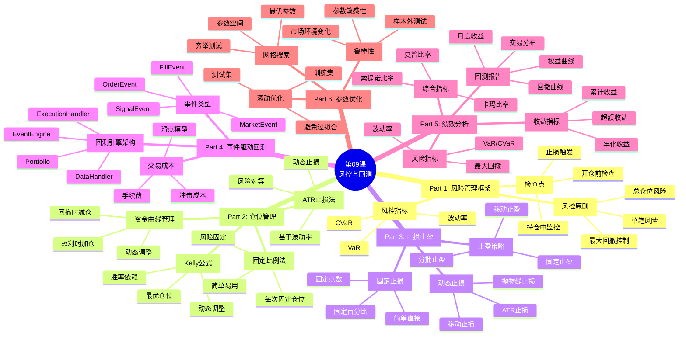

# 第09课：风险控制与回测系统 - 框架要点

> **课程版本**: v3.0
> **课时**: 90分钟
> **难度**: ⭐⭐⭐⭐
> **前置课程**: 第08课（策略引擎）
> **后续课程**: 第10课（实盘交易，可选）

---

## 📋 课程核心要点

### 🎯 本课要解决的问题
1. **如何设计完善的风险管理框架**
2. **如何实现仓位管理算法（Kelly公式、固定比例等）**
3. **如何实现止损止盈机制**
4. **如何构建事件驱动回测引擎**
5. **如何生成专业的回测报告**
6. **如何进行参数优化**

### 🎓 学习目标（Know-Do-Be）

**Know（理解概念）**:
- 理解风险管理的核心原则
- 理解仓位管理算法原理（Kelly公式、固定比例、ATR）
- 理解事件驱动回测架构
- 理解滑点、手续费等交易成本
- 理解绩效评估指标体系

**Do（实践技能）**:
- 能够实现RiskManager风控模块
- 能够实现Kelly公式仓位计算
- 能够实现动态止损止盈
- 能够构建事件驱动回测引擎
- 能够生成可视化回测报告
- 能够进行网格搜索参数优化

**Be（职业素养）**:
- 建立"风控第一"的交易理念
- 养成"回测必做"的严谨习惯
- 培养"参数优化"的科学精神

---

## 🗺️ 课程结构脑图



---

## 📊 时间分配（90分钟）

```mermaid
gantt
    title 第09课时间分配
    dateFormat HH:mm
    axisFormat %H:%M

    section Part 1
    风险管理框架         :p1, 00:00, 15m
    风控原则            :00:00, 7m
    风控指标            :00:07, 8m

    section Part 2
    仓位管理            :p2, 00:15, 20m
    Kelly公式          :00:15, 8m
    ATR方法            :00:23, 7m
    资金曲线管理        :00:30, 5m

    section Part 3
    止损止盈            :p3, 00:35, 15m
    固定止损            :00:35, 5m
    动态止损            :00:40, 7m
    止盈策略            :00:47, 3m

    section Part 4
    事件驱动回测        :p4, 00:50, 20m
    回测架构设计        :00:50, 10m
    事件处理流程        :01:00, 10m

    section Part 5
    绩效分析            :p5, 01:10, 10m
    指标计算            :01:10, 5m
    可视化报告          :01:15, 5m

    section Part 6
    参数优化            :p6, 01:20, 10m
    网格搜索            :01:20, 10m
```



---

## 📚 核心内容大纲

### Part 1: 风险管理框架（15分钟）

#### 1.1 风控核心原则

**原则1：单笔风险控制**
```
单笔最大亏损 ≤ 账户资金 × 2%

示例：
账户资金：100,000元
单笔最大亏损：2,000元
止损幅度：5%
最大仓位：2,000 / (100,000 × 5%) = 40,000元
```

**原则2：总仓位控制**
```
总持仓市值 ≤ 账户资金 × 80%

避免满仓操作，保留现金应对风险
```

**原则3：最大回撤控制**
```
当账户回撤 > 10% 时：
- 停止开新仓
- 减少现有仓位
- 重新评估策略
```

#### 1.2 风控指标计算

**VaR（Value at Risk）风险价值**
```python
def calculate_var(
    returns: pd.Series,
    confidence: float = 0.95
) -> float:
    """
    计算VaR（风险价值）

    Args:
        returns: 收益率序列
        confidence: 置信度（默认95%）

    Returns:
        VaR值（例如：-0.05表示95%置信度下最大亏损5%）
    """
    return returns.quantile(1 - confidence)

# 解读：
# VaR = -5% 表示：有95%把握，单日亏损不超过5%
```

**CVaR（条件VaR）**
```python
def calculate_cvar(
    returns: pd.Series,
    confidence: float = 0.95
) -> float:
    """
    计算CVaR（条件风险价值）

    Args:
        returns: 收益率序列
        confidence: 置信度

    Returns:
        CVaR值（极端情况下的平均亏损）
    """
    var = calculate_var(returns, confidence)
    return returns[returns <= var].mean()

# 解读：
# CVaR = -8% 表示：在最坏的5%情况下，平均亏损8%
```

#### 1.3 风控检查点

**开仓前检查**
```python
class RiskManager:
    """风险管理器"""

    def check_before_open(
        self,
        symbol: str,
        side: str,  # 'long' or 'short'
        size: float,
        price: float
    ) -> Tuple[bool, str]:
        """
        开仓前风控检查

        Returns:
            (是否通过, 原因)
        """
        # 检查1：单笔风险
        max_loss = self.account_value * 0.02
        position_value = size * price
        stop_loss_pct = 0.05  # 5%止损
        expected_loss = position_value * stop_loss_pct

        if expected_loss > max_loss:
            return False, f"单笔风险过大: {expected_loss} > {max_loss}"

        # 检查2：总仓位
        total_position = self.get_total_position_value()
        if total_position + position_value > self.account_value * 0.8:
            return False, "总仓位超限"

        # 检查3：同品种持仓
        current_position = self.get_position(symbol)
        if abs(current_position) > 0:
            return False, f"{symbol}已有持仓"

        # 通过所有检查
        return True, "OK"
```

---

### Part 2: 仓位管理算法（20分钟）

#### 2.1 Kelly公式仓位管理

**Kelly公式原理**
```
Kelly% = (胜率 × 盈亏比 - 败率) / 盈亏比

示例：
胜率 = 60%
盈亏比 = 2（平均盈利/平均亏损）
Kelly% = (0.6 × 2 - 0.4) / 2 = 0.4 = 40%

建议仓位：账户资金的40%
```

**Kelly公式实现**
```python
def calculate_kelly_position(
    win_rate: float,
    profit_loss_ratio: float,
    account_value: float,
    max_kelly: float = 0.25  # 限制最大Kelly仓位
) -> float:
    """
    Kelly公式计算最优仓位

    Args:
        win_rate: 胜率（0-1）
        profit_loss_ratio: 盈亏比（平均盈利/平均亏损）
        account_value: 账户资金
        max_kelly: 最大Kelly比例（防止过激）

    Returns:
        建议仓位金额
    """
    # 1. 计算Kelly百分比
    kelly_pct = (win_rate * profit_loss_ratio - (1 - win_rate)) / profit_loss_ratio

    # 2. 限制上下界
    kelly_pct = max(0, min(kelly_pct, max_kelly))

    # 3. 计算仓位
    position_size = account_value * kelly_pct

    return position_size

# 使用示例
position = calculate_kelly_position(
    win_rate=0.55,
    profit_loss_ratio=2.0,
    account_value=100000
)
print(f"建议仓位: {position}元")
```

#### 2.2 ATR动态止损仓位

**ATR（Average True Range）止损法**
```python
def calculate_atr_position(
    account_value: float,
    risk_pct: float,  # 单笔风险比例
    atr: float,       # ATR值
    atr_multiplier: float = 2.0  # ATR倍数
) -> float:
    """
    基于ATR的仓位计算

    原理：
    仓位 = 风险金额 / (ATR × ATR倍数)

    Args:
        account_value: 账户资金
        risk_pct: 风险比例（如0.02=2%）
        atr: ATR值
        atr_multiplier: ATR倍数（止损距离）

    Returns:
        仓位大小
    """
    # 1. 计算风险金额
    risk_amount = account_value * risk_pct

    # 2. 计算止损距离
    stop_distance = atr * atr_multiplier

    # 3. 计算仓位
    position_size = risk_amount / stop_distance

    return position_size
```

#### 2.3 资金曲线管理

**动态仓位调整**
```python
class EquityCurvePositionManager:
    """资金曲线仓位管理"""

    def adjust_position_by_equity(
        self,
        base_position: float,
        equity_curve: pd.Series
    ) -> float:
        """
        根据资金曲线调整仓位

        策略：
        - 权益创新高：满仓
        - 小幅回撤(<5%)：75%仓位
        - 中等回撤(5-10%)：50%仓位
        - 大幅回撤(>10%)：停止交易

        Args:
            base_position: 基础仓位
            equity_curve: 权益曲线

        Returns:
            调整后仓位
        """
        # 1. 计算回撤
        peak = equity_curve.cummax()
        drawdown = (equity_curve.iloc[-1] - peak.iloc[-1]) / peak.iloc[-1]

        # 2. 根据回撤调整仓位
        if drawdown >= 0:  # 创新高
            multiplier = 1.0
        elif drawdown > -0.05:  # 小幅回撤
            multiplier = 0.75
        elif drawdown > -0.10:  # 中等回撤
            multiplier = 0.50
        else:  # 大幅回撤
            multiplier = 0.0  # 停止交易

        return base_position * multiplier
```

---

### Part 3: 止损止盈策略（15分钟）

#### 3.1 固定止损

**固定百分比止损**
```python
def fixed_percentage_stop_loss(
    entry_price: float,
    side: str,  # 'long' or 'short'
    stop_pct: float = 0.05  # 5%止损
) -> float:
    """固定百分比止损"""
    if side == 'long':
        return entry_price * (1 - stop_pct)
    else:  # short
        return entry_price * (1 + stop_pct)
```

#### 3.2 移动止损（Trailing Stop）

```python
def calculate_trailing_stop(
    current_price: float,
    highest_price: float,  # 持仓期间最高价
    side: str,
    trailing_pct: float = 0.03  # 3%回撤止损
) -> float:
    """
    移动止损

    原理：
    - 价格创新高时，止损线上移
    - 价格回撤X%时，触发止损

    Args:
        current_price: 当前价格
        highest_price: 持仓期间最高价
        side: 多空方向
        trailing_pct: 回撤百分比

    Returns:
        止损价格
    """
    if side == 'long':
        stop_price = highest_price * (1 - trailing_pct)
        return stop_price
    else:  # short
        # 对于空头，使用最低价
        lowest_price = highest_price  # 参数名改为price_extreme更合适
        stop_price = lowest_price * (1 + trailing_pct)
        return stop_price
```

#### 3.3 ATR动态止损

```python
def calculate_atr_stop(
    entry_price: float,
    atr: float,
    side: str,
    atr_multiplier: float = 2.0
) -> float:
    """
    ATR动态止损

    原理：
    止损距离 = ATR × 倍数
    波动大时，止损距离大（避免被震出）
    波动小时，止损距离小（严格控制风险）

    Args:
        entry_price: 入场价格
        atr: ATR值
        side: 多空方向
        atr_multiplier: ATR倍数

    Returns:
        止损价格
    """
    stop_distance = atr * atr_multiplier

    if side == 'long':
        return entry_price - stop_distance
    else:  # short
        return entry_price + stop_distance
```

---

### Part 4: 事件驱动回测引擎（20分钟）

#### 4.1 回测引擎架构

**核心组件**：
```
1. EventEngine（事件引擎）
   - 管理事件队列
   - 分发事件到处理器

2. DataHandler（数据处理器）
   - 提供历史数据
   - 生成MarketEvent

3. Strategy（策略）
   - 接收MarketEvent
   - 生成SignalEvent

4. Portfolio（投资组合）
   - 接收SignalEvent
   - 生成OrderEvent

5. ExecutionHandler（执行处理器）
   - 接收OrderEvent
   - 生成FillEvent（模拟成交）
```

**事件流程**：
```
MarketEvent → Strategy → SignalEvent → Portfolio → OrderEvent
    ↓
ExecutionHandler → FillEvent → Portfolio（更新持仓）
```

#### 4.2 事件定义

```python
from dataclasses import dataclass
from datetime import datetime
from typing import Literal

@dataclass
class MarketEvent:
    """市场数据事件"""
    timestamp: datetime
    symbol: str
    open: float
    high: float
    low: float
    close: float
    volume: int

@dataclass
class SignalEvent:
    """交易信号事件"""
    timestamp: datetime
    symbol: str
    signal: Literal['BUY', 'SELL', 'HOLD']
    strength: float  # 0-100

@dataclass
class OrderEvent:
    """订单事件"""
    timestamp: datetime
    symbol: str
    order_type: Literal['MARKET', 'LIMIT']
    side: Literal['LONG', 'SHORT']
    quantity: float
    price: float = None  # LIMIT订单需要

@dataclass
class FillEvent:
    """成交事件"""
    timestamp: datetime
    symbol: str
    side: Literal['LONG', 'SHORT']
    quantity: float
    fill_price: float
    commission: float
```

#### 4.3 事件驱动回测引擎实现

```python
from queue import Queue

class EventDrivenBacktester:
    """事件驱动回测引擎"""

    def __init__(
        self,
        data_handler,
        strategy,
        portfolio,
        execution_handler
    ):
        self.events = Queue()
        self.data_handler = data_handler
        self.strategy = strategy
        self.portfolio = portfolio
        self.execution_handler = execution_handler

    def run(self):
        """执行回测"""
        # 1. 初始化
        self.data_handler.start()

        # 2. 主循环
        while self.data_handler.has_next():
            # 2.1 获取新数据 → MarketEvent
            market_event = self.data_handler.get_next()
            self.events.put(market_event)

            # 2.2 处理事件队列
            while not self.events.empty():
                event = self.events.get()

                if isinstance(event, MarketEvent):
                    # Strategy处理 → SignalEvent
                    self.strategy.on_market(event, self.events)
                    # Portfolio更新市场数据
                    self.portfolio.on_market(event)

                elif isinstance(event, SignalEvent):
                    # Portfolio处理 → OrderEvent
                    self.portfolio.on_signal(event, self.events)

                elif isinstance(event, OrderEvent):
                    # ExecutionHandler处理 → FillEvent
                    self.execution_handler.on_order(event, self.events)

                elif isinstance(event, FillEvent):
                    # Portfolio更新持仓
                    self.portfolio.on_fill(event)

        # 3. 返回回测结果
        return self.portfolio.get_performance()
```

---

### Part 5: 绩效分析与可视化（10分钟）

#### 5.1 完整绩效指标

```python
class PerformanceMetrics:
    """绩效指标计算"""

    @staticmethod
    def calculate_all_metrics(
        equity_curve: pd.Series,
        returns: pd.Series,
        trades: List[Dict]
    ) -> Dict:
        """计算所有绩效指标"""

        # 1. 收益指标
        total_return = (equity_curve.iloc[-1] / equity_curve.iloc[0]) - 1
        annual_return = (1 + total_return) ** (252 / len(equity_curve)) - 1

        # 2. 风险指标
        volatility = returns.std() * np.sqrt(252)  # 年化波动率
        downside_returns = returns[returns < 0]
        downside_volatility = downside_returns.std() * np.sqrt(252)

        # 3. 最大回撤
        cummax = equity_curve.cummax()
        drawdown = (equity_curve - cummax) / cummax
        max_drawdown = drawdown.min()

        # 4. 夏普比率
        risk_free_rate = 0.03
        sharpe_ratio = (annual_return - risk_free_rate) / volatility

        # 5. 索提诺比率（只考虑下行风险）
        sortino_ratio = (annual_return - risk_free_rate) / downside_volatility

        # 6. 卡玛比率（收益/最大回撤）
        calmar_ratio = annual_return / abs(max_drawdown)

        # 7. 交易统计
        winning_trades = [t for t in trades if t['pnl'] > 0]
        losing_trades = [t for t in trades if t['pnl'] < 0]
        win_rate = len(winning_trades) / len(trades) if trades else 0
        avg_win = np.mean([t['pnl'] for t in winning_trades]) if winning_trades else 0
        avg_loss = abs(np.mean([t['pnl'] for t in losing_trades])) if losing_trades else 0
        profit_factor = avg_win / avg_loss if avg_loss > 0 else 0

        return {
            'total_return': total_return,
            'annual_return': annual_return,
            'volatility': volatility,
            'max_drawdown': max_drawdown,
            'sharpe_ratio': sharpe_ratio,
            'sortino_ratio': sortino_ratio,
            'calmar_ratio': calmar_ratio,
            'win_rate': win_rate,
            'profit_factor': profit_factor,
            'total_trades': len(trades)
        }
```

#### 5.2 可视化回测报告

```python
import matplotlib.pyplot as plt

def generate_backtest_report(
    equity_curve: pd.Series,
    metrics: Dict
):
    """生成可视化回测报告"""

    fig, axes = plt.subplots(2, 2, figsize=(15, 10))

    # 1. 权益曲线
    axes[0, 0].plot(equity_curve.index, equity_curve.values)
    axes[0, 0].set_title('Equity Curve')
    axes[0, 0].set_xlabel('Date')
    axes[0, 0].set_ylabel('Equity')

    # 2. 回撤曲线
    cummax = equity_curve.cummax()
    drawdown = (equity_curve - cummax) / cummax
    axes[0, 1].fill_between(drawdown.index, 0, drawdown.values, color='red', alpha=0.3)
    axes[0, 1].set_title('Drawdown')
    axes[0, 1].set_xlabel('Date')
    axes[0, 1].set_ylabel('Drawdown %')

    # 3. 月度收益热力图
    # （实现月度收益计算和热力图）

    # 4. 指标摘要
    metrics_text = f"""
    Total Return: {metrics['total_return']:.2%}
    Annual Return: {metrics['annual_return']:.2%}
    Sharpe Ratio: {metrics['sharpe_ratio']:.2f}
    Max Drawdown: {metrics['max_drawdown']:.2%}
    Win Rate: {metrics['win_rate']:.2%}
    """
    axes[1, 1].text(0.1, 0.5, metrics_text, fontsize=12)
    axes[1, 1].axis('off')

    plt.tight_layout()
    plt.savefig('backtest_report.png')
    plt.show()
```

---

### Part 6: 参数优化（10分钟）

#### 6.1 网格搜索

```python
from itertools import product

def grid_search_optimization(
    strategy_class,
    data: pd.DataFrame,
    param_grid: Dict
) -> pd.DataFrame:
    """
    网格搜索参数优化

    Args:
        strategy_class: 策略类
        data: 回测数据
        param_grid: 参数网格
          例如：{'ma_fast': [5, 10, 20], 'ma_slow': [20, 30, 60]}

    Returns:
        参数组合及对应绩效的DataFrame
    """
    results = []

    # 1. 生成所有参数组合
    param_names = list(param_grid.keys())
    param_values = list(param_grid.values())
    param_combinations = list(product(*param_values))

    # 2. 遍历每个参数组合
    for params in param_combinations:
        param_dict = dict(zip(param_names, params))

        # 3. 创建策略实例
        strategy = strategy_class(**param_dict)

        # 4. 执行回测
        backtester = SimpleBacktester()
        result = backtester.run(strategy, data)

        # 5. 记录结果
        results.append({
            **param_dict,
            'sharpe_ratio': result['sharpe_ratio'],
            'total_return': result['total_return'],
            'max_drawdown': result['max_drawdown']
        })

    # 6. 转为DataFrame并排序
    df = pd.DataFrame(results)
    df = df.sort_values('sharpe_ratio', ascending=False)

    return df

# 使用示例
param_grid = {
    'ma_fast': [5, 10, 15, 20],
    'ma_slow': [20, 30, 40, 60],
    'rsi_period': [10, 14, 20]
}

results = grid_search_optimization(
    strategy_class=MAWithRSIStrategy,
    data=historical_data,
    param_grid=param_grid
)

print("最优参数组合:")
print(results.head())
```

#### 6.2 Walk-Forward Analysis（滚动优化）

```python
def walk_forward_analysis(
    strategy_class,
    data: pd.DataFrame,
    train_period: int = 252,  # 1年训练
    test_period: int = 63,    # 3个月测试
    param_grid: Dict
) -> Dict:
    """
    Walk-Forward分析（滚动优化）

    原理：
    1. 在训练集上优化参数
    2. 在测试集上验证效果
    3. 滚动窗口，重复1-2

    避免过拟合！

    Returns:
        滚动测试的绩效汇总
    """
    results = []

    # 滚动窗口
    for i in range(0, len(data) - train_period - test_period, test_period):
        # 1. 划分训练集和测试集
        train_data = data.iloc[i:i+train_period]
        test_data = data.iloc[i+train_period:i+train_period+test_period]

        # 2. 在训练集上优化参数
        opt_results = grid_search_optimization(
            strategy_class,
            train_data,
            param_grid
        )
        best_params = opt_results.iloc[0].to_dict()

        # 3. 使用最优参数在测试集上回测
        strategy = strategy_class(**best_params)
        backtester = SimpleBacktester()
        test_result = backtester.run(strategy, test_data)

        results.append({
            'period': i,
            **best_params,
            **test_result
        })

    return results
```

---

## 📝 课后作业

### 作业1：实现完整风控系统（⭐⭐⭐⭐）
- 实现RiskManager类
- 实现Kelly公式仓位管理
- 实现ATR动态止损
- 单元测试覆盖率>80%

### 作业2：构建事件驱动回测引擎（⭐⭐⭐⭐⭐）
- 实现EventDrivenBacktester
- 实现滑点和手续费模拟
- 对比事件驱动 vs 向量化回测
- 生成可视化回测报告

### 作业3：参数优化实战（⭐⭐⭐⭐⭐）
- 对MA+RSI策略进行网格搜索优化
- 进行Walk-Forward Analysis
- 分析参数敏感性
- 撰写优化报告（避免过拟合）

---

## 🎯 核心知识点

### 风险管理
- ✅ 单笔风险、总仓位、最大回撤控制
- ✅ VaR/CVaR风险指标
- ✅ 风控检查点设计

### 仓位管理
- ✅ Kelly公式最优仓位
- ✅ ATR动态止损仓位
- ✅ 资金曲线管理

### 止损止盈
- ✅ 固定止损 vs 动态止损
- ✅ 移动止损（Trailing Stop）
- ✅ ATR止损

### 回测系统
- ✅ 事件驱动架构
- ✅ 滑点、手续费模拟
- ✅ 绩效指标体系

### 参数优化
- ✅ 网格搜索
- ✅ Walk-Forward Analysis
- ✅ 过拟合检验

---

## 📖 扩展阅读

1. **《海龟交易法则》**: 经典仓位管理和风控
2. **《量化投资策略》**: 回测和绩效评估
3. **Zipline**: https://github.com/quantopian/zipline
4. **Backtrader**: https://www.backtrader.com/
5. **QuantStats**: https://github.com/ranaroussi/quantstats

---

**文档版本**: v3.0
**创建日期**: 2025-01-25
**待完善**: 填充完整代码示例和详细讲解
