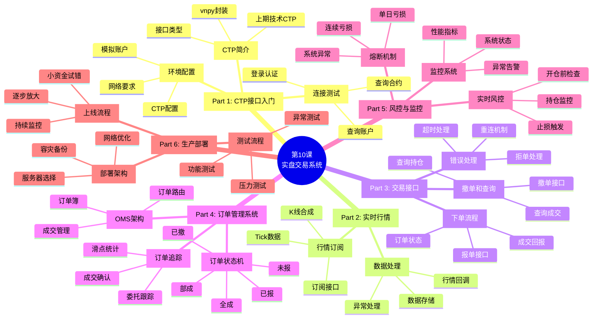

# 第10课：实盘交易系统（可选） - 框架要点

> **课程版本**: v3.0
> **课时**: 90分钟
> **难度**: ⭐⭐⭐⭐⭐
> **前置课程**: 第01-09课（所有核心课程）
> **课程性质**: 可选进阶课程

---

## ⚠️ 重要声明

**本课程仅供学习研究使用，不构成任何投资建议。实盘交易风险极大，可能导致本金全部损失。**

**在进行实盘交易前，请务必：**
1. 充分理解交易风险
2. 在模拟盘上充分测试
3. 使用可承受损失的小资金
4. 严格执行风控策略
5. 遵守相关法律法规

---

## 📋 课程核心要点

### 🎯 本课要解决的问题
1. **如何连接期货交易所（CTP接口）**
2. **如何实现实时行情订阅**
3. **如何下单、撤单、查询持仓**
4. **如何处理异步回调**
5. **如何实现订单管理系统（OMS）**
6. **如何监控系统状态和风险**
7. **如何从模拟盘过渡到实盘**

### 🎓 学习目标（Know-Do-Be）

**Know（理解概念）**:
- 理解CTP接口架构
- 理解实盘交易流程
- 理解订单状态机
- 理解滑点和成交风险
- 理解系统监控要点

**Do（实践技能）**:
- 能够使用vnpy连接CTP
- 能够订阅实时行情
- 能够下单和撤单
- 能够查询账户和持仓
- 能够实现OMS（订单管理系统）
- 能够实现风控熔断机制
- 能够部署生产环境

**Be（职业素养）**:
- 建立"安全第一"的实盘意识
- 养成"小步试错"的谨慎习惯
- 培养"监控先行"的风控思维
- 保持"风险可控"的理性决策

---

## 🗺️ 课程结构脑图



---

## 📊 时间分配（90分钟）

```mermaid
gantt
    title 第10课时间分配
    dateFormat HH:mm
    axisFormat %H:%M

    section Part 1
    CTP接口入门          :p1, 00:00, 20m
    CTP简介             :00:00, 7m
    环境配置            :00:07, 8m
    连接测试            :00:15, 5m

    section Part 2
    实时行情            :p2, 00:20, 15m
    行情订阅            :00:20, 8m
    数据处理            :00:28, 7m

    section Part 3
    交易接口            :p3, 00:35, 20m
    下单流程            :00:35, 10m
    撤单查询            :00:45, 6m
    错误处理            :00:51, 4m

    section Part 4
    订单管理系统        :p4, 00:55, 15m
    OMS设计             :00:55, 8m
    订单状态机          :01:03, 7m

    section Part 5
    风控与监控          :p5, 01:10, 10m
    实时风控            :01:10, 5m
    监控告警            :01:15, 5m

    section Part 6
    生产部署            :p6, 01:20, 10m
    部署架构            :01:20, 5m
    上线流程            :01:25, 5m
```



---

## 📚 核心内容大纲

### Part 1: CTP接口入门（20分钟）

#### 1.1 CTP简介

**CTP（综合交易平台）**：
- 上海期货信息技术有限公司（上期技术）开发
- 中国期货市场标准交易接口
- 支持A股期货、期权等品种
- C++接口，Python有多种封装（vnpy、tqsdk等）

**vnpy框架**：
- Python量化交易框架
- 封装CTP、恒生等多种接口
- 提供回测、实盘、风控一体化方案
- 活跃的开源社区

#### 1.2 环境配置

**1. 申请模拟账户**
```bash
# SimNow模拟账户（免费）
网址：https://www.simnow.com.cn/

# 账户信息示例
Broker: 9999（SimNow代码）
Account: 123456
Password: xxxxxx

# 7x24小时环境（练习用）
Trade Front: tcp://180.168.146.187:10130
Market Front: tcp://180.168.146.187:10131
```

**2. 安装vnpy**
```bash
pip install vnpy vnpy_ctp
```

**3. 配置connect_ctp.json**
```json
{
    "用户名": "123456",
    "密码": "xxxxxx",
    "经纪商代码": "9999",
    "交易服务器": "tcp://180.168.146.187:10130",
    "行情服务器": "tcp://180.168.146.187:10131",
    "产品名称": "",
    "授权编码": ""
}
```

#### 1.3 连接测试

```python
from vnpy.event import EventEngine
from vnpy.trader.engine import MainEngine
from vnpy.trader.ui import MainWindow
from vnpy_ctp import CtpGateway

# 1. 创建主引擎
event_engine = EventEngine()
main_engine = MainEngine(event_engine)

# 2. 添加CTP接口
main_engine.add_gateway(CtpGateway)

# 3. 连接CTP
setting = {
    "用户名": "123456",
    "密码": "xxxxxx",
    "经纪商代码": "9999",
    "交易服务器": "tcp://180.168.146.187:10130",
    "行情服务器": "tcp://180.168.146.187:10131"
}

main_engine.connect(setting, "CTP")

# 4. 查询账户
accounts = main_engine.get_all_accounts()
print(f"账户余额: {accounts[0].balance}")

# 5. 查询合约
contracts = main_engine.get_all_contracts()
print(f"可交易合约数: {len(contracts)}")
```

---

### Part 2: 实时行情订阅（15分钟）

#### 2.1 行情订阅接口

```python
from vnpy.trader.object import SubscribeRequest, TickData

class MarketDataHandler:
    """行情处理器"""

    def __init__(self, main_engine):
        self.main_engine = main_engine
        self.ticks = {}  # 存储最新Tick

        # 注册事件监听
        self.main_engine.event_engine.register(
            EVENT_TICK,
            self.on_tick
        )

    def subscribe(self, symbols: List[str]):
        """订阅行情"""
        for symbol in symbols:
            req = SubscribeRequest(
                symbol=symbol,
                exchange=Exchange.SHFE  # 上期所
            )
            self.main_engine.subscribe(req, "CTP")

    def on_tick(self, event):
        """Tick回调"""
        tick: TickData = event.data

        # 1. 更新最新Tick
        self.ticks[tick.symbol] = tick

        # 2. 打印行情
        print(f"{tick.symbol} - "
              f"最新价:{tick.last_price}, "
              f"买一:{tick.bid_price_1}, "
              f"卖一:{tick.ask_price_1}")

        # 3. 存储到数据库（可选）
        self.save_tick_to_db(tick)

# 使用
handler = MarketDataHandler(main_engine)
handler.subscribe(['rb2506', 'hc2506'])  # 订阅螺纹钢、热卷
```

#### 2.2 K线合成

```python
from vnpy.app.cta_strategy import BarGenerator

class KlineGenerator:
    """K线合成器"""

    def __init__(self):
        self.bg = BarGenerator(self.on_bar)

    def on_tick(self, tick: TickData):
        """Tick推送到K线生成器"""
        self.bg.update_tick(tick)

    def on_bar(self, bar: BarData):
        """1分钟K线回调"""
        print(f"{bar.symbol} 1分钟K线 - "
              f"O:{bar.open_price}, "
              f"H:{bar.high_price}, "
              f"L:{bar.low_price}, "
              f"C:{bar.close_price}")

        # 触发策略信号生成
        self.strategy.on_bar(bar)
```

---

### Part 3: 交易接口（20分钟）

#### 3.1 下单流程

```python
from vnpy.trader.object import OrderRequest, Direction, Offset

def send_order(
    main_engine,
    symbol: str,
    direction: Direction,  # LONG/SHORT
    offset: Offset,        # OPEN/CLOSE
    price: float,
    volume: int
) -> str:
    """
    发送委托

    Args:
        main_engine: 主引擎
        symbol: 合约代码
        direction: 方向（多/空）
        offset: 开平（开仓/平仓）
        price: 价格
        volume: 数量

    Returns:
        订单ID（vt_orderid）
    """
    req = OrderRequest(
        symbol=symbol,
        exchange=Exchange.SHFE,
        direction=direction,
        type=OrderType.LIMIT,  # 限价单
        volume=volume,
        price=price,
        offset=offset
    )

    vt_orderid = main_engine.send_order(req, "CTP")
    print(f"订单已发送: {vt_orderid}")

    return vt_orderid

# 使用示例
# 开多仓
order_id = send_order(
    main_engine=main_engine,
    symbol="rb2506",
    direction=Direction.LONG,   # 买入
    offset=Offset.OPEN,         # 开仓
    price=4500,
    volume=1  # 1手
)
```

#### 3.2 订单和成交回调

```python
from vnpy.trader.object import OrderData, TradeData

class OrderTracker:
    """订单跟踪器"""

    def __init__(self, main_engine):
        self.main_engine = main_engine
        self.orders = {}  # 订单簿
        self.trades = {}  # 成交记录

        # 注册事件
        main_engine.event_engine.register(EVENT_ORDER, self.on_order)
        main_engine.event_engine.register(EVENT_TRADE, self.on_trade)

    def on_order(self, event):
        """订单状态回调"""
        order: OrderData = event.data

        # 更新订单簿
        self.orders[order.vt_orderid] = order

        # 打印订单状态
        print(f"订单更新: {order.vt_orderid} - "
              f"状态:{order.status.value}, "
              f"已成:{order.traded}/{order.volume}")

        # 处理订单状态
        if order.status == Status.ALLTRADED:
            print(f"✅ 订单全部成交: {order.vt_orderid}")
        elif order.status == Status.CANCELLED:
            print(f"❌ 订单已撤销: {order.vt_orderid}")
        elif order.status == Status.REJECTED:
            print(f"⚠️ 订单被拒: {order.vt_orderid}")

    def on_trade(self, event):
        """成交回调"""
        trade: TradeData = event.data

        # 记录成交
        self.trades[trade.vt_tradeid] = trade

        print(f"成交通知: {trade.symbol} - "
              f"方向:{trade.direction.value}, "
              f"价格:{trade.price}, "
              f"数量:{trade.volume}")
```

#### 3.3 撤单和查询

```python
def cancel_order(main_engine, vt_orderid: str):
    """撤单"""
    req = CancelRequest(
        orderid=vt_orderid.split('.')[0],  # 提取本地订单号
        exchange=Exchange.SHFE
    )
    main_engine.cancel_order(req, "CTP")

def query_position(main_engine, symbol: str = None):
    """查询持仓"""
    positions = main_engine.get_all_positions()

    if symbol:
        positions = [p for p in positions if p.symbol == symbol]

    for pos in positions:
        print(f"持仓: {pos.symbol} - "
              f"方向:{pos.direction.value}, "
              f"数量:{pos.volume}, "
              f"均价:{pos.price}")

    return positions
```

---

### Part 4: 订单管理系统（OMS）（15分钟）

#### 4.1 OMS架构设计

**核心功能**：
1. **订单路由**：将策略订单路由到交易接口
2. **订单簿管理**：跟踪所有活跃订单
3. **成交管理**：记录成交，计算持仓
4. **风控检查**：开仓前风控检查

#### 4.2 订单状态机

```python
from enum import Enum

class OrderStatus(Enum):
    """订单状态"""
    SUBMITTING = "提交中"     # 正在提交
    NOTTRADED = "未成交"      # 已报未成交
    PARTTRADED = "部分成交"   # 部分成交
    ALLTRADED = "全部成交"    # 全部成交
    CANCELLED = "已撤销"      # 已撤销
    REJECTED = "拒单"         # 被拒绝

class OrderStateMachine:
    """订单状态机"""

    # 状态转换规则
    TRANSITIONS = {
        OrderStatus.SUBMITTING: [OrderStatus.NOTTRADED, OrderStatus.REJECTED],
        OrderStatus.NOTTRADED: [OrderStatus.PARTTRADED, OrderStatus.ALLTRADED, OrderStatus.CANCELLED],
        OrderStatus.PARTTRADED: [OrderStatus.ALLTRADED, OrderStatus.CANCELLED]
    }

    def can_transition(self, from_status: OrderStatus, to_status: OrderStatus) -> bool:
        """检查状态转换是否合法"""
        allowed = self.TRANSITIONS.get(from_status, [])
        return to_status in allowed
```

#### 4.3 完整OMS实现

```python
class OrderManagementSystem:
    """订单管理系统"""

    def __init__(self, main_engine, risk_manager):
        self.main_engine = main_engine
        self.risk_manager = risk_manager
        self.active_orders = {}  # 活跃订单
        self.positions = {}      # 持仓

    def send_order(
        self,
        symbol: str,
        direction: Direction,
        offset: Offset,
        price: float,
        volume: int
    ) -> Optional[str]:
        """
        发送订单（带风控检查）

        Returns:
            订单ID，如果风控未通过则返回None
        """
        # 1. 风控检查
        passed, reason = self.risk_manager.check_before_order(
            symbol=symbol,
            direction=direction,
            volume=volume,
            price=price
        )

        if not passed:
            print(f"❌ 风控拒单: {reason}")
            return None

        # 2. 发送订单
        req = OrderRequest(
            symbol=symbol,
            exchange=Exchange.SHFE,
            direction=direction,
            type=OrderType.LIMIT,
            volume=volume,
            price=price,
            offset=offset
        )

        vt_orderid = self.main_engine.send_order(req, "CTP")

        # 3. 加入活跃订单
        self.active_orders[vt_orderid] = {
            'req': req,
            'status': OrderStatus.SUBMITTING,
            'traded': 0
        }

        return vt_orderid

    def on_order(self, order: OrderData):
        """订单状态更新"""
        if order.vt_orderid in self.active_orders:
            # 更新订单状态
            self.active_orders[order.vt_orderid]['status'] = order.status
            self.active_orders[order.vt_orderid]['traded'] = order.traded

            # 全部成交或已撤销，从活跃订单移除
            if order.status in [Status.ALLTRADED, Status.CANCELLED]:
                del self.active_orders[order.vt_orderid]

    def on_trade(self, trade: TradeData):
        """成交回报，更新持仓"""
        symbol = trade.symbol
        direction = trade.direction

        if symbol not in self.positions:
            self.positions[symbol] = {'long': 0, 'short': 0}

        if direction == Direction.LONG:
            if trade.offset == Offset.OPEN:
                self.positions[symbol]['long'] += trade.volume
            else:  # CLOSE
                self.positions[symbol]['short'] -= trade.volume
        else:  # SHORT
            if trade.offset == Offset.OPEN:
                self.positions[symbol]['short'] += trade.volume
            else:  # CLOSE
                self.positions[symbol]['long'] -= trade.volume

        print(f"持仓更新: {symbol} - "
              f"多:{self.positions[symbol]['long']}, "
              f"空:{self.positions[symbol]['short']}")
```

---

### Part 5: 风控与监控（10分钟）

#### 5.1 实时风控检查

```python
class RealTimeRiskManager:
    """实时风控管理器"""

    def __init__(self, account_value: float):
        self.account_value = account_value
        self.daily_pnl = 0  # 当日盈亏
        self.positions = {}

    def check_before_order(
        self,
        symbol: str,
        direction: Direction,
        volume: int,
        price: float
    ) -> Tuple[bool, str]:
        """开仓前风控检查"""

        # 检查1：单笔风险
        position_value = volume * price * get_contract_size(symbol)
        max_loss = position_value * 0.05  # 假设5%止损
        if max_loss > self.account_value * 0.02:
            return False, "单笔风险超限"

        # 检查2：总仓位
        total_position_value = self.get_total_position_value()
        if total_position_value + position_value > self.account_value * 0.8:
            return False, "总仓位超限"

        # 检查3：当日亏损熔断
        if self.daily_pnl < -self.account_value * 0.05:
            return False, "触发当日亏损熔断（-5%）"

        # 检查4：同品种单边持仓
        current_pos = self.positions.get(symbol, {}).get(direction.value, 0)
        max_single_position = get_max_position(symbol)
        if current_pos + volume > max_single_position:
            return False, f"{symbol}单边持仓超限"

        return True, "OK"

    def update_daily_pnl(self, pnl: float):
        """更新当日盈亏"""
        self.daily_pnl = pnl

        # 熔断检查
        if self.daily_pnl < -self.account_value * 0.05:
            print("🚨 触发5%亏损熔断，停止所有交易")
            self.trigger_circuit_breaker()
```

#### 5.2 监控告警系统

```python
class MonitoringSystem:
    """监控告警系统"""

    def __init__(self):
        self.alert_handlers = []  # 告警处理器（邮件、微信等）

    def check_system_health(self, main_engine):
        """系统健康检查"""

        # 1. 连接状态
        if not main_engine.get_gateway("CTP").td_api.login_status:
            self.send_alert("❌ CTP交易连接断开")

        # 2. 订单延迟
        avg_latency = self.get_avg_order_latency()
        if avg_latency > 1000:  # 超过1秒
            self.send_alert(f"⚠️ 订单延迟过高: {avg_latency}ms")

        # 3. 持仓风险
        positions = main_engine.get_all_positions()
        for pos in positions:
            # 检查持仓盈亏
            if pos.pnl < -pos.price * pos.volume * 0.10:
                self.send_alert(f"⚠️ {pos.symbol}持仓亏损超10%")

    def send_alert(self, message: str):
        """发送告警"""
        print(f"📢 告警: {message}")

        # 发送邮件
        # send_email(message)

        # 发送微信（通过企业微信机器人）
        # send_wechat(message)
```

---

### Part 6: 生产部署（10分钟）

#### 6.1 部署架构

**推荐架构**：
```
[交易服务器（低延迟）]
    ├─ CTP网关
    ├─ 策略引擎
    ├─ OMS
    └─ 风控引擎

[数据服务器]
    ├─ MongoDB（行情、订单）
    ├─ Redis（缓存）
    └─ PostgreSQL（账户）

[监控服务器]
    ├─ Prometheus（指标采集）
    ├─ Grafana（可视化）
    └─ AlertManager（告警）
```

**服务器要求**：
- CPU: 4核以上
- 内存: 8GB以上
- 网络: 低延迟（<10ms到交易所）
- 磁盘: SSD（快速日志写入）

#### 6.2 模拟盘测试流程

**测试清单**：
```
□ 功能测试
  □ 登录连接
  □ 行情订阅
  □ 下单成交
  □ 撤单
  □ 查询持仓
  □ 查询成交

□ 异常测试
  □ 网络断开重连
  □ 拒单处理
  □ 部分成交
  □ 超时处理

□ 压力测试
  □ 高频下单（100单/秒）
  □ 多品种并发
  □ 长时间运行（24小时）

□ 风控测试
  □ 单笔风险触发
  □ 总仓位触发
  □ 亏损熔断触发
```

#### 6.3 实盘上线流程

**阶段1：小资金试错（1-2周）**
```
- 资金量：1万元
- 仓位：10-20%
- 目标：验证系统稳定性
- 重点：监控异常和bug
```

**阶段2：逐步放大（1-2月）**
```
- 资金量：5-10万元
- 仓位：20-50%
- 目标：验证策略盈利能力
- 重点：优化参数和风控
```

**阶段3：正式运营（持续）**
```
- 资金量：根据策略容量
- 仓位：50-80%
- 目标：稳定盈利
- 重点：持续监控和优化
```

**上线检查清单**：
```
□ 模拟盘测试全部通过
□ 风控参数配置正确
□ 监控告警已部署
□ 日志系统正常
□ 备份策略已准备
□ 应急预案已制定
□ 资金风险可承受
```

---

## 📝 课后作业

### 作业1：CTP接口实战（⭐⭐⭐）
- 申请SimNow模拟账户
- 连接CTP，订阅行情
- 下单并查询成交
- 撰写接口使用报告

### 作业2：实现完整OMS（⭐⭐⭐⭐⭐）
- 实现订单管理系统
- 实现订单状态机
- 集成风控检查
- 处理各种异常情况
- 单元测试覆盖率>80%

### 作业3：模拟盘完整测试（⭐⭐⭐⭐⭐）
- 部署完整交易系统到模拟盘
- 运行策略至少1周
- 记录所有异常和问题
- 撰写测试报告和改进建议

---

## 🎯 核心知识点

### CTP接口
- ✅ CTP接口架构
- ✅ vnpy封装使用
- ✅ 行情订阅
- ✅ 交易接口（下单、撤单、查询）

### OMS系统
- ✅ 订单管理架构
- ✅ 订单状态机
- ✅ 成交管理
- ✅ 风控集成

### 风控监控
- ✅ 实时风控检查
- ✅ 熔断机制
- ✅ 监控告警
- ✅ 系统健康检查

### 生产部署
- ✅ 部署架构设计
- ✅ 模拟盘测试
- ✅ 实盘上线流程
- ✅ 风险控制

---

## ⚠️ 风险提示

### 技术风险
- 🚨 网络断开可能导致无法及时平仓
- 🚨 程序bug可能导致错单、重单
- 🚨 服务器故障可能导致系统无响应

### 市场风险
- 🚨 滑点可能导致成交价格偏离预期
- 🚨 流动性不足可能无法成交
- 🚨 极端行情可能导致爆仓

### 操作风险
- 🚨 参数配置错误可能导致巨额亏损
- 🚨 风控失效可能导致风险失控
- 🚨 监控缺失可能无法及时发现问题

**应对措施**：
- ✅ 充分的模拟盘测试
- ✅ 小资金试错
- ✅ 严格的风控参数
- ✅ 完善的监控告警
- ✅ 应急预案
- ✅ 持续学习和优化

---

## 📖 扩展阅读

1. **vnpy文档**: https://www.vnpy.com/docs/cn/
2. **CTP API文档**: http://www.sfit.com.cn/
3. **期货交易规则**: https://www.cffex.com.cn/
4. **《打开量化投资的黑箱》**: Rishi K. Narang
5. **《量化交易系统设计》**: 陈炳南

---

## 🎓 课程总结

完成本课程后，你将具备：

✅ **理论基础**：
- 理解量化交易完整流程
- 掌握核心技术栈（Python、MongoDB、异步编程）
- 理解风险管理和绩效评估

✅ **实践能力**：
- 能够独立搭建数据管道
- 能够实现技术指标和策略
- 能够集成AI辅助决策
- 能够构建回测系统
- 能够连接实盘交易

✅ **职业素养**：
- 严谨的代码规范
- 完善的测试习惯
- 风险优先的决策思维

**下一步建议**：
1. 在模拟盘充分测试
2. 学习更多策略类型
3. 参与量化社区交流
4. 持续学习新技术
5. 保持对市场的敬畏

---

**恭喜你完成CherryQuant量化交易课程！**
**记住：量化交易是科学与艺术的结合，需要持续学习和实践！**

---

**文档版本**: v3.0
**创建日期**: 2025-01-25
**待完善**: 填充完整代码示例和详细讲解
