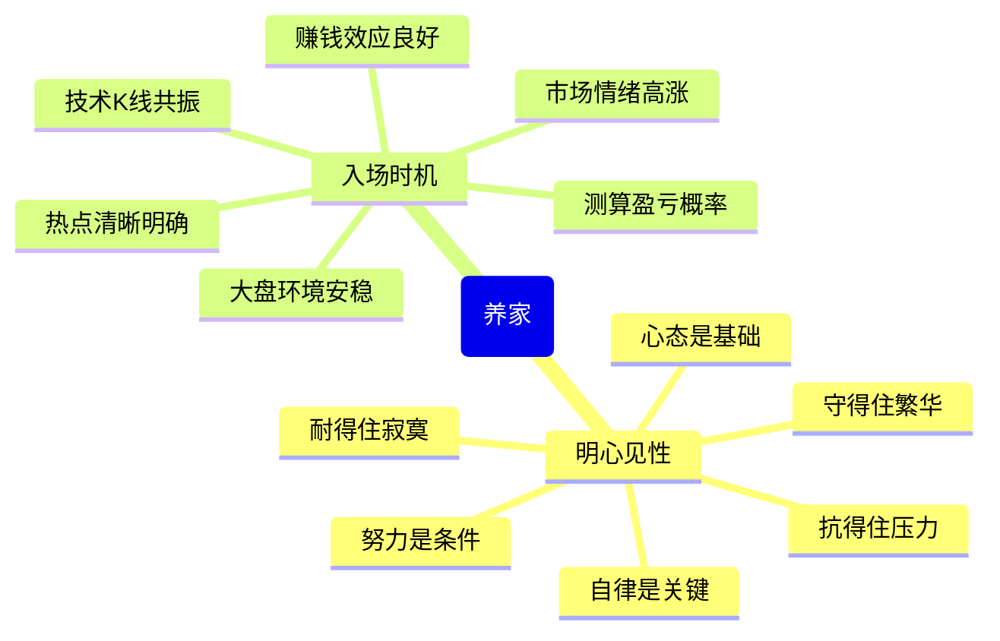
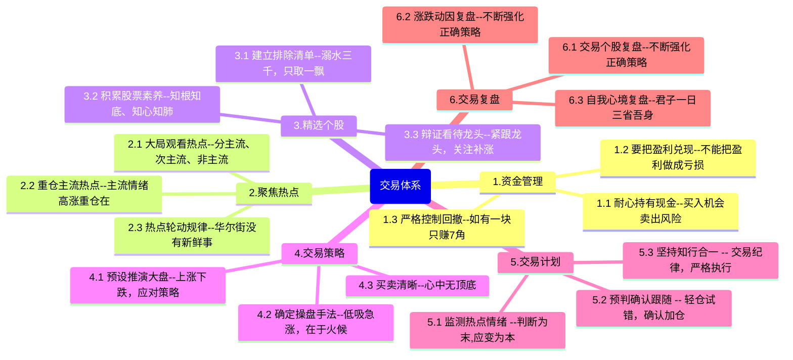

# 炒股养家心法

> 作者：炒股养家

我一直把自己定义成散户，无奈江湖上依然有关于我的
各种案例和心法，心法大致还是按照我的思路的，我个人
觉得这也是最具价值的东西，比告诉你我明天要买什么更有价值，因为心法领悟的透彻，操作便会事半功倍。或许你们都有听说我从十几万做到几个亿，但是很少有人知道我也一度损失惨重，每天花18小时的学习。经历了而立、
不惑之后，对市场看的比较淡了，但是总觉得该做点比操作更有意义的事情。受几位朋友怂恿，把自己的历程以及观点做简要分享，供有缘者读之。

---

《养家心法》

情绪分周期

交易分阶梯

每一次休息就应该是：
**一次总结，一次剖析，一次进步，一次取舍，一次扬弃**

每一个周期的成功交易
需要及时的总结、固化

同样一个失败的周期，也该有客观的态度

经常看到有人说，一直亏，一直停不下来，一直不甘心

没有等待何来机会?
没有放弃何来得到？

炒股需要学习，
学习不是从各种文章中找代码

而是学术、学道、 最终以道驭术
道可以是大局观，情绪判断，交易心法

术可以很具体，细化到每一个买点判断，仓位分布，每一个买卖动作

但是，除了学习
炒股，更需要冷静
很多路需要靠自己走，

很多压力需要自己承受
很多折磨需要自己挺过去，

很多伤痛需要自己缝合
或许有人能理解你的彷徨，

但别人代替不了你的成长
过来人能对你的处境感同身受，但无法帮你分担

痛苦的经历并不可怕，可怕的是你真的被他打败了
或者被他打的找不到方向，失了自己的节奏
或者全是悲观失望的情绪
一边是不服输的疲狂交易，一边是悲观的情绪蔓延
而这种悲观的情绪会把你进一步带向深渊
炒股需要自我进化，自我成长
如果你觉得节奏不对，不妨停下脚步
回溯自己的每一笔交易，反思自己每一个操作
重新揭开伤疤，或许很痛
但也同样会让你更加刻骨铭心
每一个市场的参与者
都在市场中踽踽独行
因盈利而开心，因亏损而失溶，因连续的舌损而心力交疼
在市场，交易一日，彷徨一日，纠结一曰，希望一日，恐惧一日
谁不曾有一段败家的历史
谁又不曾在恐惧和希望中轮回
不同的是，有的人走出来了
有的人，永远的被打败了
吃点亏，交点学费不算什么
找到自己的路坚定自己的信念，勇敢的走下去

信念是什么？
是顽强的意志？必胜的信心？神来之笔?
都不是基本靠硬撑
这里的硬撑，不是说更频繁的交易
而是不论涨跌，不论心痛，坚持功课，坚持复盘
坚持做体系内的操作，哪怕体系束缚了你的手脚
为何硬撑?
半夜看看沉睡的家人，想想白天输掉的Moncy
自然就有了含泪坚持，和血吞牙的勇气
一个周期的结束，意味着一个新周期即将开始
从现在做起，从每一天做起，锻炼自己的思维，坚持自己的体系
从做每一笔“正确”的交易开始
种一棵树，最住时机是在20年年前，如果没有，最好的时机就是现
在

我的经历：

年少无知的轻狂，就是为了暴寓而来，一月没有20％收益绝对
不合格，所以仓促出手，赶上好行情，信心膨胀，感觉良好。
当年的我，觉得自己悟道了，辞去工作，遇上熊市，还接了朋
友的账户操作，结果是亏成狗，最后那位朋友也觉得我是个骗子。
那是一段和血吞牙的日子，其中的境地许多人都知道，关于奶粉，
关于学习。之后，经历市场的打击，倍感交瘁，面对账户的亏损，面对几
乎不可能在回去的数字、不敢下手，也无出路。
坚定信心，踏实向前，有前辈点拨或有高人指点，沉心静气，
脚踏实地，看透浮夸，慢慢走上正轨，学会控仓，学会空仓，学
会冷静，学会建立体系
想来，大多数人都要走这样一条路，好学的人很多，但是学成的
是少数，主要还是看个人的心性＄如果经历过行情的惨烈，现在
依然在用配资搏杀，那注定不适合这个市场。

心法：

善于做短线的人，应该清楚自身的特点，寻找出适合自己的方
法。股票是一个心理游戏，我们的操作应该尽量让自己避免被动。
有这种舒服的感觉就对了，好的策略就应该不管行情怎么变化，
让自己始终在应变中处于优势，这也是实现稳定赢利的前提！
对于个股，不应拘泥于自己手中所持品种，而应最大限度的观
察各板块走势，要对各个周期的领涨和领跌品种进行重点关注。
对于操作，不要一味的追求个别技术指标，或者短期的所谓资金
流进流出，主力庄家这些。

针对不同阶段有不同阶段的操作模式，高抛低吸也对，追涨杀
跌也好，都有其道理，关键取决于对市场的理解
每个人都应该有自己的交易风格，而不是赚钱了就是短线，套了
就成了股东，没有自己风格的人，一很难在市场里长期生存，因为
情绪会被市场说带走就带走，如果你的情绪被市场掌握，失败将
挥之不去。

所以静下心来，问问自己的性格适合超短、短线、中长线还是
长线！针对不同的交易风格，制定不同的作战交易体系！没有形
成自己交易体系的人，最终在市场会输多赢少，结果都不是太好！
所以在你没有形成体系之前，不做有压力的资金，不要融资与杠
杆参与操作，尽量的保住自己的本金！

## 交易体系

有人知道追涨不适合自己，德是往往管不住手，有人知道重仓
不好，无奈赌性太重，一道的和做到的差太多了，所以，知行合
一四个字足够很多人修行几年的声。做不到，你的情绪就容易被
市场左右，一旦被市场左右，失败将挥之不去。如果你能掌握市
场的情绪，胜利将接踵而来!

知行合一，说起来容易，做起来难，这也是为什么心法一定要
由实战来检验，经历过你才会有更深的领悟。

